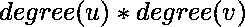

# 最大化树的任意两个顶点之间度数的乘积之和

> 原文:[https://www . geesforgeks . org/最大化树的任意两个顶点之间的度积之和/](https://www.geeksforgeeks.org/maximize-the-sum-of-products-of-the-degrees-between-any-two-vertices-of-the-tree/)

给定一个整数 **N** ，任务是构造一棵树，使得所有有序对 **(u，v)** 的之和为最大值，其中 **u！= v** 。打印最大可能总和。

**示例:**

```
Input: N = 4
Output: 26
      1
     /
    2
   /
  3
 /
4
For node 1, 1*2 + 1*2 + 1*1 = 5
For node 2, 2*1 + 2*2 + 2*1 = 8
For node 3, 2*1 + 2*2 + 2*1 = 8
For node 4, 1*1 + 1*2 + 1*2 = 5
Total sum = 5 + 8 + 8 + 5 = 26

Input: N = 6
Output: 82 
```

**方法:**我们知道一棵树中所有节点的度之和是**(2 * N)–2**，其中 **N** 是树中的节点数。因为我们必须最大化和，我们必须最小化叶节点的数量，因为叶节点在树的所有节点中具有最小的度，并且树将具有以下形式:

```
      1
     /
    2
   /
  ...
 /
N
```

其中只有根节点和唯一的叶节点的度为 1，所有其他节点的度为 2。

下面是上述方法的实现:

## C++

```
// C++ implementation of above approach
#include <bits/stdc++.h>
using namespace std;
#define ll long long int

// Function to return the maximum possible sum
ll maxSum(int N)
{
    ll ans = 0;

    for (int u = 1; u <= N; u++) {
        for (int v = 1; v <= N; v++) {
            if (u == v)
                continue;

            // Initialize degree for node u to 2
            int degreeU = 2;

            // If u is the leaf node or the root node
            if (u == 1 || u == N)
                degreeU = 1;

            // Initialize degree for node v to 2
            int degreeV = 2;

            // If v is the leaf node or the root node
            if (v == 1 || v == N)
                degreeV = 1;

            // Update the sum
            ans += (degreeU * degreeV);
        }
    }

    return ans;
}

// Driver code
int main()
{
    int N = 6;
    cout << maxSum(N);
}
```

## Java 语言(一种计算机语言，尤用于创建网站)

```
// Java implementation of above approach
class GFG
{

// Function to return the maximum possible sum
static int maxSum(int N)
{
    int ans = 0;

    for (int u = 1; u <= N; u++)
    {
        for (int v = 1; v <= N; v++)
        {
            if (u == v)
                continue;

            // Initialize degree for node u to 2
            int degreeU = 2;

            // If u is the leaf node or the root node
            if (u == 1 || u == N)
                degreeU = 1;

            // Initialize degree for node v to 2
            int degreeV = 2;

            // If v is the leaf node or the root node
            if (v == 1 || v == N)
                degreeV = 1;

            // Update the sum
            ans += (degreeU * degreeV);
        }
    }

    return ans;
}

// Driver code
public static void main(String[] args)
{
    int N = 6;
    System.out.println(maxSum(N));
}
}

// This code is contributed by Code_Mech
```

## 蟒蛇 3

```
# Python3 implementation of above approach

# Function to return the maximum possible sum
def maxSum(N) :
    ans = 0;

    for u in range(1, N + 1) :
        for v in range(1, N + 1) :
            if (u == v) :
                continue;

            # Initialize degree for node u to 2
            degreeU = 2;

            # If u is the leaf node or the root node
            if (u == 1 or u == N) :
                degreeU = 1;

            # Initialize degree for node v to 2
            degreeV = 2;

            # If v is the leaf node or the root node
            if (v == 1 or v == N) :
                degreeV = 1;

            # Update the sum
            ans += (degreeU * degreeV);

    return ans;

# Driver code
if __name__ == "__main__" :

    N = 6;
    print(maxSum(N));

# This code is contributed by Ryuga
```

## C#

```
// C# implementation of above approach
using System;
class GFG
{

// Function to return the maximum possible sum
static int maxSum(int N)
{
    int ans = 0;

    for (int u = 1; u <= N; u++)
    {
        for (int v = 1; v <= N; v++)
        {
            if (u == v)
                continue;

            // Initialize degree for node u to 2
            int degreeU = 2;

            // If u is the leaf node or the root node
            if (u == 1 || u == N)
                degreeU = 1;

            // Initialize degree for node v to 2
            int degreeV = 2;

            // If v is the leaf node or the root node
            if (v == 1 || v == N)
                degreeV = 1;

            // Update the sum
            ans += (degreeU * degreeV);
        }
    }

    return ans;
}

// Driver code
static void Main()
{
    int N = 6;
    Console.WriteLine(maxSum(N));
}
}

// This code is contributed by Chandan_jnu
```

## 服务器端编程语言（Professional Hypertext Preprocessor 的缩写）

```
<?php
// PHP implementation of above approach

// Function to return the maximum
// possible sum
function maxSum($N)
{
    $ans = 0;

    for ($u = 1; $u <= $N; $u++)
    {
        for ($v = 1; $v <= $N; $v++)
        {
            if ($u == $v)
                continue;

            // Initialize degree for node u to 2
            $degreeU = 2;

            // If u is the leaf node or the
            // root node
            if ($u == 1 || $u == $N)
                $degreeU = 1;

            // Initialize degree for node v to 2
            $degreeV = 2;

            // If v is the leaf node or the
            // root node
            if ($v == 1 || $v == $N)
                $degreeV = 1;

            // Update the sum
            $ans += ($degreeU * $degreeV);
        }
    }

    return $ans;
}

// Driver code
$N = 6;
echo maxSum($N);

// This code is contributed
// by Akanksha Rai
?>
```

## java 描述语言

```
<script>

// Javascript implementation of above approach

// Function to return the maximum possible sum
function maxSum(N)
{
    var ans = 0;

    for (var u = 1; u <= N; u++) {
        for (var v = 1; v <= N; v++) {
            if (u == v)
                continue;

            // Initialize degree for node u to 2
            var degreeU = 2;

            // If u is the leaf node or the root node
            if (u == 1 || u == N)
                degreeU = 1;

            // Initialize degree for node v to 2
            var degreeV = 2;

            // If v is the leaf node or the root node
            if (v == 1 || v == N)
                degreeV = 1;

            // Update the sum
            ans += (degreeU * degreeV);
        }
    }

    return ans;
}

// Driver code
var N = 6;
document.write( maxSum(N));

</script>
```

**Output:** 

```
82
```