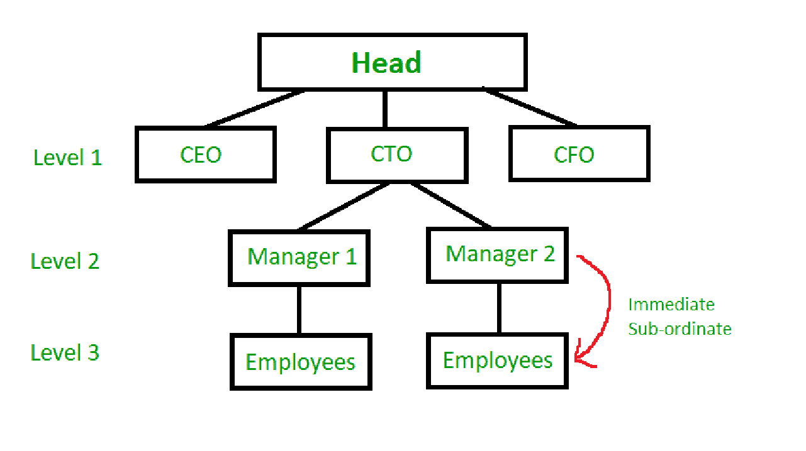

# 最大化所有人的总利润

> 原文:[https://www . geesforgeks . org/最大化所有人的总利润/](https://www.geeksforgeeks.org/maximize-the-total-profit-of-all-the-persons/)

一个组织有一个等级结构。将组织一次聚会。没有两个直接下属可以来参加聚会。利润与每个人息息相关。你必须使所有参加聚会的人的总利润最大化。
**层级结构**
在层级组织中，所有的员工(除了最高层的那个)都是其他某个员工的下属。
员工只直接向直接上级汇报。这使得结构灵活高效。



为了解决这个问题，这个结构可以想象成一棵树，每个员工都是它的节点。
示例:

```
Input: 
         15
       /   \
     10     12
    /  \   /  \
   26   4 7    9
Output: The Maximum Profit would be 15+12+26+9 = 62
The Parent 15 chooses sub-ordinate 12, 10 chooses 26 and 12 chooses 9.

Input:
        12
       / | \
      9 25 16
     /     / \
    13    13   9
Output: 12+25+13+13 = 63
```

**方法:**
给定每个员工的利润，我们必须找到最大和，这样就不会邀请两个具有相同上级(家长)的员工(节点)。如果每个员工都选择贡献最大的下属去，这是可以实现的。
在程序中，公司的层级以字典的形式实现，关键字是唯一的员工标识，数据是[与该员工相关的利润、[直接子坐标列表]]形式的数组。
对于每个员工，关联利润最高的下属被添加到总利润中。此外，总会邀请最高层的员工。

## C++

```
// C++ program for above approach
#include <bits/stdc++.h>
using namespace std;

int getMaxProfit(vector<vector<int> > hier)
{

    // The head has no competition and therefore invited
    int totSum = hier[0][0];
    for (vector<int> i : hier) {
        vector<int> currentSuperior = i;
        int selectedSub = 0;

        // Select the subordinate with maximum
        // value of each superior
        for (int j = 1; j < currentSuperior.size(); j++) {
            int e = currentSuperior[j];
            if (hier[e - 1][0] > selectedSub) {
                selectedSub = hier[e - 1][0];
            }
        }

        totSum += selectedSub;
    }

    return totSum;
}

// Driver Code
int main()
{

    // Define the Organization as a 2 - D array
    // Index : [Profit, List of Employees]
    /*
     Same as example 1 given above
              1:15
            /     \
          2:10    3:12
         /   \    /   \
       4:26 5:4 6:7  7:9
    */

    // Given input
    vector<vector<int> > organization
        = { { 15, 2, 3 }, { 10, 4, 5 }, { 12, 6, 7 },
            { 26 },       { 4 },        { 7 },
            { 9 } };

    // Function call
    int maxProfit = getMaxProfit(organization);
    cout << maxProfit << "\n";

    return 0;
}
```

## Java 语言(一种计算机语言，尤用于创建网站)

```
// Java program for above approach
class GFG {
    static int getMaxProfit(int[][] hier)
    {

        // The head has no competition and therefore invited
        int totSum = hier[0][0];
        for (int i = 0; i < hier.length; i++) {
            int selectedSub = 0;
            for (int j = 1; j < hier[i].length; j++) {

                int e = hier[i][j];
                if (hier[e - 1][0] > selectedSub) {
                    selectedSub = hier[e - 1][0];
                }
            }
            totSum += selectedSub;
        }
        return totSum;
    }

    public static void main(String[] args)
    {
        // Define the Organization as a 2 - D array
        // Index : [Profit, List of Employees]
        /*
         Same as example 1 given above
                  1:15
                /     \
              2:10    3:12
             /   \    /   \
           4:26 5:4 6:7  7:9
        */

        // Given input
        int[][] organization
            = { { 15, 2, 3 }, { 10, 4, 5 }, { 12, 6, 7 },
                { 26 },       { 4 },        { 7 },
                { 9 } };

        // Function call
        int maxProfit = getMaxProfit(organization);
        System.out.println(maxProfit);
    }
}

// This code is contributed by rajsanghavi9.
```

## 蟒蛇 3

```
# Python program for above approach

def getMaxProfit(hier):
    # The head has no competition and therefore invited
    totSum = hier[1][0]
    for i in hier:
        currentSuperior = hier[i]
        selectedSub = 0
        # select the subordinate with maximum
        # value of each superior
        for j in currentSuperior[1]:
            if(hier[j][0] > selectedSub):
                selectedSub = hier[j][0]
        totSum += selectedSub
    return totSum

# driver function

def main():
    # Define the Organization as a Dictionary
    # Index : [Profit, List of Employees]
        # Same as example 1 given above
    # 1:15
    #       /     \
    # 2:10    3:12
    #    /   \    /   \
    # 4:26 5:4 6:7  7:9

    organization = {1: [15, [2, 3]],
                    2: [10, [4, 5]], 3: [12, [6, 7]],
                    4: [26, []], 5: [4, []], 6: [7, []], 7: [9, []]}
    maxProfit = getMaxProfit(organization)
    print(maxProfit)

main()
```

**Output:** 

```
62
```

**时间复杂度:**O(N)
T3】辅助空间: O(N)