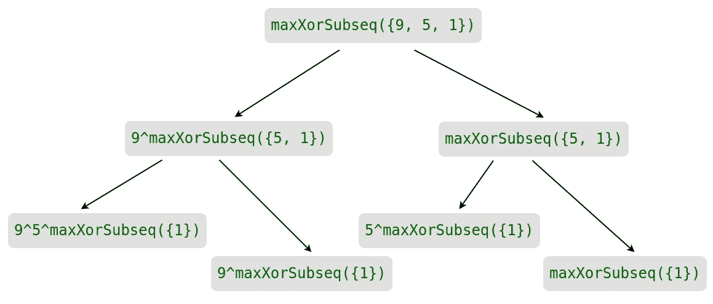

# 通过从两端等距的元素使异或子序列最大化

> 原文:[https://www . geeksforgeeks . org/maximize-xor-subsequence-可能的等距元素-从两端/](https://www.geeksforgeeks.org/maximize-xor-subsequence-possible-by-equidistant-elements-from-both-ends/)

给定一个大小为 **N** 的数组**A【】**，求**最大异或子序列**，使得**A【I】**和**A【N–I–1】**都属于这个子序列，其中 I 的范围在**【0，N–1】**之间。

**示例:**

> **输入:** N = 8，A [ ] = {1，2，3，4，5，6，7，8}
> **输出:** 13
> **解释:**
> 最大异或子序列为{1，3，4，5，6，8}
> 
> **输入:** N = 5，A [ ] = {3，2，6，5，4}
> **输出:** 6
> **解释:**
> 最大异或子序列为{3，2，6，5，4}

**方法:**
既然 A[i]和 A[N-i-1]都应该出现在同一个子序列中，那就把它们配对，然后求最大异或和。对于每个有效索引 **i** ，计算(A[i] ^ A[N-i-1])并将其存储在新数组 **X** 中。这个新阵列的大小将是 N/2。

**天真解:**
这个问题创建数组**X【】**后最简单的方法就是递归生成 **X** 的所有子序列，找到最大 xor 子序列。

以下是 maxXorSubseq(X，N，I)的递归定义:

> **maxXorSubseq** ( X，n，I)=**max**(x[I]^**maxxorsubseq**(x，n，I+1)**maxxorsubseq**(x，n，i + 1) )

总的可能组合为**2<sup>N</sup>T3。
***时间复杂度:** O(2 <sup>N</sup> )***

下面是上述方法的实现:

## C++

```
// C++ implementation
// of the above approach
#include <bits/stdc++.h>
using namespace std;

// Returns maximum xor
int maxXorSubseq(vector<int> &x, int n,
                                 int i)
{
    if(i == n)
       return 0;

    return max(x[i] ^ maxXorSubseq(x, n,
                                   i + 1),
                      maxXorSubseq(x, n,
                                   i + 1));
}

vector<int> compute(vector<int> a, int n)
{
    vector<int> x;

    // Calculate a[i]^a[n-i-1]
    for(int i = 0; i < n / 2; i++)
       x.push_back(a[i] ^ a[n - i - 1]);

    // If n is odd
    if(n & 1)
       x.push_back(a[n / 2]);

    return x;
}

// Driver code
int main()
{
    int n = 8;
    vector<int> a = { 1, 2, 3, 4,
                      5, 6, 7, 8 };

    // Getting new array x
    vector<int> x = compute(a, n);

    int mxXor = maxXorSubseq(x, x.size(), 0);

    cout << (mxXor);
    return 0;
}

// This code is contributed by mohit kumar 29   
```

## Java 语言(一种计算机语言，尤用于创建网站)

```
// Java implementation
// of the above approach
import java.util.*;

class GFG{

// Returns maximum xor
static int maxXorSubseq(List<Integer> x, int n,
                                         int i)
{
    if(i == n)
    return 0;

    return Math.max(x.get(i) ^ maxXorSubseq(x, n,
                                            i + 1),
                               maxXorSubseq(x, n,
                                            i + 1));
}

static List<Integer> compute(List<Integer> a, int n)
{
    List<Integer> x = new ArrayList<Integer>();

    // Calculate a[i]^a[n-i-1]
    for(int i = 0; i < n / 2; i++)
        x.add(a.get(i) ^ a.get(n - i - 1));

    // If n is odd
    if((n & 1) == 1)
        x.add(a.get(n / 2));

    return x;
}

// Driver code
public static void main(String[] args)
{
    int n = 8;
    List<Integer> a = Arrays.asList( 1, 2, 3, 4,
                                     5, 6, 7, 8 );

    // Getting new array x
    List<Integer> x = compute(a, n);

    int mxXor = maxXorSubseq(x, x.size(), 0);

    System.out.println((mxXor));
}
}

// This code is contributed by offbeat
```

## 蟒蛇 3

```
# Python3 implementation
# of the above approach

# Returns maximum xor
def maxXorSubseq(x, n, i):

    if(i == n):
        return 0

    return max(
        x[i]^maxXorSubseq(
        x, n, i + 1), maxXorSubseq(
        x, n, i + 1))

def compute(a, n):

    x = []

    # Calculate a[i]^a[n-i-1]
    for i in range(n//2):    
        x.append(a[i]^a[n-i-1])

    # If n is odd
    if(n&1):
        x.append(a[n//2])

    return x

# Driver code
if __name__ =="__main__":

    n = 8
    a = [1, 2, 3, 4, 5, 6, 7, 8]

    # Getting new array x
    x = compute(a, n)

    mxXor = maxXorSubseq(x, len(x), 0)

    print(mxXor)
```

## C#

```
// C# implementation 
// of the above approach 
using System;
using System.Collections.Generic;
class GFG {

    // Returns maximum xor
    static int maxXorSubseq(List<int> x, int n, int i)
    {
        if(i == n)
        return 0;

        return Math.Max(x[i] ^ maxXorSubseq(x, n, i + 1), maxXorSubseq(x, n, i + 1));
    }

    static List<int> compute(List<int> a, int n)
    {
        List<int> x = new List<int>();

        // Calculate a[i]^a[n-i-1]
        for(int i = 0; i < n / 2; i++)
            x.Add(a[i] ^ a[n - i - 1]);

        // If n is odd
        if((n & 1) == 1)
            x.Add(a[n / 2]);

        return x;
    }

  static void Main() {
        int n = 8;
        List<int> a = new List<int>{ 1, 2, 3, 4, 5, 6, 7, 8 };

        // Getting new array x
        List<int> x = compute(a, n);

        int mxXor = maxXorSubseq(x, x.Count, 0);

        Console.WriteLine((mxXor));
  }
}

// This code is contributed by divyeshrabadiya07
```

## java 描述语言

```
<script>

    // Javascript implementation
    // of the above approach

    // Returns maximum xor
    function maxXorSubseq(x, n, i)
    {
        if(i == n)
        return 0;

        return Math.max(x[i] ^ maxXorSubseq(x, n, i + 1),
        maxXorSubseq(x, n, i + 1));
    }

    function compute(a, n)
    {
        let x = [];

        // Calculate a[i]^a[n-i-1]
        for(let i = 0; i < parseInt(n / 2, 10); i++)
            x.push(a[i] ^ a[n - i - 1]);

        // If n is odd
        if((n & 1) == 1)
            x.push(a[parseInt(n / 2, 10)]);

        return x;
    }

    let n = 8;
    let a = [ 1, 2, 3, 4, 5, 6, 7, 8 ];

    // Getting new array x
    let x = compute(a, n);

    let mxXor = maxXorSubseq(x, x.length, 0);

    document.write((mxXor));

</script>
```

**Output:**

```
13
```

**时间复杂度:** O(2 <sup>n</sup>

**辅助空间:** O(N)

**高效方法:**
考虑到上面的实现，下面是输入的部分递归树 **X = [9，5，1]**



在上面的部分递归树中，maxXorSubseq({1})被求解了四次。在绘制完整的递归树时，可以观察到有许多子问题被一次又一次地解决。所以这个问题有 [**重叠子问题**](https://www.geeksforgeeks.org/overlapping-subproblems-property-in-dynamic-programming-dp-1/) ，使用 [**记忆**](https://www.geeksforgeeks.org/memoization-1d-2d-and-3d/) 可以避免相同子问题的重新计算。

对于记忆，创建一个数组 **dp [ ]** 数组并存储:

> dp[i] = max（x[i] ^ maxXorSubseq（x， n， i + 1）， maxXorSubseq（x， n， idx + 1）

这避免了对先前计算的指数进行重新计算，从而优化了计算复杂性。

下面是上述方法的实现:

## C++

```
// C++ implementation of the above approach
#include <bits/stdc++.h>
using namespace std;
vector<int> dp;

// Returns maximum xor sum
int maxXorSubseq(vector<int> x, int n, int idx)
{
    if (idx == n)
    {
        return 0;
    }

    // If already precomputed
    if (dp[idx] != -1)
    {
        return dp[idx];
    }
    int ans = 0;
    ans = max(ans, x[idx] ^ maxXorSubseq(x, n, idx + 1));
    ans = max(ans, maxXorSubseq(x, n, idx + 1));

    // Store the maximum
    dp[idx] = ans;
    return ans;
}

vector<int> compute(int a[],int n)
{
    vector<int> x;

    // Calculate a[i]^a[n-i-1]
    for(int i = 0; i < n / 2; i++)
    {
        x.push_back(a[i] ^ a[n - i - 1]);
    }

    //  If n is odd
    if ((n & 1) != 0)
    {
        x.push_back(a[n / 2]);
    }
    return x;
}

// Driver code
int main()
{
    int n = 8;
    int a[] = { 1, 2, 3, 4, 5, 6, 7, 8 };

    // Getting new array x
    vector<int> x = compute(a, n);

    // Initialize dp array
    for(int i = 0; i < x.size(); i++)
    {
        dp.push_back(-1);
    }
    int mxXor = maxXorSubseq(x, x.size(), 0);    
    cout << mxXor << endl;
    return 0;
}

// This code is contributed by divyesh072019.
```

## Java 语言(一种计算机语言，尤用于创建网站)

```
// Java implementation of the above approach
import java.io.*;
import java.util.*;

class GFG{

static Vector<Integer> dp = new Vector<Integer>();

// Returns maximum xor sum
static int maxXorSubseq(Vector<Integer> x,
                        int n, int idx)
{
    if (idx == n)
    {
        return 0;
    }

    // If already precomputed
    if (dp.get(idx) != -1)
    {
        return dp.get(idx);
    }
    int ans = 0;
    ans = Math.max(ans, x.get(idx) ^
                   maxXorSubseq(x, n, idx + 1));
    ans = Math.max(ans,
                   maxXorSubseq(x, n, idx + 1));

    // Store the maximum
    dp.set(idx,ans);
    return ans;
}

static Vector<Integer> compute(int[] a,int n)
{
    Vector<Integer> x = new Vector<Integer>();

    // Calculate a[i]^a[n-i-1]
    for(int i = 0; i < n / 2; i++)
    {
        x.add(a[i] ^ a[n - i - 1]);
    }

    //  If n is odd
    if ((n & 1) != 0)
    {
        x.add(a[n / 2]);
    }
    return x;
}

// Driver code
public static void main(String[] args)
{
    int n = 8;
    int[] a = { 1, 2, 3, 4, 5, 6, 7, 8 };

    // Getting new array x
    Vector<Integer> x = compute(a, n);

    // Initialize dp array
    for(int i = 0; i < x.size(); i++)
    {
        dp.add(-1);
    }
    int mxXor = maxXorSubseq(x, x.size(), 0);

    System.out.println(mxXor);
}
}

//  This code is contributed by avanitrachhadiya2155
```

## 蟒蛇 3

```
# Python3 implementation
# of the above approach

# Returns maximum xor sum
def maxXorSubseq(x, n, idx):

    if(idx == n):
        return 0

    # If already precomputed
    if(dp[idx]!=-1):
        return dp[idx]

    ans = 0

    ans = max(
        ans, x[idx] ^ maxXorSubseq(
                    x, n, idx + 1))

    ans = max(ans, maxXorSubseq(
                    x, n, idx + 1))

    # Store the maximum
    dp[idx] = ans

    return ans

def compute(a, n):

    x = []

    # Calculate a[i]^a[n-i-1]
    for i in range(n//2):
        x.append(a[i]^a[n-i-1])

    # If n is odd
    if(n&1):
        x.append(a[n//2])

    return x

# Declared dp[] array globally
dp = []

# Driver code
if __name__ =="__main__":

    n = 8
    a =[1, 2, 3, 4, 5, 6, 7, 8]

    # Getting new array x
    x = compute(a, n)

    # Initialize dp array
    dp = [-1 for i in range(len(x))]

    mxXor = maxXorSubseq(x, len(x), 0)

    print(mxXor)

```

## C#

```
// C# implementation of the above approach
using System;
using System.Collections.Generic;
class GFG
{
    static List<int> dp = new List<int>();

    // Returns maximum xor sum
    static int maxXorSubseq(List<int> x, int n, int idx)
    {
        if (idx == n)
        {
            return 0;
        }

        // If already precomputed
        if(dp[idx] != -1)
        {
            return dp[idx];
        }
        int ans = 0;
        ans = Math.Max(ans, x[idx]^maxXorSubseq(x, n, idx + 1));
        ans = Math.Max(ans, maxXorSubseq(x, n, idx + 1));

        // Store the maximum
        dp[idx] = ans;
        return ans;
    }
    static List<int> compute(int[] a,int n)
    {
        List<int> x = new List<int>();

        // Calculate a[i]^a[n-i-1]
        for(int i = 0; i < n / 2; i++)
        {
            x.Add(a[i] ^ a[n - i - 1]);
        }

        //  If n is odd
        if((n & 1) != 0)
        {
            x.Add(a[n / 2]);
        }
        return x;
    }

    // Driver code
    static public void Main ()
    {
        int n = 8;
        int[] a = { 1, 2, 3, 4, 5, 6, 7, 8 };

        // Getting new array x
        List<int> x = compute(a, n);

        // Initialize dp array
        for(int i = 0; i < x.Count; i++)
        {
            dp.Add(-1);
        }
        int mxXor = maxXorSubseq(x, x.Count, 0);
        Console.WriteLine(mxXor);
    }
}

// This code is contributed by rag2127
```

## java 描述语言

```
<script>
    // Javascript implementation of the above approach

    let dp = [];

    // Returns maximum xor sum
    function maxXorSubseq(x, n, idx)
    {
        if (idx == n)
        {
            return 0;
        }

        // If already precomputed
        if(dp[idx] != -1)
        {
            return dp[idx];
        }
        let ans = 0;
        ans = Math.max(ans, x[idx]^maxXorSubseq(x, n, idx + 1));
        ans = Math.max(ans, maxXorSubseq(x, n, idx + 1));

        // Store the maximum
        dp[idx] = ans;
        return ans;
    }

    function compute(a, n)
    {
        let x = [];

        // Calculate a[i]^a[n-i-1]
        for(let i = 0; i < parseInt(n / 2, 10); i++)
        {
            x.push(a[i] ^ a[n - i - 1]);
        }

        //  If n is odd
        if((n & 1) != 0)
        {
            x.push(a[n / 2]);
        }
        return x;
    }

    let n = 8;
    let a = [ 1, 2, 3, 4, 5, 6, 7, 8 ];

    // Getting new array x
    let x = compute(a, n);

    // Initialize dp array
    for(let i = 0; i < x.length; i++)
    {
      dp.push(-1);
    }
    let mxXor = maxXorSubseq(x, x.length, 0);
    document.write(mxXor);

// This code is contributed by suresh07.
</script>
```

**Output:**

```
13
```

***时间复杂度:** O(N)*

***辅助空间:**O(N)*T4】