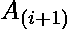

# 用 a[i+1] > a[i]

最大化元素

> 原文:[https://www . geeksforgeeks . org/用-ai1-ai/](https://www.geeksforgeeks.org/maximizing-the-elements-with-ai1-ai/) 最大化元素

给定 N 个整数的数组，重新排列数组元素，使得下一个数组元素大于前一个元素( > )。
**例:**

> 输入:arr[] = {20，30，10，50，40}
> 输出:4
> 我们将数组重新排列为 10，20，30，40，50。作为 20 > 10、30 > 20、40 > 30、50 > 40，所以我们得到 4 个指数 I，使得 > 。
> 输入:arr[] = {200，100，100，200}
> 输出:2
> 我们得到最优排列为 100 200 100 200。

如果所有元素都是不同的，那么答案就是 n-1，其中 n 是数组中的元素数。如果有重复的元素，那么答案是 n–max _ freq。

## C++

```
#include<bits/stdc++.h>
using namespace std;

// returns the number of positions where A(i + 1) is
// greater than A(i) after rearrangement of the array
int countMaxPos(int arr[], int n)
{

    // Creating a HashMap containing char
    // as a key and occurrences as a value
    unordered_map<int, int> map;

    for (int i = 0; i < n; i++ ) {
        if (map.count(arr[i]))
            map.insert({arr[i], (map.count(arr[i]) + 1)});
        else
            map.insert({arr[i], 1});
    }

    // Find the maximum frequency
    int max_freq = 0;

    for (auto i : map) {
        if (max_freq < i.second)
        {
            max_freq = i.second;
        }
    }
    return n - max_freq;
}

// Driver code
int main()
{
    int arr[] = { 20, 30, 10, 50, 40 };
    int n = sizeof(arr)/sizeof(arr[0]);
    cout << (countMaxPos(arr, n));
}

// This code is contributed by Rajput-Ji
```

## Java 语言(一种计算机语言，尤用于创建网站)

```
import java.util.*;

class GFG {

    // returns the number of positions where A(i + 1) is
    // greater than A(i) after rearrangement of the array
    static int countMaxPos(int[] arr)
    {
        int n = arr.length;

        // Creating a HashMap containing char
        // as a key and occurrences as  a value
        HashMap<Integer, Integer> map
            = new HashMap<Integer, Integer>();
        for (int x : arr) {
            if (map.containsKey(x))
                map.put(x, map.get(x) + 1);
            else
                map.put(x, 1);
        }

        // Find the maximum frequency
        int max_freq = 0;
        for (Map.Entry entry : map.entrySet())
            max_freq = Math.max(max_freq, (int)entry.getValue());

        return n - max_freq;
    }

    // Driver code
    public static void main(String[] args)
    {
        int[] arr = { 20, 30, 10, 50, 40 };
        System.out.println(countMaxPos(arr));
    }
}
```

## 蟒蛇 3

```
# Python3 implementation of the above approach

# Returns the number of positions where
# A(i + 1) is greater than A(i) after
# rearrangement of the array
def countMaxPos(arr):

    n = len(arr)

    # Creating a HashMap containing char
    # as a key and occurrences as a value
    Map = {}
    for x in arr:
        if x in Map:
            Map[x] += 1
        else:
            Map[x] = 1

    # Find the maximum frequency
    max_freq = 0
    for entry in Map:
        max_freq = max(max_freq, Map[entry])

    return n - max_freq

# Driver code
if __name__ == "__main__":

    arr = [20, 30, 10, 50, 40]
    print(countMaxPos(arr))

# This code is contributed by Rituraj Jain
```

## C#

```
// C# implementation of the approach
using System;
using System.Collections.Generic;            

class GFG
{

    // returns the number of positions where
    // A(i + 1) is greater than A(i) after
    // rearrangement of the array
    static int countMaxPos(int[] arr)
    {
        int n = arr.Length;

        // Creating a HashMap containing char
        // as a key and occurrences as a value
        Dictionary<int,
                   int> map = new Dictionary<int,
                                             int>();
        foreach (int x in arr)
        {
            if (map.ContainsKey(x))
                map[x] = map[x] + 1;
            else
                map.Add(x, 1);
        }

        // Find the maximum frequency
        int max_freq = 0;
        foreach(KeyValuePair<int, int> entry in map)
            max_freq = Math.Max(max_freq, entry.Value);

        return n - max_freq;
    }

    // Driver code
    public static void Main(String[] args)
    {
        int[] arr = { 20, 30, 10, 50, 40 };
        Console.WriteLine(countMaxPos(arr));
    }
}

// This code is contributed by 29AjayKumar
```

## java 描述语言

```
<script>
// Javascript implementation of the approach

// returns the number of positions where
// A(i + 1) is greater than A(i) after
// rearrangement of the array
function countMaxPos(arr) {
    let n = arr.length;

    // Creating a HashMap containing char
    // as a key and occurrences as a value
    let map = new Map();

    for (let x of arr) {
        if (map.has(x))
            map.set(x, map.get(x) + 1);
        else
            map.set(x, 1);
    }

    // Find the maximum frequency
    let max_freq = 0;

    for (let entry of map)
        max_freq = Math.max(max_freq, entry[1]);

    console.log(max_freq, n)
    return n - max_freq;
}

// Driver code

let arr = [20, 30, 10, 50, 40];
document.write(countMaxPos(arr));

// This code is contributed by _saurabh_jaiswal
</script>
```

**Output:** 

```
4
```