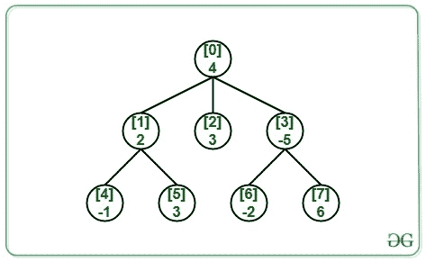
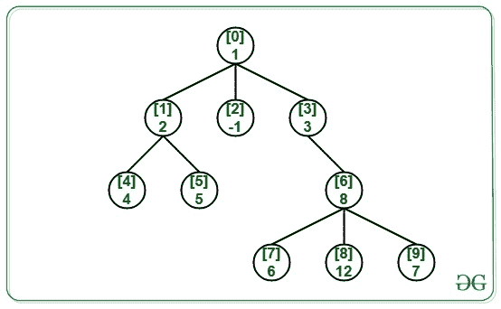

# N 元树中任意两级和之间的最大绝对差

> 原文:[https://www . geeksforgeeks . org/任意两级总和树的最大绝对差值/](https://www.geeksforgeeks.org/maximum-absolute-difference-between-any-two-level-sum-in-a-n-ary-tree/)

给定一个具有正负节点的 [N 元树](https://www.geeksforgeeks.org/generic-treesn-array-trees/)**N**和**(N–1)**边，任务是找出其中水平和的最大绝对差。

**示例:**

> **输入:** N = 8，边[][2] = {{0，1}，{0，2}，{0，3}，{1，4}，{1，5}，{3，6}，{6，7}，值[] = {4，2，3，-5，-1，3，-2，6}，下图:
> 
> 
> 
> **输出:** 6
> **说明:**
> 0 级所有节点之和为 4。
> 1 级所有节点之和为 0。
> 二级所有节点之和为 6。
> 因此，电平和的最大绝对差=(6–0)= 6。
> 
> **输入:** N = 10，边[][2] = {{0，1}、{0，2}、{0，3}、{1，4}、{1，5}、{3，6}、{6，7}、{6，8}、{6，9}}，值[] = {1，2，-1，3，4，5，8，6，12，7}，下图为:
> 
> 
> 
> **输出:** 24

**逼近:**求水平和的最大绝对差，先求最大水平和最小水平和，因为**最大** **水平和****最小水平和**的绝对差总是给我们最大绝对差即，

> 最大绝对差值=绝对值(最大水平总和–最小水平总和)

以下是步骤:

1.  在给定的 **N 元树上执行 [BFS 遍历](https://www.geeksforgeeks.org/breadth-first-search-or-bfs-for-a-graph/)**。
2.  在进行 BFS 遍历时，分别处理不同级别的节点。
3.  对于正在处理的每个级别，计算该级别中节点的总和，并跟踪最大和最小级别总和。
4.  以上遍历后，求最大和最小水平和的绝对差。

下面是上述方法的实现:

## C++

```
// C++ program for the above approach

#include <bits/stdc++.h>
using namespace std;

// Function to find the maximum
// absolute difference of level sum
void maxAbsDiffLevelSum(int N, int M,
                        vector<int> cost,
                        int Edges[][2])
{
    // Create the adjacency list
    vector<int> adj[N];

    for (int i = 0; i < M; i++) {
        int u = Edges[i][0];
        int v = Edges[i][1];
        adj[u].push_back(v);
    }

    // Initialize value of maximum
    // and minimum level sum
    int maxSum = cost[0], minSum = cost[0];

    // Do Level order traversal keeping
    // track of nodes at every level
    queue<int> q;
    q.push(0);

    while (!q.empty()) {

        // Get the size of queue when
        // the level order traversal
        // for one level finishes
        int count = q.size();

        int sum = 0;

        // Iterate for all the nodes
        // in the queue currently
        while (count--) {

            // Dequeue an node from queue
            int temp = q.front();
            q.pop();

            sum = sum + cost[temp];

            // Enqueue the children of
            // dequeued node
            for (int i = 0;
                 i < adj[temp].size(); i++) {

                q.push(adj[temp][i]);
            }
        }

        // Update the maximum level
        // sum value
        maxSum = max(sum, maxSum);

        // Update the minimum level
        // sum value
        minSum = min(sum, minSum);
    }

    // Return the result
    cout << abs(maxSum - minSum);
}

// Driver Code
int main()
{
    // Number of nodes and edges
    int N = 10, M = 9;

    // Edges of the N-ary tree
    int Edges[][2] = { { 0, 1 }, { 0, 2 },
                       { 0, 3 }, { 1, 4 },
                       { 1, 5 }, { 3, 6 },
                       { 6, 7 }, { 6, 8 },
                       { 6, 9 } };

    // Given cost
    vector<int> cost = { 1, 2, -1, 3, 4,
                         5, 8, 6, 12, 7 };

    // Function Call
    maxAbsDiffLevelSum(N, M, cost, Edges);

    return 0;
}
```

## Java 语言(一种计算机语言，尤用于创建网站)

```
// Java program for the above approach
import java.util.*;

class GFG{

// Function to find the maximum
// absolute difference of level sum
static void maxAbsDiffLevelSum(int N, int M,
                               int []cost,
                               int Edges[][])
{

    // Create the adjacency list
    @SuppressWarnings("unchecked")
    Vector<Integer> []adj = new Vector[N];
    for(int i = 0; i < adj.length; i++)
        adj[i] = new Vector<Integer>();

    for(int i = 0; i < M; i++)
    {
        int u = Edges[i][0];
        int v = Edges[i][1];
        adj[u].add(v);
    }

    // Initialize value of maximum
    // and minimum level sum
    int maxSum = cost[0], minSum = cost[0];

    // Do Level order traversal keeping
    // track of nodes at every level
    Queue<Integer> q = new LinkedList<Integer>();
    q.add(0);

    while (!q.isEmpty())
    {

        // Get the size of queue when
        // the level order traversal
        // for one level finishes
        int count = q.size();

        int sum = 0;

        // Iterate for all the nodes
        // in the queue currently
        while (count-- > 0)
        {

            // Dequeue an node from queue
            int temp = q.peek();
            q.remove();

            sum = sum + cost[temp];

            // Enqueue the children of
            // dequeued node
            for(int i = 0;
                    i < adj[temp].size();
                    i++)
            {
                q.add(adj[temp].get(i));
            }
        }

        // Update the maximum level
        // sum value
        maxSum = Math.max(sum, maxSum);

        // Update the minimum level
        // sum value
        minSum = Math.min(sum, minSum);
    }

    // Return the result
    System.out.print(Math.abs(maxSum - minSum));
}

// Driver Code
public static void main(String[] args)
{

    // Number of nodes and edges
    int N = 10, M = 9;

    // Edges of the N-ary tree
    int Edges[][] = { { 0, 1 }, { 0, 2 },
                      { 0, 3 }, { 1, 4 },
                      { 1, 5 }, { 3, 6 },
                      { 6, 7 }, { 6, 8 },
                      { 6, 9 } };

    // Given cost
    int []cost = { 1, 2, -1, 3, 4,
                   5, 8, 6, 12, 7 };

    // Function call
    maxAbsDiffLevelSum(N, M, cost, Edges);
}
}

// This code is contributed by Amit Katiyar
```

## 蟒蛇 3

```
# Python3 program for the above approach
from collections import deque

# Function to find the maximum
# absolute difference of level sum
def maxAbsDiffLevelSum(N, M, cost, Edges):

    # Create the adjacency list
    adj = [[] for i in range(N)]

    for i in range(M):
        u = Edges[i][0]
        v = Edges[i][1]
        adj[u].append(v)

    # Initialize value of maximum
    # and minimum level sum
    maxSum = cost[0]
    minSum = cost[0]

    # Do Level order traversal keeping
    # track of nodes at every level
    q = deque()
    q.append(0)

    while len(q) > 0:

        # Get the size of queue when
        # the level order traversal
        # for one level finishes
        count = len(q)

        sum = 0

        # Iterate for all the nodes
        # in the queue currently
        while (count):

            # Dequeue an node from queue
            temp = q.popleft()
            # q.pop()

            sum = sum + cost[temp]

            # Enqueue the children of
            # dequeued node
            for i in adj[temp]:
                q.append(i)

            count -= 1

        # Update the maximum level
        # sum value
        maxSum = max(sum, maxSum)

        # Update the minimum level
        # sum value
        minSum = min(sum, minSum)

    # Return the result
    print(abs(maxSum - minSum))

# Driver Code
if __name__ == '__main__':

    # Number of nodes and edges
    N = 10
    M = 9

    # Edges of the N-ary tree
    Edges = [ [ 0, 1 ], [ 0, 2 ],
              [ 0, 3 ], [ 1, 4 ],
              [ 1, 5 ], [ 3, 6 ],
              [ 6, 7 ], [ 6, 8 ],
              [ 6, 9 ] ]

    # Given cost
    cost = [ 1, 2, -1, 3, 4,
             5, 8, 6, 12, 7 ]

    # Function call
    maxAbsDiffLevelSum(N, M, cost, Edges)

# This code is contributed by mohit kumar 29
```

## C#

```
// C# program for
// the above approach
using System;
using System.Collections.Generic;
class GFG{

// Function to find the maximum
// absolute difference of level sum
static void maxAbsDiffLevelSum(int N, int M,
                               int []cost,
                               int [,]Edges)
{
  // Create the adjacency list
  List<int> []adj = new List<int>[N];
  for(int i = 0; i < adj.Length; i++)
    adj[i] = new List<int>();

  for(int i = 0; i < M; i++)
  {
    int u = Edges[i, 0];
    int v = Edges[i, 1];
    adj[u].Add(v);
  }

  // Initialize value of maximum
  // and minimum level sum
  int maxSum = cost[0], minSum = cost[0];

  // Do Level order traversal keeping
  // track of nodes at every level
  Queue<int> q = new Queue<int>();
  q.Enqueue(0);

  while (q.Count!=0)
  {
    // Get the size of queue when
    // the level order traversal
    // for one level finishes
    int count = q.Count;

    int sum = 0;

    // Iterate for all the nodes
    // in the queue currently
    while (count-- > 0)
    {
      // Dequeue an node from queue
      int temp = q.Peek();
      q.Dequeue();

      sum = sum + cost[temp];

      // Enqueue the children of
      // dequeued node
      for(int i = 0; i < adj[temp].Count; i++)
      {
        q.Enqueue(adj[temp][i]);
      }
    }

    // Update the maximum level
    // sum value
    maxSum = Math.Max(sum, maxSum);

    // Update the minimum level
    // sum value
    minSum = Math.Min(sum, minSum);
  }

  // Return the result
  Console.Write(Math.Abs(maxSum - minSum));
}

// Driver Code
public static void Main(String[] args)
{   
  // Number of nodes and edges
  int N = 10, M = 9;

  // Edges of the N-ary tree
  int [,]Edges = {{0, 1}, {0, 2},
                  {0, 3}, {1, 4},
                  {1, 5}, {3, 6},
                  {6, 7}, {6, 8},
                  {6, 9}};

  // Given cost
  int []cost = {1, 2, -1, 3, 4,
                5, 8, 6, 12, 7};

  // Function call
  maxAbsDiffLevelSum(N, M, cost, Edges);
}
}

// This code is contributed by 29AjayKumar
```

## java 描述语言

```
<script>

    // JavaScript implementation of the above approach

    // Function to find the maximum
    // absolute difference of level sum
    function maxAbsDiffLevelSum(N, M, cost, Edges)
    {
      // Create the adjacency list
      let adj = new Array(N);
      for(let i = 0; i < adj.length; i++)
        adj[i] = [];

      for(let i = 0; i < M; i++)
      {
        let u = Edges[i][0];
        let v = Edges[i][1];
        adj[u].push(v);
      }

      // Initialize value of maximum
      // and minimum level sum
      let maxSum = cost[0], minSum = cost[0];

      // Do Level order traversal keeping
      // track of nodes at every level
      let q = [];
      q.push(0);

      while (q.length!=0)
      {
        // Get the size of queue when
        // the level order traversal
        // for one level finishes
        let count = q.length;

        let sum = 0;

        // Iterate for all the nodes
        // in the queue currently
        while (count-- > 0)
        {
          // Dequeue an node from queue
          let temp = q[0];
          q.shift();

          sum = sum + cost[temp];

          // Enqueue the children of
          // dequeued node
          for(let i = 0; i < adj[temp].length; i++)
          {
            q.push(adj[temp][i]);
          }
        }

        // Update the maximum level
        // sum value
        maxSum = Math.max(sum, maxSum);

        // Update the minimum level
        // sum value
        minSum = Math.min(sum, minSum);
      }

      // Return the result
      document.write(Math.abs(maxSum - minSum));
    }

    // Number of nodes and edges
    let N = 10, M = 9;

    // Edges of the N-ary tree
    let Edges = [[0, 1], [0, 2],
                    [0, 3], [1, 4],
                    [1, 5], [3, 6],
                    [6, 7], [6, 8],
                    [6, 9]];

    // Given cost
    let cost = [1, 2, -1, 3, 4, 5, 8, 6, 12, 7];

    // Function call
    maxAbsDiffLevelSum(N, M, cost, Edges);

</script>
```

**Output:** 

```
24
```

***时间复杂度:**O(N)*
T5**辅助空间:** O(N)