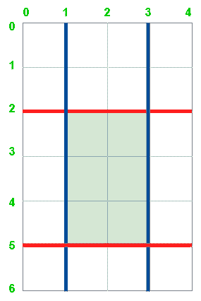

# 水平和垂直切割后蛋糕的最大面积

> 原文:[https://www . geeksforgeeks . org/水平和垂直切割后的最大蛋糕面积/](https://www.geeksforgeeks.org/maximum-area-of-a-cake-after-horizontal-and-vertical-cuts/)

给定两个正整数 **h** 和 **w** 代表高度 ***h*** 和宽度 ***w*** ，形成一个矩形。此外，还有两个[整数数组](https://www.geeksforgeeks.org/introduction-to-arrays/)***水平切口*** 和 ***垂直切口*** ，其中 ***水平切口【I】***是从矩形顶部到 ***的距离，而*** 是水平切口，类似地， ***垂直切口【j】***是任务是在阵列中提供的每个水平和垂直位置 ***水平切割*** 和 ***垂直切割*** 后，找到矩形的*最大面积。因为答案可能是一个巨大的数字，所以返回这个模 10^9 + 7。*

**示例:**



最大面积= 6

> **输入:** h = 6，w = 4，水平切割= [2，5]，垂直切割= [1，3]
> **输出:** 6
> **解释:**上图代表给定的矩形。红线是水平切割，蓝线是垂直切割。矩形切割后，绿色的矩形块面积最大。
> 
> **输入:** h = 5，w = 4，水平切割= [3，1]，垂直切割= [1]
> **输出:** 9

**方法:**通过观察可以解决问题-

*   水平切面如果垂直于任何垂直切面，则所有垂直切面都穿过所有水平切面。
*   接下来，矩形的最大面积必须由至少一个垂直切口和一个水平切口包围。

从上面的观察，很明显，我们需要分别找到两个水平切口和两个垂直切口之间的最大距离，并将它们相乘以找到矩形的面积。按照以下步骤解决问题:

*   对**水平切割**和**垂直切割**阵列进行排序。
*   初始化两个变量，分别将**最大水平**和**最大垂直**设为**水平切割【0】**和**垂直切割【0】**，以考虑水平和垂直方向上最靠近轴的矩形，它们将分别存储矩形的最大水平和垂直长度。
*   [使用变量 **i** 在范围](https://www.geeksforgeeks.org/range-based-loop-c/)**【1，horizontal cuts . size()-1】**中迭代，并执行以下步骤:
    *   将**最大水平**的值修改为**最大值(最大水平，水平切口[I]–水平切口[i-1])** 。
    *   将**最大垂直**的值修改为**最大值(最大垂直，垂直间距[I]–垂直间距[i-1])** 。
*   打印**最大水平*最大垂直**作为答案。

下面是上述方法的实现:

## C++

```
// C++ Program for the above approach
#include <bits/stdc++.h>
using namespace std;
const int mod = 1e9 + 7;

class Solution {
public:
    // Returns the maximum area of rectangle
    // after Horizontal and Vertical Cuts
    int maxArea(int h, int w, vector<int>& horizontalCuts,
                vector<int>& verticalCuts)
    {

        // Sort the two arrays
        sort(horizontalCuts.begin(), horizontalCuts.end());
        sort(verticalCuts.begin(), verticalCuts.end());

        // Insert the right bound h and w
        // in their respective vectors
        horizontalCuts.push_back(h);
        verticalCuts.push_back(w);

          //Initialising both by first indexs,
          //to consider first rectangle formed by
          //respective horizontal and vertical cuts
        int maxHorizontal = horizontalCuts[0];
        int maxVertical = verticalCuts[0];

        // Find the maximum Horizontal Length possible
        for (int i = 1; i < horizontalCuts.size(); i++) {
            int diff
                = horizontalCuts[i] - horizontalCuts[i - 1];
            maxHorizontal = max(maxHorizontal, diff);
        }

        // Find the maximum vertical Length possible
        for (int i = 1; i < verticalCuts.size(); i++) {
            int diff
                = verticalCuts[i] - verticalCuts[i - 1];
            maxVertical = max(maxVertical, diff);
        }

        // Return the maximum area of rectangle
        return (int)((long)maxHorizontal * maxVertical
                     % mod);
    }
};

// Driver Code
int main()
{
    // Class Call
    Solution ob;

    // Given Input
    vector<int> hc = { 2, 5 }, vc = { 1, 3 };
    int h = 6, v = 4;
    // Function Call
    cout << (ob.maxArea(6, 4, hc, vc));
    return 0;
}
```

## Java 语言(一种计算机语言，尤用于创建网站)

```
// Java program for above approach
import java.awt.*;
import java.util.*;
class GFG{

    final int mod = (int) (1e9 + 7);

    // Returns the maximum area of rectangle
    // after Horizontal and Vertical Cuts
    int maxArea(int h, int w, ArrayList<Integer> horizontalCuts,
                    ArrayList<Integer> verticalCuts)
    {

        // Sort the two arrays
        Collections.sort(horizontalCuts);
        Collections.sort(verticalCuts);

        // Insert the right bound h and w
        // in their respective vectors
        horizontalCuts.add(h);
        verticalCuts.add(w);

        int maxHorizontal = 0;
        int maxVertical = 0;

        // Find the maximum Horizontal Length possible
        for (int i = 1; i < horizontalCuts.size(); i++) {
            int diff
                    = horizontalCuts.get(i) - horizontalCuts.get(i-1);
            maxHorizontal = Math.max(maxHorizontal, diff);
        }

        // Find the maximum vertical Length possible
        for (int i = 1; i < verticalCuts.size(); i++) {
            int diff
                    = verticalCuts.get(i) - verticalCuts.get(i - 1);
            maxVertical = Math.max(maxVertical, diff);
        }

        // Return the maximum area of rectangle
        return (int)((long)maxHorizontal * maxVertical
                % mod);
        }

    // Driver Code
    public static void main(String[] args)
    {

        // Class Call
        GFG ob = new GFG();

        // Given Input
        ArrayList<Integer> hc = new ArrayList<>();
        hc.add(2);
        hc.add(5);
        ArrayList<Integer> vc = new ArrayList<>();
        vc.add(1);
        vc.add(3);

        int h = 6, v = 4;

        // Function Call
        System.out.println(ob.maxArea(6, 4, hc, vc));
    }
}

//This code is contributed by hritikrommie.
```

## 蟒蛇 3

```
# python 3 Program for the above approach
mod = 1000000007

# Returns the maximum area of rectangle
# after Horizontal and Vertical Cuts
def maxArea(h, w, horizontalCuts,
            verticalCuts):

    # Sort the two arrays
    horizontalCuts.sort()
    verticalCuts.sort()

    # Insert the right bound h and w
    # in their respective vectors
    horizontalCuts.append(h)
    verticalCuts.append(w)

    maxHorizontal = 0
    maxVertical = 0

    # Find the maximum Horizontal Length possible
    for i in range(1, len(horizontalCuts)):

        diff = horizontalCuts[i] - horizontalCuts[i - 1]
        maxHorizontal = max(maxHorizontal, diff)

    # Find the maximum vertical Length possible
    for i in range(1,
                   len(verticalCuts)):
        diff = verticalCuts[i] - verticalCuts[i - 1]
        maxVertical = max(maxVertical, diff)

    # Return the maximum area of rectangle
    return (int)(maxHorizontal * maxVertical
                 % mod)

# Driver Code
if __name__ == "__main__":

    # Given Input
    hc = [2, 5]
    vc = [1, 3]
    h = 6
    v = 4

    # Function Call
    print(maxArea(6, 4, hc, vc))

    # This code is contributed by ukasp.
```

## C#

```
// C# Program for the above approach
using System;
using System.Collections;
using System.Collections.Generic;
class GFG
{
    static int mod = 1000000007;

    // Returns the maximum area of rectangle
    // after Horizontal and Vertical Cuts
    static int maxArea(int h, int w, List<int> horizontalCuts, List<int> verticalCuts)
    {
        // Sort the two arrays
        horizontalCuts.Sort();
        verticalCuts.Sort();

        // Insert the right bound h and w
        // in their respective vectors
        horizontalCuts.Add(h);
        verticalCuts.Add(w);

        int maxHorizontal = 0;
        int maxVertical = 0;

        // Find the maximum Horizontal Length possible
        for(int i = 1; i < horizontalCuts.Count; i++)
        {

            int diff = horizontalCuts[i] - horizontalCuts[i - 1];
            maxHorizontal = Math.Max(maxHorizontal, diff);
        }

        // Find the maximum vertical Length possible
        for(int i = 1; i < verticalCuts.Count; i++)
        {
            int diff = verticalCuts[i] - verticalCuts[i - 1];
            maxVertical = Math.Max(maxVertical, diff);
        }

        // Return the maximum area of rectangle
        return (int)(maxHorizontal * maxVertical % mod);
    }

  static void Main ()
  {
    // Given Input
    List<int> hc = new List<int>(new int[]{ 2, 5 });
    List<int> vc = new List<int>(new int[]{ 1, 3 });

    // Function Call
    Console.WriteLine(maxArea(6, 4, hc, vc));
  }
}

// This code is contributed by suresh07.
```

## java 描述语言

```
<script>
        // JavaScript program for the above approach

        const mod = 1e9 + 7;

        class Solution {

            // Returns the maximum area of rectangle
            // after Horizontal and Vertical Cuts
            maxArea(h, w, horizontalCuts, verticalCuts) {

                // Sort the two arrays
                horizontalCuts.sort(function (a, b) { return a - b; })
                verticalCuts.sort(function (a, b) { return a - b; })

                // Insert the right bound h and w
                // in their respective vectors
                horizontalCuts.push(h);
                verticalCuts.push(w);

                let maxHorizontal = 0;
                let maxVertical = 0;

                // Find the maximum Horizontal Length possible
                for (let i = 1; i < horizontalCuts.length; i++) {
                    let diff
                        = horizontalCuts[i] - horizontalCuts[i - 1];
                    maxHorizontal = Math.max(maxHorizontal, diff);
                }

                // Find the maximum vertical Length possible
                for (let i = 1; i < verticalCuts.length; i++) {
                    let diff
                        = verticalCuts[i] - verticalCuts[i - 1];
                    maxVertical = Math.max(maxVertical, diff);
                }

                // Return the maximum area of rectangle
                return parseInt(maxHorizontal * maxVertical
                    % mod);
            }
        }

        // Driver Code

        // Class Call
        let ob = new Solution();

        // Given Input
        let hc = [2, 5], vc = [1, 3];
        let h = 6, v = 4;
        // Function Call
        document.write(ob.maxArea(6, 4, hc, vc));

    // This code is contributed by Potta Lokesh

    </script>
```

**Output**

```
6
```

***时间复杂度:** O(NlogN)*
***辅助空间:** O(1)*