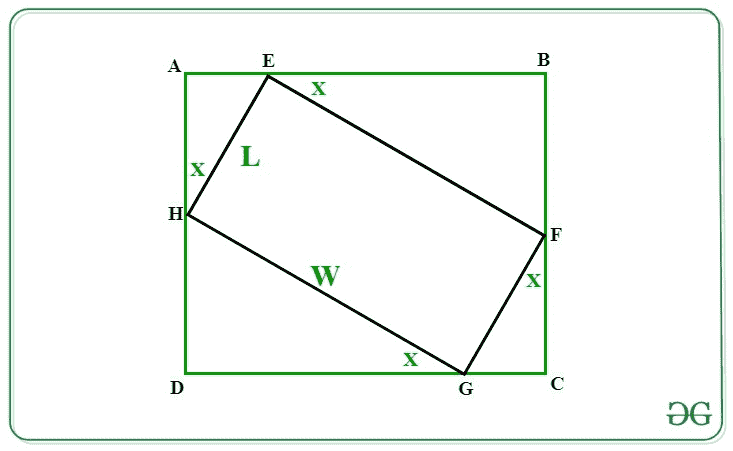
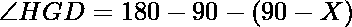
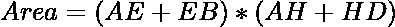
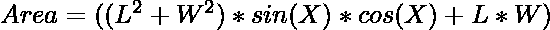
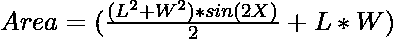
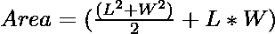
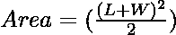

# 给定大小为 LxW 的矩形可外切的最大面积

> 原文:[https://www . geeksforgeeks . org/给定大小的最大外接矩形面积-lxw/](https://www.geeksforgeeks.org/maximum-area-of-a-rectangle-that-can-be-circumscribed-about-a-given-rectangle-of-size-lxw/)

给定一个矩形尺寸 **L** 和 **W** 。任务是找到一个矩形的最大面积，这个矩形可以用尺寸 **L** 和 **W** 围绕一个给定的矩形进行外切。

**示例:**

> **输入:** L = 10，W = 10
> T3】输出: 200
> 
> **输入:** L = 18，W = 12
> T3】输出: 450

**方法:**让下面是给定的矩形 **EFGH** 的尺寸 **L** 和 **W** 。我们必须找到矩形 **ABCD** 的面积，它是外接矩形 **EFGH** 。



上图:
如果那么作为 GCF 就是直角三角形。
因此，

=>
=>
同样，


现在，矩形 ABCD 的面积由:
给出

> 面积= AB * AD
> 面积= (AE + EB)*(AH + HD) …..(1)

> 根据投影规则:
> AE = L * sin(X)
> EB = W * cos(X)
> AH = L * cos(X)
> HD = W * sin(X)

将上述投影的值代入等式(1)，我们得到:

> 
> 
> 
> 
> 现在要最大化面积，罪恶值(2X)必须最大化即 1。
> 因此在将罪恶(2X)替换为 1 之后，我们有
> 
> 

以下是上述方法的实现:

## C++

```
// C++ program for the above approach
#include <bits/stdc++.h>
using namespace std;

// Function to find area of rectangle
// inscribed another rectangle of
// length L and width W
double AreaofRectangle(int L, int W)
{

    // Area of rectangle
    double area = (W + L) * (W + L) / 2;

    // Return the area
    return area;
}

// Driver Code
int main()
{

    // Given dimensions
    int L = 18;
    int W = 12;

    // Function call
    cout << AreaofRectangle(L, W);
    return 0;
}

// This code is contributed by Princi Singh
```

## Java 语言(一种计算机语言，尤用于创建网站)

```
// Java program for the above approach
import java.io.*;
import java.util.*;

class GFG{

// Function to find area of rectangle
// inscribed another rectangle of
// length L and width W
static double AreaofRectangle(int L, int W)
{

    // Area of rectangle
    double area = (W + L) * (W + L) / 2;

    // Return the area
    return area;
}

// Driver Code
public static void main(String args[])
{

    // Given dimensions
    int L = 18;
    int W = 12;

    // Function call
    System.out.println(AreaofRectangle(L, W));
}
}

// This code is contributed by offbeat
```

## 蟒蛇 3

```
# Python3 program for the above approach

# Function to find area of rectangle
# inscribed another rectangle of
# length L and width W
def AreaofRectangle(L, W):

  # Area of rectangle
  area =(W + L)*(W + L)/2

# Return the area
  return area

# Driver Code
if __name__ == "__main__":

  # Given Dimensions
  L = 18
  W = 12

  # Function Call
  print(AreaofRectangle(L, W))
```

## C#

```
// C# program for the above approach
using System;

class GFG{

// Function to find area of rectangle
// inscribed another rectangle of
// length L and width W
static double AreaofRectangle(int L, int W)
{

    // Area of rectangle
    double area = (W + L) * (W + L) / 2;

    // Return the area
    return area;
}

// Driver Code
public static void Main(String []args)
{

    // Given dimensions
    int L = 18;
    int W = 12;

    // Function call
    Console.Write(AreaofRectangle(L, W));
}
}

// This code is contributed by shivanisinghss2110
```

## java 描述语言

```
<script>
      // JavaScript program for the above approach

      // Function to find area of rectangle
      // inscribed another rectangle of
      // length L and width W
      function AreaofRectangle(L, W) {
        // Area of rectangle
        var area = parseFloat(((W + L) * (W + L)) / 2).toFixed(1);

        // Return the area
        return area;
      }

      // Driver Code
      // Given dimensions
      var L = 18;
      var W = 12;

      // Function call
      document.write(AreaofRectangle(L, W));
    </script>
```

**Output:** 

```
450.0
```

**时间复杂度:***O(1)*
T5】辅助空间: *O(1)*