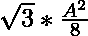

# 等边三角形内接矩形的最大面积

> 原文:[https://www . geesforgeks . org/等边三角形内接矩形的最大面积/](https://www.geeksforgeeks.org/maximum-area-of-rectangle-inscribed-in-an-equilateral-triangle/)

给定一个整数 **A** ，表示一个等边三角形的边，任务是找出三角形中可以内接的矩形的最大面积。
**例:**

> **输入:** A = 10
> **输出:** 21.65
> **说明:**
> 10 边等边三角形内接矩形最大面积为 21.65。
> **输入:** A = 12
> **输出:** 31.176
> **说明:**
> 12 边等边三角形内接矩形的最大面积为 31.176。

**方法:**思路是利用等边三角形内角为 60° o 的事实。然后，从三角形的一边画出垂线，并借助下面的公式
计算矩形的边

> 矩形的长度=(等边三角形的边)/2
> 矩形的宽度= sqrt(3) *(等边三角形的边)/4

那么，矩形的最大面积将是
下面是上述方法的实现:

## C++

```
// CPP implementation to find the
// maximum area inscribed in an
// equilateral triangle
#include<bits/stdc++.h>
using namespace std;

// Function to find the maximum area
// of the rectangle inscribed in an
// equilateral triangle of side S
double solve(int s)
{
    // Maximum area of the rectangle
    // inscribed in an equilateral
    // triangle of side S
    double area = (1.732 * pow(s, 2))/8;
    return area;

}

// Driver Code
int main()
{
    int n = 14;
    cout << solve(n);
}

// This code is contributed by Surendra_Gangwar
```

## Java 语言(一种计算机语言，尤用于创建网站)

```
// Java implementation to find the
// maximum area inscribed in an
// equilateral triangle

class GFG
{
    // Function to find the maximum area
    // of the rectangle inscribed in an
    // equilateral triangle of side S
    static double solve(int s)
    {
        // Maximum area of the rectangle
        // inscribed in an equilateral
        // triangle of side S
        double area = (1.732 * Math.pow(s, 2))/8;
        return area;

    }

    // Driver Code
    public static void  main(String[] args)
    {
        int n = 14;
        System.out.println(solve(n));
    }
}

// This article is contributed by Apurva raj
```

## 蟒蛇 3

```
# Python3 implementation to find the
# maximum area inscribed in an
# equilateral triangle

# Function to find the maximum area
# of the rectangle inscribed in an
# equilateral triangle of side S
def solve(s):

    # Maximum area of the rectangle
    # inscribed in an equilateral
    # triangle of side S
    area = (1.732 * s**2)/8
    return area

# Driver Code
if __name__=='__main__':
    n = 14
    print(solve(n))
```

## C#

```
// C# implementation to find the
// maximum area inscribed in an
// equilateral triangle
using System;

class GFG
{
    // Function to find the maximum area
    // of the rectangle inscribed in an
    // equilateral triangle of side S
    static double solve(int s)
    {
        // Maximum area of the rectangle
        // inscribed in an equilateral
        // triangle of side S
        double area = (1.732 * Math.Pow(s, 2))/8;
        return area;

    }

    // Driver Code
    public static void  Main(String[] args)
    {
        int n = 14;
        Console.WriteLine(solve(n));
    }
}

// This code is contributed by Rajput-Ji
```

## java 描述语言

```
<script>

// Javascript implementation to find the
// maximum area inscribed in an
// equilateral triangle

// Function to find the maximum area
// of the rectangle inscribed in an
// equilateral triangle of side S
function solve(s)
{

    // Maximum area of the rectangle
    // inscribed in an equilateral
    // triangle of side S
    let area = (1.732 * Math.pow(s, 2))/8;
    return area;

}

// Driver Code
    let n = 14;
    document.write(solve(n));

// This code is contributed by Manoj

</script>
```

**Output:** 

```
42.434
```