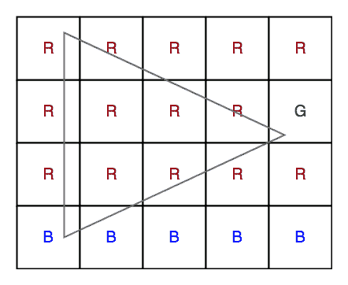

# 顶点颜色不同的三角形的最大面积

> 原文:[https://www . geesforgeks . org/最大面积-三角形-不同-顶点-颜色/](https://www.geeksforgeeks.org/maximum-area-triangle-different-vertex-colors/)

给定一个由 **N** 行和 **M** 列组成的矩阵，由三个值{r，g，b}组成。任务是找到最大三角形的面积，该三角形的一边平行于 y 轴，即垂直，并且所有三个顶点的颜色都不同。
**例:**

```
Input :  N = 4, M =5
  mat[][] =
  {
  r, r, r, r, r,
  r, r, r, r, g,
  r, r, r, r, r,
  b, b, b, b, b,
  }
Output : 10
The maximum area of triangle is 10.
Triangle coordinates are (0,0) containing r, (1,4) containing g, (3,0) containing b.
```



我们知道三角形的面积= 1/2 *底*高，所以我们需要最大化三角形的底和高。由于一边平行于 y 轴，我们可以把那一边看作三角形的底边。
为了最大化基数，我们可以为每一列找到{r，g，b}的第一次和最后一次出现。所以每列有两组 3 个值。对于任何列中的基，一个顶点来自第一个集合，第二个顶点来自第二个集合，因此它们具有不同的值。
为了最大化高度，对于任何作为基础的柱，必须选择第三个顶点，使得该顶点离柱最远，在柱的左侧或右侧，其值不同于其他两个顶点。
现在为每一列找出三角形的最大面积。
以下是本办法的实施:

## C++

```
// C++ program to find maximum area of triangle
// having different vertex color in a matrix.
#include<bits/stdc++.h>
using namespace std;
#define R 4
#define C 5

// return the color value so that their corresponding
// index can be access.
int mapcolor(char c)
{
    if (c == 'r')
        return 0;
    else if (c == 'g')
        return 1;
    else if (c == 'b')
        return 2;
}

// Returns the maximum area of triangle from all
// the possible triangles
double findarea(char mat[R][C], int r, int c,
                int top[3][C], int bottom[3][C],
                int left[3], int right[3])
{
    double ans = (double)1;

    // for each column
    for (int i = 0; i < c; i++)

        // for each top vertex
        for (int x = 0; x < 3; x++)

            // for each bottom vertex
            for (int y = 0; y < 3; y++)
            {
                // finding the third color of
                // vertex either on right or left.
                int z = 3 - x - y;

                // finding area of triangle on left side of column.
                if (x != y && top[x][i] != INT_MAX &&
                    bottom[y][i] != INT_MIN && left[z] != INT_MAX)
                {
                    ans = max(ans, ((double)1/(double)2) *
                                   (bottom[y][i] - top[x][i]) *
                                    (i - left[z]));
                }

                // finding area of triangle on right side of column.
                if (x != y && top[x][i] != INT_MAX &&
                              bottom[y][i] != INT_MIN &&
                              right[z] != INT_MIN)
                {
                    ans = max(ans, ((double)1/(double)2) *
                                    (bottom[y][i] - top[x][i]) *
                                    (right[z] - i));
                }
            }

    return ans;
}

// Precompute the vertices of top, bottom, left
// and right and then computing the maximum area.
double maxarea(char mat[R][C], int r, int c)
{
    int left[3], right[3];
    int top[3][C], bottom[3][C];
    memset(left, INT_MAX, sizeof left);
    memset(right, INT_MIN, sizeof right);
    memset(top, INT_MAX, sizeof top);
    memset(bottom, INT_MIN, sizeof bottom);

    // finding the r, b, g cells for the left
    // and right vertices.
    for (int i = 0; i < r; i++)
    {
        for (int j = 0; j < c; j++)
        {
            left[mapcolor(mat[i][j])] =
                  min(left[mapcolor(mat[i][j])], j);
            right[mapcolor(mat[i][j])] =
                  max(left[mapcolor(mat[i][j])], j);
        }
    }

    // finsing set of {r, g, b} of top and
    // bottom for each column.
    for (int j = 0; j < c; j++)
    {
        for( int i = 0; i < r; i++)
        {
            top[mapcolor(mat[i][j])][j] =
                 min(top[mapcolor(mat[i][j])][j], i);
            bottom[mapcolor(mat[i][j])][j] =
                 max(bottom[mapcolor(mat[i][j])][j], i);
        }
    }

    return findarea(mat, R, C, top, bottom, left, right);
}

// Driven Program
int main()
{
    char mat[R][C] =
    {
        'r', 'r', 'r', 'r', 'r',
        'r', 'r', 'r', 'r', 'g',
        'r', 'r', 'r', 'r', 'r',
        'b', 'b', 'b', 'b', 'b',
    };

    cout << maxarea(mat, R, C) << endl;
    return 0;
}
```

## 蟒蛇 3

```
# Python3 program to find the maximum
# area of triangle having different
# vertex color in a matrix.

# Return the color value so that their
# corresponding index can be access.
def mapcolor(c):

    if c == 'r':
        return 0
    elif c == 'g':
        return 1
    elif c == 'b':
        return 2

# Returns the maximum area of triangle
# from all the possible triangles
def findarea(mat, r, c, top,
             bottom, left, right):

    ans = 1

    # for each column
    for i in range(0, c):

        # for each top vertex
        for x in range(0, 3):

            # for each bottom vertex
            for y in range(0, 3):

                # finding the third color of
                # vertex either on right or left.
                z = 3 - x - y

                # finding area of triangle on
                # left side of column.
                if (x != y and top[x][i] != INT_MAX and
                    bottom[y][i] != INT_MIN and
                    left[z] != INT_MAX):

                    ans = max(ans, 0.5 * (bottom[y][i] -
                              top[x][i]) * (i - left[z]))

                # finding area of triangle on right side of column.
                if (x != y and top[x][i] != INT_MAX and
                    bottom[y][i] != INT_MIN and
                    right[z] != INT_MIN):

                    ans = max(ans, 0.5 * (bottom[y][i] -
                              top[x][i]) * (right[z] - i))

    return ans

# Precompute the vertices of top, bottom, left
# and right and then computing the maximum area.
def maxarea(mat, r, c):

    left = [-1] * 3
    right = [0] * 3
    top = [[-1 for i in range(C)]
               for j in range(3)]
    bottom = [[0 for i in range(C)]
                 for j in range(3)]

    # finding the r, b, g cells for
    # the left and right vertices.
    for i in range(0, r):

        for j in range(0, c):

            left[mapcolor(mat[i][j])] = \
                min(left[mapcolor(mat[i][j])], j)

            right[mapcolor(mat[i][j])] = \
                max(left[mapcolor(mat[i][j])], j)

    # finsing set of r, g, b of top
    # and bottom for each column.
    for j in range(0, c):

        for i in range(0, r):

            top[mapcolor(mat[i][j])][j] = \
                min(top[mapcolor(mat[i][j])][j], i)

            bottom[mapcolor(mat[i][j])][j] = \
                max(bottom[mapcolor(mat[i][j])][j], i)

    return int(findarea(mat, R, C, top,
                        bottom, left, right))

# Driver Code
if __name__ == "__main__":

    R, C = 4, 5
    mat = [['r', 'r', 'r', 'r', 'r'],
           ['r', 'r', 'r', 'r', 'g'],
           ['r', 'r', 'r', 'r', 'r'],
           ['b', 'b', 'b', 'b', 'b']]

    INT_MAX, INT_MIN = float('inf'), float('-inf')
    print(maxarea(mat, R, C))

# This code is contributed by Rituraj Jain
```

**输出:**

```
10
```

**时间复杂度:** O(R * C)
**辅助空间:** O(R + C)
**来源:**[http://stackoverflow . com/questions/40078660/最大三角形面积具有不同颜色的所有顶点](http://stackoverflow.com/questions/40078660/maximum-area-of-triangle-having-all-vertices-of-different-color)
本文由[**Anuj Chauhan(Anuj 0503)**](https://web.facebook.com/anuj0503)供稿。如果你喜欢 GeeksforGeeks 并想投稿，你也可以使用[write.geeksforgeeks.org](https://write.geeksforgeeks.org)写一篇文章或者把你的文章邮寄到 review-team@geeksforgeeks.org。看到你的文章出现在极客博客主页上，帮助其他极客。
如果发现有不正确的地方，或者想分享更多关于上述话题的信息，请写评论。