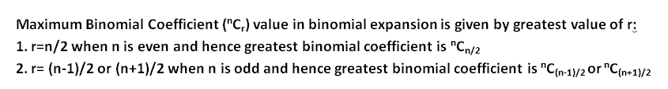

# 最大二项式系数项值

> 原文:[https://www . geesforgeks . org/最大-二项式-系数-项-值/](https://www.geeksforgeeks.org/maximum-binomial-coefficient-term-value/)

给定正整数 **n** 。任务是找出所有二项式系数中的最大系数项。
二项式系数系列为
**T5】nC<sub>0</sub>， <sup>n</sup> C <sub>1</sub> ， <sup>n</sup> C <sub>2</sub> ，…。， <sup>n</sup> C <sub>r</sub> ，…。， <sup>n</sup> C <sub>n-2</sub> ， <sup>n</sup> C <sub>n-1</sub> ，<sup>n</sup>C<sub>n</sub>T33
任务是找出**T36】nC<sub>r</sub>T40】的最大值。****

**示例:**

```
Input : n = 4
Output : 6
4C0 = 1
4C1 = 4
4C2 = 6
4C3 = 1
4C4 = 1
So, maximum coefficient value is 6.

Input : n = 3
Output : 3
```

**方法一:(蛮力)**
思路是求二项式系数序列的所有值，求序列中的最大值。

下面是该方法的实现:

## C++

```
// CPP Program to find maximum binomial coefficient
// term
#include<bits/stdc++.h>
using namespace std;

// Return maximum binomial coefficient term value.
int maxcoefficientvalue(int n)
{
    int C[n+1][n+1];

    // Calculate value of Binomial Coefficient in 
    // bottom up manner
    for (int i = 0; i <= n; i++)
    {
        for (int j = 0; j <= min(i, n); j++)
        {
            // Base Cases
            if (j == 0 || j == i)
                C[i][j] = 1;

            // Calculate value using previously
            // stored values
            else
                C[i][j] = C[i-1][j-1] + C[i-1][j];
        }
    }

    // finding the maximum value.
    int maxvalue = 0;
    for (int i = 0; i <= n; i++)
        maxvalue = max(maxvalue, C[n][i]);

    return maxvalue;
}

// Driven Program
int main()
{
    int n = 4;
    cout << maxcoefficientvalue(n) << endl;
    return 0;
} 
```

## Java 语言(一种计算机语言，尤用于创建网站)

```
// Java Program to find
// maximum binomial 
// coefficient term
import java.io.*;

class GFG 
{
// Return maximum binomial 
// coefficient term value.
static int maxcoefficientvalue(int n)
{
    int [][]C = new int[n + 1][n + 1];

    // Calculate value of 
    // Binomial Coefficient  
    // in bottom up manner
    for (int i = 0; i <= n; i++)
    {
        for (int j = 0; 
                 j <= Math.min(i, n); j++)
        {

            // Base Cases
            if (j == 0 || j == i)
                C[i][j] = 1;

            // Calculate value
            // using previously
            // stored values
            else
                C[i][j] = C[i - 1][j - 1] + 
                          C[i - 1][j];
        }
    }

    // finding the
    // maximum value.
    int maxvalue = 0;

    for (int i = 0; i <= n; i++)
        maxvalue = Math.max(maxvalue, C[n][i]);

    return maxvalue;
}

// Driver Code
public static void main (String[] args) 
{
    int n = 4;
    System.out.println(maxcoefficientvalue(n));
}
}

// This code is contributed by ajit
```

## 蟒蛇 3

```
# Python3 Program to find 
# maximum binomial 
# coefficient term

# Return maximum binomial 
# coefficient term value.
def maxcoefficientvalue(n):
    C = [[0 for x in range(n + 1)]
            for y in range(n + 1)];

    # Calculate value of
    # Binomial Coefficient in
    # bottom up manner
    for i in range(n + 1):
        for j in range(min(i, n) + 1):

            # Base Cases
            if (j == 0 or j == i):
                C[i][j] = 1;

            # Calculate value
            # using previously
            # stored values
            else:
                C[i][j] = (C[i - 1][j - 1] + 
                           C[i - 1][j]);

    # finding the maximum value.
    maxvalue = 0;
    for i in range(n + 1):
        maxvalue = max(maxvalue, C[n][i]);

    return maxvalue;

# Driver Code
n = 4;
print(maxcoefficientvalue(n));

# This code is contributed by mits
```

## C#

```
// C# Program to find maximum binomial coefficient
// term
using System;

public class GFG {

    // Return maximum binomial coefficient term value.
    static int maxcoefficientvalue(int n)
    {
        int [,]C = new int[n+1,n+1];

        // Calculate value of Binomial Coefficient in 
        // bottom up manner
        for (int i = 0; i <= n; i++)
        {
            for (int j = 0; j <= Math.Min(i, n); j++)
            {

                // Base Cases
                if (j == 0 || j == i)
                    C[i,j] = 1;

                // Calculate value using previously
                // stored values
                else
                    C[i,j] = C[i-1,j-1] + C[i-1,j];
            }
        }

        // finding the maximum value.
        int maxvalue = 0;

        for (int i = 0; i <= n; i++)
            maxvalue = Math.Max(maxvalue, C[n,i]);

        return maxvalue;
    }

    // Driven Program

    static public void Main ()
    {

        int n = 4;

        Console.WriteLine(maxcoefficientvalue(n));
    }
}

// This code is contributed by vt_m.
```

## 服务器端编程语言（Professional Hypertext Preprocessor 的缩写）

```
<?php
// PHP Program to find 
// maximum binomial 
// coefficient term

// Return maximum binomial 
// coefficient term value.
function maxcoefficientvalue($n)
{

    // Calculate value of 
    // Binomial Coefficient in 
    // bottom up manner
    for ($i = 0; $i <= $n; $i++)
    {
        for ($j = 0; $j <= min($i, $n); $j++)
        {

            // Base Cases
            if ($j == 0 || $j == $i)
                $C[$i][$j] = 1;

            // Calculate value
            // using previously
            // stored values
            else
                $C[$i][$j] = $C[$i - 1][$j - 1] + 
                             $C[$i - 1][$j];
        }
    }

    // finding the maximum value.
    $maxvalue = 0;
    for ($i = 0; $i <= $n; $i++)
        $maxvalue = max($maxvalue, $C[$n][$i]);

    return $maxvalue;
}

    // Driver Code
    $n = 4;
    echo maxcoefficientvalue($n), "\n";

// This code is contributed by aj_36
?>
```

## java 描述语言

```
<script>

// JavaScript Program to find 
// maximum binomial 
// coefficient term

    // Returns value of 
    // Binomial Coefficient
    // C(n, k)
    function binomialCoeff(n, k)
    {
        let C = new Array(n+1);

        // Loop to create 2D array using 1D array
    for (let i = 0; i < C.length; i++) {
        C[i] = new Array(2);
    }

        // Calculate value of 
        // Binomial Coefficient 
        // in bottom up manner
        for (let i = 0; i <= n; i++)
        {
            for (let j = 0; 
                j <= Math.min(i, k); j++)
            {

                // Base Cases
                if (j == 0 || j == i)
                    C[i][j] = 1;

                // Calculate value using 
                // previously stored values
                else
                    C[i][j] = C[i - 1][j - 1] + 
                              C[i - 1][j];
            }
        }
        return C[n][k];
    }

    // Return maximum 
    // binomial coefficient
    // term value.
    function maxcoefficientvalue(n)
    {

        // if n is even
        if (n % 2 == 0)
            return binomialCoeff(n, n / 2);

        // if n is odd
        else
            return binomialCoeff(n, (n + 1) / 2);
    }

// Driver Code
        let n = 4;   
        document.write(maxcoefficientvalue(n));

  // This code is contributed by avijitmondal1998..
</script>
```

**输出:**

```
6
```

**方法二:(使用公式)**



证据，

> (x + y) <sup>n</sup> 的展开为:
> T3】nC<sub>0</sub>x<sup>n</sup>y<sup>0</sup>，<sup>n</sup>C<sub>1</sub>x<sup>n-1</sup>y<sup>1</sup>，<sup>n</sup>C<sub>2</sub>x<sup>n-2</sup>y，<sup>n</sup>C<sub>r</sub>x<sup>n-r</sup>y<sup>r</sup>，…。，<sup>n</sup>C<sub>n-2</sub>x<sup>2</sup>y<sup>n-2</sup>，<sup>n</sup>C<sub>n-1</sub>x<sup>1</sup>y<sup>n-1</sup>，<sup>n</sup>C<sub>n</sub>x<sup>0</sup>y<sup>n【T58， <sup>n</sup> C <sub>r</sub> ，…。， <sup>n</sup> C <sub>n-2</sub> ， <sup>n</sup> C <sub>n-1</sub> ， <sup>n</sup> C <sub>n</sub>
> 让术语 t <sub>i+1</sub> 在(x + y) <sup>n</sup> 中包含最大值。因此，
> t<sub>r+1</sub>T153】= t<sub>r</sub>T99<sup>n</sup>C<sub>r</sub>x<sup>n-r</sup>y<sup>r</sup>T154】=<sup>n</sup>C<sub>r-1</sub>x<sup>n-r+1</sup>y【
> <sup>n</sup>C<sub>r</sub>>=<sup>n</sup>C<sub>r-1</sub>
> T127】n</sup>C<sub>r</sub>/<sup>n</sup>C<sub>r-1</sub>T156】= 1
> (使用 <sup>n
> r 应为整数。因此，当 n 为偶数时，我们得到 r 的最大系数等于:
> (1) n/2。
> (2) (n+1)/2 或(n-1)/2，当 n 为奇数时。</sup>

## C++

```
// CPP Program to find maximum binomial coefficient term
#include<bits/stdc++.h>
using namespace std;

// Returns value of Binomial Coefficient C(n, k)
int binomialCoeff(int n, int k)
{
    int C[n+1][k+1];

    // Calculate value of Binomial Coefficient 
    // in bottom up manner
    for (int i = 0; i <= n; i++)
    {
        for (int j = 0; j <= min(i, k); j++)
        {
            // Base Cases
            if (j == 0 || j == i)
                C[i][j] = 1;

            // Calculate value using previously
            // stored values
            else
                C[i][j] = C[i-1][j-1] + C[i-1][j];
        }
    }

    return C[n][k];
}

// Return maximum binomial coefficient term value.
int maxcoefficientvalue(int n)
{
    // if n is even
    if (n%2 == 0)
        return binomialCoeff(n, n/2);

    // if n is odd
    else
        return binomialCoeff(n, (n+1)/2);
}

// Driven Program
int main()
{
    int n = 4;
    cout << maxcoefficientvalue(n) << endl;
    return 0;
} 
```

## Java 语言(一种计算机语言，尤用于创建网站)

```
// Java Program to find 
// maximum binomial 
// coefficient term
import java.io.*;

class GFG 
{

    // Returns value of 
    // Binomial Coefficient
    // C(n, k)
    static int binomialCoeff(int n, 
                             int k)
    {
        int [][]C = new int[n + 1][k + 1];

        // Calculate value of 
        // Binomial Coefficient 
        // in bottom up manner
        for (int i = 0; i <= n; i++)
        {
            for (int j = 0; 
                j <= Math.min(i, k); j++)
            {

                // Base Cases
                if (j == 0 || j == i)
                    C[i][j] = 1;

                // Calculate value using 
                // previously stored values
                else
                    C[i][j] = C[i - 1][j - 1] + 
                              C[i - 1][j];
            }
        }
        return C[n][k];
    }

    // Return maximum 
    // binomial coefficient
    // term value.
    static int maxcoefficientvalue(int n)
    {

        // if n is even
        if (n % 2 == 0)
            return binomialCoeff(n, n / 2);

        // if n is odd
        else
            return binomialCoeff(n, (n + 1) / 2);
    }

    // Driver Code
    public static void main(String[] args) 
    {
        int n = 4;

        System.out.println(maxcoefficientvalue(n));
    }
}

// This code is contributed
// by akt_mit
```

## 蟒蛇 3

```
# Python3 Program to find
# maximum binomial
# coefficient term
# Returns value of 
# Binomial Coefficient C(n, k)
def binomialCoeff(n, k):

    C=[[0 for x in range(k+1)] for y in range(n+1)] 

    # Calculate value of
    # Binomial Coefficient 
    # in bottom up manner
    for i in range(n+1):
        for j in range(min(i,k)+1):
            # Base Cases
            if (j == 0 or j == i):
                C[i][j] = 1;

            # Calculate value
            # using previously
            # stored values
            else:
                C[i][j] = C[i - 1][j - 1] + C[i - 1][j];

    return C[n][k];

# Return maximum binomial
# coefficient term value.
def maxcoefficientvalue(n):
    # if n is even
    if (n % 2 == 0):
        return binomialCoeff(n, int(n / 2));

    # if n is odd
    else:
        return binomialCoeff(n, int((n + 1) / 2));

# Driver Code
if __name__=='__main__':
    n = 4;
    print(maxcoefficientvalue(n));

# This code is contributed by mits
```

## C#

```
// C# Program to find maximum binomial 
// coefficient term
using System;

public class GFG {

    // Returns value of Binomial Coefficient
    // C(n, k)
    static int binomialCoeff(int n, int k)
    {
        int [,]C = new int[n+1,k+1];

        // Calculate value of Binomial 
        // Coefficient in bottom up manner
        for (int i = 0; i <= n; i++)
        {
            for (int j = 0; 
                  j <= Math.Min(i, k); j++)
            {

                // Base Cases
                if (j == 0 || j == i)
                    C[i,j] = 1;

                // Calculate value using 
                // previously stored values
                else
                    C[i,j] = C[i-1,j-1] + 
                                   C[i-1,j];
            }
        }

        return C[n,k];
    }

    // Return maximum binomial coefficient
    // term value.
    static int maxcoefficientvalue(int n)
    {

        // if n is even
        if (n % 2 == 0)
            return binomialCoeff(n, n/2);

        // if n is odd
        else
            return binomialCoeff(n, (n + 1) / 2);
    }

    // Driven Program
    static public void Main ()
    {

        int n = 4;

        Console.WriteLine(maxcoefficientvalue(n));
    }
}

// This code is contributed by vt_m.
```

## 服务器端编程语言（Professional Hypertext Preprocessor 的缩写）

```
<?php
// PHP Program to find
// maximum binomial
// coefficient term
// Returns value of 
// Binomial Coefficient C(n, k)
function binomialCoeff($n, $k)
{
    $C[$n + 1][$k + 1] = array(0);

    // Calculate value of
    // Binomial Coefficient 
    // in bottom up manner
    for ($i = 0; $i <= $n; $i++)
    {
        for ($j = 0;
             $j <= min($i, $k); $j++)
        {
            // Base Cases
            if ($j == 0 || $j == $i)
                $C[$i][$j] = 1;

            // Calculate value
            // using previously
            // stored values
            else
                $C[$i][$j] = $C[$i - 1][$j - 1] + 
                             $C[$i - 1][$j];
        }
    }

    return $C[$n][$k];
}

// Return maximum binomial
// coefficient term value.
function maxcoefficientvalue($n)
{
    // if n is even
    if ($n % 2 == 0)
        return binomialCoeff($n, $n / 2);

    // if n is odd
    else
        return binomialCoeff($n, 
                            ($n + 1) / 2);
}

// Driver Code
$n = 4;
echo maxcoefficientvalue($n), "\n";

// This code is contributed by m_kit
?>
```

## java 描述语言

```
<script>

// Javascript Program to find
// maximum binomial
// coefficient term

// Returns value of
// Binomial Coefficient
// C(n, k)
function binomialCoeff(n, k)
{
    let C = new Array(n + 1);
    for(let i = 0; i <= n; i++)
    {
        C[i] = new Array(k + 1);
    }

    // Calculate value of
    // Binomial Coefficient
    // in bottom up manner
    for(let i = 0; i <= n; i++)
    {
        for(let j = 0; j <= Math.min(i, k); j++)
        {

            // Base Cases
            if (j == 0 || j == i)
                C[i][j] = 1;

            // Calculate value using
            // previously stored values
            else
                C[i][j] = C[i - 1][j - 1] +
                          C[i - 1][j];
        }
    }
    return C[n][k];
}

// Return maximum
// binomial coefficient
// term value.
function maxcoefficientvalue(n)
{

    // If n is even
    if (n % 2 == 0)
        return binomialCoeff(n, n / 2);

    // If n is odd
    else
        return binomialCoeff(n, (n + 1) / 2);
}

// Driver Code
let n = 4;

document.write(maxcoefficientvalue(n));

// This code is contributed by suresh07

</script>
```

**输出:**

```
6
```