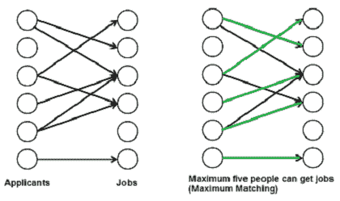
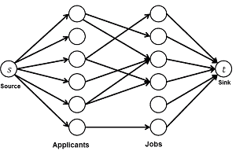
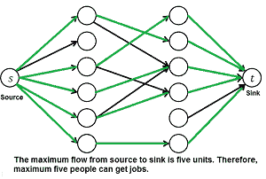

# 最大二分匹配

> 原文:[https://www.geeksforgeeks.org/maximum-bipartite-matching/](https://www.geeksforgeeks.org/maximum-bipartite-matching/)

[二分图](https://www.geeksforgeeks.org/bipartite-graph)中的匹配是一组选择的边，使得没有两条边共享一个端点。最大匹配是最大尺寸(最大边数)的匹配。在最大匹配中，如果添加了任何边，它就不再匹配。给定的二部图可以有多个最大匹配。
**我们为什么在乎？**
现实世界中有很多问题可以形成为二部匹配。比如考虑以下问题:
*有 M 个求职者，N 个工作。每个申请者都有自己感兴趣的工作子集。每个职位空缺只能接受一个申请人，一个职位申请人只能被任命一个职位。给申请人分配工作，以便尽可能多的申请人找到工作。*



我们强烈建议首先阅读以下帖子。
[最大流问题的福特-富尔克森算法](https://www.geeksforgeeks.org/ford-fulkerson-algorithm-for-maximum-flow-problem/)
**最大二部匹配和最大流问题**
**M** 最大**B**ipart**M**匹配( **MBP** )问题可以通过将其转换为流网络来解决(参见[本](http://www.youtube.com/watch?v=NlQqmEXuiC8)视频了解我们是如何得出这个结论的)。以下是步骤。



***1)构建流量网络***
一个流量网络中必须有源和汇。因此，我们添加一个来源，并从来源向所有申请人添加边。同样，将所有作业的边添加到汇点。每个边的容量标记为 1 个单位。



***2)求最大流量。***
我们使用[福特-富尔克森算法](https://www.geeksforgeeks.org/ford-fulkerson-algorithm-for-maximum-flow-problem/)在步骤 1 构建的流量网络中寻找最大流量。最大流量实际上就是我们要找的 MBP。

**如何实施上述方法？**
我们先来定义输入输出形式。输入采用[埃德蒙兹矩阵](http://en.wikipedia.org/wiki/Edmonds_matrix)的形式，这是一个 2D 数组“bpGraph[M][N]”，有 M 行(针对 M 个职位申请人)和 N 列(针对 N 个职位)。如果我的申请人对 j 的工作感兴趣，bpGraph[i][j]的值为 1，否则为 0。
输出是能够获得工作人数上限。
实现这一点的简单方法是创建一个矩阵，该矩阵表示具有 M+N+2 个顶点的有向图的[邻接矩阵表示](https://www.geeksforgeeks.org/graph-and-its-representations/)。调用矩阵的[for fulkerson()](https://www.geeksforgeeks.org/ford-fulkerson-algorithm-for-maximum-flow-problem/)。此实现需要 O((M+N)*(M+N))个额外空间。
利用图是二分图，每条边的容量不是 0 就是 1 的事实，可以减少额外的空间，简化代码。这个想法是使用 DFS 遍历为申请人找到一份工作(类似于在福特-富尔克森增加路径)。我们对每个申请人都称之为 bpm()，bpm()是基于 DFS 的函数，它尝试了所有的可能性来为申请人分配工作。
在 bpm()中，我们一个接一个地尝试一个求职者‘u’感兴趣的所有工作，直到找到工作，否则所有的工作都是碰运气的尝试。对于我们尝试的每一项工作，我们都遵循。
如果工作没有分配给任何人，我们只需将其分配给申请人并返回 true。如果一个工作被分配给别人，比如说 x，那么我们递归地检查 x 是否可以被分配其他工作。为了确保 x 不会再次获得相同的工作，在对 x 进行递归调用之前，我们将工作标记为“v”。如果 x 可以获得其他工作，我们将求职者更改为“v ”,并返回 true。我们使用一个数组 maxR[0..N-1]存储分配给不同职务的申请者。
如果 bmp()返回 true，则表示在流网络中有一个扩充路径，并且在 maxBPM()中向结果添加了 1 个流单位。

## C++

```
// A C++ program to find maximal
// Bipartite matching.
#include <iostream>
#include <string.h>
using namespace std;

// M is number of applicants
// and N is number of jobs
#define M 6
#define N 6

// A DFS based recursive function
// that returns true if a matching
// for vertex u is possible
bool bpm(bool bpGraph[M][N], int u,
         bool seen[], int matchR[])
{
    // Try every job one by one
    for (int v = 0; v < N; v++)
    {
        // If applicant u is interested in
        // job v and v is not visited
        if (bpGraph[u][v] && !seen[v])
        {
            // Mark v as visited
            seen[v] = true;

            // If job 'v' is not assigned to an
            // applicant OR previously assigned
            // applicant for job v (which is matchR[v])
            // has an alternate job available.
            // Since v is marked as visited in
            // the above line, matchR[v] in the following
            // recursive call will not get job 'v' again
            if (matchR[v] < 0 || bpm(bpGraph, matchR[v],
                                     seen, matchR))
            {
                matchR[v] = u;
                return true;
            }
        }
    }
    return false;
}

// Returns maximum number
// of matching from M to N
int maxBPM(bool bpGraph[M][N])
{
    // An array to keep track of the
    // applicants assigned to jobs.
    // The value of matchR[i] is the
    // applicant number assigned to job i,
    // the value -1 indicates nobody is
    // assigned.
    int matchR[N];

    // Initially all jobs are available
    memset(matchR, -1, sizeof(matchR));

    // Count of jobs assigned to applicants
    int result = 0;
    for (int u = 0; u < M; u++)
    {
        // Mark all jobs as not seen
        // for next applicant.
        bool seen[N];
        memset(seen, 0, sizeof(seen));

        // Find if the applicant 'u' can get a job
        if (bpm(bpGraph, u, seen, matchR))
            result++;
    }
    return result;
}

// Driver Code
int main()
{
    // Let us create a bpGraph
    // shown in the above example
    bool bpGraph[M][N] = {{0, 1, 1, 0, 0, 0},
                          {1, 0, 0, 1, 0, 0},
                          {0, 0, 1, 0, 0, 0},
                          {0, 0, 1, 1, 0, 0},
                          {0, 0, 0, 0, 0, 0},
                          {0, 0, 0, 0, 0, 1}};

    cout << "Maximum number of applicants that can get job is "
         << maxBPM(bpGraph);

    return 0;
}
```

## Java 语言(一种计算机语言，尤用于创建网站)

```
// A Java program to find maximal
// Bipartite matching.
import java.util.*;
import java.lang.*;
import java.io.*;

class GFG
{
    // M is number of applicants
    // and N is number of jobs
    static final int M = 6;
    static final int N = 6;

    // A DFS based recursive function that
    // returns true if a matching for
    // vertex u is possible
    boolean bpm(boolean bpGraph[][], int u,
                boolean seen[], int matchR[])
    {
        // Try every job one by one
        for (int v = 0; v < N; v++)
        {
            // If applicant u is interested
            // in job v and v is not visited
            if (bpGraph[u][v] && !seen[v])
            {

                // Mark v as visited
                seen[v] = true;

                // If job 'v' is not assigned to
                // an applicant OR previously
                // assigned applicant for job v (which
                // is matchR[v]) has an alternate job available.
                // Since v is marked as visited in the
                // above line, matchR[v] in the following
                // recursive call will not get job 'v' again
                if (matchR[v] < 0 || bpm(bpGraph, matchR[v],
                                         seen, matchR))
                {
                    matchR[v] = u;
                    return true;
                }
            }
        }
        return false;
    }

    // Returns maximum number
    // of matching from M to N
    int maxBPM(boolean bpGraph[][])
    {
        // An array to keep track of the
        // applicants assigned to jobs.
        // The value of matchR[i] is the
        // applicant number assigned to job i,
        // the value -1 indicates nobody is assigned.
        int matchR[] = new int[N];

        // Initially all jobs are available
        for(int i = 0; i < N; ++i)
            matchR[i] = -1;

        // Count of jobs assigned to applicants
        int result = 0;
        for (int u = 0; u < M; u++)
        {
            // Mark all jobs as not seen
            // for next applicant.
            boolean seen[] =new boolean[N] ;
            for(int i = 0; i < N; ++i)
                seen[i] = false;

            // Find if the applicant 'u' can get a job
            if (bpm(bpGraph, u, seen, matchR))
                result++;
        }
        return result;
    }

    // Driver Code
    public static void main (String[] args)
                       throws java.lang.Exception
    {
        // Let us create a bpGraph shown
        // in the above example
        boolean bpGraph[][] = new boolean[][]{
                              {false, true, true,
                               false, false, false},
                              {true, false, false,
                               true, false, false},
                              {false, false, true,
                               false, false, false},
                              {false, false, true,
                               true, false, false},
                              {false, false, false,
                               false, false, false},
                              {false, false, false,
                               false, false, true}};
        GFG m = new GFG();
        System.out.println( "Maximum number of applicants that can"+
                            " get job is "+m.maxBPM(bpGraph));
    }
}
```

## 计算机编程语言

```
# Python program to find
# maximal Bipartite matching.

class GFG:
    def __init__(self,graph):

        # residual graph
        self.graph = graph
        self.ppl = len(graph)
        self.jobs = len(graph[0])

    # A DFS based recursive function
    # that returns true if a matching
    # for vertex u is possible
    def bpm(self, u, matchR, seen):

        # Try every job one by one
        for v in range(self.jobs):

            # If applicant u is interested
            # in job v and v is not seen
            if self.graph[u][v] and seen[v] == False:

                # Mark v as visited
                seen[v] = True

                '''If job 'v' is not assigned to
                   an applicant OR previously assigned
                   applicant for job v (which is matchR[v])
                   has an alternate job available.
                   Since v is marked as visited in the
                   above line, matchR[v]  in the following
                   recursive call will not get job 'v' again'''
                if matchR[v] == -1 or self.bpm(matchR[v],
                                               matchR, seen):
                    matchR[v] = u
                    return True
        return False

    # Returns maximum number of matching
    def maxBPM(self):
        '''An array to keep track of the
           applicants assigned to jobs.
           The value of matchR[i] is the
           applicant number assigned to job i,
           the value -1 indicates nobody is assigned.'''
        matchR = [-1] * self.jobs

        # Count of jobs assigned to applicants
        result = 0
        for i in range(self.ppl):

            # Mark all jobs as not seen for next applicant.
            seen = [False] * self.jobs

            # Find if the applicant 'u' can get a job
            if self.bpm(i, matchR, seen):
                result += 1
        return result

bpGraph =[[0, 1, 1, 0, 0, 0],
          [1, 0, 0, 1, 0, 0],
          [0, 0, 1, 0, 0, 0],
          [0, 0, 1, 1, 0, 0],
          [0, 0, 0, 0, 0, 0],
          [0, 0, 0, 0, 0, 1]]

g = GFG(bpGraph)

print ("Maximum number of applicants that can get job is %d " % g.maxBPM())

# This code is contributed by Neelam Yadav
```

## C#

```
// A C# program to find maximal
// Bipartite matching.
using System;

class GFG
{
    // M is number of applicants
    // and N is number of jobs
    static int M = 6;
    static int N = 6;

    // A DFS based recursive function
    // that returns true if a matching
    // for vertex u is possible
    bool bpm(bool [,]bpGraph, int u,
             bool []seen, int []matchR)
    {
        // Try every job one by one
        for (int v = 0; v < N; v++)
        {
            // If applicant u is interested
            // in job v and v is not visited
            if (bpGraph[u, v] && !seen[v])
            {
                // Mark v as visited
                seen[v] = true;

                // If job 'v' is not assigned to
                // an applicant OR previously assigned
                // applicant for job v (which is matchR[v])
                // has an alternate job available.
                // Since v is marked as visited in the above
                // line, matchR[v] in the following recursive
                // call will not get job 'v' again
                if (matchR[v] < 0 || bpm(bpGraph, matchR[v],
                                         seen, matchR))
                {
                    matchR[v] = u;
                    return true;
                }
            }
        }
        return false;
    }

    // Returns maximum number of
    // matching from M to N
    int maxBPM(bool [,]bpGraph)
    {
        // An array to keep track of the
        // applicants assigned to jobs.
        // The value of matchR[i] is the
        // applicant number assigned to job i,
        // the value -1 indicates nobody is assigned.
        int []matchR = new int[N];

        // Initially all jobs are available
        for(int i = 0; i < N; ++i)
            matchR[i] = -1;

        // Count of jobs assigned to applicants
        int result = 0;
        for (int u = 0; u < M; u++)
        {
            // Mark all jobs as not
            // seen for next applicant.
            bool []seen = new bool[N] ;
            for(int i = 0; i < N; ++i)
                seen[i] = false;

            // Find if the applicant
            // 'u' can get a job
            if (bpm(bpGraph, u, seen, matchR))
                result++;
        }
        return result;
    }

    // Driver Code
    public static void Main ()
    {
        // Let us create a bpGraph shown
        // in the above example
        bool [,]bpGraph = new bool[,]
                          {{false, true, true,
                            false, false, false},
                           {true, false, false,
                            true, false, false},
                           {false, false, true,
                            false, false, false},
                           {false, false, true,
                            true, false, false},
                           {false, false, false,
                            false, false, false},
                           {false, false, false,
                            false, false, true}};
        GFG m = new GFG();
    Console.Write( "Maximum number of applicants that can"+
                            " get job is "+m.maxBPM(bpGraph));
    }
}

//This code is contributed by nitin mittal.
```

## 服务器端编程语言（Professional Hypertext Preprocessor 的缩写）

```
<?php
// A PHP program to find maximal
// Bipartite matching.

// M is number of applicants
// and N is number of jobs
$M = 6;
$N = 6;

// A DFS based recursive function
// that returns true if a matching
// for vertex u is possible
function bpm($bpGraph, $u, &$seen, &$matchR)
{
    global $N;

    // Try every job one by one
    for ($v = 0; $v < $N; $v++)
    {
        // If applicant u is interested in
        // job v and v is not visited
        if ($bpGraph[$u][$v] && !$seen[$v])
        {
            // Mark v as visited
            $seen[$v] = true;

            // If job 'v' is not assigned to an
            // applicant OR previously assigned
            // applicant for job v (which is matchR[v])
            // has an alternate job available.
            // Since v is marked as visited in
            // the above line, matchR[v] in the following
            // recursive call will not get job 'v' again
            if ($matchR[$v] < 0 || bpm($bpGraph, $matchR[$v],
                                    $seen, $matchR))
            {
                $matchR[$v] = $u;
                return true;
            }
        }
    }
    return false;
}

// Returns maximum number
// of matching from M to N
function maxBPM($bpGraph)
{
    global $N,$M;

    // An array to keep track of the
    // applicants assigned to jobs.
    // The value of matchR[i] is the
    // applicant number assigned to job i,
    // the value -1 indicates nobody is
    // assigned.
    $matchR = array_fill(0, $N, -1);

    // Initially all jobs are available

    // Count of jobs assigned to applicants
    $result = 0;
    for ($u = 0; $u < $M; $u++)
    {
        // Mark all jobs as not seen
        // for next applicant.
        $seen=array_fill(0, $N, false);

        // Find if the applicant 'u' can get a job
        if (bpm($bpGraph, $u, $seen, $matchR))
            $result++;
    }
    return $result;
}

// Driver Code

// Let us create a bpGraph
// shown in the above example
$bpGraph = array(array(0, 1, 1, 0, 0, 0),
                    array(1, 0, 0, 1, 0, 0),
                    array(0, 0, 1, 0, 0, 0),
                    array(0, 0, 1, 1, 0, 0),
                    array(0, 0, 0, 0, 0, 0),
                    array(0, 0, 0, 0, 0, 1));

echo "Maximum number of applicants that can get job is ".maxBPM($bpGraph);

// This code is contributed by chadan_jnu
?>
```

## java 描述语言

```
<script>

    // A JavaScript program to find maximal
    // Bipartite matching.

    // M is number of applicants
    // and N is number of jobs
    let M = 6;
    let N = 6;

    // A DFS based recursive function that
    // returns true if a matching for
    // vertex u is possible
    function bpm(bpGraph, u, seen, matchR)
    {
        // Try every job one by one
        for (let v = 0; v < N; v++)
        {
            // If applicant u is interested
            // in job v and v is not visited
            if (bpGraph[u][v] && !seen[v])
            {

                // Mark v as visited
                seen[v] = true;

                // If job 'v' is not assigned to
                // an applicant OR previously
                // assigned applicant for job v (which
                // is matchR[v]) has an alternate job available.
                // Since v is marked as visited in the
                // above line, matchR[v] in the following
                // recursive call will not get job 'v' again
                if (matchR[v] < 0 || bpm(bpGraph, matchR[v],
                                         seen, matchR))
                {
                    matchR[v] = u;
                    return true;
                }
            }
        }
        return false;
    }

    // Returns maximum number
    // of matching from M to N
    function maxBPM(bpGraph)
    {
        // An array to keep track of the
        // applicants assigned to jobs.
        // The value of matchR[i] is the
        // applicant number assigned to job i,
        // the value -1 indicates nobody is assigned.
        let matchR = new Array(N);

        // Initially all jobs are available
        for(let i = 0; i < N; ++i)
            matchR[i] = -1;

        // Count of jobs assigned to applicants
        let result = 0;
        for (let u = 0; u < M; u++)
        {
            // Mark all jobs as not seen
            // for next applicant.
            let seen =new Array(N);
            for(let i = 0; i < N; ++i)
                seen[i] = false;

            // Find if the applicant 'u' can get a job
            if (bpm(bpGraph, u, seen, matchR))
                result++;
        }
        return result;
    }

    // Let us create a bpGraph shown
    // in the above example
    let bpGraph = [
      [false, true, true,
        false, false, false],
          [true, false, false,
            true, false, false],
              [false, false, true,
                false, false, false],
                  [false, false, true,
                    true, false, false],
                      [false, false, false,
                        false, false, false],
                          [false, false, false,
                            false, false, true]];

    document.write( "Maximum number of applicants that can"+
                       " get job is "+ maxBPM(bpGraph));

</script>
```

**输出:**

```
Maximum number of applicants that can get job is 5
```

你可能还想看下面:
[最大匹配的 Hopcroft–Karp 算法|集合 1(简介)](https://www.geeksforgeeks.org/hopcroft-karp-algorithm-for-maximum-matching-set-1-introduction/)
[最大匹配的 Hopcroft–Karp 算法|集合 2(实现)](https://www.geeksforgeeks.org/hopcroft-karp-algorithm-for-maximum-matching-set-2-implementation/)
**参考文献:**
[http://www . cs . Cornell . edu/~ wdtseng/icpc/notes/graph _ part 5 . pdf](http://www.cs.cornell.edu/~wdtseng/icpc/notes/graph_part5.pdf)
T13】http://www.youtube.com/watch?v=NlQqmEXuiC8
http://en.wikipedia.org/wiki/Maximum_matching【T17