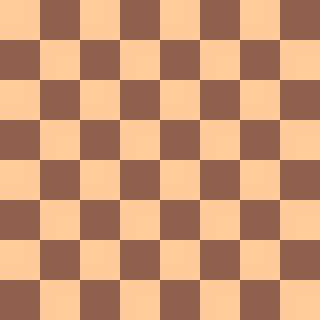
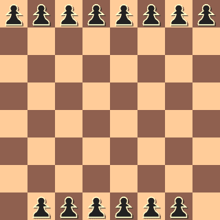

# 可以放置在 N*N 棋盘上的最大主教数

> 原文:[https://www . geeksforgeeks . org/maximum-bishops-the-can-plating-on-nn-checkboard/](https://www.geeksforgeeks.org/maximum-bishops-that-can-be-placed-on-nn-chessboard/)

给定一个整数 **n** ，任务是打印一个 **n x n** 棋盘上可以放置的最大主教数量，这样就不会有两个主教互相攻击。例如，最多 2 个主教可以安全地放在 2×2 的棋盘上。

**示例:**

> **输入:** n = 2
> **输出:** 2
> 我们可以将两个主教排成一排。
> 
> **输入:**n = 5
> T3】输出: 8



**接近:**主教可以在四条对角线中的任何一条上行进。因此，我们可以放置主教，如果它不在另一个主教的任何对角线上。一个 **n * n** 棋盘上最多可以放置**2 *(n–1)**个主教。

1.  把 n 个主教放在第一排
2.  把 n-2 个主教放在最后一排。我们只留下最后一排的两个角



下面是上述方法的实现:

## C++

```
// C++ implementation of the approach
#include <iostream>
using namespace std;

// Function to return the maximum number of bishops
// that can be placed on an n * n chessboard
int numberOfBishops(int n)
{
    if (n < 1)
        return 0;
    else if (n == 1)
        return 1;
    else
        return 2 * (n - 1);
}

// Driver code
int main()
{
    int n = 5;
    cout << numberOfBishops(n);
    return 0;
}
```

## Java 语言(一种计算机语言，尤用于创建网站)

```
// Java implementation of the approach
class gfg
{

// Function to return the maximum
// number of bishops that can be
// placed on an n * n chessboard
static int numberOfBishops(int n)
{
    if (n < 1)
        return 0;
    else if (n == 1)
        return 1;
    else
        return 2 * (n - 1);
}

// Driver code
public static void main(String[] args)
{
    int n = 5;
    System.out.println(numberOfBishops(n));
}
}

// This code is contributed by Mukul Singh.
```

## 蟒蛇 3

```
# Python3 implementation of the
# approach
import math as mt

# Function to return the maximum number
# of bishops that can be placed on an
# n * n chessboard
def numberOfBishops(n):
    if (n < 1):
        return 0
    elif (n == 1):
        return 1
    else:
        return 2 * (n - 1)

# Driver code
n = 5
print(numberOfBishops(n))

# This code is contributed by
# Mohit kumar 29
```

## C#

```
// C# implementation of the approach
using System;

class GFG
{

// Function to return the maximum number
// of bishops that can be placed on an
// n * n chessboard
static int numberOfBishops(int n)
{
    if (n < 1)
        return 0;
    else if (n == 1)
        return 1;
    else
        return 2 * (n - 1);
}

// Driver code
public static void Main()
{
    int n = 5;
    Console.Write(numberOfBishops(n));
}
}

// This code is contributed
// by Akanksha Rai
```

## 服务器端编程语言（Professional Hypertext Preprocessor 的缩写）

```
<?php
// PHP implementation of the approach

// Function to return the maximum number
// of bishops that can be placed on an
// n * n chessboard
function numberOfBishops($n)
{
    if ($n < 1)
        return 0;
    else if ($n == 1)
        return 1;
    else
        return 2 * ($n - 1);
}

// Driver code
$n = 5;
echo numberOfBishops($n);

// This code is contributed by Ryuga
?>
```

## java 描述语言

```
<script>
// Javascript implementation of the approach

    // Function to return the maximum
// number of bishops that can be
// placed on an n * n chessboard
    function numberOfBishops(n)
    {
        if (n < 1)
            return 0;
        else if (n == 1)
            return 1;
        else
            return 2 * (n - 1);
    }

    // Driver code
    let n = 5;
    document.write(numberOfBishops(n));

// This code is contributed by patel2127
</script>
```

**Output:** 

```
8
```

以下是 **n** 较大值的实现:

## C++

```
// C++ implementation of the approach
#include <bits/stdc++.h>
using namespace std;

// Function to return the difference of
// two big numbers as string
string subtract(string str1, string str2)
{
    string res = "";
    int n1 = str1.length();
    int n2 = str2.length();

    // To make subtraction easy
    reverse(str1.begin(), str1.end());
    reverse(str2.begin(), str2.end());

    int carry = 0;

    for (int i = 0; i < n2; i++) {

        // Subtract digit by bdigit
        int subst = ((str1[i] - '0')
                     - (str2[i] - '0') - carry);

        if (subst < 0) {
            subst = subst + 10;
            carry = 1;
        }
        else
            carry = 0;

        // Change subst as character and
        // add it to result string
        res.push_back(subst + '0');
    }

    for (int i = n2; i < n1; i++) {
        int subst = ((str1[i] - '0') - carry);

        if (subst < 0) {
            subst = subst + 10;
            carry = 1;
        }
        else
            carry = 0;

        res.push_back(subst + '0');
    }

    // Reverse result to make it actual number
    reverse(res.begin(), res.end());

    return res;
}

string NumberOfBishops(string a)
{
    if (a == "1")
        return a;
    else {

        // Subtract 1 from number
        a = subtract(a, "1");

        // Reverse the string to make calculations easier
        reverse(a.begin(), a.end());

        int carry = 0;

        // Multiply by 2
        for (int i = 0; i < a.size(); i++) {
            int tmp = a[i] - '0';
            tmp *= 2;
            tmp += carry;
            a[i] = '0' + (tmp % 10);
            carry = tmp / 10;
        }
        if (carry > 0)
            a += ('0' + carry);

        // Reverse the string to get actual result
        reverse(a.begin(), a.end());

        // Return result
        return a;
    }
}

// Driver code
int main()
{
    string a = "12345678901234567890";
    cout << NumberOfBishops(a) << endl;

    return 0;
}
```

## Java 语言(一种计算机语言，尤用于创建网站)

```
// Java implementation of the approach
import java.util.*;

class GFG{

public static char[] reverse(char []str)
{
    char[] temp = new char[str.length];

    // Fill character array backwards with
    // characters of the string
    for(int i = 0; i < str.length; i++)
        temp[str.length - i - 1] = str[i];

    // Convert character array to string
    // and return it
    return temp;
}

// Function to return the difference of
// two big numbers as String
static char[] subtract(char[] str1, char[] str2)
{
    String res = "";
    int n1 = str1.length;
    int n2 = str2.length;

    // To make subtraction easy
    str1 = reverse(str1);
    str2 = reverse(str2);

    int carry = 0;

    for(int i = 0; i < n2; i++)
    {

        // Subtract digit by bdigit
        int subst = ((str1[i] - '0') -
                     (str2[i] - '0') - carry);

        if (subst < 0)
        {
            subst = subst + 10;
            carry = 1;
        }
        else
            carry = 0;

        // Change subst as character and
        // add it to result String
        res = res + (subst);
    }

    for(int i = n2; i < n1; i++)
    {

        int subst = ((str1[i] - '0') - carry);

        if (subst < 0)
        {
            subst = subst + 10;
            carry = 1;
        }
        else
            carry = 0;

        res += (subst);
    }

    // Reverse result to make it actual number
    char[] Res = res.toCharArray();
    Res = reverse(Res);
    return Res;
}

static char[] NumberOfBishops(char[] a)
{
    if (new String(a) == "1")
        return a;
    else
    {

        // Subtract 1 from number
        a = subtract(a, "1".toCharArray());

        //Console.WriteLine(new String(a));

        // Reverse the String to make
        // calculations easier
        a = reverse(a);

        int carry = 0;

        // Multiply by 2
        for(int i = 0; i < a.length; i++)
        {
            int tmp = a[i] - '0';
            tmp *= 2;
            tmp += carry;
            a[i] = (char)('0' + (tmp % 10));
            carry = tmp / 10;
        }

        String A = new String(a);

        if (carry > 0)
            A += ('0' + carry);

        char[] a1 = A.toCharArray();

        // Reverse the String to get
        // actual result
        a1 = reverse(a1);

        // Return result
        return a1;
    }
}

// Driver code
public static void main(String []args)
{
    char[] a = "12345678901234567890".toCharArray();

    System.out.println(new String(NumberOfBishops(a)));
}
}

// This code is contributed by pratham76
```

## 蟒蛇 3

```
# Python3 implementation of the approach

# Function to return the difference
# of two big numbers as string
def subtract(str1, str2):

    res = ""
    n1 = len(str1)
    n2 = len(str2)

    # To make subtraction easy,
    # reverse the strings
    str1 = str1[::-1]
    str2 = str2[::-1]
    carry = 0

    for i in range(0, n2):

        # Subtract digit by bdigit
        subst = int(str1[i]) - int(str2[i]) - carry

        if subst < 0:
            subst = subst + 10
            carry = 1

        else:
            carry = 0

        # Change subst as character and
        # add it to result string
        res += str(subst)

    for i in range(n2, n1):
        subst = int(str1[i]) - carry

        if subst < 0:
            subst = subst + 10
            carry = 1

        else:
            carry = 0

        res += str(subst)

    # Reverse result to make it
    # actual number
    return res[::-1]

def NumberOfBishops(a):

    if a == "1":
        return a

    else:

        # Subtract 1 from number
        a = subtract(a, "1")
        carry = 0

        # Reverse the string to make
        # calculations easier. Convert the
        # string to list to manipulate it
        # as strings are immutable in python
        a = list(a[::-1])

        # Multiply by 2
        for i in range(0, len(a)):
            tmp = (int(a[i]) * 2) + carry
            a[i] = str(tmp % 10)
            carry = tmp // 10

        # Convert the list back to string
        a = ''.join(a)
        if carry > 0:
            a += str(carry)

        # Reverse the string to get
        # actual result
        return a[::-1]

# Driver code
if __name__ == "__main__":

    a = "12345678901234567890"
    print(NumberOfBishops(a))

# This code is contributed
# by Rituraj Jain
```

## C#

```
// C# implementation of the approach
using System;
class GFG
{

  // Function to return the difference of 
  // two big numbers as string
  static char[] subtract(char[] str1, char[] str2)
  {
    string res = "";
    int n1 = str1.Length;
    int n2 = str2.Length;

    // To make subtraction easy
    Array.Reverse(str1);
    Array.Reverse(str2);
    int carry = 0;

    for (int i = 0; i < n2; i++)
    {

      // Subtract digit by bdigit
      int subst = ((str1[i] - '0') - (str2[i] - '0') - carry);

      if (subst < 0)
      {
        subst = subst + 10;
        carry = 1;
      }
      else
        carry = 0;

      // Change subst as character and
      // add it to result string
      res = res + (subst);
    }

    for (int i = n2; i < n1; i++)
    {
      int subst = ((str1[i] - '0') - carry);

      if (subst < 0)
      {
        subst = subst + 10;
        carry = 1;
      }
      else
        carry = 0;

      res += (subst);
    }

    // Reverse result to make it actual number
    char[] Res = res.ToCharArray();
    Array.Reverse(Res);
    return Res;
  }

  static char[] NumberOfBishops(char[] a)
  {
    if (new string(a) == "1")
      return a;
    else
    {

      // Subtract 1 from number
      a = subtract(a, "1".ToCharArray());

      //Console.WriteLine(new string(a));

      // Reverse the string to make calculations easier
      Array.Reverse(a);

      int carry = 0;

      // Multiply by 2
      for (int i = 0; i < a.Length; i++)
      {
        int tmp = a[i] - '0';
        tmp *= 2;
        tmp += carry;
        a[i] = (char)('0' + (tmp % 10));
        carry = tmp / 10;
      }

      string A = new string(a);

      if (carry > 0)
        A += ('0' + carry);
      char[] a1 = A.ToCharArray();

      // Reverse the string to get actual result
      Array.Reverse(a1);

      // Return result
      return a1;
    }
  }

  // Driver code
  static void Main()
  {
    char[] a = "12345678901234567890".ToCharArray();
    Console.WriteLine(new string(NumberOfBishops(a)));
  }
}

// This code is contributed by divyeshrabadiy07
```

## java 描述语言

```
<script>

// Javascript implementation of the approach

function reverse(str)
{
    let temp = new Array(str.length);

    // Fill character array backwards with
    // characters of the string
    for(let i = 0; i < str.length; i++)
        temp[str.length - i - 1] = str[i];

    // Convert character array to string
    // and return it
    return temp;
}

// Function to return the difference of
// two big numbers as String
function subtract(str1,str2)
{
    let res = "";
    let n1 = str1.length;
    let n2 = str2.length;

    // To make subtraction easy
    str1 = reverse(str1);
    str2 = reverse(str2);

    let carry = 0;

    for(let i = 0; i < n2; i++)
    {

        // Subtract digit by bdigit
        let subst = (parseInt(str1[i]) -
                     parseInt(str2[i]) - carry);

        if (subst < 0)
        {
            subst = subst + 10;
            carry = 1;
        }
        else
            carry = 0;

        // Change subst as character and
        // add it to result String
        res = res + (subst).toString();
    }

    for(let i = n2; i < n1; i++)
    {

        let subst = (parseInt(str1[i]) - carry);

        if (subst < 0)
        {
            subst = subst + 10;
            carry = 1;
        }
        else
            carry = 0;

        res += (subst).toString();
    }

    // Reverse result to make it actual number
    let Res = res.split("");
    Res = reverse(Res);
    return Res;
}

function NumberOfBishops(a)
{
    if (a == "1")
        return a;
    else
    {

        // Subtract 1 from number
        a = subtract(a, "1");

        //Console.WriteLine(new String(a));

        // Reverse the String to make
        // calculations easier
        a = reverse(a);

        let carry = 0;

        // Multiply by 2
        for(let i = 0; i < a.length; i++)
        {
            let tmp = parseInt(a[i]);
            tmp *= 2;
            tmp += carry;
            a[i] =  (tmp % 10).toString();
            carry = Math.floor(tmp / 10);
        }

        let A = a.join("");

        if (carry > 0)
            A += ( carry).toString();

        let a1 = A.split("");

        // Reverse the String to get
        // actual result
        a1 = reverse(a1);

        // Return result
        return a1;
    }
}

// Driver code
let a = "12345678901234567890".split("");

document.write(NumberOfBishops(a).join(""));

// This code is contributed by unknown2108.
</script>
```

**Output:** 

```
24691357802469135778
```