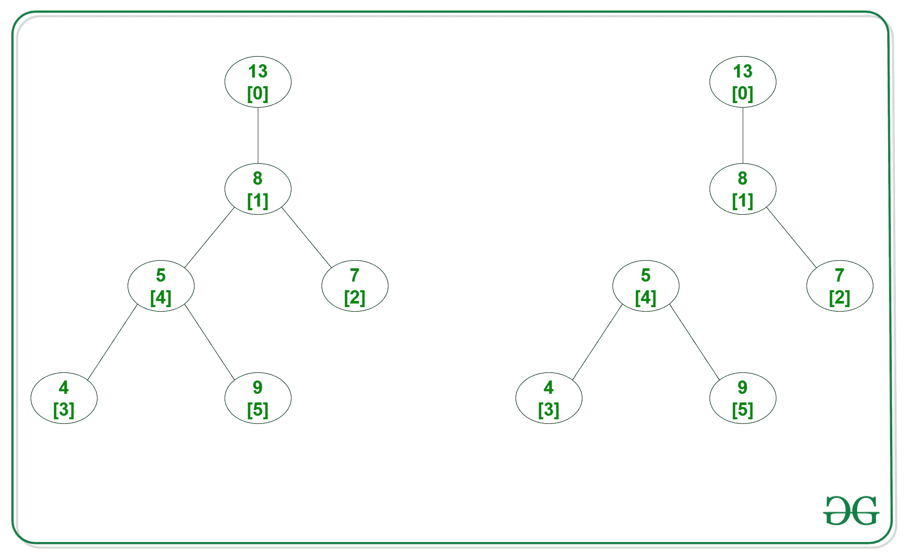
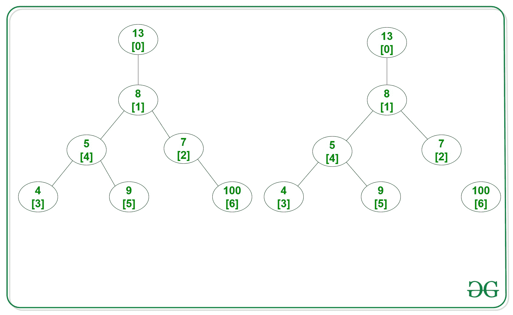

# 将给定二叉树分成两半的最大成本

> 原文:[https://www . geeksforgeeks . org/将给定二叉树拆分为两半的最大成本/](https://www.geeksforgeeks.org/maximum-cost-of-splitting-given-binary-tree-into-two-halves/)

给定一个具有值为 **0 到 N–1**和 **N-1** 边的 **N** 节点的[二叉树](https://www.geeksforgeeks.org/binary-tree-data-structure/)和一个由边的值组成的数组**arr【】**，任务是找出将树分成两半的最大成本。

> 拆分树的成本等于拆分子树的节点值之和的乘积。

**示例:**

> **输入:** N = 6，arr[] = {13，8，7，4，5，9}，Edges[][] = {{0，1}，{1，2}，{1，4}，{3，4}，{4，5}}
> **输出:** 504
> **解释:**
> 下面是移除边缘后的给定树和结果树:
> 
> 
> 
> 移除第 1 个和第 4 个之间的边，然后
> T1 = value at[0]+value at[1]+value at[2]= 13+8+7
> T1 = value at[3]+value at[4]+value at[5]= 4+5+9
> T1 * T2 =(13+8+7)*(4+5+9)= 504
> 
> **输入:** N = 7，arr[]= {13，8，7，4，5，9，100}，Edges[][] = { {0，1}，{1，2}，{1，4}，{3，4}，{4，5}，{2，6}}
> **输出:** 4600
> **解释:**
> 下面是移除边缘后的给定树和结果树:
> 
> 
> 
> 移除第二个和第六个之间的边，然后
> T1 = value at[0]+value at[1]+value at[2]+value at[3]+value at[4]+value at[5]= 13+8+7+4+5+9
> T2 = value at[6]= 100
> T1 * T2 =(13+8+7+5+4+9)*(100)= 4600

**方法:**想法是[遍历给定的树](https://www.geeksforgeeks.org/tree-traversals-inorder-preorder-and-postorder/)并尝试在每一个可能的边上断开树，然后在那个边上找到分裂的最大代价。完成以上所有步骤后，打印所有拆分中的最大成本。以下是步骤:

1.  使用[邻接表](https://www.geeksforgeeks.org/convert-adjacency-matrix-to-adjacency-list-representation-of-graph/)存储所有边，每个节点的值存储在给定的数组 **arr[]** 中。
2.  对于当前节点，求其后代(包括其自身)中值的总和。
3.  假设如果移除当前节点与其父节点之间的边，则可以形成两棵树。
4.  现在，计算 t1、t2 的值，检查 t1 和 t2 的乘积是否最大。
5.  对当前节点的所有子节点递归重复此过程。

下面是上述方法的实现:

## C++

```
// C++ program for the above approach
#include <bits/stdc++.h>
using namespace std;

// To store the results and sum of
// all nodes in the array
int ans = 0, allsum = 0;

// To create adjacency list
vector<int> edges[100001];

// Function to add edges into the
// adjacency list
void addedge(int a, int b)
{
    edges[a].push_back(b);
    edges[b].push_back(a);
}

// Recursive function that calculate
// the value of the cost of splitting
// the tree recursively
void findCost(int r, int p, int arr[])
{
    int i, cur;

    for (i = 0; i < edges[r].size();
         i++) {

        // Fetch the child of node-r
        cur = edges[r].at(i);

        // Neglect if cur node is parent
        if (cur == p)
            continue;

        findCost(cur, r, arr);

        // Add all values of nodes
        // which are decendents of r
        arr[r] += arr[cur];
    }

    // The two trees formed are rooted
    // at 'r' with its decendents
    int t1 = arr[r];
    int t2 = allsum - t1;

    // Check and replace if current
    // product t1*t2 is large
    if (t1 * t2 > ans) {
        ans = t1 * t2;
    }
}

// Function to find the maximum cost
// after splitting the tree in 2 halves
void maximumCost(int r, int p,
                 int N, int M,
                 int arr[],
                 int Edges[][2])
{
    // Find sum of values in all nodes
    for (int i = 0; i < N; i++) {
        allsum += arr[i];
    }

    // Traverse edges to create
    // adjacency list
    for (int i = 0; i < M; i++) {
        addedge(Edges[i][0],
                Edges[i][1]);
    }

    // Function Call
    findCost(r, p, arr);
}

// Driver Code
int main()
{
    int a, b, N = 6;

    // Values in each node
    int arr[] = { 13, 8, 7, 4, 5, 9 };

    int M = 5;

    // Given Edges
    int Edges[][2] = { { 0, 1 }, { 1, 2 },
                       { 1, 4 }, { 3, 4 },
                       { 4, 5 } };

    maximumCost(1, -1, N, M, arr, Edges);

    cout << ans;
    return 0;
}
```

## Java 语言(一种计算机语言，尤用于创建网站)

```
// Java program for the above approach
import java.util.*;
class GFG{

// To store the results and sum of
// all nodes in the array
static int ans = 0, allsum = 0;

// To create adjacency list
static Vector<Integer> []edges = new Vector[100001];

// Function to add edges into the
// adjacency list
static void addedge(int a, int b)
{
    edges[a].add(b);
    edges[b].add(a);
}

// Recursive function that calculate
// the value of the cost of splitting
// the tree recursively
static void findCost(int r, int p, int arr[])
{
    int i, cur;
    for (i = 0; i < edges[r].size(); i++)
    {
        // Fetch the child of node-r
        cur = edges[r].get(i);

        // Neglect if cur node is parent
        if (cur == p)
            continue;

        findCost(cur, r, arr);

        // Add all values of nodes
        // which are decendents of r
        arr[r] += arr[cur];
    }

    // The two trees formed are rooted
    // at 'r' with its decendents
    int t1 = arr[r];
    int t2 = allsum - t1;

    // Check and replace if current
    // product t1*t2 is large
    if (t1 * t2 > ans)
    {
        ans = t1 * t2;
    }
}

// Function to find the maximum cost
// after splitting the tree in 2 halves
static void maximumCost(int r, int p,
                        int N, int M,
                        int arr[],
                        int Edges[][])
{
    // Find sum of values in all nodes
    for (int i = 0; i < N; i++)
    {
        allsum += arr[i];
    }

    // Traverse edges to create
    // adjacency list
    for (int i = 0; i < M; i++)
    {
        addedge(Edges[i][0],
                Edges[i][1]);
    }

    // Function Call
    findCost(r, p, arr);
}

// Driver Code
public static void main(String[] args)
{
    int a, b, N = 6;

    // Values in each node
    int arr[] = {13, 8, 7, 4, 5, 9};

    int M = 5;

    // Given Edges
    int Edges[][] = {{0, 1}, {1, 2},
                     {1, 4}, {3, 4},
                     {4, 5}};
    for (int i = 0; i < edges.length; i++)
        edges[i] = new Vector<Integer>();
    maximumCost(1, -1, N, M, arr, Edges);
    System.out.print(ans);
}
}

// This code is contributed by Amit Katiyar
```

## 蟒蛇 3

```
# Python3 program for the above approach

# To store the results and sum of
# all nodes in the array
ans = 0
allsum = 0

# To create adjacency list
edges = [[] for i in range(100001)]

# Function to add edges into the
# adjacency list
def addedge(a, b):

    global edges
    edges[a].append(b)
    edges[b].append(a)

# Recursive function that calculate
# the value of the cost of splitting
# the tree recursively
def findCost(r, p, arr):

    global edges
    global ans
    global allsum
    i = 0

    for i in range(len(edges[r])):

        # Fetch the child of node-r
        cur = edges[r][i]

        # Neglect if cur node is parent
        if (cur == p):
            continue

        findCost(cur, r, arr)

        # Add all values of nodes
        # which are decendents of r
        arr[r] += arr[cur]

    # The two trees formed are rooted
    # at 'r' with its decendents
    t1 = arr[r]
    t2 = allsum - t1

    # Check and replace if current
    # product t1*t2 is large
    if (t1 * t2 > ans):
        ans = t1 * t2

# Function to find the maximum cost
# after splitting the tree in 2 halves
def maximumCost(r, p, N, M, arr, Edges):

    global allsum

    # Find sum of values in all nodes
    for i in range(N):
        allsum += arr[i]

    # Traverse edges to create
    # adjacency list
    for i in range(M):
        addedge(Edges[i][0], Edges[i][1])

    # Function Call
    findCost(r, p, arr)

# Driver Code
if __name__ == '__main__':

    N = 6

    # Values in each node
    arr = [ 13, 8, 7, 4, 5, 9 ]

    M = 5

    # Given Edges
    Edges = [ [ 0, 1 ], [ 1, 2 ],
              [ 1, 4 ], [ 3, 4 ],
              [ 4, 5 ] ]

    maximumCost(1, -1, N, M, arr, Edges)

    print(ans)

# This code is contributed by ipg2016107
```

## C#

```
// C# program for the above approach
using System;
using System.Collections.Generic;
class GFG{

// To store the results and sum of
// all nodes in the array
static int ans = 0, allsum = 0;

// To create adjacency list
static List<int> []edges = new List<int>[100001];

// Function to add edges into the
// adjacency list
static void addedge(int a, int b)
{
    edges[a].Add(b);
    edges[b].Add(a);
}

// Recursive function that calculate
// the value of the cost of splitting
// the tree recursively
static void findCost(int r, int p, int []arr)
{
    int i, cur;
    for (i = 0; i < edges[r].Count; i++)
    {
        // Fetch the child of node-r
        cur = edges[r][i];

        // Neglect if cur node is parent
        if (cur == p)
            continue;

        findCost(cur, r, arr);

        // Add all values of nodes
        // which are decendents of r
        arr[r] += arr[cur];
    }

    // The two trees formed are rooted
    // at 'r' with its decendents
    int t1 = arr[r];
    int t2 = allsum - t1;

    // Check and replace if current
    // product t1*t2 is large
    if (t1 * t2 > ans)
    {
        ans = t1 * t2;
    }
}

// Function to find the maximum cost
// after splitting the tree in 2 halves
static void maximumCost(int r, int p,
                        int N, int M,
                        int []arr, int [, ]Edges)
{
    // Find sum of values in all nodes
    for (int i = 0; i < N; i++)
    {
        allsum += arr[i];
    }

    // Traverse edges to create
    // adjacency list
    for (int i = 0; i < M; i++)
    {
        addedge(Edges[i, 0],
                Edges[i, 1]);
    }

    // Function Call
    findCost(r, p, arr);
}

// Driver Code
public static void Main(String[] args)
{
    int  N = 6;

    // Values in each node
    int []arr = {13, 8, 7, 4, 5, 9};

    int M = 5;

    // Given Edges
    int [,]Edges = {{0, 1},
                    {1, 2}, {1, 4},
                    {3, 4}, {4, 5}};
    for (int i = 0; i < edges.Length; i++)
        edges[i] = new List<int>();
    maximumCost(1, -1, N, M, arr, Edges);
    Console.Write(ans);
}
}

// This code is contributed by Rajput-Ji
```

## java 描述语言

```
<script>

    // JavaScript program for the above approach

    // To store the results and sum of
    // all nodes in the array
    let ans = 0, allsum = 0;

    // To create adjacency list
    let edges = new Array(100001);

    // Function to add edges into the
    // adjacency list
    function addedge(a, b)
    {
        edges[a].push(b);
        edges[b].push(a);
    }

    // Recursive function that calculate
    // the value of the cost of splitting
    // the tree recursively
    function findCost(r, p, arr)
    {
        let i, cur;
        for (i = 0; i < edges[r].length; i++)
        {
            // Fetch the child of node-r
            cur = edges[r][i];

            // Neglect if cur node is parent
            if (cur == p)
                continue;

            findCost(cur, r, arr);

            // Add all values of nodes
            // which are decendents of r
            arr[r] += arr[cur];
        }

        // The two trees formed are rooted
        // at 'r' with its decendents
        let t1 = arr[r];
        let t2 = allsum - t1;

        // Check and replace if current
        // product t1*t2 is large
        if (t1 * t2 > ans)
        {
            ans = t1 * t2;
        }
    }

    // Function to find the maximum cost
    // after splitting the tree in 2 halves
    function maximumCost(r, p, N, M, arr, Edges)
    {
        // Find sum of values in all nodes
        for (let i = 0; i < N; i++)
        {
            allsum += arr[i];
        }

        // Traverse edges to create
        // adjacency list
        for (let i = 0; i < M; i++)
        {
            addedge(Edges[i][0], Edges[i][1]);
        }

        // Function Call
        findCost(r, p, arr);
    }

    let  N = 6;

    // Values in each node
    let arr = [13, 8, 7, 4, 5, 9];

    let M = 5;

    // Given Edges
    let Edges = [[0, 1], [1, 2], [1, 4], [3, 4], [4, 5]];
    for (let i = 0; i < edges.length; i++)
        edges[i] = [];
    maximumCost(1, -1, N, M, arr, Edges);
    document.write(ans);

</script>
```

**Output:** 

```
504
```

***时间复杂度:**O(N)*
T5**辅助空间:** O(N)