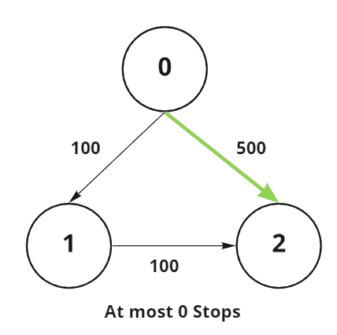
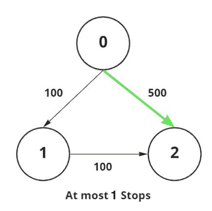

# 通过最多 K 个中间节点从源节点到目的节点的最大开销路径

> 原文:[https://www . geesforgeks . org/最大成本-从源节点到目标节点的路径-通过最多 k 个中间节点/](https://www.geeksforgeeks.org/maximum-cost-path-from-source-node-to-destination-node-via-at-most-k-intermediate-nodes/)

给定一个由 N 个顶点组成的[有向加权图](https://www.geeksforgeeks.org/graph-data-structure-and-algorithms/)和一个数组**边【】【】**，每行代表由一条边连接的两个顶点以及该边的权重，任务是找到从给定源顶点 **src** 到给定目的顶点 **dst** 的权重总和最大的路径，最多由 **K** 个中间顶点组成。如果不存在这样的路径，则打印 **-1** 。

**示例:**

> **输入:** N = 3，Edges[][] = {{0，1，100}，{1，2，100}，{0，2，500}}，src = 0，dst = 2，K = 0
> **输出:** 500
> **解释:**
> 
> 
> 
> **路径 0 → 2:** 权重最大，最多 0 个中间节点的路径权重为 500。
> 
> **输入:** N = 3，Edges[][] = {{0，1，100}，{1，2，100}，{0，2，500}}，src = 0，dst = 2，K = 0
> **输出:** 500
> **解释:**
> 
> 
> 
> **路径 0 → 2:** 权重最大，最多 1 个中间节点的路径权重为 500。

**方法:**给定的问题可以通过使用 [BFS(广度优先搜索)遍历](https://www.geeksforgeeks.org/breadth-first-search-or-bfs-for-a-graph/)来解决。按照以下步骤解决问题:

*   初始化变量，比如说**和**，以存储源节点和目的节点之间的最大距离，目的节点最多有 K 个**中间节点。**
*   使用边初始化图形的[邻接表](https://www.geeksforgeeks.org/graph-and-its-representations/)。
*   初始化一个空的[队列](https://www.geeksforgeeks.org/queue-data-structure/)[将源顶点推入其中](https://www.geeksforgeeks.org/queuepush-and-queuepop-in-cpp-stl/)。初始化一个变量，比如 **lvl** ，来存储 **src** 和 **dst** 之间的节点数。
*   当[队列不为空](https://www.geeksforgeeks.org/queueempty-queuesize-c-stl/)且 **lvl** 小于 **K + 2** 时，执行以下步骤:
    *   将队列的[大小存储在一个变量中，比如 **S** 。](https://www.geeksforgeeks.org/queueempty-queuesize-c-stl/)
    *   [迭代范围](https://www.geeksforgeeks.org/loops-in-c-and-cpp/)**【1，S】**并执行以下步骤:
        *   [弹出](https://www.geeksforgeeks.org/queuepush-and-queuepop-in-cpp-stl/)队列的[前元素](https://www.geeksforgeeks.org/queuefront-queueback-c-stl/)并将其存储在变量中，比如 **T** 。
        *   如果 **T** 是 **dst** 顶点，那么将 **ans** 的值更新为 **ans** 和当前距离 **T 秒**的最大值。
        *   遍历当前弹出节点的所有邻居，检查其邻居的距离是否大于当前距离。如果发现为真，则[将其推入队列](https://www.geeksforgeeks.org/queuepush-and-queuepop-in-cpp-stl/)并更新其距离。
    *   将 **lvl** 的值增加 **1** 。
*   完成上述步骤后，打印**和**的值作为合成的最大距离。

下面是上述方法的实现:

## C++

```
// C++ program for the above approach

#include <bits/stdc++.h>
using namespace std;

// Function to find the longest distance
// from source to destination with at
// most K intermediate nodes
int findShortestPath(
    int n, vector<vector<int> >& edges,
    int src, int dst, int K)
{
    // Initialize the adjacency list
    vector<vector<pair<int, int> > > adjlist(
        n, vector<pair<int, int> >());

    // Initialize a queue to perform BFS
    queue<pair<int, int> > q;

    unordered_map<int, int> mp;

    // Store the maximum distance of
    // every node from source vertex
    int ans = INT_MIN;

    // Initialize adjacency list
    for (int i = 0; i < edges.size(); i++) {

        auto edge = edges[i];

        adjlist[edge[0]].push_back(
            make_pair(edge[1], edge[2]));
    }

    // Push the first element into queue
    q.push({ src, 0 });

    int level = 0;

    // Iterate until the queue becomes empty
    // and the number of nodes between src
    // and dst vertex is at most to K
    while (!q.empty() && level < K + 2) {

        // Current size of the queue
        int sz = q.size();

        for (int i = 0; i < sz; i++) {

            // Extract the front
            // element of the queue
            auto pr = q.front();

            // Pop the front element
            // of the queue
            q.pop();

            // If the dst vertex is reached
            if (pr.first == dst)
                ans = max(ans, pr.second);

            // Traverse the adjacent nodes
            for (auto pr2 : adjlist[pr.first]) {

                // If the distance is greater
                // than the current distance
                if (mp.find(pr2.first)
                        == mp.end()
                    || mp[pr2.first]
                           > pr.second
                                 + pr2.second) {

                    // Push it into the queue
                    q.push({ pr2.first,
                             pr.second
                                 + pr2.second });
                    mp[pr2.first] = pr.second
                                    + pr2.second;
                }
            }
        }

        // Increment the level by 1
        level++;
    }

    // Finally, return the maximum distance
    return ans != INT_MIN ? ans : -1;
}

// Driver Code
int main()
{
    int n = 3, src = 0, dst = 2, k = 1;
    vector<vector<int> > edges
        = { { 0, 1, 100 },
            { 1, 2, 100 },
            { 0, 2, 500 } };

    cout << findShortestPath(n, edges,
                             src, dst, k);

    return 0;
}
```

## 蟒蛇 3

```
# Python3 program for the above approach
from collections import deque

# Function to find the longest distance
# from source to destination with at
# most K intermediate nodes
def findShortestPath(n, edges, src, dst, K):

    # Initialize the adjacency list
    adjlist = [[] for i in range(n)]

    # Initialize a queue to perform BFS
    q = deque()

    mp = {}

    # Store the maximum distance of
    # every node from source vertex
    ans = -10**9

    # Initialize adjacency list
    for i in range(len(edges)):
        edge = edges[i]
        adjlist[edge[0]].append([edge[1],
                                 edge[2]])

    # Push the first element into queue
    q.append([src, 0])

    level = 0

    # Iterate until the queue becomes empty
    # and the number of nodes between src
    # and dst vertex is at most to K
    while (len(q) > 0 and level < K + 2):

        # Current size of the queue
        sz = len(q)

        for i in range(sz):

            # Extract the front
            # element of the queue
            pr = q.popleft()

            # Pop the front element
            # of the queue
            # q.pop()

            # If the dst vertex is reached
            if (pr[0] == dst):
                ans = max(ans, pr[1])

            # Traverse the adjacent nodes
            for pr2 in adjlist[pr[0]]:

                # If the distance is greater
                # than the current distance
                if ((pr2[0] not in mp) or
                  mp[pr2[0]] > pr[1] + pr2[1]):

                    # Push it into the queue
                    q.append([pr2[0], pr[1] + pr2[1]])
                    mp[pr2[0]] = pr[1] + pr2[1]

        # Increment the level by 1
        level += 1

    # Finally, return the maximum distance
    return ans if ans != -10**9 else -1

# Driver Code
if __name__ == '__main__':

    n, src, dst, k = 3, 0, 2, 1

    edges= [ [ 0, 1, 100 ],
             [ 1, 2, 100 ],
             [ 0, 2, 500 ] ]

    print(findShortestPath(n, edges,src, dst, k))

# This code is contributed by mohit kumar 29
```

**Output:** 

```
500
```

***时间复杂度:** O(N + E)*
***辅助空间:** O(N)*