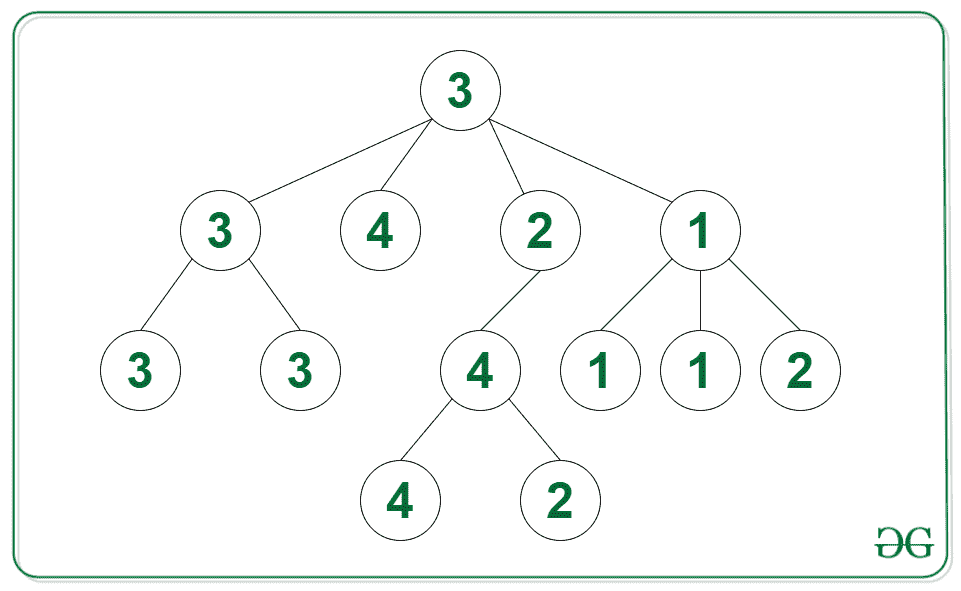
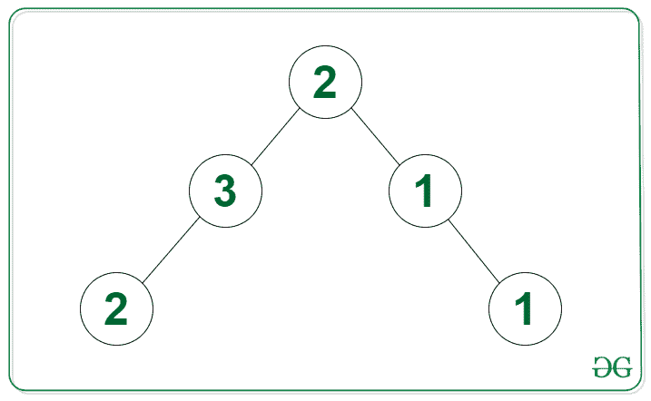

# 给定 N 元树中连接的重复节点的最大数量

> 原文:[https://www . geesforgeks . org/给定 n 元树中最大连接重复节点数/](https://www.geeksforgeeks.org/maximum-count-of-connected-duplicate-nodes-in-given-n-ary-tree/)

给定一个[类属树](https://www.geeksforgeeks.org/generic-treesn-array-trees/)，使得每个节点都有一个与之相关联的值，任务是找到树中具有相同值的最大数量的连接节点。如果一个节点是另一个节点的子节点，则连接两个节点。

**示例:**

> **输入:**下图中的树
> 
> 
> 
> **输出:** 4
> **说明:**最大的一组连通节点的值为 3，节点数等于 4。
> 
> **输入:**下图中的树
> 
> 
> 
> **输出:** 2

**方法:**使用[后序遍历](https://www.geeksforgeeks.org/post-order-traversal-of-binary-tree-in-on-using-o1-space/)可以解决给定的问题。其思想是检查子节点是否具有与其父节点相同的值，并将 1 添加到从子节点返回的答案中。可以遵循以下步骤来解决问题:

*   在 N 元树上应用[后序遍历](https://www.geeksforgeeks.org/post-order-traversal-of-binary-tree-in-on-using-o1-space/):
    *   如果根没有子对象，那么返回 1 给父对象
    *   添加从值与当前节点相同的子节点返回的所有答案
    *   更新最大连接节点数
*   返回最大连接节点数作为答案

下面是上述方法的实现:

## C++

```
// C++ code for the above approach
#include <bits/stdc++.h>
using namespace std;

class Node {
public:
    vector<Node*> children;
    int val;

    // constructor
    Node(int v)
    {

        val = v;
        children = {};
    }
};
// Post order traversal function
// to calculate the largest group
// of connected nodes
int postOrder(Node* root, int maxi[])
{

    // If the current node has no
    // children then return 1
    if (root->children.size() == 0)
        return 1;

    // Initialize a variable sum to
    // calculate largest group connected
    // to current node with same value
    // as current node
    int sum = 1;

    // Iterate through all neighbors
    for (Node* child : root->children) {

        // Get the value from children
        int nodes = postOrder(child, maxi);

        // If child node value is same as
        // current node then add the
        // returned value to sum
        if (child->val == root->val)
            sum += nodes;
    }

    // Update maximum connected
    // nodes if sum is greater
    maxi[0] = max(maxi[0], sum);

    // Return the connected group
    // to the current node
    return sum;
}
// Function to find the largest
// number of nodes in a tree
int largestGroup(Node* root)
{

    // Base case
    if (root == NULL)
        return 0;

    // Initialize a variable max
    // to calculate largest group
    int maxi[1];

    // Post-order traversal
    postOrder(root, maxi);

    // Return the answer
    return maxi[0];
}

// Driver code
int main()
{

    // Initialize the tree
    Node* three1 = new Node(3);
    Node* three2 = new Node(3);
    Node* three3 = new Node(3);
    Node* three4 = new Node(3);
    Node* two1 = new Node(2);
    Node* two2 = new Node(2);
    Node* two3 = new Node(2);
    Node* two4 = new Node(2);
    Node* four1 = new Node(4);
    Node* four2 = new Node(4);
    Node* four3 = new Node(4);
    Node* one1 = new Node(1);
    Node* one2 = new Node(1);
    Node* one3 = new Node(1);
    Node* one4 = new Node(1);
    three2->children.push_back(two1);
    three2->children.push_back(three1);
    three2->children.push_back(three3);
    four1->children.push_back(four2);
    four1->children.push_back(four3);
    two2->children.push_back(one1);
    two2->children.push_back(one2);
    two2->children.push_back(two3);
    one3->children.push_back(one4);
    one3->children.push_back(two4);
    three4->children.push_back(three2);
    three4->children.push_back(four1);
    three4->children.push_back(two2);
    three4->children.push_back(one3);

    // Call the function
    // and print the result
    cout << (largestGroup(three4));
}

// This code is contributed by Potta Lokesh
```

## Java 语言(一种计算机语言，尤用于创建网站)

```
// Java implementation for the above approach

import java.io.*;
import java.util.*;

class GFG {

    static class Node {

        List<Node> children;
        int val;

        // constructor
        public Node(int val)
        {

            this.val = val;
            children = new ArrayList<>();
        }
    }

    // Function to find the largest
    // number of nodes in a tree
    public static int largestGroup(Node root)
    {

        // Base case
        if (root == null)
            return 0;

        // Initialize a variable max
        // to calculate largest group
        int[] max = new int[1];

        // Post-order traversal
        postOrder(root, max);

        // Return the answer
        return max[0];
    }

    // Post order traversal function
    // to calculate the largest group
    // of connected nodes
    public static int postOrder(
        Node root, int[] max)
    {

        // If the current node has no
        // children then return 1
        if (root.children.size() == 0)
            return 1;

        // Initialize a variable sum to
        // calculate largest group connected
        // to current node with same value
        // as current node
        int sum = 1;

        // Iterate through all neighbors
        for (Node child : root.children) {

            // Get the value from children
            int nodes = postOrder(child, max);

            // If child node value is same as
            // current node then add the
            // returned value to sum
            if (child.val == root.val)
                sum += nodes;
        }

        // Update maximum connected
        // nodes if sum is greater
        max[0] = Math.max(max[0], sum);

        // Return the connected group
        // to the current node
        return sum;
    }

    // Driver code
    public static void main(String[] args)
    {

        // Initialize the tree
        Node three1 = new Node(3);
        Node three2 = new Node(3);
        Node three3 = new Node(3);
        Node three4 = new Node(3);
        Node two1 = new Node(2);
        Node two2 = new Node(2);
        Node two3 = new Node(2);
        Node two4 = new Node(2);
        Node four1 = new Node(4);
        Node four2 = new Node(4);
        Node four3 = new Node(4);
        Node one1 = new Node(1);
        Node one2 = new Node(1);
        Node one3 = new Node(1);
        Node one4 = new Node(1);
        three2.children.add(two1);
        three2.children.add(three1);
        three2.children.add(three3);
        four1.children.add(four2);
        four1.children.add(four3);
        two2.children.add(one1);
        two2.children.add(one2);
        two2.children.add(two3);
        one3.children.add(one4);
        one3.children.add(two4);
        three4.children.add(three2);
        three4.children.add(four1);
        three4.children.add(two2);
        three4.children.add(one3);

        // Call the function
        // and print the result
        System.out.println(
            largestGroup(three4));
    }
}
```

## 蟒蛇 3

```
# Python code for the above approach
class Node:

  # constructor
  def __init__(self, v):
    self.val = v;
    self.children = [];

# Post order traversal function
# to calculate the largest group
# of connected nodes
def postOrder(root, maxi):

  # If the current node has no
  # children then return 1
  if (len(root.children) == 0):
    return 1;

  # Initialize a variable sum to
  # calculate largest group connected
  # to current node with same value
  # as current node
  sum = 1;

  # Iterate through all neighbors
  for child in root.children:

    # Get the value from children
    nodes = postOrder(child, maxi);

    # If child node value is same as
    # current node then add the
    # returned value to sum
    if (child.val == root.val):
      sum += nodes;

  # Update maximum connected
  # nodes if sum is greater
  maxi[0] = max(maxi[0], sum);

  # Return the connected group
  # to the current node
  return sum;

# Function to find the largest
# number of nodes in a tree
def largestGroup(root):

  # Base case
  if (root == None):
    return 0;

  # Initialize a variable max
  # to calculate largest group
  maxi = [0];

  # Post-order traversal
  postOrder(root, maxi);

  # Return the answer
  return maxi[0];

# Driver code

# Initialize the tree
three1 = Node(3);
three2 = Node(3);
three3 = Node(3);
three4 = Node(3);
two1 = Node(2);
two2 = Node(2);
two3 = Node(2);
two4 = Node(2);
four1 = Node(4);
four2 = Node(4);
four3 = Node(4);
one1 = Node(1);
one2 = Node(1);
one3 = Node(1);
one4 = Node(1);
three2.children.append(two1);
three2.children.append(three1);
three2.children.append(three3);
four1.children.append(four2);
four1.children.append(four3);
two2.children.append(one1);
two2.children.append(one2);
two2.children.append(two3);
one3.children.append(one4);
one3.children.append(two4);
three4.children.append(three2);
three4.children.append(four1);
three4.children.append(two2);
three4.children.append(one3);

# Call the function
# and print the result
print((largestGroup(three4)));

# This code is contributed by gfgking
```

## C#

```
// C# implementation for the above approach
using System;
using System.Collections.Generic;

// Class representing a Node of an N-ary tree
public class Node
{
  public int val;
  public List<Node> children;

  // Constructor to create a Node
  public Node(int vall)
  {
    val = vall;
    children = new List<Node>();
  }
}

class GFG {

  // Function to find the largest
  // number of nodes in a tree
  public static int largestGroup(Node root)
  {

    // Base case
    if (root == null)
      return 0;

    // Initialize a variable max
    // to calculate largest group
    int[] max = new int[1];

    // Post-order traversal
    postOrder(root, max);

    // Return the answer
    return max[0];
  }

  // Post order traversal function
  // to calculate the largest group
  // of connected nodes
  public static int postOrder(
    Node root, int[] max)
  {

    // If the current node has no
    // children then return 1
    if (root.children.Count == 0)
      return 1;

    // Initialize a variable sum to
    // calculate largest group connected
    // to current node with same value
    // as current node
    int sum = 1;

    // Iterate through all neighbors
    foreach (Node child in root.children) {

      // Get the value from children
      int nodes = postOrder(child, max);

      // If child node value is same as
      // current node then Add the
      // returned value to sum
      if (child.val == root.val)
        sum += nodes;
    }

    // Update maximum connected
    // nodes if sum is greater
    max[0] = Math.Max(max[0], sum);

    // Return the connected group
    // to the current node
    return sum;
  }

  // Driver code
  static public void Main (){

    // Initialize the tree
    Node three1 = new Node(3);
    Node three2 = new Node(3);
    Node three3 = new Node(3);
    Node three4 = new Node(3);
    Node two1 = new Node(2);
    Node two2 = new Node(2);
    Node two3 = new Node(2);
    Node two4 = new Node(2);
    Node four1 = new Node(4);
    Node four2 = new Node(4);
    Node four3 = new Node(4);
    Node one1 = new Node(1);
    Node one2 = new Node(1);
    Node one3 = new Node(1);
    Node one4 = new Node(1);
    three2.children.Add(two1);
    three2.children.Add(three1);
    three2.children.Add(three3);
    four1.children.Add(four2);
    four1.children.Add(four3);
    two2.children.Add(one1);
    two2.children.Add(one2);
    two2.children.Add(two3);
    one3.children.Add(one4);
    one3.children.Add(two4);
    three4.children.Add(three2);
    three4.children.Add(four1);
    three4.children.Add(two2);
    three4.children.Add(one3);

    // Call the function
    // and print the result
    Console.WriteLine(
      largestGroup(three4));
  }
}

// This code is contributed
// by Shubham Singh
```

## java 描述语言

```
<script>
// Javascript code for the above approach
class Node {

  // constructor
  constructor(v) {

    this.val = v;
    this.children = [];
  }
};

// Post order traversal function
// to calculate the largest group
// of connected nodes
function postOrder(root, maxi) {

  // If the current node has no
  // children then return 1
  if (root.children.length == 0)
    return 1;

  // Initialize a variable sum to
  // calculate largest group connected
  // to current node with same value
  // as current node
  let sum = 1;

  // Iterate through all neighbors
  for (child of root.children) {

    // Get the value from children
    let nodes = postOrder(child, maxi);

    // If child node value is same as
    // current node then add the
    // returned value to sum
    if (child.val == root.val)
      sum += nodes;
  }

  // Update maximum connected
  // nodes if sum is greater
  maxi[0] = Math.max(maxi[0], sum);

  // Return the connected group
  // to the current node
  return sum;
}

// Function to find the largest
// number of nodes in a tree
function largestGroup(root) {

  // Base case
  if (root == null)
    return 0;

  // Initialize a variable max
  // to calculate largest group
  let maxi = [0];

  // Post-order traversal
  postOrder(root, maxi);

  // Return the answer
  return maxi[0];
}

// Driver code

// Initialize the tree
let three1 = new Node(3);
let three2 = new Node(3);
let three3 = new Node(3);
let three4 = new Node(3);
let two1 = new Node(2);
let two2 = new Node(2);
let two3 = new Node(2);
let two4 = new Node(2);
let four1 = new Node(4);
let four2 = new Node(4);
let four3 = new Node(4);
let one1 = new Node(1);
let one2 = new Node(1);
let one3 = new Node(1);
let one4 = new Node(1);
three2.children.push(two1);
three2.children.push(three1);
three2.children.push(three3);
four1.children.push(four2);
four1.children.push(four3);
two2.children.push(one1);
two2.children.push(one2);
two2.children.push(two3);
one3.children.push(one4);
one3.children.push(two4);
three4.children.push(three2);
three4.children.push(four1);
three4.children.push(two2);
three4.children.push(one3);

// Call the function
// and print the result
document.write((largestGroup(three4)));

// This code is contributed by gfgking
</script>
```

**Output:** 

```
4
```

**时间复杂度:** O(N)，其中 N 为树中节点数
T3】辅助空间: O(H)，H 为树高