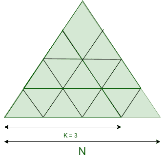

# 给定等边三角形内可形成的等边三角形的最大数量

> 原文:[https://www . geesforgeks . org/给定等边三角形内可形成的最大等边三角形数/](https://www.geeksforgeeks.org/maximum-count-of-equilateral-triangles-that-can-be-formed-within-given-equilateral-triangle/)

给定两个整数 **N** 和 **K** ，其中 N 表示一个较大的等边三角形的单位尺寸，任务是找出存在于 N 边的较大三角形中的大小为 K 的等边三角形的数目

**示例:**

> **输入:** N = 4，K = 3
> 
> [](https://media.geeksforgeeks.org/wp-content/uploads/20200807043234/UntitledDiagram.png)
> 
> **输出:** 3
> **说明:**
> 3 个 3 个单位大小的等边三角形存在于 4 个单位大小的 Bigger 等边三角形中。
> 
> **输入:** N = 4，K = 2
> **输出:** 7
> **说明:**
> 有 7 个 2 个单位大小的等边三角形存在于 4 个单位大小的 Bigger 等边三角形中。

**天真方法:**想法是迭代所有可能大小的较大等边三角形，以检查具有所需大小的三角形的数量 **K** 并打印三角形的总数。

***时间复杂度:**O(N)*
T5**辅助空间:** O(1)

**高效方法:**要优化上述方法，请注意以下几点:

*   尺寸 **N** 中出现的在尺寸 **K** 的向上方向具有峰值的三角形的数量等于**((N–K+1)*(N–K+2))/2**。
*   尺寸 **N** 中出现的在尺寸 **K** 的向下方向具有峰值的倒三角形的数量等于**((N–2K+1)*(N–2K+2))/2**。

下面是上述方法的实现:

## C++

```
// C++ program for the above approach
#include <iostream>
using namespace std;

// Function to find the number of
// equilateral triangle formed
// within another triangle
int No_of_Triangle(int N, int K)
{
    // Check for the valid condition
    if (N < K)
        return -1;

    else {

        int Tri_up = 0;

        // Number of triangles having
        // upward peak
        Tri_up = ((N - K + 1)
                  * (N - K + 2))
                 / 2;

        int Tri_down = 0;

        // Number of inverted triangles
        Tri_down = ((N - 2 * K + 1)
                    * (N - 2 * K + 2))
                   / 2;

        // Total no. of K sized triangle
        return Tri_up + Tri_down;
    }
}

// Driver Code
int main()
{
    // Given N and K
    int N = 4, K = 2;

    // Function Call
    cout << No_of_Triangle(N, K);
    return 0;
}
```

## Java 语言(一种计算机语言，尤用于创建网站)

```
// Java program for the above approach
import java.util.*;
class GFG{

// Function to find the number of
// equilateral triangle formed
// within another triangle
static int No_of_Triangle(int N, int K)
{
    // Check for the valid condition
    if (N < K)
        return -1;

    else
    {
        int Tri_up = 0;

        // Number of triangles having
        // upward peak
        Tri_up = ((N - K + 1) * (N - K + 2)) / 2;

        int Tri_down = 0;

        // Number of inverted triangles
        Tri_down = ((N - 2 * K + 1) *
                    (N - 2 * K + 2)) / 2;

        // Total no. of K sized triangle
        return Tri_up + Tri_down;
    }
}

// Driver Code
public static void main(String[] args)
{
    // Given N and K
    int N = 4, K = 2;

    // Function Call
    System.out.print(No_of_Triangle(N, K));
}
}

// This code is contributed by PrinciRaj1992
```

## 蟒蛇 3

```
# Python3 program for the above approach

# Function to find the number of
# equilateral triangle formed
# within another triangle
def No_of_Triangle(N, K):

    # Check for the valid condition
    if (N < K):
        return -1;

    else:
        Tri_up = 0;

        # Number of triangles having
        # upward peak
        Tri_up = ((N - K + 1) *
                  (N - K + 2)) // 2;

        Tri_down = 0;

        # Number of inverted triangles
        Tri_down = ((N - 2 * K + 1) *
                    (N - 2 * K + 2)) // 2;

        # Total no. of K sized triangle
        return Tri_up + Tri_down;

# Driver Code
if __name__ == '__main__':
    # Given N and K
    N = 4; K = 2;

    # Function Call
    print(No_of_Triangle(N, K));

# This code is contributed by sapnasingh4991
```

## C#

```
// C# program for the above approach
using System;
class GFG{

// Function to find the number of
// equilateral triangle formed
// within another triangle
static int No_of_Triangle(int N, int K)
{
    // Check for the valid condition
    if (N < K)
        return -1;

    else
    {
        int Tri_up = 0;

        // Number of triangles having
        // upward peak
        Tri_up = ((N - K + 1) * (N - K + 2)) / 2;

        int Tri_down = 0;

        // Number of inverted triangles
        Tri_down = ((N - 2 * K + 1) *
                    (N - 2 * K + 2)) / 2;

        // Total no. of K sized triangle
        return Tri_up + Tri_down;
    }
}

// Driver Code
public static void Main(String[] args)
{
    // Given N and K
    int N = 4, K = 2;

    // Function Call
    Console.Write(No_of_Triangle(N, K));
}
}

// This code is contributed by Rajput-Ji
```

## java 描述语言

```
<script>

// JavaScript program for the above approach

// Function to find the number of
// equilateral triangle formed
// within another triangle
function No_of_Triangle(N, K)
{
    // Check for the valid condition
    if (N < K)
        return -1;

    else {

        let Tri_up = 0;

        // Number of triangles having
        // upward peak
        Tri_up = Math.floor(((N - K + 1)
                * (N - K + 2))
                / 2);

        let Tri_down = 0;

        // Number of inverted triangles
        Tri_down = Math.floor(((N - 2 * K + 1)
                    * (N - 2 * K + 2))
                / 2);

        // Total no. of K sized triangle
        return Tri_up + Tri_down;
    }
}

// Driver Code

    // Given N and K
    let N = 4, K = 2;

    // Function Call
    document.write(No_of_Triangle(N, K));

// This code is contributed by Surbhi Tyagi.

</script>
```

**Output:** 

```
7
```

***时间复杂度:**O(1)*
T5**辅助空间:** O(1)