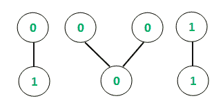
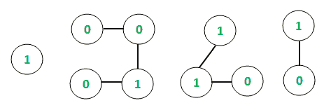

# 二进制值图的所有连通分支中最大可能的十进制等价图

> 原文:[https://www . geesforgeks . org/最大十进制等值二进制值图的所有连接组件中的可能组件/](https://www.geeksforgeeks.org/maximum-decimal-equivalent-possible-among-all-connected-components-of-a-binary-valued-graph/)

给定一个具有 **V** 顶点和 **E** 边的**二进制值** [无向图](https://www.geeksforgeeks.org/graph-data-structure-and-algorithms/)，任务是在图的所有连通分支中找到最大十进制等价。二进制值的图可以认为只有二进制数 **(0 或 1)** 作为顶点值。

**示例:**

> **输入:** E = 4，V = 7
> 
> 
> 
> **输出:** 3
> **说明:**
> 连接部件的十进制当量如下:
> 【0，1】:最大可能十进制当量= 2[(10)<sub>2</sub>
> 【0，0，0】:最大可能十进制当量= 2
> 【1，1】:最大可能十进制当量= 3
> 因此，所有部件的最大十进制当量= 3
> 
> **输入:** E = 6，V = 10
> 
> 
> 
> **输出:** 8
> **说明:**
> 连接部件及十进制当量如下:
> 【1】:最大可能十进制当量= 2
> 【0，0，1，0】:最大可能十进制当量= 8【(1000)】<sub>2</sub>
> 【1，1，0】:最大可能十进制当量= 6
> 【1，0】:最大可能十进制当量= 2
> 因此，所有部件的最大十进制当量= 8 【T13

**进场:**

*   其思想是使用[深度优先搜索遍历](https://www.geeksforgeeks.org/depth-first-search-or-dfs-for-a-graph/)来跟踪无向图中的连接组件，如[这篇](https://www.geeksforgeeks.org/connected-components-in-an-undirected-graph/)文章中所解释的。
*   对于每个连接的组件，存储二进制字符串并计算等效的十进制值。
*   设置一个全局最大值，与每次迭代后获得的最大十进制等值进行比较，以获得最终结果。

下面是上述方法的实现:

## C++

```
// C++ Program to find
// maximum decimal equivalent among
// all connected components

#include <bits/stdc++.h>

using namespace std;

// Function to traverse the undirected
// graph using the Depth first traversal
void depthFirst(int v, vector<int> graph[],
                vector<bool>& visited,
                vector<int>& storeChain)
{
    // Marking the visited
    // vertex as true
    visited[v] = true;

    // Store the connected chain
    storeChain.push_back(v);

    for (auto i : graph[v]) {
        if (visited[i] == false) {

            // Recursive call to
            // the DFS algorithm
            depthFirst(i, graph,
                       visited, storeChain);
        }
    }
}

// Function to return decimal
// equivalent of each connected
// component
int decimal(int arr[], int n)
{
    int zeros = 0, ones = 0;

    // Storing the respective
    // counts of 1's and 0's
    for (int i = 0; i < n; i++) {
        if (arr[i] == 0)
            zeros++;
        else
            ones++;
    }

    // If all are zero then
    // maximum decimal equivalent
    // is also zero
    if (zeros == n)
        return 0;

    int temp = n - ones;
    int dec = 0;

    // For all the 1's, calculate
    // the decimal equivalent by
    // appropriate multiplication
    // of power of 2's
    while (ones--) {
        dec += pow(2, temp);
        temp++;
    }
    return dec;
}

// Function to find the maximum
// decimal equivalent among all
// connected components
void decimalValue(
    vector<int> graph[], int vertices,
    vector<int> values)
{
    // Initializing boolean array
    // to mark visited vertices
    vector<bool> visited(10001, false);

    // maxDeci stores the
    // maximum decimal value
    int maxDeci = INT_MIN;

    // Following loop invokes
    // DFS algorithm
    for (int i = 1; i <= vertices; i++) {
        if (visited[i] == false) {

            // Variable to hold
            // temporary length
            int sizeChain;

            // Variable to hold temporary
            // Decimal values
            int tempDeci;

            // Container to store
            // each chain
            vector<int> storeChain;

            // DFS algorithm
            depthFirst(i, graph, visited,
                       storeChain);

            // Variable to hold each
            // chain size
            sizeChain = storeChain.size();

            // Container to store values
            // of vertices of individual
            // chains
            int chainValues[sizeChain + 1];

            // Storing the values of
            // each chain
            for (int i = 0; i < sizeChain; i++) {
                int temp = values[storeChain[i] - 1];
                chainValues[i] = temp;
            }

            // Function call to find
            // decimal equivalent
            tempDeci = decimal(chainValues,
                               sizeChain);

            // Conditional to store maximum
            // value of decimal equivalent
            if (tempDeci > maxDeci) {
                maxDeci = tempDeci;
            }
        }
    }

    // Printing the decimal result
    // (global maxima)

    cout << maxDeci;
}

// Driver code
int main()
{
    // Initializing graph in the
    // form of adjacency list
    vector<int> graph[1001];

    // Defining the number of
    // edges and vertices
    int E, V;
    E = 4;
    V = 7;

    // Assigning the values
    // for each vertex of the
    // undirected graph
    vector<int> values;
    values.push_back(0);
    values.push_back(1);
    values.push_back(0);
    values.push_back(0);
    values.push_back(0);
    values.push_back(1);
    values.push_back(1);

    // Constructing the
    // undirected graph
    graph[1].push_back(2);
    graph[2].push_back(1);
    graph[3].push_back(4);
    graph[4].push_back(3);
    graph[4].push_back(5);
    graph[5].push_back(4);
    graph[6].push_back(7);
    graph[7].push_back(6);

    decimalValue(graph, V, values);
    return 0;
}
```

## Java 语言(一种计算机语言，尤用于创建网站)

```
// Java program to find maximum
// decimal equivalent among all
// connected components
import java.io.*;
import java.util.*;

class GFG{

// Function to traverse the undirected
// graph using the Depth first traversal
static void depthFirst(int v,
                       List<List<Integer>> graph,
                       boolean[] visited,
                       List<Integer> storeChain)
{

    // Marking the visited
    // vertex as true
    visited[v] = true;

    // Store the connected chain
    storeChain.add(v);

    for(int i : graph.get(v))
    {
        if (visited[i] == false)
        {

            // Recursive call to
            // the DFS algorithm
            depthFirst(i, graph, visited,
                       storeChain);
        }
    }
}

// Function to return decimal
// equivalent of each connected
// component
static int decimal(int arr[], int n)
{
    int zeros = 0, ones = 0;

    // Storing the respective
    // counts of 1's and 0's
    for(int i = 0; i < n; i++)
    {
        if (arr[i] == 0)
            zeros++;
        else
            ones++;
    }

    // If all are zero then maximum
    // decimal equivalent is also zero
    if (zeros == n)
        return 0;

    int temp = n - ones;
    int dec = 0;

    // For all the 1's, calculate
    // the decimal equivalent by
    // appropriate multiplication
    // of power of 2's
    while (ones > 0)
    {
        dec += Math.pow(2, temp);
        temp++;
        ones--;
    }
    return dec;
}

// Function to find the maximum
// decimal equivalent among all
// connected components
static void decimalValue(List<List<Integer>> graph,
                         int vertices,
                         List<Integer> values)
{

    // Initializing boolean array
    // to mark visited vertices
    boolean[] visited = new boolean[10001];

    // maxDeci stores the
    // maximum decimal value
    int maxDeci = Integer.MIN_VALUE;

    // Following loop invokes
    // DFS algorithm
    for(int i = 1; i <= vertices; i++)
    {
        if (visited[i] == false)
        {

            // Variable to hold
            // temporary length
            int sizeChain;

            // Variable to hold temporary
            // Decimal values
            int tempDeci;

            // Container to store
            // each chain
            List<Integer> storeChain = new ArrayList<Integer>();

            // DFS algorithm
            depthFirst(i, graph, visited,
                       storeChain);

            // Variable to hold each
            // chain size
            sizeChain = storeChain.size();

            // Container to store values
            // of vertices of individual
            // chains
            int[] chainValues = new int[sizeChain + 1];

            // Storing the values of
            // each chain
            for(int j = 0; j < sizeChain; j++)
            {
                int temp = values.get(
                    storeChain.get(j) - 1);
                chainValues[j] = temp;
            }

            // Function call to find
            // decimal equivalent
            tempDeci = decimal(chainValues,
                               sizeChain);

            // Conditional to store maximum
            // value of decimal equivalent
            if (tempDeci > maxDeci)
            {
                maxDeci = tempDeci;
            }
        }
    }

    // Printing the decimal result
    // (global maxima)
    System.out.println(maxDeci);
}

// Driver code
public static void main(String[] args)
{

    // Initializing graph in the
    // form of adjacency list
    @SuppressWarnings("unchecked")
    List<List<Integer>> graph = new ArrayList();

    for(int i = 0; i < 1001; i++)
        graph.add(new ArrayList<Integer>());

    // Defining the number
    // of edges and vertices
    int E = 4, V = 7;

    // Assigning the values for each
    // vertex of the undirected graph
    List<Integer> values = new ArrayList<Integer>();
    values.add(0);
    values.add(1);
    values.add(0);
    values.add(0);
    values.add(0);
    values.add(1);
    values.add(1);

    // Constructing the
    // undirected graph
    graph.get(1).add(2);
    graph.get(2).add(1);
    graph.get(3).add(4);
    graph.get(4).add(3);
    graph.get(4).add(5);
    graph.get(5).add(4);
    graph.get(6).add(7);
    graph.get(7).add(6);

    decimalValue(graph, V, values);
}
}

// This code is contributed by jithin
```

## 蟒蛇 3

```
# Python3 Program to find
# maximum decimal equivalent among
# all connected components
import sys

# Function to traverse the
# undirected graph using
# the Depth first traversal
def depthFirst(v, graph,
               visited,
               storeChain):

    # Marking the visited
    # vertex as true
    visited[v] = True;

    # Store the connected chain
    storeChain.append(v);

    for i in graph[v]:
        if (visited[i] == False):

            # Recursive call to
            # the DFS algorithm
            depthFirst(i, graph,
                       visited,
                       storeChain);       

# Function to return decimal
# equivalent of each connected
# component
def decimal(arr, n):

    zeros = 0
    ones = 0

    # Storing the respective
    # counts of 1's and 0's
    for i in range(n):

        if (arr[i] == 0):
            zeros+=1;
        else:
            ones += 1;   

    # If all are zero then
    # maximum decimal equivalent
    # is also zero
    if (zeros == n):
        return 0;

    temp = n - ones;
    dec = 0;

    # For all the 1's, calculate
    # the decimal equivalent by
    # appropriate multiplication
    # of power of 2's
    while (ones != 0):
        ones -= 1
        dec += pow(2, temp);
        temp += 1;

    return dec;

# Function to find the maximum
# decimal equivalent among all
# connected components
def decimalValue(graph,
                 vertices, values):

    # Initializing boolean array
    # to mark visited vertices
    visited = [False for i in range(10001)]

    # maxDeci stores the
    # maximum decimal value
    maxDeci = -sys.maxsize;

    # Following loop invokes
    # DFS algorithm
    for i in range(vertices + 1):

        if (visited[i] == False):

            # Variable to hold
            # temporary length
            sizeChain = 0;

            # Variable to hold
            # temporary Decimal values
            tempDeci = 0;

            # Container to store
            # each chain
            storeChain = [];

            # DFS algorithm
            depthFirst(i, graph,
                       visited,
                       storeChain);

            # Variable to hold each
            # chain size
            sizeChain = len(storeChain)

            # Container to store values
            # of vertices of individual
            # chains
            chainValues = [0 for i in range(sizeChain + 1)]

            # Storing the values of
            # each chain
            for i in range(sizeChain):           
                temp = values[storeChain[i] - 1];
                chainValues[i] = temp;           

            # Function call to find
            # decimal equivalent
            tempDeci = decimal(chainValues,
                               sizeChain);

            # Conditional to store maximum
            # value of decimal equivalent
            if (tempDeci > maxDeci):
                maxDeci = tempDeci;           

    # Printing the decimal result
    # (global maxima)
    print(maxDeci)

if __name__ == "__main__":

    # Initializing graph in the
    # form of adjacency list
    graph = [[] for i in range(1001)]

    # Defining the number
    # of edges and vertices
    E = 4;
    V = 7;

    # Assigning the values
    # for each vertex of
    # the undirected graph
    values = [];
    values.append(0);
    values.append(1);
    values.append(0);
    values.append(0);
    values.append(0);
    values.append(1);
    values.append(1);

    # Constructing the
    # undirected graph
    graph[1].append(2);
    graph[2].append(1);
    graph[3].append(4);
    graph[4].append(3);
    graph[4].append(5);
    graph[5].append(4);
    graph[6].append(7);
    graph[7].append(6);

    decimalValue(graph, V, values);

# This code is contributed by rutvik_56
```

## C#

```
// C# program to find maximum
// decimal equivalent among all
// connected components
using System;
using System.Collections;
using System.Collections.Generic;

class GFG{

// Function to traverse the undirected
// graph using the Depth first traversal
static void depthFirst(int v,
                       ArrayList graph,
                       bool[] visited,
                       ArrayList storeChain)
{

    // Marking the visited
    // vertex as true
    visited[v] = true;

    // Store the connected chain
    storeChain.Add(v);

    foreach(int i in (ArrayList)graph[v])
    {
        if (visited[i] == false)
        {

            // Recursive call to
            // the DFS algorithm
            depthFirst(i, graph, visited,
                       storeChain);
        }
    }
}

// Function to return decimal_t
// equivalent of each connected
// component
static int decimal_t(int []arr, int n)
{
    int zeros = 0, ones = 0;

    // Storing the respective
    // counts of 1's and 0's
    for(int i = 0; i < n; i++)
    {
        if (arr[i] == 0)
            zeros++;
        else
            ones++;
    }

    // If all are zero then maximum
    // decimal_t equivalent is also zero
    if (zeros == n)
        return 0;

    int temp = n - ones;
    int dec = 0;

    // For all the 1's, calculate
    // the decimal_t equivalent by
    // appropriate multiplication
    // of power of 2's
    while (ones > 0)
    {
        dec += (int)Math.Pow(2, temp);
        temp++;
        ones--;
    }
    return dec;
}

// Function to find the maximum
// decimal_t equivalent among all
// connected components
static void decimal_tValue(ArrayList graph,
                           int vertices,
                           ArrayList values)
{

    // Initializing boolean array
    // to mark visited vertices
    bool[] visited = new bool[10001];

    // maxDeci stores the
    // maximum decimal_t value
    int maxDeci = -100000000;

    // Following loop invokes
    // DFS algorithm
    for(int i = 1; i <= vertices; i++)
    {
        if (visited[i] == false)
        {

            // Variable to hold
            // temporary length
            int sizeChain;

            // Variable to hold temporary
            // decimal_t values
            int tempDeci;

            // Container to store
            // each chain
            ArrayList storeChain = new ArrayList();

            // DFS algorithm
            depthFirst(i, graph, visited,
                       storeChain);

            // Variable to hold each
            // chain size
            sizeChain = storeChain.Count;

            // Container to store values
            // of vertices of individual
            // chains
            int[] chainValues = new int[sizeChain + 1];

            // Storing the values of
            // each chain
            for(int j = 0; j < sizeChain; j++)
            {
                int temp = (int)values[(int)storeChain[j] - 1];
                chainValues[j] = temp;
            }

            // Function call to find
            // decimal_t equivalent
            tempDeci = decimal_t(chainValues, sizeChain);

            // Conditional to store maximum
            // value of decimal_t equivalent
            if (tempDeci > maxDeci)
            {
                maxDeci = tempDeci;
            }
        }
    }

    // Printing the decimal_t result
    // (global maxima)
    Console.WriteLine(maxDeci);
}

// Driver code
public static void Main(string[] args)
{

    // Initializing graph in the
    // form of adjacency list
    ArrayList graph = new ArrayList();
    for(int i = 0; i < 1001; i++)
        graph.Add(new ArrayList());

    // Defining the number
    // of edges and vertices
    int V = 7;

    // Assigning the values for each
    // vertex of the undirected graph
    ArrayList values = new ArrayList();
    values.Add(0);
    values.Add(1);
    values.Add(0);
    values.Add(0);
    values.Add(0);
    values.Add(1);
    values.Add(1);

    // Constructing the
    // undirected graph
    ((ArrayList)graph[1]).Add(2);
    ((ArrayList)graph[2]).Add(1);
    ((ArrayList)graph[3]).Add(4);
    ((ArrayList)graph[4]).Add(3);
    ((ArrayList)graph[4]).Add(5);
    ((ArrayList)graph[5]).Add(4);
    ((ArrayList)graph[6]).Add(7);
    ((ArrayList)graph[7]).Add(6);

    decimal_tValue(graph, V, values);
}
}

// This code is contributed by pratham76
```

**Output:** 

```
3
```

**复杂度分析:**
**时间复杂度:**O(V<sup>2</sup>)
DFS 算法运行需要 O(V + E)时间，其中 V、E 是无向图的顶点和边。此外，在计算和返回结果时需要额外的 O(V)的每次迭代中，都可以找到十进制等价物。因此，整体复杂度为**O(V<sup>2</sup>)**
**辅助空间:** O(V)