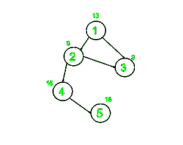

# 有向无环图中节点与其祖先之间的最大差异

> 原文:[https://www . geesforgeks . org/有向无环图中节点与其祖先之间的最大差异-dag/](https://www.geeksforgeeks.org/maximum-difference-between-node-and-its-ancestor-in-a-directed-acyclic-graph-dag/)

给定一个 2D [数组](https://www.geeksforgeeks.org/introduction-to-arrays/) **边【】【】**，表示有向无环连通图中一对节点之间的有向边，该有向无环连通图由从**【1，N】**取值的 **N** 个节点和表示每个节点权重的[数组](https://www.geeksforgeeks.org/arrays-in-c-cpp/)**【arr】**组成，任务是找出任意节点与其任意[祖先](https://www.geeksforgeeks.org/print-ancestors-of-a-given-node-in-binary-tree/)的权重之间的最大绝对差。

**示例:**

> ***输入:** N = 5，M = 4，Edges[][2] = {{1，2}，{2，3}，{4，5}，{1，3}}，arr[] = {13，8，3，15，18}*
> ***输出** : 10*
> **解释:**
> 
> [](https://media.geeksforgeeks.org/wp-content/uploads/20210111195659/maximumdiffINDAG-300x225.jpg)
> 
> 从上图可以观察到，任何节点的值与其任何祖先之间的最大差值是 18(节点 5)–8(节点 2) = 10。
> 
> **输入:** *N = 4，M = 3，Edges[][2] = {{1，2}，{2，4}，{1，3}}，arr[] =* {2，3，1，5}
> **输出:** 3

**方法:**解决给定问题的思路是在图上执行 [DFS 遍历，并填充从每个节点到其子节点的最大值和最小值，并找到最大绝对差。
按照以下步骤解决给定问题:](https://www.geeksforgeeks.org/depth-first-search-or-dfs-for-a-graph/)

*   初始化一个变量，说**和**为 [INT_MIN](https://www.geeksforgeeks.org/int_max-int_min-cc-applications/) 来存储所需的最大差值。
*   在给定的图上执行 [DFS 遍历](https://www.geeksforgeeks.org/iterative-depth-first-traversal/)，通过执行以下操作，找到一个节点与其任何[祖先](https://www.geeksforgeeks.org/print-ancestors-of-a-given-node-in-binary-tree/)的权重之间的最大绝对差:
    *   对于每个源节点，说 **src** ，更新 **ans** 的值，分别存储 **src** 和 **currentMin** 和 **currentMax** 的权重绝对差的最大值。
    *   将 **currentMin** 的值更新为 **currentMin** 的最小值和源节点 **src** 的值。
    *   将 **currentMax** 的值更新为 **currentMax** 的最大值和源节点 **src** 的值。
    *   现在，递归遍历 **src** 的子节点，并将 **currentMax** 和 **currentMin** 的值更新为 **DFS(子，Adj，ans，currentMin，currentMax)** 。
*   完成上述步骤后，打印**和**的值作为最大差值。

下面是上述方法的实现:

## C++

```
// C++ program for the above approach
#include <bits/stdc++.h>
using namespace std;

// Function to perform DFS
// Traversal on the given graph
void DFS(int src, vector<int> Adj[],
         int& ans, int arr[],
         int currentMin, int currentMax)
{

    // Update the value of ans
    ans = max(
        ans, max(abs(
                     currentMax - arr[src - 1]),
                 abs(currentMin - arr[src - 1])));

    // Update the currentMin and currentMax
    currentMin = min(currentMin,
                     arr[src - 1]);

    currentMax = min(currentMax,
                     arr[src - 1]);

    // Traverse the adjacency
    // list of the node src
    for (auto& child : Adj[src]) {

        // Recursively call
        // for the child node
        DFS(child, Adj, ans, arr,
            currentMin, currentMax);
    }
}

// Function to calculate maximum absolute
// difference between a node and its ancestor
void getMaximumDifference(int Edges[][2],
                          int arr[], int N,
                          int M)
{

    // Stores the adjacency list of graph
    vector<int> Adj[N + 1];

    // Create Adjacency list
    for (int i = 0; i < M; i++) {
        int u = Edges[i][0];
        int v = Edges[i][1];

        // Add a directed edge
        Adj[u].push_back(v);
    }

    int ans = 0;

    // Perform DFS Traversal
    DFS(1, Adj, ans, arr,
        arr[0], arr[0]);

    // Print the maximum
    // absolute difference
    cout << ans;
}

// Driver Code
int main()
{
    int N = 5, M = 4;
    int Edges[][2]
        = { { 1, 2 }, { 2, 3 },
            { 4, 5 }, { 1, 3 } };
    int arr[] = { 13, 8, 3, 15, 18 };

    getMaximumDifference(Edges, arr, N, M);

    return 0;
}
```

## Java 语言(一种计算机语言，尤用于创建网站)

```
// Java program for the above approach
import java.util.*;

class GFG{

static int ans;

// Function to perform DFS
// Traversal on the given graph
static void DFS(int src,
                ArrayList<ArrayList<Integer> > Adj,
                int arr[], int currentMin,
                int currentMax)
{

    // Update the value of ans
    ans = Math.max(ans,
          Math.max(Math.abs(currentMax - arr[src - 1]),
                   Math.abs(currentMin - arr[src - 1])));

    // Update the currentMin and currentMax
    currentMin = Math.min(currentMin, arr[src - 1]);

    currentMax = Math.min(currentMax, arr[src - 1]);

    // Traverse the adjacency
    // list of the node src
    for(Integer child : Adj.get(src))
    {

        // Recursively call
        // for the child node
        DFS(child, Adj, arr, currentMin, currentMax);
    }
}

// Function to calculate maximum absolute
// difference between a node and its ancestor
static void getMaximumDifference(int Edges[][],
                                 int arr[], int N,
                                 int M)
{
    ans = 0;

    // Stores the adjacency list of graph
    ArrayList<ArrayList<Integer>> Adj = new ArrayList<>();

    for(int i = 0; i < N + 1; i++)
        Adj.add(new ArrayList<>());

    // Create Adjacency list
    for(int i = 0; i < M; i++)
    {
        int u = Edges[i][0];
        int v = Edges[i][1];

        // Add a directed edge
        Adj.get(u).add(v);
    }

    // Perform DFS Traversal
    DFS(1, Adj, arr, arr[0], arr[0]);

    // Print the maximum
    // absolute difference
    System.out.println(ans);
}

// Driver code
public static void main(String[] args)
{
    int N = 5, M = 4;
    int Edges[][] = { { 1, 2 }, { 2, 3 },
                      { 4, 5 }, { 1, 3 } };
    int arr[] = { 13, 8, 3, 15, 18 };

    getMaximumDifference(Edges, arr, N, M);
}
}

// This code is contributed by offbeat
```

## 蟒蛇 3

```
# Python3 program for the above approach
ans = 0

# Function to perform DFS
# Traversal on the given graph
def DFS(src, Adj, arr, currentMin, currentMax):

    # Update the value of ans
    global ans
    ans = max(ans, max(abs(currentMax - arr[src - 1]),
                       abs(currentMin - arr[src - 1])))

    # Update the currentMin and currentMax
    currentMin = min(currentMin, arr[src - 1])

    currentMax = min(currentMax, arr[src - 1])

    # Traverse the adjacency
    # list of the node src
    for child in Adj[src]:

        # Recursively call
        # for the child node
        DFS(child, Adj, arr, currentMin, currentMax)

# Function to calculate maximum absolute
# difference between a node and its ancestor
def getMaximumDifference(Edges, arr, N, M):

    global ans

    # Stores the adjacency list of graph
    Adj = [[] for i in range(N + 1)]

    # Create Adjacency list
    for i in range(M):
        u = Edges[i][0]
        v = Edges[i][1]

        # Add a directed edge
        Adj[u].append(v)

    # Perform DFS Traversal
    DFS(1, Adj, arr, arr[0], arr[0])

    # Print the maximum
    # absolute difference
    print(ans)

# Driver Code
if __name__ == '__main__':

    N = 5
    M = 4
    Edges = [[1, 2], [2, 3], [4, 5], [1, 3]]
    arr =  [13, 8, 3, 15, 18]

    getMaximumDifference(Edges, arr, N, M)

# This code is contributed by ipg2016107
```

## C#

```
// C# program for the above approach
using System;
using System.Collections.Generic;
class GFG {

    static int ans;

    // Function to perform DFS
    // Traversal on the given graph
    static void DFS(int src, List<List<int>> Adj, int[] arr,
                    int currentMin, int currentMax)
    {

        // Update the value of ans
        ans = Math.Max(ans,
              Math.Max(Math.Abs(currentMax - arr[src - 1]),
                       Math.Abs(currentMin - arr[src - 1])));

        // Update the currentMin and currentMax
        currentMin = Math.Min(currentMin, arr[src - 1]);

        currentMax = Math.Min(currentMax, arr[src - 1]);

        // Traverse the adjacency
        // list of the node src
        foreach(int child in Adj[src])
        {

            // Recursively call
            // for the child node
            DFS(child, Adj, arr, currentMin, currentMax);
        }
    }

    // Function to calculate maximum absolute
    // difference between a node and its ancestor
    static void getMaximumDifference(int[,] Edges,
                                     int[] arr, int N, int M)
    {
        ans = 0;

        // Stores the adjacency list of graph
        List<List<int>> Adj = new List<List<int>>();

        for(int i = 0; i < N + 1; i++)
            Adj.Add(new List<int>());

        // Create Adjacency list
        for(int i = 0; i < M; i++)
        {
            int u = Edges[i,0];
            int v = Edges[i,1];

            // Add a directed edge
            Adj[u].Add(v);
        }

        // Perform DFS Traversal
        DFS(1, Adj, arr, arr[0], arr[0]);

        // Print the maximum
        // absolute difference
        Console.WriteLine(ans);
    }

  static void Main() {
    int N = 5, M = 4;
    int[,] Edges = { { 1, 2 }, { 2, 3 },
                      { 4, 5 }, { 1, 3 } };
    int[] arr = { 13, 8, 3, 15, 18 };

    getMaximumDifference(Edges, arr, N, M);
  }
}

// This code is contributed by rameshtravel07.
```

## java 描述语言

```
<script>

// Javascript program for the above approach

var ans = 0;

// Function to perform DFS
// Traversal on the given graph
function DFS(src, Adj, arr, currentMin, currentMax)
{

    // Update the value of ans
    ans = Math.max(
        ans, Math.max(Math.abs(
                     currentMax - arr[src - 1]),
                 Math.abs(currentMin - arr[src - 1])));

    // Update the currentMin and currentMax
    currentMin = Math.min(currentMin,
                     arr[src - 1]);

    currentMax = Math.min(currentMax,
                     arr[src - 1]);

    // Traverse the adjacency
    // list of the node src
    Adj[src].forEach(child => {

        // Recursively call
        // for the child node
        DFS(child, Adj,arr,
            currentMin, currentMax);
    });
}

// Function to calculate maximum absolute
// difference between a node and its ancestor
function getMaximumDifference(Edges, arr, N, M)
{

    // Stores the adjacency list of graph
    var Adj = Array.from(Array(N+1), ()=> Array());

    // Create Adjacency list
    for (var i = 0; i < M; i++) {
        var u = Edges[i][0];
        var v = Edges[i][1];

        // Add a directed edge
        Adj[u].push(v);
    }

    // Perform DFS Traversal
    DFS(1, Adj, arr,
        arr[0], arr[0]);

    // Print the maximum
    // absolute difference
    document.write( ans);
}

// Driver Code
var N = 5, M = 4;
var Edges
    = [ [ 1, 2 ], [ 2, 3 ],
        [ 4, 5 ], [ 1, 3 ] ];
var arr = [13, 8, 3, 15, 18];
getMaximumDifference(Edges, arr, N, M);

</script>
```

**Output:** 

```
10
```

***时间复杂度:** O(N + M)*
***辅助空间:** O(N)*