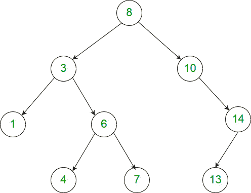

# 二叉树中节点与其祖先的最大差异

> 原文:[https://www . geeksforgeeks . org/二叉树中节点与其祖先之间的最大差异/](https://www.geeksforgeeks.org/maximum-difference-between-node-and-its-ancestor-in-binary-tree/)

给定一棵二叉树，我们需要找到从节点 A 的值中减去节点 B 的值所能得到的最大值，其中 A 和 B 是二叉树的两个节点，A 是 B 的祖先，期望时间复杂度为 O(n)。

例如，考虑下面的二叉树



我们可以有各种祖先节点差异，其中一些如下所示:
8–3 = 5
3–7 =-4
8–1 = 7
10–13 =-3
。。。。
但在所有这些差异中，最大值是 8 减去 1 得到的 7，我们需要将它作为结果返回。

由于我们给定了一棵二叉树，节点值之间没有关系，所以我们需要遍历整个二叉树来获得最大差异，并且我们只能通过以下步骤在一次遍历中获得结果:
如果我们在叶节点，那么只要返回它的值，因为它不能是任何节点的祖先。然后在每个内部节点，我们将尝试从左子树和右子树中获取最小值，并计算节点值与该最小值之间的差值，并根据该差值更新结果。

当我们在递归中返回时计算最小值，我们将检查所有差异的最佳可能性(仅用最小子树值检查节点值)，因此仅在一次遍历中计算结果。

以下是上述想法的实现。

## C++

```
// C++ program to find maximum difference between node
// and its ancestor
#include <bits/stdc++.h>
using namespace std;

/* A binary tree node has key, pointer to left
   child and a pointer to right child */
struct Node
{
    int key;
    struct Node* left, *right;
};

/* To create a newNode of tree and return pointer */
struct Node* newNode(int key)
{
    Node* temp = new Node;
    temp->key = key;
    temp->left = temp->right = NULL;
    return (temp);
}

/* Recursive function to calculate maximum ancestor-node
   difference in  binary tree. It updates value at 'res'
   to store the result.  The returned value of this function
   is minimum value in subtree rooted with 't' */
int maxDiffUtil(Node* t, int *res)
{
    /* Returning Maximum int value if node is not
       there (one child case)  */
    if (t == NULL)
        return INT_MAX;

    /* If leaf node then just return node's value  */
    if (t->left == NULL && t->right == NULL)
        return t->key;

    /* Recursively calling left and right subtree
       for minimum value  */
    int val = min(maxDiffUtil(t->left, res),
                  maxDiffUtil(t->right, res));

    /* Updating res if (node value - minimum value
       from subtree) is bigger than res  */
    *res = max(*res, t->key - val);

    /* Returning minimum value got so far */
    return min(val, t->key);
}

/* This function mainly calls maxDiffUtil() */
int maxDiff(Node *root)
{
    // Initialising result with minimum int value
    int res = INT_MIN;

    maxDiffUtil(root, &res);

    return res;
}

/* Helper function to print inorder traversal of
  binary tree   */
void inorder(Node* root)
{
    if (root)
    {
        inorder(root->left);
        printf("%d ", root->key);
        inorder(root->right);
    }
}

// Driver program to test above functions
int main()
{
    // Making above given diagram's binary tree
    Node* root;
    root = newNode(8);
    root->left = newNode(3);

    root->left->left = newNode(1);
    root->left->right = newNode(6);
    root->left->right->left = newNode(4);
    root->left->right->right = newNode(7);

    root->right = newNode(10);
    root->right->right = newNode(14);
    root->right->right->left = newNode(13);

    printf("Maximum difference between a node and"
           " its ancestor is : %d\n", maxDiff(root));
}
```

## Java 语言(一种计算机语言，尤用于创建网站)

```
/* Java program to find maximum difference between node
   and its ancestor */

// A binary tree node has key, pointer to left
// and right child
class Node
{
    int key;
    Node left, right;

    public Node(int key)
    {
        this.key = key;
        left = right = null;
    }
}

/* Class Res created to implement pass by reference
   of 'res' variable */
class Res
{
    int r = Integer.MIN_VALUE;
}

public class BinaryTree
{
    Node root;

    /* Recursive function to calculate maximum ancestor-node
       difference in  binary tree. It updates value at 'res'
       to store the result.  The returned value of this function
       is minimum value in subtree rooted with 't' */
    int maxDiffUtil(Node t, Res res)
    {
        /* Returning Maximum int value if node is not
           there (one child case)  */
        if (t == null)
            return Integer.MAX_VALUE;

        /* If leaf node then just return node's value  */
        if (t.left == null && t.right == null)
            return t.key;

        /* Recursively calling left and right subtree
           for minimum value  */
        int val = Math.min(maxDiffUtil(t.left, res),
                maxDiffUtil(t.right, res));

        /* Updating res if (node value - minimum value
           from subtree) is bigger than res  */
        res.r = Math.max(res.r, t.key - val);

        /* Returning minimum value got so far */
        return Math.min(val, t.key);
    }

    /* This function mainly calls maxDiffUtil() */
    int maxDiff(Node root)
    {
        // Initialising result with minimum int value
        Res res = new Res();
        maxDiffUtil(root, res);

        return res.r;
    }

    /* Helper function to print inorder traversal of
       binary tree   */
    void inorder(Node root)
    {
        if (root != null)
        {
            inorder(root.left);
            System.out.print(root.key + "");
            inorder(root.right);
        }
    }

    // Driver program to test the above functions
    public static void main(String[] args)
    {
        BinaryTree tree = new BinaryTree();

        // Making above given diagram's binary tree
        tree.root = new Node(8);
        tree.root.left = new Node(3);
        tree.root.left.left = new Node(1);
        tree.root.left.right = new Node(6);
        tree.root.left.right.left = new Node(4);
        tree.root.left.right.right = new Node(7);

        tree.root.right = new Node(10);
        tree.root.right.right = new Node(14);
        tree.root.right.right.left = new Node(13);

        System.out.println("Maximum difference between a node and"
                + " its ancestor is : " + tree.maxDiff(tree.root));
    }
}

// This code has been contributed by Mayank Jaiswal(mayank_24)
```

## 蟒蛇 3

```
# Python3 program to find maximum difference
# between node and its ancestor

_MIN = -2147483648
_MAX = 2147483648

# Helper function that allocates a new
# node with the given data and None left
# and right poers.                                    
class newNode:

    # Constructor to create a new node
    def __init__(self, key):
        self.key = key
        self.left = None
        self.right = None

"""
Recursive function to calculate maximum
ancestor-node difference in binary tree.
It updates value at 'res' to store the
result. The returned value of this function
is minimum value in subtree rooted with 't' """
def maxDiffUtil(t, res):

    """ Returning Maximum value if node
    is not there (one child case) """
    if (t == None):
        return _MAX, res

    """ If leaf node then just return
        node's value """
    if (t.left == None and t.right == None):
        return t.key, res

    """ Recursively calling left and right
    subtree for minimum value """
    a, res = maxDiffUtil(t.left, res)
    b, res = maxDiffUtil(t.right, res)
    val = min(a, b)

    """ Updating res if (node value - minimum
    value from subtree) is bigger than res """
    res = max(res, t.key - val)

    """ Returning minimum value got so far """
    return min(val, t.key), res

""" This function mainly calls maxDiffUtil() """
def maxDiff(root):

    # Initialising result with minimum value
    res = _MIN
    x, res = maxDiffUtil(root, res)
    return res

""" Helper function to print inorder
traversal of binary tree """
def inorder(root):

    if (root):

        inorder(root.left)
        prf("%d ", root.key)
        inorder(root.right)

# Driver Code
if __name__ == '__main__':

    """
    Let us create Binary Tree shown
    in above example """
    root = newNode(8)
    root.left = newNode(3)

    root.left.left = newNode(1)
    root.left.right = newNode(6)
    root.left.right.left = newNode(4)
    root.left.right.right = newNode(7)

    root.right = newNode(10)
    root.right.right = newNode(14)
    root.right.right.left = newNode(13)
    print("Maximum difference between a node and",
          "its ancestor is :", maxDiff(root))

# This code is contributed by
# Shubham Singh(SHUBHAMSINGH10)
```

## C#

```
using System;

/* C# program to find maximum difference between node
   and its ancestor */

// A binary tree node has key, pointer to left 
// and right child 
public class Node
{
    public int key;
    public Node left, right;

    public Node(int key)
    {
        this.key = key;
        left = right = null;
    }
}

/* Class Res created to implement pass by reference
   of 'res' variable */
public class Res
{
    public int r = int.MinValue;
}

public class BinaryTree
{
    public Node root;

    /* Recursive function to calculate maximum ancestor-node
       difference in  binary tree. It updates value at 'res'
       to store the result.  The returned value of this function
       is minimum value in subtree rooted with 't' */
    public virtual int maxDiffUtil(Node t, Res res)
    {
        /* Returning Maximum int value if node is not
           there (one child case)  */
        if (t == null)
        {
            return int.MaxValue;
        }

        /* If leaf node then just return node's value  */
        if (t.left == null && t.right == null)
        {
            return t.key;
        }

        /* Recursively calling left and right subtree
           for minimum value  */
        int val = Math.Min(maxDiffUtil(t.left, res), maxDiffUtil(t.right, res));

        /* Updating res if (node value - minimum value
           from subtree) is bigger than res  */
        res.r = Math.Max(res.r, t.key - val);

        /* Returning minimum value got so far */
        return Math.Min(val, t.key);
    }

    /* This function mainly calls maxDiffUtil() */
    public virtual int maxDiff(Node root)
    {
        // Initialising result with minimum int value
        Res res = new Res();
        maxDiffUtil(root, res);

        return res.r;
    }

    /* Helper function to print inorder traversal of
       binary tree   */
    public virtual void inorder(Node root)
    {
        if (root != null)
        {
            inorder(root.left);
            Console.Write(root.key + "");
            inorder(root.right);
        }
    }

    // Driver program to test the above functions
    public static void Main(string[] args)
    {
        BinaryTree tree = new BinaryTree();

        // Making above given diagram's binary tree
        tree.root = new Node(8);
        tree.root.left = new Node(3);
        tree.root.left.left = new Node(1);
        tree.root.left.right = new Node(6);
        tree.root.left.right.left = new Node(4);
        tree.root.left.right.right = new Node(7);

        tree.root.right = new Node(10);
        tree.root.right.right = new Node(14);
        tree.root.right.right.left = new Node(13);

        Console.WriteLine("Maximum difference between a node and" + " its ancestor is : " + tree.maxDiff(tree.root));
    }
}

  // This code is contributed by Shrikant13
```

## java 描述语言

```
<script>
/* javascript program to find maximum difference between node
   and its ancestor */

// A binary tree node has key, pointer to left
// and right child
class Node {
    constructor(key) {
        this.key = key;
        this.left = this.right = null;
    }
}

/*
 * Class Res created to implement pass by reference of 'res' variable
 */
class Res {
constructor(){
    this.r = Number.MIN_VALUE;
    }
}

var root;

    /*
     * Recursive function to calculate maximum ancestor-node difference in binary
     * tree. It updates value at 'res' to store the result. The returned value of
     * this function is minimum value in subtree rooted with 't'
     */
    function maxDiffUtil( t,  res) {
        /*
         * Returning Maximum var value if node is not there (one child case)
         */
        if (t == null)
            return Number.MAX_VALUE;

        /* If leaf node then just return node's value */
        if (t.left == null && t.right == null)
            return t.key;

        /*
         * Recursively calling left and right subtree for minimum value
         */
        var val = Math.min(maxDiffUtil(t.left, res), maxDiffUtil(t.right, res));

        /*
         * Updating res if (node value - minimum value from subtree) is bigger than res
         */
        res.r = Math.max(res.r, t.key - val);

        /* Returning minimum value got so far */
        return Math.min(val, t.key);
    }

    /* This function mainly calls maxDiffUtil() */
    function maxDiff( root) {
        // Initialising result with minimum var value
         res = new Res();
        maxDiffUtil(root, res);

        return res.r;
    }

    /*
     * Helper function to print inorder traversal of binary tree
     */
    function inorder( root) {
        if (root !=null) {
            inorder(root.left);
            document.write(root.key + "");
            inorder(root.right);
        }
    }

    // Driver program to test the above functions

        // Making above given diagram's binary tree
        root = new Node(8);
        root.left = new Node(3);
        root.left.left = new Node(1);
        root.left.right = new Node(6);
        root.left.right.left = new Node(4);
        root.left.right.right = new Node(7);

        root.right = new Node(10);
        root.right.right = new Node(14);
        root.right.right.left = new Node(13);

        document.write("Maximum difference between a node and"
        + " its ancestor is : " + maxDiff(root));

// This code contributed by umadevi9616
</script>
```

**输出:**

```
Maximum difference between a node and its ancestor is : 7 

```

？list = plqm7 alhxfyshcxd 7 r1j 0k y9 ZG _ gbb1 dbk
本文由 Utkarsh Trivedi 供稿。如果您发现任何不正确的地方，请写评论，或者您想分享更多关于上面讨论的主题的信息