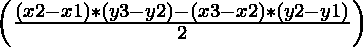

# 使用旋转卡尺法计算坐标平面上两点之间的最大距离

> 原文:[https://www . geesforgeks . org/坐标平面两点间最大距离-使用旋转卡尺-方法/](https://www.geeksforgeeks.org/maximum-distance-between-two-points-in-coordinate-plane-using-rotating-calipers-method/)

**先决条件:** [格拉汉姆扫描的凸包](https://www.geeksforgeeks.org/convex-hull-set-2-graham-scan/)[方位](https://www.geeksforgeeks.org/orientation-3-ordered-points/)。
给定坐标平面中的一组 **N** 点，任务是找出给定平面组中任意两点之间的最大距离。

**示例:**

> **输入:** n = 4，点:(0，3)，(3，0)，(0，0)，(1，1)
> **输出:**最大距离= 4.24264
> **说明:**
> 它们之间距离最大的点是(0，3)和(3，0)
> 
> **输入:** n = 5，点:(4，0)，(0，2)，(-1，-7)，(1，10)，(2，-3)
> **输出:**最大距离= 17.11724
> **说明:**
> 它们之间距离最大的点是(-1，7)和(1，10)

**天真的做法:**天真的想法是从给定的集合中尝试每一对可能的点，并计算每一对点之间的距离，然后打印所有对点之间的最大距离。

下面是上述方法的实现:

## C++

```
#include <bits/stdc++.h>
using namespace std;

// Function calculates distance
// between two points
long dist(pair<long, long> p1,
          pair<long, long> p2)
{
    long x0 = p1.first - p2.first;
    long y0 = p1.second - p2.second;
    return x0 * x0 + y0 * y0;
}

// Function to find the maximum
// distance between any two points
double maxDist(pair<long, long> p[], int n)
{
    double Max = 0;

    // Iterate over all possible pairs
    for(int i = 0; i < n; i++)
    {
        for(int j = i + 1; j < n; j++)
        {

            // Update max
            Max = max(Max, (double)dist(p[i],
                                        p[j]));
        }
    }

    // Return actual distance
    return sqrt(Max);
}

// Driver code  
int main()
{

    // Number of points
    int n = 5;

    pair<long, long> p[n];

    // Given points
    p[0].first = 4, p[0].second = 0;
    p[1].first = 0, p[1].second = 2;
    p[2].first = -1, p[2].second = -7;
    p[3].first = 1, p[3].second = 10;
    p[4].first = 2, p[4].second = -3;

    // Function call
    cout << fixed << setprecision(14)
         << maxDist(p, n) <<endl;

    return 0;
}

// This code is contributed by divyeshrabadiya07
```

## Java 语言(一种计算机语言，尤用于创建网站)

```
import java.awt.*;
import java.util.ArrayList;

public class Main {

    // Function calculates distance
    // between two points
    static long dist(Point p1, Point p2)
    {
        long x0 = p1.x - p2.x;
        long y0 = p1.y - p2.y;
        return x0 * x0 + y0 * y0;
    }

    // Function to find the maximum
    // distance between any two points
    static double maxDist(Point p[])
    {
        int n = p.length;
        double max = 0;

        // Iterate over all possible pairs
        for (int i = 0; i < n; i++) {

            for (int j = i + 1; j < n; j++) {

                // Update max
                max = Math.max(max,
                               dist(p[i],
                                    p[j]));
            }
        }

        // Return actual distance
        return Math.sqrt(max);
    }

    // Driver Code
    public static void main(String[] args)
    {
        // Number of points
        int n = 5;

        Point p[] = new Point[n];

        // Given points
        p[0] = new Point(4, 0);
        p[1] = new Point(0, 2);
        p[2] = new Point(-1, -7);
        p[3] = new Point(1, 10);
        p[4] = new Point(2, -3);

        // Function Call
        System.out.println(maxDist(p));
    }
}
```

## 蟒蛇 3

```
from math import sqrt

# Function calculates distance
# between two points
def dist(p1, p2):

    x0 = p1[0] - p2[0]
    y0 = p1[1] - p2[1]
    return x0 * x0 + y0 * y0

# Function to find the maximum
# distance between any two points
def maxDist(p):

    n = len(p)
    maxm = 0

    # Iterate over all possible pairs
    for i in range(n):
        for j in range(i + 1, n):

            # Update maxm
            maxm = max(maxm, dist(p[i], p[j]))

    # Return actual distance
    return sqrt(maxm)

# Driver Code
if __name__ == '__main__':

    # Number of points
    n = 5

    p = []

    # Given points
    p.append([4, 0])
    p.append([0, 2])
    p.append([-1, -7])
    p.append([1, 10])
    p.append([2, -3])

    # Function Call
    print(maxDist(p))

# This code is contributed by mohit kumar 29
```

## C#

```
using System;
class GFG {

    // Function calculates distance
    // between two points
    static long dist(Tuple<int, int> p1, Tuple<int, int> p2)
    {
        long x0 = p1.Item1 - p2.Item1;
        long y0 = p1.Item2 - p2.Item2;
        return x0 * x0 + y0 * y0;
    }

    // Function to find the maximum
    // distance between any two points
    static double maxDist(Tuple<int, int>[] p)
    {
        int n = p.Length;
        double max = 0;

        // Iterate over all possible pairs
        for (int i = 0; i < n; i++) {

            for (int j = i + 1; j < n; j++) {

                // Update max
                max = Math.Max(max, dist(p[i],p[j]));
            }
        }

        // Return actual distance
        return Math.Sqrt(max);
    }

  // Driver code
  static void Main() {

        // Given points
        Tuple<int, int>[] p =
        {
            Tuple.Create(4, 0),
            Tuple.Create(0, 2),
            Tuple.Create(-1, -7),
            Tuple.Create(1, 10),
            Tuple.Create(2, -3),
        };

        // Function Call
        Console.WriteLine(maxDist(p));
  }
}

// This code is contributed by divyesh072019
```

## java 描述语言

```
<script>
      // Function calculates distance
      // between two points
      function dist(p1, p2) {
        var x0 = p1[0] - p2[0];
        var y0 = p1[1] - p2[1];
        return x0 * x0 + y0 * y0;
      }
      // Function to find the maximum
      // distance between any two points
      function maxDist(p) {
        var n = p.length;
        var maxm = 0;

        // Iterate over all possible pairs
        for (let i = 0; i < n; i++) {
          for (let j = i + 1; j < n; j++) {
            // Update maxm
            maxm = Math.max(maxm, dist(p[i], p[j]));
          }
        }
        // Return actual distance
        return Math.sqrt(maxm);
      }
      // Driver Code
      // Number of points
      var n = 5;

      var p = [];

      // Given points
      p.push([4, 0]);
      p.push([0, 2]);
      p.push([-1, -7]);
      p.push([1, 10]);
      p.push([2, -3]);

      // Function Call
      document.write(maxDist(p));
    </script>
```

**Output:** 

```
17.11724276862369
```

***时间复杂度:** O(N <sup>2</sup> ，其中 N 为积分总数。*
***辅助空间:** O(1)*

**有效方法:**上述简单方法可以使用**旋转卡尺法**进行优化。

> **旋转卡尺**是一种解决计算几何领域大量问题的方法。它类似于围绕多边形凸包外侧旋转可调测径器的想法。最初，发明这种方法是为了计算凸多边形的直径。它还可以用来计算两个凸多边形之间的最小和最大距离、凸多边形的交点、多边形中两点之间的最大距离等等。

为了实现上述方法，我们将使用[凸包](https://www.geeksforgeeks.org/convex-hull-set-1-jarviss-algorithm-or-wrapping/)的概念。在我们开始进一步讨论最佳方法之前，我们需要了解以下内容:

*   **三角形的无符号面积:**如果给我们三个点 **P1(x1，y1)，P2(x2，y2)** 和 **P3(x3，y3)** 那么



*   是三角形的有符号区域。如果面积是正的，那么三个点是顺时针方向，否则它们是逆时针方向，如果面积等于零，那么这些点是共线的。如果我们取**绝对值**，那么这将代表三角形的无符号面积。这里，无符号基本上是指没有方向的面积，即我们只需要面积的相对绝对值。因此，我们可以从公式中去掉(1/2)。因此，

> 三角形的相对面积=**ABS((x2-x1)*(y3-y2)-(x3-x2)*(y2-y1))**

*   **对跖点:**是那些完全相反的点。但对我们来说，对跖点是凸多边形中相互距离最远的点。如果我们从给定的集合中选择一个点，那么这个点只有当且仅当我们能从给定的集合中找到它的对跖点时，才能达到它的最大距离。

以下是步骤:

1.  具有最大距离的两个点必须位于由给定集合形成的凸多边形的边界上。因此，使用 [Graham Scan 的凸包](https://www.geeksforgeeks.org/convex-hull-set-2-graham-scan/)方法以逆时针顺序排列点。
2.  我们有 **N** 个点，最初从点 **P1** 开始，包括给定点集中的那些点，这样区域的面积总是通过包括集合中的任何点而增加。
3.  从点 **P1** 开始，选择 **K = 2** 并增加 **K** ，而**区域(PN，P1，PK)** 则在增加并停止后才开始减少。现在当前点 **PK** 可能是 **P1** 的对跖点。同样，通过找到**区域(P1、P2、PK)** 并从我们之前停止的位置递增 **K** 来找到 p2 的对跖点，以此类推。
4.  保持更新每个对跖点的最大距离发生在上述步骤中，因为初始点和包含区域的点之间的距离是最大的。

下面是上述方法的实现:

## Java 语言(一种计算机语言，尤用于创建网站)

```
// Java Program for the above approach
import java.awt.*;
import java.util.*;
import java.util.Map.Entry;

public class Main {

    // Function to detect the orientation
    static int orientation(Point p,
                           Point q,
                           Point r)
    {
        int x = area(p, q, r);

        // If area > 0 then
        // points are clockwise
        if (x > 0) {
            return 1;
        }

        // If area<0 then
        // points are counterclockwise
        if (x < 0) {
            return -1;
        }

        // If area is 0 then p, q
        // and r are co-linear
        return 0;
    }

    // Function to find the area
    static int area(Point p, Point q, Point r)
    {
        // 2*(area of triangle)
        return ((p.y - q.y) * (q.x - r.x)
                - (q.y - r.y) * (p.x - q.x));
    }

    // Function to find the absolute Area
    static int absArea(Point p,
                       Point q, Point r)
    {
        // Unsigned area
        // 2*(area of triangle)
        return Math.abs(area(p, q, r));
    }

    // Function to find the distance
    static int dist(Point p1, Point p2)
    {
        // squared-distance b/w
        // p1 and p2 for precision
        return ((p1.x - p2.x) * (p1.x - p2.x)
                + (p1.y - p2.y) * (p1.y - p2.y));
    }

    // Function to implement Convex Hull
    // Approach
    static ArrayList<Point>
    convexHull(Point points[])
    {
        int n = points.length;

        Point min = new Point(Integer.MAX_VALUE,
                              Integer.MAX_VALUE);

        // Choose point having min.
        // y-coordinate and if two points
        // have same y-coordinate choose
        // the one with minimum x-coordinate
        int ind = -1;

        // Iterate Points[]
        for (int i = 0; i < n; i++) {
            if (min.y > points[i].y) {
                min.y = points[i].y;
                min.x = points[i].x;
                ind = i;
            }
            else if (min.y == points[i].y
                     && min.x > points[i].x) {
                min.x = points[i].x;
                ind = i;
            }
        }
        points[ind] = points[0];
        points[0] = min;

        // Sort points which have
        // minimum polar angle wrt
        // Point min
        Arrays.sort(points, 1, n,
                    new Comparator<Point>() {

                        @Override
                        public int compare(Point o1,
                                           Point o2)
                        {

                            int o = orientation(min, o1, o2);

                            // If points are co-linear
                            // choose the one having smaller
                            // distance with min first.
                            if (o == 0) {
                                return dist(o1, min)
                                    - dist(o2, min);
                            }

                            // If clockwise then swap
                            if (o == 1) {
                                return 1;
                            }

                            // If anticlockwise then
                            // don't swap
                            return -1;
                        }
                    });

        Stack<Point> st = new Stack<>();

        // First hull point
        st.push(points[0]);

        int k;
        for (k = 1; k < n - 1; k++) {
            if (orientation(points[0],
                            points[k],
                            points[k + 1])
                != 0)
                break;
        }

        // Second hull point
        st.push(points[k]);

        for (int i = k + 1; i < n; i++) {
            Point top = st.pop();

            while (orientation(st.peek(),
                               top,
                               points[i])
                   >= 0) {
                top = st.pop();
            }

            st.push(top);
            st.push(points[i]);
        }

        ArrayList<Point> hull
            = new ArrayList<>();

        // Iterate stack and add node to hull
        for (int i = 0; i < st.size(); i++) {
            hull.add(st.get(i));
        }
        return hull;
    }

    // Function to find the maximum
    // distance between any two points
    // from a set of given points
    static double
    rotatingCaliper(Point points[])
    {
        // Takes O(n)
        ArrayList<Point> convexHull
            = convexHull(points);
        int n = convexHull.size();

        // Convex hull point in counter-
        // clockwise order
        Point hull[] = new Point[n];
        n = 0;

        while (n < convexHull.size()) {
            hull[n] = convexHull.get(n++);
        }

        // Base Cases
        if (n == 1)
            return 0;
        if (n == 2)
            return Math.sqrt(dist(hull[0], hull[1]));
        int k = 1;

        // Find the farthest vertex
        // from hull[0] and hull[n-1]
        while (absArea(hull[n - 1],
                       hull[0],
                       hull[(k + 1) % n])
               > absArea(hull[n - 1],
                         hull[0],
                         hull[k])) {
            k++;
        }

        double res = 0;

        // Check points from 0 to k
        for (int i = 0, j = k;
             i <= k && j < n; i++) {
            res = Math.max(res,
                           Math.sqrt((double)dist(hull[i],
                                                  hull[j])));

            while (j < n
                   && absArea(hull[i],
                              hull[(i + 1) % n],
                              hull[(j + 1) % n])
                          > absArea(hull[i],
                                    hull[(i + 1) % n],
                                    hull[j])) {

                // Update res
                res = Math.max(
                    res,
                    Math.sqrt(dist(hull[i],
                                   hull[(j + 1) % n])));
                j++;
            }
        }

        // Return the result distance
        return res;
    }

    // Driver Code
    public static void main(String[] args)
    {
        // Total points
        int n = 5;
        Point p[] = new Point[n];

        // Given Points
        p[0] = new Point(4, 0);
        p[1] = new Point(0, 2);
        p[2] = new Point(-1, -7);
        p[3] = new Point(1, 10);
        p[4] = new Point(2, -3);

        // Function Call
        System.out.println(rotatingCaliper(p));
    }
}
```

**Output:** 

```
17.11724276862369
```

**时间复杂度:***O(N * log N)*
T5】辅助空间: *O(N)*