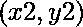

# 通过单个点的最大不同线

> 原文:[https://www . geesforgeks . org/maximum-distinct-line-passing-through-a-单点/](https://www.geeksforgeeks.org/maximum-distinct-lines-passing-through-a-single-point/)

给定两点和代表的线。任务是在不叠加(或覆盖)任何其他线的情况下，找到可以通过单个点的最大行数。我们可以移动任何线，但不能旋转它。
**示例:**

```
Input : Line 1 : x1 = 1, y1 = 1, x2 = 2, y2 = 2
        Line 2 : x2 = 2, y1 = 2, x2 = 4, y2 = 10
Output : 2
There are two lines. These two lines are not 
parallel, so both of them will pass through
a single point.

Input : Line 1 : x1 = 1, y1 = 5, x2 = 1, y2 = 10
        Line 2 : x2 = 5, y1 = 1, x2 = 10, y2 = 1
Output : 2
```

*   将直线表示成对，其中直线可以表示为，称为直线斜率形式。我们现在可以看到，我们可以为任何线路更改 **c** ，但是不能修改 **m** 。
*   假设 **(c1 ≠ c2)** ，具有相同的 **m** 平行值的线。同样，没有两条平行线能在不相互叠加的情况下穿过同一点。
*   因此，我们的问题简化为从给定的一组直线中找到不同的斜率值。

我们可以将一条线的斜率计算为，将它们添加到一个集合中，并计算集合中斜率的不同值的数量。但是我们必须分别处理垂直线。
所以，如果那么，**斜率= INT_MAX** 。
否则，**斜率=** 。
以下是实施办法。

## C++

```
// C++ program to find maximum number of lines
// which can pass through a single point
#include <bits/stdc++.h>
using namespace std;

// function to find maximum lines which passes
// through a single point
int maxLines(int n, int x1[], int y1[],
                int x2[], int y2[])
{
    unordered_set<double> s;

    double slope;
    for (int i = 0; i < n; ++i) {
        if (x1[i] == x2[i])
            slope = INT_MAX;
        else
            slope = (y2[i] - y1[i]) * 1.0
                    / (x2[i] - x1[i]) * 1.0;

        s.insert(slope);
    }

    return s.size();
}

// Driver program
int main()
{
    int n = 2, x1[] = { 1, 2 }, y1[] = { 1, 2 },
            x2[] = { 2, 4 }, y2[] = { 2, 10 };
    cout << maxLines(n, x1, y1, x2, y2);
    return 0;
}
// This code is written by
// Sanjit_Prasad
```

## Java 语言(一种计算机语言，尤用于创建网站)

```
// Java program to find maximum number of lines
// which can pass through a single point

import java.util.*;
import java.lang.*;
import java.io.*;

class GFG{

// function to find maximum lines which passes
// through a single point
static int maxLines(int n, int x1[], int y1[],
                    int x2[], int y2[])
{
    Set<Double> s=new HashSet<Double>();

    double slope;
    for (int i = 0; i < n; ++i) {
        if (x1[i] == x2[i])
            slope = Integer.MAX_VALUE;
        else
            slope = (y2[i] - y1[i]) * 1.0
                    / (x2[i] - x1[i]) * 1.0;

        s.add(slope);
    }

    return s.size();
}

// Driver program
public static void main(String args[])
{
    int n = 2, x1[] = { 1, 2 }, y1[] = { 1, 2 },
            x2[] = { 2, 4 }, y2[] = { 2, 10 };
    System.out.print(maxLines(n, x1, y1, x2, y2));
}
}
// This code is written by
// Subhadeep
```

## 蟒蛇 3

```
# Python3 program to find maximum number
# of lines which can pass through a
# single point
import sys
# function to find maximum lines
# which passes through a single point
def maxLines(n, x1, y1, x2, y2):

    s = [];

    slope=sys.maxsize;
    for i in range(n):
        if (x1[i] == x2[i]):
            slope = sys.maxsize;
        else:
            slope = (y2[i] - y1[i]) * 1.0 /(x2[i] - x1[i]) * 1.0;

        s.append(slope);

    return len(s);

# Driver Code
n = 2;
x1 = [ 1, 2 ];
y1 = [1, 2];
x2 = [2, 4];
y2 = [2, 10];
print(maxLines(n, x1, y1, x2, y2));

# This code is contributed by mits
```

## C#

```
// C# program to find maximum number of lines
// which can pass through a single point
using System;
using System.Collections.Generic;

class GFG
{

// function to find maximum lines which passes
// through a single point
static int maxLines(int n, int []x1, int []y1,
                    int []x2, int []y2)
{
    HashSet<Double> s = new HashSet<Double>();

    double slope;
    for (int i = 0; i < n; ++i)
    {
        if (x1[i] == x2[i])
            slope = int.MaxValue;
        else
            slope = (y2[i] - y1[i]) * 1.0
                    / (x2[i] - x1[i]) * 1.0;

        s.Add(slope);
    }

    return s.Count;
}

// Driver code
public static void Main()
{
    int n = 2;
    int []x1 = { 1, 2 }; int []y1 = { 1, 2 };
    int []x2 = { 2, 4 }; int []y2 = { 2, 10 };
    Console.Write(maxLines(n, x1, y1, x2, y2));
}
}

/* This code contributed by PrinciRaj1992 */
```

## 服务器端编程语言（Professional Hypertext Preprocessor 的缩写）

```
<?php
// PHP program to find maximum number
// of lines which can pass through a
// single point

// function to find maximum lines
// which passes through a single point
function maxLines($n, $x1, $y1, $x2, $y2)
{
    $s = array();

    $slope;
    for ($i = 0; $i < $n; ++$i)
    {
        if ($x1[$i] == $x2[$i])
            $slope = PHP_INT_MAX;
        else
            $slope = ($y2[$i] - $y1[$i]) * 1.0 /
                     ($x2[$i] - $x1[$i]) * 1.0;

        array_push($s, $slope);
    }

    return count($s);
}

// Driver Code
$n = 2;
$x1 = array( 1, 2 );
$y1 = array(1, 2);
$x2 = array(2, 4);
$y2 = array(2, 10);
echo maxLines($n, $x1, $y1, $x2, $y2);

// This code is contributed by mits
?>
```

## java 描述语言

```
<script>
     // JavaScript program to find maximum number
     // of lines which can pass through a
     // single point
     // function to find maximum lines
     // which passes through a single point
     function maxLines(n, x1, y1, x2, y2) {
       var s = [];

       //Max Integer Value
       var slope = 2147483647;

       for (let i = 0; i < n; i++) {
         if (x1[i] === x2[i]) slope = 2147483647;
         else slope = (((y2[i] - y1[i]) * 1.0) / (x2[i] - x1[i])) * 1.0;

         s.push(slope);
       }
       return s.length;
     }
     // Driver Code
     var n = 2;
     var x1 = [1, 2];
     var y1 = [1, 2];
     var x2 = [2, 4];
     var y2 = [2, 10];
     document.write(maxLines(n, x1, y1, x2, y2));
   </script>
```

**Output:** 

```
2
```

**时间复杂度:** 