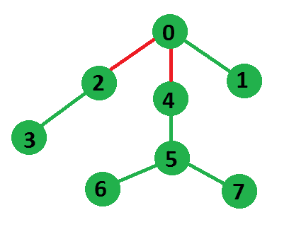

# 从树上移除最大边缘，使森林变得均匀

> 原文:[https://www . geesforgeks . org/maximum-edge-remove-tree-make-even-forest/](https://www.geeksforgeeks.org/maximum-edge-removal-tree-make-even-forest/)

给定一棵有偶数个顶点的无向树，我们需要从这棵树上去掉最大数量的边，这样得到的森林的每个连通部分都有偶数个顶点。

示例:



```
In above shown tree, we can remove at max 2 
edges 0-2 and 0-4 shown in red such that each
connected component will have even number of
vertices.
```

因为我们需要具有偶数个顶点的连接组件，所以当我们获得一个组件时，我们可以移除将它连接到剩余树的边，并且我们将剩下具有偶数个顶点的树，这将是相同的问题，但是尺寸较小，我们必须重复该算法，直到剩余树不能以上述方式进一步分解。

我们将使用 [DFS](https://www.geeksforgeeks.org/depth-first-traversal-for-a-graph/) 遍历树，这将返回当前节点为根的组件中的顶点数。如果一个节点从它的一个子节点得到偶数个顶点，那么从那个节点到它的子节点的边将被移除，结果将增加 1，如果返回的数是奇数，那么我们将把它加到组件的顶点数上，如果当前节点是它的根。

```
1) Do DFS from any starting node as tree
is connected.

2) Initialize count of nodes in subtree rooted
under current node as 0.

3) Do following recursively for every subtree
of current node.
    a) If size of current subtree is even,
       increment result by 1 as we can 
       disconnect the subtree.
    b) Else add count of nodes in current 
       subtree to current count.
```

请参见下面的代码，以便更好地理解，

## C++14

```
/* Program to get maximum number of edges which
   can be removed such that each connected component
   of this tree will have an even number of vertices */
#include <bits/stdc++.h>
using namespace std;

// Utility method to do DFS of the graph and count edge
// deletion for even forest
int dfs(vector<int> g[], int u, bool visit[], int& res)
{
    visit[u] = true;
    int currComponentNode = 0;

    //  iterate over all neighbor of node u
    for (int i = 0; i < g[u].size(); i++)
    {
        int v = g[u][i];
        if (!visit[v])
        {
            // Count the number of nodes in a subtree
            int subtreeNodeCount = dfs(g, v, visit, res);

            // if returned node count is even, disconnect
            // the subtree and increase result by one.
            if (subtreeNodeCount % 2 == 0)
                res++;

            //  else add subtree nodes in current component
            else
                currComponentNode += subtreeNodeCount;
        }
    }

    // number of nodes in current component and one for
    // current node
    return (currComponentNode + 1);
}

/*  method returns max edge that we can remove, after which
    each  connected component will have even number of
    vertices */
int maxEdgeRemovalToMakeForestEven(vector<int> g[], int N)
{
    // Create a visited array for DFS and make all nodes
    // unvisited in starting
    bool visit[N + 1];
    for (int i = 0; i <= N; i++)
        visit[i] = false;

    int res = 0; // Passed as reference

    //  calling the dfs from node-0
    dfs(g, 0, visit, res);

    return res;
}

// Utility function to add an undirected edge (u,v)
void addEdge(vector<int> g[], int u, int v)
{
    g[u].push_back(v);
    g[v].push_back(u);
}

//  Driver code to test above methods
int main()
{
    int edges[][2] = {{0, 2}, {0, 1}, {0, 4},
                      {2, 3}, {4, 5}, {5, 6},
                      {5, 7}};
    int N = sizeof(edges)/sizeof(edges[0]);
    vector<int> g[N + 1];
    for (int i = 0; i < N; i++)
         addEdge(g, edges[i][0], edges[i][1]);

    cout << maxEdgeRemovalToMakeForestEven(g, N);
    return 0;
}
```

## Java 语言(一种计算机语言，尤用于创建网站)

```
/* Program to get maximum number of edges which
can be removed such that each connected component
of this tree will have an even number of vertices */
import java.util.*;
class GFG
{

// graph
static Vector<Vector<Integer>> g = new Vector<Vector<Integer>>();

static int res;

// Utility method to do DFS of the graph and count edge
// deletion for even forest
static int dfs( int u, boolean visit[])
{
    visit[u] = true;
    int currComponentNode = 0;

    // iterate over all neighbor of node u
    for (int i = 0; i < g.get(u).size(); i++)
    {
        int v = g.get(u).get(i);
        if (!visit[v])
        {
            // Count the number of nodes in a subtree
            int subtreeNodeCount = dfs(v, visit);

            // if returned node count is even, disconnect
            // the subtree and increase result by one.
            if (subtreeNodeCount % 2 == 0)
                res++;

            // else add subtree nodes in current component
            else
                currComponentNode += subtreeNodeCount;
        }
    }

    // number of nodes in current component and one for
    // current node
    return (currComponentNode + 1);
}

/* method returns max edge that we can remove, after which
    each connected component will have even number of
    vertices */
static int maxEdgeRemovalToMakeForestEven( int N)
{
    // Create a visited array for DFS and make all nodes
    // unvisited in starting
    boolean visit[]=new boolean[N + 1];
    for (int i = 0; i <= N; i++)
        visit[i] = false;

    res = 0; // Passed as reference

    // calling the dfs from node-0
    dfs(0, visit);

    return res;
}

// Utility function to add an undirected edge (u,v)
static void addEdge( int u, int v)
{
    g.get(u).add(v);
    g.get(v).add(u);
}

// Driver code to test above methods
public static void main(String args[])
{
    int edges[][] = {{0, 2}, {0, 1}, {0, 4},
                    {2, 3}, {4, 5}, {5, 6},
                    {5, 7}};
    int N = edges.length;

    for (int i = 0; i < N+1; i++)
    g.add(new Vector<Integer>());

    for (int i = 0; i < N; i++)
        addEdge( edges[i][0], edges[i][1]);

    System.out.println(maxEdgeRemovalToMakeForestEven( N));
}
}

// This code is contributed by Arnab Kundu
```

## 蟒蛇 3

```
# Python3 program to get maximum number of
# edges which can be removed such that each
# connected component of this tree will
# have an even number of vertices
from typing import List

# Utility method to do DFS of the graph
# and count edge deletion for even forest
def dfs(u: int, visit: List[bool]) -> int:

    global res, g

    visit[u] = True
    currComponentNode = 0

    # Iterate over all neighbor of node u
    for i in range(len(g[u])):
        v = g[u][i]

        if (not visit[v]):

            # Count the number of nodes in a subtree
            subtreeNodeCount = dfs(v, visit)

            # If returned node count is even, disconnect
            # the subtree and increase result by one.
            if (subtreeNodeCount % 2 == 0):
                res += 1

            # Else add subtree nodes in
            # current component
            else:
                currComponentNode += subtreeNodeCount

    # Number of nodes in current component
    # and one for current node
    return (currComponentNode + 1)

# Method returns max edge that we can remove,
# after which each connected component will
# have even number of vertices
def maxEdgeRemovalToMakeForestEven(N: int) -> int:

    # Create a visited array for DFS and make
    # all nodes unvisited in starting
    visit = [False for _ in range(N + 1)]

    # Calling the dfs from node-0
    dfs(0, visit)

    return res

# Utility function to add an undirected edge (u,v)
def addEdge(u: int, v: int) -> None:

    global g

    g[u].append(v)
    g[v].append(u)

#  Driver code
if __name__ == "__main__":

    res = 0
    edges = [ [ 0, 2 ], [ 0, 1 ],
              [ 0, 4 ], [ 2, 3 ],
              [ 4, 5 ], [ 5, 6 ],
              [ 5, 7 ] ]
    N = len(edges)
    g = [[] for _ in range(N + 1)]

    for i in range(N):
        addEdge(edges[i][0], edges[i][1])

    print(maxEdgeRemovalToMakeForestEven(N))

# This code is contributed by sanjeev2552
```

## C#

```
/* C# Program to get maximum number of edges which
can be removed such that each connected component
of this tree will have an even number of vertices */
using System;
using System.Collections.Generic;

class GFG
{

// graph
static List<List<int>> g = new List<List<int>>();

static int res;

// Utility method to do DFS of the graph and
// count edge deletion for even forest
static int dfs( int u, bool []visit)
{
    visit[u] = true;
    int currComponentNode = 0;

    // iterate over all neighbor of node u
    for (int i = 0; i < g[u].Count; i++)
    {
        int v = g[u][i];
        if (!visit[v])
        {
            // Count the number of nodes in a subtree
            int subtreeNodeCount = dfs(v, visit);

            // if returned node count is even, disconnect
            // the subtree and increase result by one.
            if (subtreeNodeCount % 2 == 0)
                res++;

            // else add subtree nodes in current component
            else
                currComponentNode += subtreeNodeCount;
        }
    }

    // number of nodes in current component and one for
    // current node
    return (currComponentNode + 1);
}

/* method returns max edge that we can remove,
after which each connected component
will have even number of vertices */
static int maxEdgeRemovalToMakeForestEven( int N)
{
    // Create a visited array for DFS and
    // make all nodes unvisited in starting
    bool []visit = new bool[N + 1];
    for (int i = 0; i <= N; i++)
        visit[i] = false;

    res = 0; // Passed as reference

    // calling the dfs from node-0
    dfs(0, visit);

    return res;
}

// Utility function to add an undirected edge (u,v)
static void addEdge( int u, int v)
{
    g[u].Add(v);
    g[v].Add(u);
}

// Driver code
public static void Main(String []args)
{
    int [,]edges = {{0, 2}, {0, 1}, {0, 4},
                    {2, 3}, {4, 5}, {5, 6},
                    {5, 7}};
    int N = edges.GetLength(0);

    for (int i = 0; i < N + 1; i++)
    g.Add(new List<int>());

    for (int i = 0; i < N; i++)
        addEdge(edges[i, 0], edges[i, 1]);

    Console.WriteLine(maxEdgeRemovalToMakeForestEven(N));
}
}

// This code is contributed by 29AjayKumar
```

## java 描述语言

```
<script>

/* Program to get maximum number of edges which
can be removed such that each connected component
of this tree will have an even number of vertices */

// graph
let g = [];
let res;

// Utility method to do DFS of the graph and count edge
// deletion for even forest
function dfs(u,visit)
{
    visit[u] = true;
    let currComponentNode = 0;

    // iterate over all neighbor of node u
    for (let i = 0; i < g[u].length; i++)
    {
        let v = g[u][i];
        if (!visit[v])
        {
            // Count the number of nodes in a subtree
            let subtreeNodeCount = dfs(v, visit);

            // if returned node count is even, disconnect
            // the subtree and increase result by one.
            if (subtreeNodeCount % 2 == 0)
                res++;

            // else add subtree nodes in current component
            else
                currComponentNode += subtreeNodeCount;
        }
    }

    // number of nodes in current component and one for
    // current node
    return (currComponentNode + 1);
}

/* method returns max edge that we can remove, after which
    each connected component will have even number of
    vertices */
function maxEdgeRemovalToMakeForestEven(N)
{
    // Create a visited array for DFS and make all nodes
    // unvisited in starting
    let visit=new Array(N + 1);
    for (let i = 0; i <= N; i++)
        visit[i] = false;

    res = 0; // Passed as reference

    // calling the dfs from node-0
    dfs(0, visit);

    return res;
}

// Utility function to add an undirected edge (u,v)
function addEdge(u,v)
{
     g[u].push(v);
    g[v].push(u);
}

// Driver code to test above methods
let edges=[[0, 2], [0, 1], [0, 4],
                    [2, 3], [4, 5], [5, 6],
                    [5, 7]];
let N = edges.length;
for (let i = 0; i < N+1; i++)
    g.push([]);

for (let i = 0; i < N; i++)
    addEdge( edges[i][0], edges[i][1]);

document.write(maxEdgeRemovalToMakeForestEven( N));

// This code is contributed by rag2127

</script>
```

**输出:**

```
2
```

**时间复杂度:** O(n)，其中 n 为树中节点数。

本文由 [**乌卡什·特里维迪**](https://in.linkedin.com/in/utkarsh-trivedi-253069a7) 供稿。如果你喜欢 GeeksforGeeks 并想投稿，你也可以使用[write.geeksforgeeks.org](https://write.geeksforgeeks.org)写一篇文章或者把你的文章邮寄到 review-team@geeksforgeeks.org。看到你的文章出现在极客博客主页上，帮助其他极客。
如果发现有不正确的地方，或者想分享更多关于上述话题的信息，请写评论。