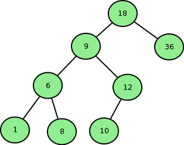

# BST 两个节点之间的最大元素

> 原文:[https://www . geesforgeks . org/maximum-element-two-nodes-BST/](https://www.geeksforgeeks.org/maximum-element-two-nodes-bst/)

给定一个由 **N** 个元素和两个整数 **A，B** 组成的数组，它们属于给定的数组。通过将元素从 arr[0]插入 arr[n-1]来创建二叉查找树。任务是在从 A 到 b 的路径中找到最大元素。
**示例:**

```
Input : arr[] = { 18, 36, 9, 6, 12, 10, 1, 8 }, 
        a = 1, 
        b = 10.
Output : 12
```



从 1 到 10 的路径包含{ 1，6，9，12，10 }。最大元素为 12。

想法是找到节点‘a’和节点‘b’的[最低共同祖先](https://www.geeksforgeeks.org/lowest-common-ancestor-in-a-binary-search-tree/)。然后搜索 LCA 和‘a’之间的最大节点，也找到 LCA 和‘b’之间的最大节点。答案将是最大两个节点。

## C++

```
// C++ program to find maximum element in the path
// between two Nodes of Binary Search Tree.
#include <bits/stdc++.h>
using namespace std;

struct Node
{
    struct Node *left, *right;
    int data;
};

// Create and return a pointer of new Node.
Node *createNode(int x)
{
    Node *p = new Node;
    p -> data = x;
    p -> left = p -> right = NULL;
    return p;
}

// Insert a new Node in Binary Search Tree.
void insertNode(struct Node *root, int x)
{
    Node *p = root, *q = NULL;

    while (p != NULL)
    {
        q = p;
        if (p -> data < x)
            p = p -> right;
        else
            p = p -> left;
    }

    if (q == NULL)
        p = createNode(x);
    else
    {
        if (q -> data < x)
            q -> right = createNode(x);
        else
            q -> left = createNode(x);
    }
}

// Return the maximum element between a Node
// and its given ancestor.
int maxelpath(Node *q, int x)
{
    Node *p = q;

    int mx = INT_MIN;

    // Traversing the path between ansector and
    // Node and finding maximum element.
    while (p -> data != x)
    {
        if (p -> data > x)
        {
            mx = max(mx, p -> data);
            p = p -> left;
        }
        else
        {
            mx = max(mx, p -> data);
            p = p -> right;
        }
    }

    return max(mx, x);
}

// Return maximum element in the path between
// two given Node of BST.
int maximumElement(struct Node *root, int x, int y)
{
    Node *p = root;

    // Finding the LCA of Node x and Node y
    while ((x < p -> data && y < p -> data) ||
        (x > p -> data && y > p -> data))
    {
        // Checking if both the Node lie on the
        // left side of the parent p.
        if (x < p -> data && y < p -> data)
            p = p -> left;

        // Checking if both the Node lie on the
        // right side of the parent p.
        else if (x > p -> data && y > p -> data)
            p = p -> right;
    }

    // Return the maximum of maximum elements occur
    // in path from ancestor to both Node.
    return max(maxelpath(p, x), maxelpath(p, y));
}

// Driver Code
int main()
{
    int arr[] = { 18, 36, 9, 6, 12, 10, 1, 8 };
    int a = 1, b = 10;
    int n = sizeof(arr) / sizeof(arr[0]);

    // Creating the root of Binary Search Tree
    struct Node *root = createNode(arr[0]);

    // Inserting Nodes in Binary Search Tree
    for (int i = 1; i < n; i++)
        insertNode(root, arr[i]);

    cout << maximumElement(root, a, b) << endl;

    return 0;
}
```

## Java 语言(一种计算机语言，尤用于创建网站)

```
// Java program to find maximum element in the path
// between two Nodes of Binary Search Tree.
class Solution
{

static class Node
{
     Node left, right;
    int data;
}

// Create and return a pointer of new Node.
static Node createNode(int x)
{
    Node p = new Node();
    p . data = x;
    p . left = p . right = null;
    return p;
}

// Insert a new Node in Binary Search Tree.
static void insertNode( Node root, int x)
{
    Node p = root, q = null;

    while (p != null)
    {
        q = p;
        if (p . data < x)
            p = p . right;
        else
            p = p . left;
    }

    if (q == null)
        p = createNode(x);
    else
    {
        if (q . data < x)
            q . right = createNode(x);
        else
            q . left = createNode(x);
    }
}

// Return the maximum element between a Node
// and its given ancestor.
static int maxelpath(Node q, int x)
{
    Node p = q;

    int mx = -1;

    // Traversing the path between ansector and
    // Node and finding maximum element.
    while (p . data != x)
    {
        if (p . data > x)
        {
            mx = Math.max(mx, p . data);
            p = p . left;
        }
        else
        {
            mx = Math.max(mx, p . data);
            p = p . right;
        }
    }

    return Math.max(mx, x);
}

// Return maximum element in the path between
// two given Node of BST.
static int maximumElement( Node root, int x, int y)
{
    Node p = root;

    // Finding the LCA of Node x and Node y
    while ((x < p . data && y < p . data) ||
        (x > p . data && y > p . data))
    {
        // Checking if both the Node lie on the
        // left side of the parent p.
        if (x < p . data && y < p . data)
            p = p . left;

        // Checking if both the Node lie on the
        // right side of the parent p.
        else if (x > p . data && y > p . data)
            p = p . right;
    }

    // Return the maximum of maximum elements occur
    // in path from ancestor to both Node.
    return Math.max(maxelpath(p, x), maxelpath(p, y));
}

// Driver Code
public static void main(String args[])
{
    int arr[] = { 18, 36, 9, 6, 12, 10, 1, 8 };
    int a = 1, b = 10;
    int n =arr.length;

    // Creating the root of Binary Search Tree
     Node root = createNode(arr[0]);

    // Inserting Nodes in Binary Search Tree
    for (int i = 1; i < n; i++)
        insertNode(root, arr[i]);

    System.out.println( maximumElement(root, a, b) );

}
}
//contributed by Arnab Kundu
```

## 蟒蛇 3

```
# Python 3 program to find maximum element
# in the path between two Nodes of Binary
# Search Tree.

# Create and return a pointer of new Node.
class createNode:

    # Constructor to create a new node
    def __init__(self, data):
        self.data = data
        self.left = None
        self.right = None

# Insert a new Node in Binary Search Tree.
def insertNode(root, x):
    p, q = root, None

    while p != None:
        q = p
        if p.data < x:
            p = p.right
        else:
            p = p.left

    if q == None:
        p = createNode(x)
    else:
        if q.data < x:
            q.right = createNode(x)
        else:
            q.left = createNode(x)

# Return the maximum element between a
# Node and its given ancestor.
def maxelpath(q, x):
    p = q

    mx = -999999999999

    # Traversing the path between ansector
    # and Node and finding maximum element.
    while p.data != x:
        if p.data > x:
            mx = max(mx, p.data)
            p = p.left
        else:
            mx = max(mx, p.data)
            p = p.right

    return max(mx, x)

# Return maximum element in the path
# between two given Node of BST.
def maximumElement(root, x, y):
    p = root

    # Finding the LCA of Node x and Node y
    while ((x < p.data and y < p.data) or
           (x > p.data and y > p.data)):

        # Checking if both the Node lie on
        # the left side of the parent p.
        if x < p.data and y < p.data:
            p = p.left

        # Checking if both the Node lie on
        # the right side of the parent p.
        elif x > p.data and y > p.data:
            p = p.right

    # Return the maximum of maximum elements
    # occur in path from ancestor to both Node.
    return max(maxelpath(p, x), maxelpath(p, y))

# Driver Code
if __name__ == '__main__':
    arr = [ 18, 36, 9, 6, 12, 10, 1, 8]
    a, b = 1, 10
    n = len(arr)

    # Creating the root of Binary Search Tree
    root = createNode(arr[0])

    # Inserting Nodes in Binary Search Tree
    for i in range(1,n):
        insertNode(root, arr[i])

    print(maximumElement(root, a, b))

# This code is contributed by PranchalK
```

## C#

```
using System;

// C# program to find maximum element in the path
// between two Nodes of Binary Search Tree.
public class Solution
{

public class Node
{
     public Node left, right;
    public int data;
}

// Create and return a pointer of new Node.
public static Node createNode(int x)
{
    Node p = new Node();
    p.data = x;
    p.left = p.right = null;
    return p;
}

// Insert a new Node in Binary Search Tree.
public static void insertNode(Node root, int x)
{
    Node p = root, q = null;

    while (p != null)
    {
        q = p;
        if (p.data < x)
        {
            p = p.right;
        }
        else
        {
            p = p.left;
        }
    }

    if (q == null)
    {
        p = createNode(x);
    }
    else
    {
        if (q.data < x)
        {
            q.right = createNode(x);
        }
        else
        {
            q.left = createNode(x);
        }
    }
}

// Return the maximum element between a Node
// and its given ancestor.
public static int maxelpath(Node q, int x)
{
    Node p = q;

    int mx = -1;

    // Traversing the path between ansector and
    // Node and finding maximum element.
    while (p.data != x)
    {
        if (p.data > x)
        {
            mx = Math.Max(mx, p.data);
            p = p.left;
        }
        else
        {
            mx = Math.Max(mx, p.data);
            p = p.right;
        }
    }

    return Math.Max(mx, x);
}

// Return maximum element in the path between
// two given Node of BST.
public static int maximumElement(Node root, int x, int y)
{
    Node p = root;

    // Finding the LCA of Node x and Node y
    while ((x < p.data && y < p.data) || (x > p.data && y > p.data))
    {
        // Checking if both the Node lie on the
        // left side of the parent p.
        if (x < p.data && y < p.data)
        {
            p = p.left;
        }

        // Checking if both the Node lie on the
        // right side of the parent p.
        else if (x > p.data && y > p.data)
        {
            p = p.right;
        }
    }

    // Return the maximum of maximum elements occur
    // in path from ancestor to both Node.
    return Math.Max(maxelpath(p, x), maxelpath(p, y));
}

// Driver Code
public static void Main(string[] args)
{
    int[] arr = new int[] {18, 36, 9, 6, 12, 10, 1, 8};
    int a = 1, b = 10;
    int n = arr.Length;

    // Creating the root of Binary Search Tree
     Node root = createNode(arr[0]);

    // Inserting Nodes in Binary Search Tree
    for (int i = 1; i < n; i++)
    {
        insertNode(root, arr[i]);
    }

    Console.WriteLine(maximumElement(root, a, b));

}
}

  //  This code is contributed by Shrikant13
```

## java 描述语言

```
<script>

// JavaScript program to find
// maximum element in the path
// between two Nodes of Binary
// Search Tree.

     class Node {
            constructor(val) {
                this.data = val;
                this.left = null;
                this.right = null;
            }
        }

    // Create and return a pointer of new Node.
    function createNode(x) {
var p = new Node();
        p.data = x;
        p.left = p.right = null;
        return p;
    }

    // Insert a new Node in Binary Search Tree.
    function insertNode(root , x) {
       var p = root, q = null;

        while (p != null) {
            q = p;
            if (p.data < x)
                p = p.right;
            else
                p = p.left;
        }

        if (q == null)
            p = createNode(x);
        else {
            if (q.data < x)
                q.right = createNode(x);
            else
                q.left = createNode(x);
        }
    }

    // Return the maximum element between a Node
    // and its given ancestor.
    function maxelpath(q , x) {
        var p = q;

        var mx = -1;

        // Traversing the path between ansector and
        // Node and finding maximum element.
        while (p.data != x) {
            if (p.data > x) {
                mx = Math.max(mx, p.data);
                p = p.left;
            } else {
                mx = Math.max(mx, p.data);
                p = p.right;
            }
        }

        return Math.max(mx, x);
    }

    // Return maximum element in the path between
    // two given Node of BST.
    function maximumElement(root , x , y) {
     var p = root;

        // Finding the LCA of Node x and Node y
        while ((x < p.data && y < p.data) ||
        (x > p.data && y > p.data)) {
            // Checking if both the Node lie on the
            // left side of the parent p.
            if (x < p.data && y < p.data)
                p = p.left;

            // Checking if both the Node lie on the
            // right side of the parent p.
            else if (x > p.data && y > p.data)
                p = p.right;
        }

        // Return the maximum of maximum elements occur
        // in path from ancestor to both Node.
        return Math.max(maxelpath(p, x), maxelpath(p, y));
    }

    // Driver Code

        var arr = [ 18, 36, 9, 6, 12, 10, 1, 8 ];
        var a = 1, b = 10;
        var n = arr.length;

        // Creating the root of Binary Search Tree
        var root = createNode(arr[0]);

        // Inserting Nodes in Binary Search Tree
        for (i = 1; i < n; i++)
            insertNode(root, arr[i]);

        document.write(maximumElement(root, a, b));

// This code contributed by gauravrajput1

</script>
```

**输出:**

```
12
```

**时间复杂度:** O(h)其中 h 为 BST
的高度本文由 [**Anuj Chauhan**](https://www.facebook.com/anuj0503) 供稿。如果你喜欢 GeeksforGeeks 并想投稿，你也可以使用[write.geeksforgeeks.org](https://write.geeksforgeeks.org)写一篇文章或者把你的文章邮寄到 contribute@geeksforgeeks.org。看到你的文章出现在极客博客主页上，帮助其他极客。
如果发现有不正确的地方，或者想分享更多关于上述话题的信息，请写评论。