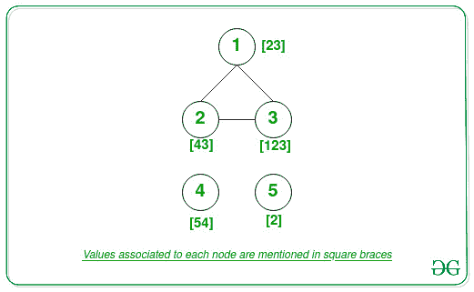

# 无向图的连通分支中所有节点的最大 GCD

> 原文:[https://www . geeksforgeeks . org/无向图中所有连接组件节点的最大 gcd/](https://www.geeksforgeeks.org/maximum-gcd-of-all-nodes-in-a-connected-component-of-an-undirected-graph/)

给定一个由 **V** 顶点和表示节点对之间的边的二维数组 **E[][2]** 组成的无向图[。给定另一个表示分配给每个节点的值的](https://www.geeksforgeeks.org/graph-data-structure-and-algorithms/)[数组](https://www.geeksforgeeks.org/introduction-to-arrays/) **arr[]** ，任务是在图中所有[连接组件的 GCD 中找到最大的](https://www.geeksforgeeks.org/connected-components-in-an-undirected-graph/) [GCD](https://www.geeksforgeeks.org/c-program-find-gcd-hcf-two-numbers/) 。

**示例:**

> **输入:** V = 5，E[][2] = {{1，3}，{2，3}，{1，2}}，arr[] = {23，43，123，54，2}
> **输出:** 54
> **解释:**
> 
> 
> 
> 连通分量{1，2，3}: GCD(arr[1]，arr[2]，arr[3]) = GCD(23，43，123) = 1。
> 连接组件{4}: GCD = 54。
> 连接组件{5}: GCD = 2。
> 因此，最大 GCD 为 54。
> 
> **输入:** V = 5，E = {{1，2}，{1，3}，{4，5}}，arr[] = { 10，10，10，15，15 }
> **输出:** 15

**方法:**给定的问题可以通过对给定的图执行[深度优先搜索](https://www.geeksforgeeks.org/connected-components-in-an-undirected-graph/)遍历，然后在所有连接的组件中找到最大的 GCD 来解决。按照以下步骤解决问题:

*   初始化一个变量，将**最大 GCD** 设为 [**INT_MIN**](https://www.geeksforgeeks.org/int_max-int_min-cc-applications/) ，以存储所有[连接组件](https://www.geeksforgeeks.org/strongly-connected-components/)中的最大 GCD。
*   初始化另一个变量，比如**current gtcd**为 **0** ，独立存储每个连接组件的 GCD。
*   将辅助数组**访问过的[]** 初始化为**假**，将访问过的节点存储在 [DFS 遍历](https://www.geeksforgeeks.org/depth-first-search-or-dfs-for-a-graph/)中。
*   在范围**【1，V】**内迭代每个顶点，并执行以下步骤:
    *   如果当前顶点未被访问，即**访问了【I】=假**，则将**当前顶点**初始化为 **0** 。
    *   用**current CDC**值从当前顶点执行 [DFS 遍历](https://www.geeksforgeeks.org/dfs-traversal-of-a-tree-using-recursion/)，并更新**current CDC**值作为每个[递归调用](https://www.geeksforgeeks.org/recursion/)中**current CDC**和**arr【I–1】**的 GCD。
    *   如果**current cdd**的值大于 **maxGCD** ，则更新 **maxGCD** 为**current cdd**。
*   完成以上步骤后，打印 **maxGCD** 的值作为结果。

下面是上述方法的实现:

## C++

```
// C++ program for the above approach
#include <bits/stdc++.h>
using namespace std;

// Function to find the  GCD of two
// numbers a and b
int gcd(int a, int b)
{
    // Base Case
    if (b == 0)
        return a;

    // Recursively find the GCD
    return gcd(b, a % b);
}

// Function to perform DFS Traversal
void depthFirst(int v, vector<int> graph[],
                vector<bool>& visited,
                int& currGCD,
                vector<int> values)
{
    // Mark the visited vertex as true
    visited[v] = true;

    // Update GCD of current
    // connected component
    currGCD = gcd(currGCD, values[v - 1]);

    // Traverse all adjacent nodes
    for (auto child : graph[v]) {

        if (visited[child] == false) {

            // Recursive call to perform
            // DFS traversal
            depthFirst(child, graph, visited,
                       currGCD, values);
        }
    }
}

// Function to find the maximum GCD
// of nodes among all the connected
// components of an undirected graph
void maximumGcd(int Edges[][2], int E,
                int V, vector<int>& arr)
{
    vector<int> graph[V + 1];

    // Traverse the edges
    for (int i = 0; i < E; i++) {

        int u = Edges[i][0];
        int v = Edges[i][1];

        graph[u].push_back(v);
        graph[v].push_back(u);
    }

    // Initialize boolean array
    // to mark visited vertices
    vector<bool> visited(V + 1, false);

    // Stores the maximum GCD value
    int maxGCD = INT_MIN;

    // Traverse all the vertices
    for (int i = 1; i <= V; i++) {

        // If node is not visited
        if (visited[i] == false) {

            // Stores GCD of current
            // connected component
            int currGCD = 0;

            // Perform DFS Traversal
            depthFirst(i, graph, visited,
                       currGCD, arr);

            // Update maxGCD
            if (currGCD > maxGCD) {
                maxGCD = currGCD;
            }
        }
    }

    // Print the result
    cout << maxGCD;
}

// Driver Code
int main()
{
    int E = 3, V = 5;
    vector<int> arr = { 23, 43, 123, 54, 2 };
    int Edges[][2] = { { 1, 3 }, { 2, 3 }, { 1, 2 } };

    maximumGcd(Edges, E, V, arr);

    return 0;
}
```

## Java 语言(一种计算机语言，尤用于创建网站)

```
// Java program for the above approach

import java.io.*;
import java.util.*;

class GFG {

  static int currGCD;

  // Function to find the  GCD of two
  // numbers a and b
  static int gcd(int a, int b)
  {
    // Base Case
    if (b == 0)
      return a;

    // Recursively find the GCD
    return gcd(b, a % b);
  }

  // Function to perform DFS Traversal
  static void depthFirst(int v,
                         ArrayList<Integer> graph[],
                         boolean visited[], int values[])
  {
    // Mark the visited vertex as true
    visited[v] = true;

    // Update GCD of current
    // connected component
    currGCD = gcd(currGCD, values[v - 1]);

    // Traverse all adjacent nodes
    for (int child : graph[v]) {

      if (visited[child] == false) {

        // Recursive call to perform
        // DFS traversal
        depthFirst(child, graph, visited, values);
      }
    }
  }

  // Function to find the maximum GCD
  // of nodes among all the connected
  // components of an undirected graph
  static void maximumGcd(int Edges[][], int E, int V,
                         int arr[])
  {

    ArrayList<Integer> graph[] = new ArrayList[V + 1];

    // Initialize the graph
    for (int i = 0; i < V + 1; i++)
      graph[i] = new ArrayList<>();

    // Traverse the edges
    for (int i = 0; i < E; i++) {

      int u = Edges[i][0];
      int v = Edges[i][1];

      graph[u].add(v);
      graph[v].add(u);
    }

    // Initialize boolean array
    // to mark visited vertices
    boolean visited[] = new boolean[V + 1];

    // Stores the maximum GCD value
    int maxGCD = Integer.MIN_VALUE;

    // Traverse all the vertices
    for (int i = 1; i <= V; i++) {

      // If node is not visited
      if (visited[i] == false) {

        // Stores GCD of current
        // connected component
        currGCD = 0;

        // Perform DFS Traversal
        depthFirst(i, graph, visited, arr);

        // Update maxGCD
        if (currGCD > maxGCD) {
          maxGCD = currGCD;
        }
      }
    }

    // Print the result
    System.out.println(maxGCD);
  }

  // Driver Code
  public static void main(String[] args)
  {

    int E = 3, V = 5;
    int arr[] = { 23, 43, 123, 54, 2 };
    int Edges[][] = { { 1, 3 }, { 2, 3 }, { 1, 2 } };

    maximumGcd(Edges, E, V, arr);
  }
}

// Thi code is contributed by Kingash.
```

## 蟒蛇 3

```
# Python 3 program for the above approach
from math import gcd
import sys

# Function to find the  GCD of two
# numbers a and b
currGCD = 0

# Function to perform DFS Traversal
def depthFirst(v, graph, visited, values):
    global currGCD

    # Mark the visited vertex as true
    visited[v] = True

    # Update GCD of current
    # connected component
    currGCD = gcd(currGCD, values[v - 1])

    # Traverse all adjacent nodes
    for child in graph[v]:
        if (visited[child] == False):

            # Recursive call to perform
            # DFS traversal
            depthFirst(child, graph, visited, values)

# Function to find the maximum GCD
# of nodes among all the connected
# components of an undirected graph
def maximumGcd(Edges, E, V, arr):
    global currGCD
    graph = [[] for i in range(V + 1)]

    # Traverse the edges
    for i in range(E):
        u = Edges[i][0]
        v = Edges[i][1]

        graph[u].append(v)
        graph[v].append(u)

    # Initialize boolean array
    # to mark visited vertices
    visited = [False for i in range(V+1)]

    # Stores the maximum GCD value
    maxGCD = -sys.maxsize - 1

    # Traverse all the vertices
    for i in range(1, V + 1, 1):

        # If node is not visited
        if (visited[i] == False):

            # Stores GCD of current
            # connected component
            currGCD = 0

            # Perform DFS Traversal
            depthFirst(i, graph, visited, arr)

            # Update maxGCD
            if (currGCD > maxGCD):
                maxGCD = currGCD

    # Print the result
    print(maxGCD)

# Driver Code
if __name__ == '__main__':
    E = 3
    V = 5
    arr =  [23, 43, 123, 54, 2]
    Edges =  [[1, 3 ], [2, 3], [1, 2]]
    maximumGcd(Edges, E, V, arr)

    # This code is contributed by ipg2016107.
```

## C#

```
// C# program for the above approach
using System;
using System.Collections.Generic;
class GFG {

    static int currGCD;

  // Function to find the  GCD of two
  // numbers a and b
  static int gcd(int a, int b)
  {
    // Base Case
    if (b == 0)
      return a;

    // Recursively find the GCD
    return gcd(b, a % b);
  }

  // Function to perform DFS Traversal
  static void depthFirst(int v, List<List<int>> graph, bool[] visited, int[] values)
  {
    // Mark the visited vertex as true
    visited[v] = true;

    // Update GCD of current
    // connected component
    currGCD = gcd(currGCD, values[v - 1]);

    // Traverse all adjacent nodes
    foreach(int child in graph[v]) {

      if (visited[child] == false) {

        // Recursive call to perform
        // DFS traversal
        depthFirst(child, graph, visited, values);
      }
    }
  }

  // Function to find the maximum GCD
  // of nodes among all the connected
  // components of an undirected graph
  static void maximumGcd(int[,] Edges, int E, int V, int[] arr)
  {

    List<List<int>> graph = new List<List<int>>();

    // Initialize the graph
    for (int i = 0; i < V + 1; i++)
      graph.Add(new List<int>());

    // Traverse the edges
    for (int i = 0; i < E; i++) {

      int u = Edges[i,0];
      int v = Edges[i,1];

      graph[u].Add(v);
      graph[v].Add(u);
    }

    // Initialize boolean array
    // to mark visited vertices
    bool[] visited = new bool[V + 1];

    // Stores the maximum GCD value
    int maxGCD = Int32.MinValue;

    // Traverse all the vertices
    for (int i = 1; i <= V; i++) {

      // If node is not visited
      if (visited[i] == false) {

        // Stores GCD of current
        // connected component
        currGCD = 0;

        // Perform DFS Traversal
        depthFirst(i, graph, visited, arr);

        // Update maxGCD
        if (currGCD > maxGCD) {
          maxGCD = currGCD;
        }
      }
    }

    // Print the result
    Console.WriteLine(maxGCD);
  }

  static void Main() {
    int E = 3, V = 5;
    int[] arr = { 23, 43, 123, 54, 2 };
    int[,] Edges = { { 1, 3 }, { 2, 3 }, { 1, 2 } };

    maximumGcd(Edges, E, V, arr);
  }
}

// This code is contributed by rameshtravel07.
```

## java 描述语言

```
<script>
    // Javascript program for the above approach

    let currGCD;

    // Function to find the  GCD of two
    // numbers a and b
    function gcd(a, b)
    {
      // Base Case
      if (b == 0)
        return a;

      // Recursively find the GCD
      return gcd(b, a % b);
    }

    // Function to perform DFS Traversal
    function depthFirst(v, graph, visited, values)
    {
      // Mark the visited vertex as true
      visited[v] = true;

      // Update GCD of current
      // connected component
      currGCD = gcd(currGCD, values[v - 1]);

      // Traverse all adjacent nodes
      for(let child = 0; child < graph[v].length; child++) {

        if (visited[graph[v][child]] == false) {

          // Recursive call to perform
          // DFS traversal
          depthFirst(graph[v][child], graph, visited, values);
        }
      }
    }

    // Function to find the maximum GCD
    // of nodes among all the connected
    // components of an undirected graph
    function maximumGcd(Edges, E, V, arr)
    {

      let graph = [];

      // Initialize the graph
      for (let i = 0; i < V + 1; i++)
        graph.push([]);

      // Traverse the edges
      for (let i = 0; i < E; i++) {

        let u = Edges[i][0];
        let v = Edges[i][1];

        graph[u].push(v);
        graph[v].push(u);
      }

      // Initialize boolean array
      // to mark visited vertices
      let visited = new Array(V + 1);
      visited.fill(false);

      // Stores the maximum GCD value
      let maxGCD = Number.MIN_VALUE;

      // Traverse all the vertices
      for (let i = 1; i <= V; i++) {

        // If node is not visited
        if (visited[i] == false) {

          // Stores GCD of current
          // connected component
          currGCD = 0;

          // Perform DFS Traversal
          depthFirst(i, graph, visited, arr);

          // Update maxGCD
          if (currGCD > maxGCD) {
            maxGCD = currGCD;
          }
        }
      }

      // Print the result
      document.write(maxGCD + "</br>");
    }

    let E = 3, V = 5;
    let arr = [ 23, 43, 123, 54, 2 ];
    let Edges = [ [ 1, 3 ], [ 2, 3 ], [ 1, 2 ] ];

    maximumGcd(Edges, E, V, arr);

    // This code is contributed by decode2207.
</script>
```

**Output:** 

```
54
```

***时间复杂度:** O((V + E) * log(M))，其中 **M** 是给定数组****arr【】**的最小元素。*
***辅助空间:** O(V)*