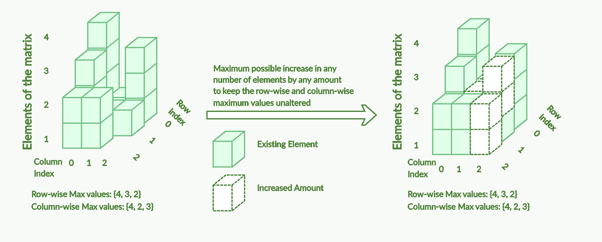

# 保持最大行数和列数不变的矩阵值的最大增加量

> 原文:[https://www . geesforgeks . org/矩阵最大值增加保持最大行数和列数不变/](https://www.geeksforgeeks.org/maximum-increase-in-value-of-matrix-to-keep-maximum-rows-and-columns-unchanged/)

给定尺寸为 **M*N** 的矩阵 **mat[][]** ，任务是找到每个单元格必须增加的总最大可能值(比如说**mat[I][j]【T5])，使得行 **i** 和列 **j** 的最大元素保持不变。**

**示例:**

> **输入:** N = 3，M = 3，mat[][] = { {4，1，3}，{3，1，1}，{2，2，0} }
> **输出:** 6
> **解释:**
> 
> 
> 
> 给定的矩阵为:
> 4 1 3
> 3 1 1
> 2 2 0
> 行方向的最大值为:{4，3，2}
> 列方向的最大值为:{4，2，3}
> 在不影响行方向和列方向的最大值的情况下增加元素后:
> 4 2 3
> 3 2
> 2 2 2
> 两个矩阵对应单元格的总增加量为((0 + 1 + 0) + (0 + 1 + 2) +)
> 
> **输入:** M = 4，N = 4，mat[][] = { {3，0，8，4}，{2，4，5，7}，{9，2，6，3}，{0，3，1，0 } }
> T3】输出:35
> T6】解释:T8】给定矩阵为:
> 3 0 8 4
> 2 4 5 7
> 9 2 6 3
> 0 3 1 0【T13 7}
> 在不影响行和列最大值的情况下增加元素后:
> 8 4 8 7
> 7 4 7 7
> 9 4 8 7
> 3 3 3
> 两个矩阵对应单元格的总增加量为((5+4+0+3)+(5+0+2+0)+(0+2+2+4)+(3+0+2+3))= 35。

**进场:**

*   沿着给定矩阵的每行和每列遍历，以存储每行和每列的最大值。
*   遍历给定矩阵 **mat[][]** ，对于每个单元格(比如**mat[I][j]【T3])，将当前元素与其对应行和列的最大值的最小值之差相加，如下所示:**

> 差异=最小值(第[i]行，第[j]列)–最大值[i][j]

*   上述操作中相加的总值就是所需的结果。

下面是上述方法的实现:

## C++

```
// C++ program for the above approach

#include <bits/stdc++.h>
using namespace std;

// Function to find the maximum increment
// in each cell of the given matrix such
// that maximum and minimum value remains
// unaffected
int maxIncrease(vector<vector<int> >& matrix)
{
    // Get the row of matrix as M
    int M = matrix.size();

    // Get the column of matrix as N
    int N = matrix[0].size();

    // To store the row-wise
    // maximum values
    vector<int> maxRowVal(M, 0);

    // To store the column-wise
    // maximum values
    vector<int> maxColVal(N, 0);

    // Traverse along the matrix
    // to store the maximum values
    // of each row and column
    for (int i = 0; i < M; i++) {

        for (int j = 0; j < N; j++) {

            // Store the row-wise
            // maximum values
            maxRowVal[i] = max(maxRowVal[i],
                               matrix[i][j]);

            // Store the column-wise
            // maximum values
            maxColVal[j] = max(maxColVal[j],
                               matrix[i][j]);
        }
    }

    // Calculate the total amount
    // of increment
    int totalIncrease = 0;

    // Traverse matrix mat[][]
    for (int i = 0; i < M; i++) {

        for (int j = 0; j < N; j++) {

            // The maximum possible
            // amount to increase
            int needToIncrease
                = min(maxRowVal[i],
                      maxColVal[j])
                  - matrix[i][j];

            // Total increased value
            totalIncrease += needToIncrease;
        }
    }

    // Return the total
    // increased value
    return totalIncrease;
}

// Driver Code
int main()
{
    // Given matrix
    vector<vector<int> > matrix{ { 3, 0, 8, 4 },
                                 { 2, 4, 5, 7 },
                                 { 9, 2, 6, 3 },
                                 { 0, 3, 1, 0 } };

    // Function Call
    cout << maxIncrease(matrix)
         << endl;
    return 0;
}
```

## Java 语言(一种计算机语言，尤用于创建网站)

```
// Java program for the above approach
import java.util.*;
class GFG{

// Function to find the maximum increment
// in each cell of the given matrix such
// that maximum and minimum value remains
// unaffected
static int maxIncrease(int [][] matrix)
{
    // Get the row of matrix as M
    int M = matrix.length;

    // Get the column of matrix as N
    int N = matrix[0].length;

    // To store the row-wise
    // maximum values
    int []maxRowVal = new int[M];

    // To store the column-wise
    // maximum values
    int []maxColVal = new int[N];

    // Traverse along the matrix
    // to store the maximum values
    // of each row and column
    for (int i = 0; i < M; i++)
    {
        for (int j = 0; j < N; j++)
        {

            // Store the row-wise
            // maximum values
            maxRowVal[i] = Math.max(maxRowVal[i],
                                    matrix[i][j]);

            // Store the column-wise
            // maximum values
            maxColVal[j] = Math.max(maxColVal[j],
                                    matrix[i][j]);
        }
    }

    // Calculate the total amount
    // of increment
    int totalIncrease = 0;

    // Traverse matrix mat[][]
    for (int i = 0; i < M; i++)
    {
        for (int j = 0; j < N; j++)
        {

            // The maximum possible
            // amount to increase
            int needToIncrease = Math.min(maxRowVal[i],
                                          maxColVal[j]) -
                                          matrix[i][j];

            // Total increased value
            totalIncrease += needToIncrease;
        }
    }

    // Return the total
    // increased value
    return totalIncrease;
}

// Driver Code
public static void main(String[] args)
{
    // Given matrix
    int [][] matrix = { { 3, 0, 8, 4 },
                        { 2, 4, 5, 7 },
                        { 9, 2, 6, 3 },
                        { 0, 3, 1, 0 } };

    // Function Call
    System.out.print(maxIncrease(matrix) + "\n");
}
}

// This code is contributed by gauravrajput1
```

## 蟒蛇 3

```
# Python3 program for the above approach

# Function to find the maximum increment
# in each cell of the given matrix such
# that maximum and minimum value remains
# unaffected
def maxIncrease(matrix):

    # Get the row of matrix as M
    M = len(matrix)

    # Get the column of matrix as N
    N = len(matrix[0])

    # To store the row-wise
    # maximum values
    maxRowVal = [0] * M

    # To store the column-wise
    # maximum values
    maxColVal = [0] * (N)

    # Traverse along the matrix
    # to store the maximum values
    # of each row and column
    for i in range(M):
        for j in range(N):

            # Store the row-wise
            # maximum values
            maxRowVal[i] = max(maxRowVal[i],
                               matrix[i][j])

            # Store the column-wise
            # maximum values
            maxColVal[j] = max(maxColVal[j],
                               matrix[i][j])

    # Calculate the total amount
    # of increment
    totalIncrease = 0

    # Traverse matrix mat[][]
    for i in range(M):
        for j in range(N):

            # The maximum possible
            # amount to increase
            needToIncrease = (min(maxRowVal[i],
                                  maxColVal[j]) -
                                  matrix[i][j])

            # Total increased value
            totalIncrease += needToIncrease

    # Return the total
    # increased value
    return totalIncrease

# Driver Code
if __name__ == '__main__':

    # Given matrix
    matrix = [ [ 3, 0, 8, 4 ],
               [ 2, 4, 5, 7 ],
               [ 9, 2, 6, 3 ],
               [ 0, 3, 1, 0 ] ]

    # Function call
    print(maxIncrease(matrix))

# This code is contributed mohit kumar 29
```

## C#

```
// C# program for the above approach
using System;

class GFG{

// Function to find the maximum increment
// in each cell of the given matrix such
// that maximum and minimum value remains
// unaffected
static int maxIncrease(int [,] matrix)
{

    // Get the row of matrix as M
    int M = matrix.GetLength(0);

    // Get the column of matrix as N
    int N = matrix.GetLength(1);

    // To store the row-wise
    // maximum values
    int []maxRowVal = new int[M];

    // To store the column-wise
    // maximum values
    int []maxColVal = new int[N];

    // Traverse along the matrix
    // to store the maximum values
    // of each row and column
    for(int i = 0; i < M; i++)
    {
       for(int j = 0; j < N; j++)
       {

          // Store the row-wise
          // maximum values
          maxRowVal[i] = Math.Max(maxRowVal[i],
                                  matrix[i, j]);

          // Store the column-wise
          // maximum values
          maxColVal[j] = Math.Max(maxColVal[j],
                                  matrix[i, j]);
       }
    }

    // Calculate the total amount
    // of increment
    int totalIncrease = 0;

    // Traverse matrix [,]mat
    for(int i = 0; i < M; i++)
    {
       for(int j = 0; j < N; j++)
       {

          // The maximum possible
          // amount to increase
          int needToIncrease = Math.Min(maxRowVal[i],
                                        maxColVal[j]) -
                                        matrix[i, j];

          // Total increased value
          totalIncrease += needToIncrease;
       }
    }

    // Return the total
    // increased value
    return totalIncrease;
}

// Driver Code
public static void Main(String[] args)
{

    // Given matrix
    int [,] matrix = { { 3, 0, 8, 4 },
                       { 2, 4, 5, 7 },
                       { 9, 2, 6, 3 },
                       { 0, 3, 1, 0 } };

    // Function call
    Console.Write(maxIncrease(matrix) + "\n");
}
}

// This code is contributed by 29AjayKumar
```

## java 描述语言

```
<script>

// Javascript program for the above approach

// Function to find the maximum increment
// in each cell of the given matrix such
// that maximum and minimum value remains
// unaffected
function maxIncrease(matrix)
{
    // Get the row of matrix as M
    var M = matrix.length;

    // Get the column of matrix as N
    var N = matrix[0].length;

    // To store the row-wise
    // maximum values
    var maxRowVal = Array(M).fill(0);

    // To store the column-wise
    // maximum values
    var maxColVal = Array(N).fill(0);

    // Traverse along the matrix
    // to store the maximum values
    // of each row and column
    for (var i = 0; i < M; i++) {

        for (var j = 0; j < N; j++) {

            // Store the row-wise
            // maximum values
            maxRowVal[i] = Math.max(maxRowVal[i],
                               matrix[i][j]);

            // Store the column-wise
            // maximum values
            maxColVal[j] = Math.max(maxColVal[j],
                               matrix[i][j]);
        }
    }

    // Calculate the total amount
    // of increment
    var totalIncrease = 0;

    // Traverse matrix mat[][]
    for (var i = 0; i < M; i++) {

        for (var j = 0; j < N; j++) {

            // The maximum possible
            // amount to increase
            var needToIncrease
                = Math.min(maxRowVal[i],
                      maxColVal[j])
                  - matrix[i][j];

            // Total increased value
            totalIncrease += needToIncrease;
        }
    }

    // Return the total
    // increased value
    return totalIncrease;
}

// Driver Code
// Given matrix
var matrix = [ [ 3, 0, 8, 4 ],
                             [ 2, 4, 5, 7 ],
                             [ 9, 2, 6, 3 ],
                             [ 0, 3, 1, 0 ] ];

// Function Call
document.write( maxIncrease(matrix) + "<br>");

// This code is contributed by noob2000.
</script>
```

**Output:** 

```
35
```

**时间复杂度:** *O(M*N)*