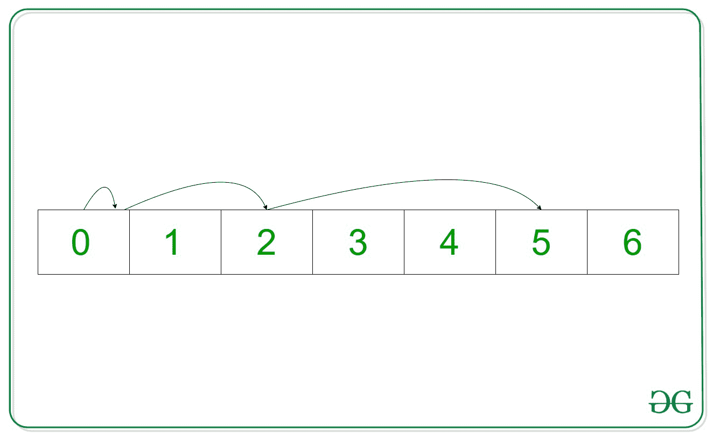

# 通过避开给定的索引 B–集合 3(二分搜索法)

，指针可以在 N 步内到达的最大索引

> 原文:[https://www . geesforgeks . org/maximum-index-a-pointer-can-in-n-steps-by-避让-给定-index-b-set-3-binary-search/](https://www.geeksforgeeks.org/maximum-index-a-pointer-can-reach-in-n-steps-by-avoiding-a-given-index-b-set-3-binary-search/)

给定两个整数 **N** 和 **B** ，任务是打印指针的最大索引，从 **0** <sup>开始，第</sup>个索引可以在自然数(即 0、1、2、3、4、5……)的[数组](https://www.geeksforgeeks.org/array-data-structure/)中到达，比如说**arr【】**，在 **N** 步中，不需要将自己放在任意点的索引 **B** 处。

> *在每一步中，指针可以从**当前指数**移动到**跳跃指数**或者保持在**当前指数。***
> ***跳跃指数=当前指数+步数***

**示例:**

> ***输入:** N = 3，B = 2*
> ***输出:** 6*
> ***解释:***
> 
> 
> 
> ***第一步:***
> *当前指数= 0*
> *步数= 1*
> *跳跃指数= 0 + 1 = 1*
> ***第二步:**当前指数= 1*
> *步数= 2*
> T22】跳跃指数= 1+2 = 3
> T25**第三步:**
> *跳跃指数= 3 + 3 = 6*
> *因此，能达到的最大指数为 6。*
> 
> ***输入:** N = 3，B = 1*
> ***输出:** 5*
> ***解释:***
> 
> 
> 
> ***第 1 步:***
> *当前指数= 0*
> *步数= 1*
> *跳跃指数= 0+1 = 1 但这是不好的指数。因此指针保持在当前索引。*
> ***第二步:***
> *当前指数= 0*
> *步数= 2*
> *跳跃指数= 0 + 2 = 2*
> *第三步:*
> 当前指数= 2
> T36】步数= 3
> 跳跃指数= 2+T39

**高效方法:**本文[中讨论的幼稚方法](https://www.geeksforgeeks.org/maximum-index-a-pointer-can-reach-in-n-steps-by-avoiding-a-given-index-b/)也可以通过使用[二分搜索法](https://www.geeksforgeeks.org/binary-search/)进行优化。如果**maximummindex–B**的值存在于从第一个 **N** 自然数开始的任何最后一个 **K** 数的总和中，那么**maximummindex**不能在没有索引 **B** 跳转的情况下被减少到小于等于 **0** 。因此，将最大索引减 1，并再次执行上述步骤。按照以下步骤解决问题:

*   将变量**最大极限达到**初始化为 **0** 。
*   [初始化向量](https://www.geeksforgeeks.org/initialize-a-vector-in-cpp-different-ways/) **Ans[]** 。
*   [使用变量 **i** 迭代范围](https://www.geeksforgeeks.org/range-based-loop-c/)**【1，N】**，并将值 **i** 添加到变量**maximumindexreated**[并将值 **i** 推送到向量](https://www.geeksforgeeks.org/vectorpush_back-vectorpop_back-c-stl/) **Ans[]** 。
*   [反转矢量 **Ans[]**](https://www.geeksforgeeks.org/stdreverse-in-c/) 。
*   [使用变量 **i** 迭代范围](https://www.geeksforgeeks.org/range-based-loop-c/)**【1，Ans.size())** ，并将值**Ans[I–1]**添加到 **Ans[i]** 。
*   [遍历一段时间循环](https://www.geeksforgeeks.org/c-c-while-loop-with-examples/)直到**最大值达到**大于 **0** ，并执行以下任务:
    *   将自动变量**初始化为数组**和**中[值大于或等于**最大值达到–B**](https://www.geeksforgeeks.org/lower_bound-in-cpp/.)的指针。**
    *   如果**等于 **Ans.end()** 那么[就跳出循环](https://www.geeksforgeeks.org/break-statement-cc/)。**
    *   如果***它**等于**最大极限达到–B**，那么将**最大极限达到**的值减少 **1** 。否则，打破循环。
*   执行上述步骤后，打印**maximumindexreated**的值作为答案。

下面是上述方法的实现:

## C++

```
// C++ program for the above approach
#include <bits/stdc++.h>
using namespace std;

// Function to find the maximum index
// reachable
int maxIndex(int N, int B)
{

    // Store the answer
    int maximumIndexReached = 0;
    vector<int> Ans;

    // Store the maximum index possible
    // i.e, N*(N-1)
    for (int i = 1; i <= N; i++) {
        maximumIndexReached += i;
        Ans.push_back(i);
    }

    reverse(Ans.begin(), Ans.end());

    // Add bthe previous elements
    for (int i = 1; i < (int)Ans.size(); i++) {
        Ans[i] += Ans[i - 1];
    }

    // Run a loop
    while (maximumIndexReached) {

        // Binary Search
        auto it
            = lower_bound(Ans.begin(), Ans.end(),
                          maximumIndexReached - B);
        if (it == Ans.end()) {
            break;
        }
        if (*it == maximumIndexReached - B) {
            maximumIndexReached--;
        }
        else {
            break;
        }
    }

    return maximumIndexReached;
}

// Driver Code
int main()
{
    int N = 3, B = 2;
    cout << maxIndex(N, B);

    return 0;
}
```

## 蟒蛇 3

```
# Python 3 program for the above approach
from bisect import bisect_left

# Function to find the maximum index
# reachable
def maxIndex(N, B):

    # Store the answer
    maximumIndexReached = 0
    Ans = []

    # Store the maximum index possible
    # i.e, N*(N-1)
    for i in range(1, N + 1):
        maximumIndexReached += i
        Ans.append(i)

    Ans.reverse()

    # Add bthe previous elements
    for i in range(len(Ans)):
        Ans[i] += Ans[i - 1]

    # Run a loop
    while (maximumIndexReached):

        # Binary Search
        it = bisect_left(Ans,
                         maximumIndexReached - B)
        if (it not in Ans):
            break

        if (it == maximumIndexReached - B):
            maximumIndexReached -= 1

        else:
            break

    return maximumIndexReached

# Driver Code
if __name__ == "__main__":

    N = 3
    B = 2
    print(maxIndex(N, B))

    # This code is contributed by ukasp.
```

## java 描述语言

```
<script>
        // JavaScript Program to implement
        // the above approach
        function lowerBound(Ans, target)
        {
            const targetRange = [-1, -1]
            const leftIdx = extremeInsertionIndex(Ans, target, true)
            if (leftIdx === Ans.length || Ans[leftIdx] != target)
                return targetRange
            targetRange[0] = leftIdx
            targetRange[1] = extremeInsertionIndex(Ans, target, false) - 1
            return targetRange
            function extremeInsertionIndex(Ans, target, left) {
                let lo = 0,
                    hi = Ans.length
                while (lo < hi) {
                    const mid = lo + Math.floor((hi - lo) / 2)
                    if (Ans[mid] > target || (left && target === Ans[mid]))
                        hi = mid
                    else
                        lo = mid + 1
                }
                return lo
            }
        }

        // Function to find the maximum index
        // reachable
        function maxIndex(N, B)
        {

            // Store the answer
            let maximumIndexReached = 0;
            let Ans = [];

            // Store the maximum index possible
            // i.e, N*(N-1)
            for (let i = 1; i <= N; i++) {
                maximumIndexReached += i;
                Ans.push(i);
            }
            Ans.reverse();

            // Add bthe previous elements
            for (let i = 1; i < Ans.length; i++) {
                Ans[i] += Ans[i - 1];
            }

            // Run a loop
            while (maximumIndexReached)
            {

                // Binary Search
                let it
                    = lowerBound(Ans, maximumIndexReached - B);
                if (it == -1) {
                    break;
                }
                if (it == maximumIndexReached - B) {
                    maximumIndexReached--;
                }
                else {
                    break;
                }
            }
            return maximumIndexReached;
        }

        // Driver Code
        let N = 3, B = 2;
        document.write(maxIndex(N, B));

// This code is contributed by Potta Lokesh
    </script>
```

**Output:** 

```
6
```

***时间复杂度:** O(N*log N)*
***辅助空间:** O(N)*