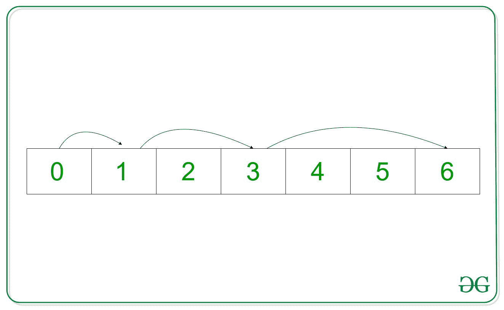
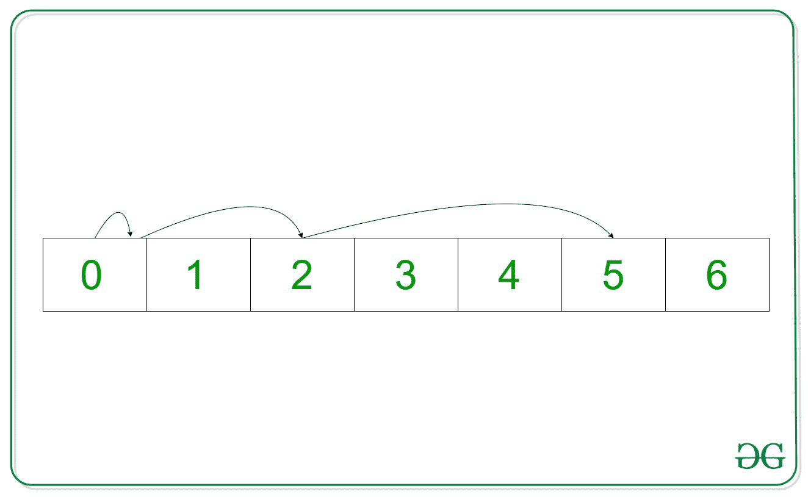

# 通过避开给定的索引 B

，指针在 N 步内可以达到的最大索引

> 原文:[https://www . geeksforgeeks . org/最大索引-一个指针可以到达 n 步-通过避免给定的索引-b/](https://www.geeksforgeeks.org/maximum-index-a-pointer-can-reach-in-n-steps-by-avoiding-a-given-index-b/)

给定两个整数 **N** 和 **B** ，任务是打印一个指针的最大索引，从 **0** <sup>开始，第</sup>个索引可以在一组自然数(即 0，1，2，3，4，5…)中到达，比如说**arr【】**，在 **N** 步中，不需要将自己放在任何点的索引 **B** 处。

> 在每一步中，指针可以从**当前指数**移动到**跳跃指数**或保持在**当前指数。**
> ***跳跃指数=当前指数+步数***

**示例:**

> **输入:** N = 3，B = 2
> **输出:** 6
> **说明:**
> 
> 
> 
> **第一步:**
> 当前指数= 0
> 步数= 1
> 跳跃指数= 0 + 1 = 1
> **第二步:**当前指数= 1
> 步数= 2
> 跳跃指数= 1 + 2 = 3
> **第三步:**
> 当前指数= 3
> 步数= 3
> 跳跃指数= 3 + 3 = 6
> 因此，能达到的最大指数为 6。
> 
> **输入:** N = 3，B = 1
> T3】输出:5
> T6】说明:
> 
> 
> 
> **第一步:**
> 当前指数= 0
> 步数= 1
> 跳跃指数= 0 + 1 = 1 *但这是不好的指数。因此指针保持在*当前索引*处。*
> **第二步:**
> 当前指数= 0
> 步数= 2
> 跳跃指数= 0 + 2 = 2
> **第三步:**
> 当前指数= 2
> 步数= 3
> 跳跃指数= 2 + 3 = 5
> 因此，能达到的最大指数为 5。

**天真法:**解决问题最简单的方法是通过考虑每个**当前指数**的两种可能性来计算最大指数，要么通过**步数**移动指针，要么停留在**当前指数**上，并生成所有可能的组合。最后，打印获得的最大索引。

***时间复杂度:**O(N<sup>3</sup>)*
***辅助空间:** O(1)*

**有效方法:**
计算给定步骤内可达到的最大指标。如果通过避免不良指数可以从最大指数达到第 0 <sup>个</sup>指数，打印结果。否则，通过将最大索引减 1 来重复该过程。
以下是步骤:

1.  通过计算第一个 **N 个**自然数之和，计算出 **N 个**步可达到的最大指数。
2.  将计算出的最大指数值分配给**当前指数**。
3.  将**当前指数**递减**步数**并将**步数**递减 **1** ，直到其中一个为负。
4.  每次减量后，检查**当前指数**是否等于 **B** 。如果发现属实，恢复对**当前指数**所做的更改。
5.  如果**当前指数**成功达到 **0** ，则打印**最大指数**的当前值作为答案。
6.  否则，将**最大指数**的值递减 **1** ，并从第 **2** 步开始重复。

下面是上述方法的实现:

## C++

```
// C++ program for the above approach
#include <bits/stdc++.h>
using namespace std;

// Function to find the maximum
// index the pointer can reach
void maximumIndex(int N, int B)
{
    int max_index = 0;

    // Calculate maximum possible
    // index that can be reached
    for (int i = 1; i <= N; i++) {

        max_index += i;
    }

    int current_index = max_index, step = N;

    while (1) {

        // Check if current index and step
        // both are greater than 0 or not
        while (current_index > 0 && N > 0) {

            // Decrement current_index by step
            current_index -= N;

            // Check if current index is
            // equal to B or not
            if (current_index == B) {

                // Restore to previous index
                current_index += N;
            }

            // Decrement step by one
            N--;
        }

        // If it reaches the 0th index
        if (current_index <= 0) {

            // Print result
            cout << max_index << endl;
            break;
        }

        // If max index fails to
        // reach the 0th index
        else {

            N = step;

            // Store max_index - 1 in current index
            current_index = max_index - 1;

            // Decrement max index
            max_index--;

            // If current index is equal to B
            if (current_index == B) {

                current_index = max_index - 1;

                    // Decrement current index
                    max_index--;
            }
        }
    }
}

// Driver Code
int main()
{
    int N = 3, B = 2;
    maximumIndex(N, B);
    return 0;
}
```

## Java 语言(一种计算机语言，尤用于创建网站)

```
// Java program for
// the above approach
import java.util.*;
class GFG{

// Function to find the maximum
// index the pointer can reach
static void maximumIndex(int N,
                        int B)
{
int max_index = 0;

// Calculate maximum possible
// index that can be reached
for (int i = 1; i <= N; i++)
{
    max_index += i;
}

int current_index = max_index,
                    step = N;

while (true)
{
    // Check if current index
    // and step both are greater
    // than 0 or not
    while (current_index > 0 &&
        N > 0)
    {
    // Decrement current_index
    // by step
    current_index -= N;

    // Check if current index
    // is equal to B or not
    if (current_index == B)
    {
        // Restore to previous
        // index
        current_index += N;
    }

    // Decrement step by one
    N--;
    }

    // If it reaches the 0th index
    if (current_index <= 0)
    {
    // Print result
    System.out.print(max_index + "\n");
    break;
    }

    // If max index fails to
    // reach the 0th index
    else
    {
    N = step;

    // Store max_index - 1 in
    // current index
    current_index = max_index - 1;

    // Decrement max index
    max_index--;

    // If current index is
    // equal to B
    if (current_index == B)
    {
        current_index = max_index - 1;

        // Decrement current index
        max_index--;
    }
    }
}
}

// Driver Code
public static void main(String[] args)
{
int N = 3, B = 2;
maximumIndex(N, B);
}
}

// This code is contributed by gauravrajput1
```

## 蟒蛇 3

```
# Python3 program for the above approach

# Function to find the maximum
# index the pointer can reach
def maximumIndex(N, B):

    max_index = 0

    # Calculate maximum possible
    # index that can be reached
    for i in range(1, N + 1):
        max_index += i

    current_index = max_index
    step = N

    while (1):

        # Check if current index and step
        # both are greater than 0 or not
        while (current_index > 0 and N > 0):

            # Decrement current_index by step
            current_index -= N

            # Check if current index is
            # equal to B or not
            if (current_index == B):

                # Restore to previous index
                current_index += N

            # Decrement step by one
            N -= 1

        # If it reaches the 0th index
        if (current_index <= 0):

            # Print result
            print(max_index)
            break

        # If max index fails to
        # reach the 0th index
        else:
            N = step

            # Store max_index - 1 in current index
            current_index = max_index - 1

            # Decrement max index
            max_index -= 1

            # If current index is equal to B
            if (current_index == B):
                current_index = max_index - 1

                # Decrement current index
                max_index -= 1

# Driver Code
if __name__ == '__main__':

    N = 3
    B = 2

    maximumIndex(N, B)

# This code is contributed by mohit kumar 29
```

## C#

```
// C# program for the
// above approach
using System;

class GFG{

// Function to find the maximum
// index the pointer can reach
static void maximumIndex(int N,
                         int B)
{
  int max_index = 0;

  // Calculate maximum possible
  // index that can be reached
  for(int i = 1; i <= N; i++)
  {
    max_index += i;
  }

  int current_index = max_index,
                      step = N;

  while (true)
  {

    // Check if current index
    // and step both are greater
    // than 0 or not
    while (current_index > 0 &&
                       N > 0)
    {

      // Decrement current_index
      // by step
      current_index -= N;

      // Check if current index
      // is equal to B or not
      if (current_index == B)
      {

        // Restore to previous
        // index
        current_index += N;
      }

      // Decrement step by one
      N--;
    }

    // If it reaches the 0th index
    if (current_index <= 0)
    {

      // Print result
      Console.Write(max_index + " ");
      break;
    }

    // If max index fails to
    // reach the 0th index
    else
    {
      N = step;

      // Store max_index - 1 in
      // current index
      current_index = max_index - 1;

      // Decrement max index
      max_index--;

      // If current index is
      // equal to B
      if (current_index == B)
      {

        current_index = max_index - 1;

        // Decrement current index
        max_index--;
      }
    }
  }
}

// Driver code
public static void Main (String[] args)
{
  int N = 3, B = 2;

  maximumIndex(N, B);
}
}

// This code is contributed by offbeat
```

## java 描述语言

```
<script>

// Javascript program for the above approach

// Function to find the maximum
// index the pointer can reach
function maximumIndex( N, B)
{
    var max_index = 0;

    // Calculate maximum possible
    // index that can be reached
    for (var i = 1; i <= N; i++) {

        max_index += i;
    }

    var current_index = max_index, step = N;

    while (1) {

        // Check if current index and step
        // both are greater than 0 or not
        while (current_index > 0 && N > 0) {

            // Decrement current_index by step
            current_index -= N;

            // Check if current index is
            // equal to B or not
            if (current_index == B) {

                // Restore to previous index
                current_index += N;
            }

            // Decrement step by one
            N--;
        }

        // If it reaches the 0th index
        if (current_index <= 0) {

            // Print result
            document.write(max_index + "<br>");;
            break;
        }

        // If max index fails to
        // reach the 0th index
        else {

            N = step;

            // Store max_index - 1 in current index
            current_index = max_index - 1;

            // Decrement max index
            max_index--;

            // If current index is equal to B
            if (current_index == B) {

                current_index = max_index - 1;

                    // Decrement current index
                    max_index--;
            }
        }
    }
}

// Driver Code
var N = 3, B = 2;
maximumIndex(N, B);

// This code is contributed by rrrtnx.
</script>
```

**Output:** 

```
6
```

***时间复杂度:**O(N<sup>2</sup>)*
***辅助空间:** O(1)*