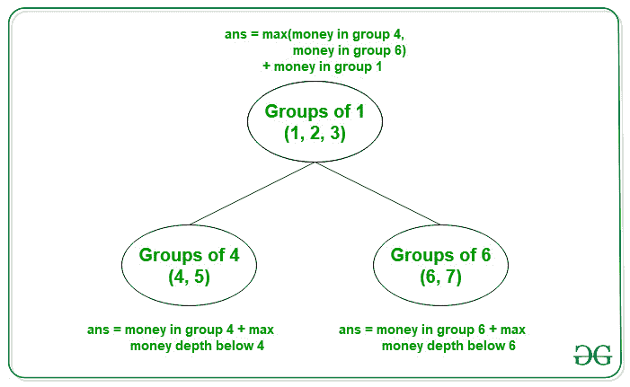

# 根据给定条件可以在朋友间收取的最大金额

> 原文:[https://www . geeksforgeeks . org/基于给定条件的朋友间最高可收款额/](https://www.geeksforgeeks.org/maximum-money-that-can-be-collected-among-friends-based-on-given-conditions/)

给定由 **N** 正整数组成的[数组](https://www.geeksforgeeks.org/introduction-to-arrays/) **arr[]** (基于 1 的索引)，使得 **arr[i]** 表示第 **i <sup>个</sup>人**的数量。还给出了两个 [2D 阵列](https://www.geeksforgeeks.org/multidimensional-arrays-c-cpp/)表示**朋友[][2]** 和**组[][2]** ，使得每对**朋友[i][0]** 和**朋友[i][1]** 是朋友并形成组。每对**组【I】【0】**和**组【I】【0】**表示包含**组【I】【0】**和**组【I】【1】**的朋友之间可以是朋友。

任务是在以下条件的基础上，找到他们之间可以收取的最大金额:

*   如果 **A** 和 **B** 是朋友而 **B** 和 **C** 是朋友那么 **A** 和 **C** 就是朋友。
*   如果一群有 **A** 的人和一群有 **B** 的人之间可以有友谊，如果一群 **B** 和一群 **C** 之间可以有友谊，那么一群 **A** 和一群 **C** 之间就有友谊。
*   一群朋友组成了小组。

**示例:**

> **输入:** arr[] = {5，2，3，6，1，9，8}，好友[][] = {{1，2}，{2，3}，{4，5}，{6，7}}，群组[][] = {{1，4}，{1，6}}
> **输出:** 27
> **解释:**
> 
> [](https://media.geeksforgeeks.org/wp-content/uploads/20210125171846/MoneyCollectedAmongFriends.jpg)
> 
> 第 1 组的总成本= 5 + 2 + 3 = 10。
> 第 2 组总成本= 6 + 1 = 7。
> 第 3 组总成本= 9 + 8 = 17。
> 因为 1 组可以在 2 组和 3 组之间借钱。因此，最高收款额为 10 + 17 = 27。
> 
> **输入:** arr[] = {1，2，3，4，5，6，7}，好友[][] = {{1，2}，{2，3}，{4，5}，{6，7}}，群组[][] = {{1，4}，{1，6}}
> **输出:** 19

**方法:**给定的问题可以通过组建一个朋友小组，找出每个小组能有多少钱来解决。这个想法是使用[不相交集合并集](https://www.geeksforgeeks.org/disjoint-set-data-structures/)，让其中一个组成员成为父组成员。按照以下步骤解决问题:

*   在组成群组时，添加每个好友群组的数量，并将该数量存储在该群组的父群组中。
*   在不同的组之间添加一条边，其中一条边的两个顶点表明这两组可以是彼此的朋友。
*   在组的父成员之间添加一条边。
*   由于父节点存储相应组的资金量，因此问题简化为[寻找从节点到叶节点的最大和路径](https://www.geeksforgeeks.org/find-the-maximum-sum-path-in-a-binary-tree/)，其中路径中的每个节点代表该组的资金量。
*   完成上述步骤后，打印可收集的最大金额的值。

下面是上述方法的实现:

## C++

```
// C++ program for the above approach

#include <bits/stdc++.h>
using namespace std;
#define N 100001

int n;
int amt[N];
long long dp[N], c[N];
int parent[N];
long long sz[N];
vector<int> v[N];

// Function to find the parent of each
// node in the graph
int find(int i)
{
    // If the parent is the same node
    // itself
    if (parent[i] == i)
        return i;

    // Recursively find the parent
    return parent[i] = find(parent[i]);
}

// Function to merge the friends of
// each groups
void Union(int a, int b)
{
    // Find the parents of a and b
    int p1 = find(a);
    int p2 = find(b);

    // If the parents are the same
    // then return
    if (p1 == p2)
        return;

    // If the size of the parent p1
    // is less than the p2, then
    // swap the parents p1 and p2
    if (sz[p1] < sz[p2]) {
        swap(p1, p2);
    }

    parent[p2] = p1;
    sz[p1] += sz[p2];

    // Money in the group of p2 is
    // added to the p1 and p2 is
    // now the member of p1
    c[p1] += c[p2];

    // p2  is now the member of p1
    c[p2] = 0;
}

// Function to calculate the maximum
// amount collected among friends
void dfs(int src, int par)
{
    dp[src] = c[src];
    long long mx = 0;

    // Traverse the adjacency list
    // of the src node
    for (auto x : v[src]) {

        if (x == par)
            continue;

        dfs(x, src);

        // Calculate the maximum
        // amount of the group
        mx = max(mx, dp[x]);
    }

    // Adding the max amount of money
    // with the current group
    dp[src] += mx;
}

// Function to find the maximum money
// collected among friends
void maximumMoney(
    int n, int amt[],
    vector<pair<int, int> > friends,
    vector<pair<int, int> > groups)
{
    // Iterate over the range [1, N]
    for (int i = 1; i <= n; i++) {

        // Initialize the parent and
        // the size of each node i
        parent[i] = i;
        sz[i] = 1;
        c[i] = amt[i - 1];
    }

    int p = friends.size();

    // Merging friends into groups
    for (int i = 0; i < p; ++i) {

        // Perform the union operation
        Union(friends[i].first,
              friends[i].second);
    }

    int m = groups.size();

    // Finding the parent of group
    // in which member is present
    for (int i = 0; i < m; ++i) {

        // Find the parent p1 and p2
        int p1 = find(groups[i].first);
        int p2 = find(groups[i].second);

        // p1 and p2 are not in same
        // group then add an edge
        if (p1 != p2) {

            // These two groups can be
            // made friends. Hence,
            // adding an edge
            v[p1].push_back(p2);
            v[p2].push_back(p1);
        }
    }

    // Starting dfs from node which
    // is the parent of group in
    // which 1 is present
    dfs(find(1), 0);

    long long ans = 0;

    // Ans is the maximum money
    // collected by each group
    for (int i = 1; i <= n; i++) {
        ans = max(ans, dp[find(i)]);
    }

    // Print the answer
    cout << ans << endl;
}

// Driver Code
signed main()
{
    int amt[] = { 5, 2, 3, 6,
                  1, 9, 8 };
    n = sizeof(amt) / sizeof(amt[0]);

    vector<pair<int, int> > friends
        = { { 1, 2 }, { 2, 3 }, { 4, 5 }, { 6, 7 } };
    vector<pair<int, int> > groups
        = { { 1, 4 }, { 1, 6 } };
    maximumMoney(n, amt, friends, groups);

    return 0;
}
```

## 蟒蛇 3

```
# Python3 program for the above approach
N = 100001

amt = [0] * N
dp = [0] * N
c = [0] * N
parent = [0] * N
sz = [0] * N
v = [[] for i in range(N)]

# Function to find the parent of each
# node in the graph
def find(i):

    # If the parent is the same node
    # itself
    if (parent[i] == i):
        return i

    parent[i] = find(parent[i])
    return parent[i]

# Function to merge the friends of
# each groups
def Union(a, b):

    # Find the parents of a and b
    p1 = find(a)
    p2 = find(b)

    # If the parents are the same
    # then return
    if (p1 == p2):
        return

    # If the size of the parent p1
    # is less than the p2, then
    # swap the parents p1 and p2
    if (sz[p1] < sz[p2]):
        temp = p1
        p1 = p2
        p2 = temp

    parent[p2] = p1
    sz[p1] += sz[p2]

    # Money in the group of p2 is
    # added to the p1 and p2 is
    # now the member of p1
    c[p1] += c[p2]

    # p2  is now the member of p1
    c[p2] = 0

# Function to calculate the maximum
# amount collected among friends
def dfs(src, par):

    dp[src] = c[src]
    mx = 0

    # Traverse the adjacency list
    # of the src node
    for x in v[src]:
        if (x == par):
            continue

        dfs(x, src)

        # Calculate the maximum
        # amount of the group
        mx = max(mx, dp[x])

    # Adding the max amount of money
    # with the current group
    dp[src] += mx

# Function to find the maximum money
# collected among friends
def maximumMoney(n, amt, friends, groups):

    # Iterate over the range [1, N]
    for i in range(1, n + 1):

        # Initialize the parent and
        # the size of each node i
        parent[i] = i
        sz[i] = 1
        c[i] = amt[i - 1]

    p = len(friends)

    # Merging friends into groups
    for i in range(p):

        # Perform the union operation
        Union(friends[i][0], friends[i][1])

    m = len(groups)

    # Finding the parent of group
    # in which member is present
    for i in range(m):

        # Find the parent p1 and p2
        p1 = find(groups[i][0])
        p2 = find(groups[i][1])

        # p1 and p2 are not in same
        # group then add an edge
        if (p1 != p2):

            # These two groups can be
            # made friends. Hence,
            # adding an edge
            v[p1].append(p2)
            v[p2].append(p1)

    # Starting dfs from node which
    # is the parent of group in
    # which 1 is present
    dfs(find(1), 0)

    ans = 0

    # Ans is the maximum money
    # collected by each group
    for i in range(1, n + 1):
        ans = max(ans, dp[find(i)])

    # Print the answer
    print(ans)

# Driver Code
amt = [ 5, 2, 3, 6, 1, 9, 8 ]
n = len(amt)

friends = [ [ 1, 2 ], [ 2, 3 ],
            [ 4, 5 ], [ 6, 7 ] ]
groups = [ [ 1, 4 ], [ 1, 6 ] ]

maximumMoney(n, amt, friends, groups)

# This code is contributed by _saurabh_jaiswal
```

## java 描述语言

```
<script>

// JavaScript program for the above approach

let N = 100001

let n;
let amt = new Array(N);
let dp = new Array(N), c = new Array(N);
let parent = new Array(N);
let sz = new Array(N);
let v = new Array(N).fill(0).map(() => []);

// Function to find the parent of each
// node in the graph
function find(i) {
    // If the parent is the same node
    // itself
    if (parent[i] == i)
        return i;

    // Recursively find the parent
    return parent[i] = find(parent[i]);
}

// Function to merge the friends of
// each groups
function Union(a, b) {
    // Find the parents of a and b
    let p1 = find(a);
    let p2 = find(b);

    // If the parents are the same
    // then return
    if (p1 == p2)
        return;

    // If the size of the parent p1
    // is less than the p2, then
    // swap the parents p1 and p2
    if (sz[p1] < sz[p2]) {
        let temp = p1;
        p1 = p2;
        p2 = temp;
    }

    parent[p2] = p1;
    sz[p1] += sz[p2];

    // Money in the group of p2 is
    // added to the p1 and p2 is
    // now the member of p1
    c[p1] += c[p2];

    // p2  is now the member of p1
    c[p2] = 0;
}

// Function to calculate the maximum
// amount collected among friends
function dfs(src, par) {
    dp[src] = c[src];
    let mx = 0;

    // Traverse the adjacency list
    // of the src node
    for (let x of v[src]) {

        if (x == par)
            continue;

        dfs(x, src);

        // Calculate the maximum
        // amount of the group
        mx = Math.max(mx, dp[x]);
    }

    // Adding the max amount of money
    // with the current group
    dp[src] += mx;
}

// Function to find the maximum money
// collected among friends
function maximumMoney(n, amt, friends, groups) {
    // Iterate over the range [1, N]
    for (let i = 1; i <= n; i++) {

        // Initialize the parent and
        // the size of each node i
        parent[i] = i;
        sz[i] = 1;
        c[i] = amt[i - 1];
    }

    let p = friends.length;

    // Merging friends into groups
    for (let i = 0; i < p; ++i) {

        // Perform the union operation
        Union(friends[i][0],
            friends[i][1]);
    }

    let m = groups.length;

    // Finding the parent of group
    // in which member is present
    for (let i = 0; i < m; ++i) {

        // Find the parent p1 and p2
        let p1 = find(groups[i][0]);
        let p2 = find(groups[i][1]);

        // p1 and p2 are not in same
        // group then add an edge
        if (p1 != p2) {

            // These two groups can be
            // made friends. Hence,
            // adding an edge
            v[p1].push(p2);
            v[p2].push(p1);
        }
    }

    // Starting dfs from node which
    // is the parent of group in
    // which 1 is present
    dfs(find(1), 0);

    let ans = 0;

    // Ans is the maximum money
    // collected by each group
    for (let i = 1; i <= n; i++) {
        ans = Math.max(ans, dp[find(i)]);
    }

    // Print the answer
    document.write(ans + "<br>");
}

// Driver Code

amt = [5, 2, 3, 6, 1, 9, 8];
n = amt.length;

let friends
    = [[1, 2], [2, 3], [4, 5], [6, 7]];
let groups
    = [[1, 4], [1, 6]];
maximumMoney(n, amt, friends, groups);

</script>
```

**Output**

```
27
```

***时间复杂度:** O(N*log N)*
***辅助空间:** O(N)*