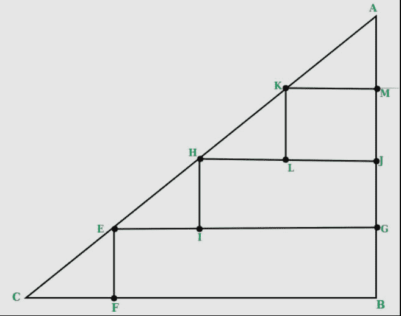

# 直角等腰三角形内可容纳的最大 2×2 正方形数量

> 原文:[https://www . geesforgeks . org/maximum-number-2x 2-squares-can-fit-inside-right-等腰三角形/](https://www.geeksforgeeks.org/maximum-number-2x2-squares-can-fit-inside-right-isosceles-triangle/)

给定基底直角等腰三角形可以容纳的最大 2×2 单位大小的正方形数量是多少(单位)。
正方形的一边必须与三角形的底边平行。

示例:

```
Input  : 8
Output : 6
Please refer below diagram for explanation.
```



```
Input : 7
Output : 3
```

因为三角形是等腰的，所以给定的底边也等于高度。现在在对角线部分，我们总是需要在三角形的高度和底部增加 2 个单位的长度来容纳一个三角形。(图中三角形的 CF 和 AM 段。对任何方块都没有贡献的部分)。在基数的剩余长度中，我们可以构造长度/ 2 的正方形。因为每个正方形有两个单位，所以高度也是如此，没有必要再计算一次。
因此，对于给定长度的每个级别，我们可以构造“(长度-2)/2”的正方形。这给了我们一个上面的“(长度-2)”的基数。继续这个过程，以获得所有可用的“长度-2”高度的方块数，我们可以计算方块。

```
while length > 2
    answer += (length - 2 )/2
    length = length - 2
```

**为了更有效的方式，我们可以使用 AP n * ( n + 1 ) / 2 之和的公式，其中 n =长度–2**

## C++

```
// C++ program to count number of 2 x 2
// squares in a right isosceles triangle
#include<bits/stdc++.h>
using namespace std;

int numberOfSquares(int base)
{
   // removing the extra part we would
   // always need
   base = (base - 2);

   // Since each square has base of
   // length of 2
   base = floor(base / 2);

   return base * (base + 1)/2;
}

// Driver code
int main()
{
   int base = 8;
   cout << numberOfSquares(base);
   return 0;
}
// This code is improved by heroichitesh.
```

## Java 语言(一种计算机语言，尤用于创建网站)

```
// Java program to count number of 2 x 2
// squares in a right isosceles triangle

class Squares
{
  public static  int numberOfSquares(int base)
   {
      // removing the extra part 
      // we would always need
      base = (base - 2);

      // Since each square has 
      // base of length of 2
      base = Math.floorDiv(base, 2);

      return base * (base + 1)/2;
   }

   // Driver code
   public static void main(String args[])
   {

      int base = 8;
      System.out.println(numberOfSquares(base));
   }
}

// This code is contributed by Anshika Goyal and improved by heroichitesh.
```

## 蟒蛇 3

```
# Python3 program to count number
# of 2 x 2 squares in a right 
# isosceles triangle
def numberOfSquares(base):

    # removing the extra part we would
    # always need
    base = (base - 2)

    # Since each square has base of
    # length of 2
    base = base // 2

    return base * (base + 1) / 2

# Driver code
base = 8

print(numberOfSquares(base))

# This code is contributed by Anant Agarwal and improved by heroichitesh. 
```

## C#

```
// C# program to count number of 2 x 2
// squares in a right isosceles triangle
using System;

class GFG {

    public static int numberOfSquares(int _base)
    {

        // removing the extra part 
        // we would always need
        _base = (_base - 2);

        // Since each square has 
        // base of length of 2
        _base = _base / 2;

        return _base * (_base + 1)/2;
    }

    // Driver code
    public static void Main()
    {

        int _base = 8;
        Console.WriteLine(numberOfSquares(_base));
    }
}

// This code is contributed by anuj_67.
```

## 服务器端编程语言（Professional Hypertext Preprocessor 的缩写）

```
<?php
// PHP program to count number of 2 x 2
// squares in a right isosceles triangle

    function numberOfSquares( $base)
    {

        // removing the extra 
        // part we would
        // always need
        $base = ($base - 2);

        // Since each square
        // has base of
        // length of 2
        $base = intdiv($base, 2);

        return $base * ($base + 1)/2;
    }

// Driver code
$base = 8;
echo numberOfSquares($base);

// This code is contributed by anuj_67 and improved by heroichitesh.
?>
```

## java 描述语言

```
<script>

    // Program to count number of 2 x 2 
    // squares in a right isosceles triangle 

    function numberOfSquares(base) 
    { 

        // Removing the extra part we would 
        // always need 
        base = (base - 2); 

        // Since each square has base of 
        // length of 2 
        base = Math.floor(base / 2); 

        return base * (base + 1) / 2; 
    } 

    // Driver code 
    let base = 8; 
    document.write(numberOfSquares(base)); 

    // This code is contributed by Mayank Tyagi

</script>
```

**输出:**

```
6
```

本文由 **Harshit Agrawal** 供稿。如果你喜欢 GeeksforGeeks 并想投稿，你也可以使用[write.geeksforgeeks.org](http://www.write.geeksforgeeks.org)写一篇文章或者把你的文章邮寄到 review-team@geeksforgeeks.org。看到你的文章出现在极客博客主页上，帮助其他极客。
如果你发现任何不正确的地方，或者你想分享更多关于上面讨论的话题的信息，请写评论。