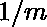
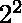
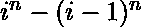
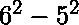
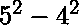
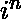
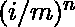

# 掷骰子 N 次后最大点数

> 原文:[https://www . geesforgeks . org/掷骰子 n 次后最大点数/](https://www.geeksforgeeks.org/maximum-number-of-dots-after-throwing-the-dice-n-times/)

给定一个 m 面骰子。骰子的第一面包含一个点，第二面包含两个点，以此类推，第 m 面包含 m 个点。每张脸都有概率出现。我们的任务是计算掷骰子次后期望的最大点数。

**示例:**

> **输入** : 2 2
> **输出**:1.7500000000000
> 这里骰子包括{1，2}。
> 那么，掷骰子两次的样本空间= 
> {(1，2)、(1，1)、(2，1)、(2，2)}
> 为(1，2)–>最大值=2
> 为(1，1)–>最大值=1
> 为(2，2)–>最大值=2
> 为(2，1)–>最大值=2
> 每个结果的概率为 0.25，
> 
> **输入** : 6 3
> **输出** : 4.958333333333

**逼近** :
这个问题的关键观察点是，一个数可以出现的次数最多取决于它的前一个数。
第一个号码是。
以 m = 6，n = 2 为例。
最大值=6 的总数等于。
最大 5 个的总数等于。
同样，我们可以找出 4、3、2 和 1。
6 6 6 6 6 6
5 5 5 5 5 5 6
4 4 4 5 6
3 3 4 5 6
2 3 4 5 6
2 3 4 5 6
1 2 3 4 5 6
枚举最大数，分布将是一个 m 边长的 n 维超立方体。每一层都是一个大立方体减去一个小立方体。
因此，我们的答案将是从 1 到 m 的所有第 I 个元素的总和，由下式给出:

计算可能会导致溢出，所以我们可以将除数移入和中，改为计算。

## C++

```
// CPP program for above implementation
#include <bits/stdc++.h>
using namespace std;

// Function find the maximum expectation
double expect(double m, double n)
{
    double ans = 0.0, i;

       for (i = m; i; i--)
        // formula to find the maximum number and
        // sum of maximum numbers
        ans += (pow(i / m, n) - pow((i - 1) / m, n)) * i;

    return ans;
}

// Driver code
int main()
{
    double m = 6, n = 3;
    cout << expect(m, n);

 return 0;
}
```

## Java 语言(一种计算机语言，尤用于创建网站)

```
// Java program for above implementation
class GFG
{
// Function find the maximum expectation
static double expect(double m, double n)
{
    double ans = 0.0, i;

    for (i = m; i > 0; i--)

        // formula to find the maximum number
        // and sum of maximum numbers
        ans += (Math.pow(i / m, n) -
                Math.pow((i - 1) / m, n)) * i;

    return ans;
}

// Driver code
public static void main(String[] args)
{
    double m = 6, n = 3;
    System.out.println(String.format("%.5f",
                             expect(m, n)));
}
}

// This code is contributed by mits
```

## 蟒蛇 3

```
# Python3 program for finding maximum
# number of dots after throwing a
# dice N times.

# Function to find the maximum
# expectation
def expect(m,n) :

    ans = 0.0
    i = m
    while (i):

        # formula to find the maximum
        # number and
        # sum of maximum numbers
        ans += (pow(i / m, n) - pow((i-1) / m, n)) * i
        i -= 1

    return ans

# Driver code
if __name__ == "__main__" :

    # multiple assignments
    m,n = 6,3

    # function calling
    print(expect(m,n))
```

## C#

```
// C# program for above implementation
using System;

class GFG
{
// Function find the maximum expectation
static double expect(double m, double n)
{
    double ans = 0.0, i;

    for (i = m; i > 0; i--)

        // formula to find the maximum number
        // and sum of maximum numbers
        ans += (Math.Pow(i / m, n) -
                Math.Pow((i - 1) / m, n)) * i;

    return ans;
}

// Driver code
public static void Main()
{
    double m = 6, n = 3;
    Console.WriteLine(expect(m, n));
}
}

// This code is contributed
// by Akanksha Rai
```

## 服务器端编程语言（Professional Hypertext Preprocessor 的缩写）

```
<?php
// PHP program for above implementation

// Function find the maximum expectation
function expect($m, $n)
{
    $ans = 0.0;

    for ($i = $m; $i; $i--)

        // formula to find the maximum number
        // and sum of maximum numbers
        $ans += (pow($i / $m, $n) -
                 pow(($i - 1) / $m, $n)) * $i;

    return $ans;
}

// Driver code
$m = 6;
$n = 3;
echo expect($m, $n);

// This code is contributed by ChitraNayal
?>
```

## java 描述语言

```
<script>
// Javascript program for above implementation

    // Function find the maximum expectation
    function expect(m,n)
    {
        let ans = 0.0, i;

        for (i = m; i > 0; i--)

        // formula to find the maximum number
        // and sum of maximum numbers
            ans += (Math.pow(i / m, n) -
                Math.pow((i - 1) / m, n)) * i;

        return ans;
    }

    // Driver code
    let m = 6, n = 3;

    document.write(expect(m, n).toFixed(5))

// This code is contributed by avanitrachhadiya2155
</script>
```

**Output:** 

```
4.95833
```

**时间复杂度:** O(m)