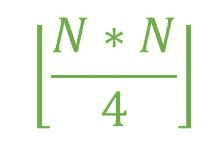

# 二部图的最大边数

> 原文:[https://www . geesforgeks . org/最大二分图边数/](https://www.geeksforgeeks.org/maximum-number-of-edges-in-bipartite-graph/)

给定一个代表顶点数的整数 **N** 。任务是在由 **N 个**顶点组成的[二部图](https://www.geeksforgeeks.org/bipartite-graph/)中找到可能的最大边数。
**二分图:**

1.  二部图是有两组顶点的图。
2.  该集合使得同一集合中的顶点之间永远不会共享一条边。

**例:**

> **输入:** N = 10
> **输出:** 25
> 两个集合都包含 5 个顶点，第一个集合
> 的每个顶点都有一条边到第二个集合
> 的每隔一个顶点，即总边= 5 * 5 = 25
> **输入:** N = 9
> **输出:** 20

**方法:**当给定集合的每个顶点都有一条边到另一个集合的每隔一个顶点时，边的数量将最大，即**边= m * n** ，其中 **m** 和 **n** 是这两个集合中的边的数量。为了最大化边数， **m** 必须等于或尽可能接近 **n** 。因此，最大边数可以用公式
计算



以下是上述方法的实现:

## C++

```
// C++ implementation of the approach
#include <bits/stdc++.h>
using namespace std;

// Function to return the maximum number
// of edges possible in a Bipartite
// graph with N vertices
int maxEdges(int N)
{
    int edges = 0;

    edges = floor((N * N) / 4);

    return edges;
}

// Driver code
int main()
{
    int N = 5;
    cout << maxEdges(N);

    return 0;
}
```

## Java 语言(一种计算机语言，尤用于创建网站)

```
// Java implementation of the approach

class GFG {

    // Function to return the maximum number
    // of edges possible in a Bipartite
    // graph with N vertices
    public static double maxEdges(double N)
    {
        double edges = 0;

        edges = Math.floor((N * N) / 4);

        return edges;
    }

    // Driver code
    public static void main(String[] args)
    {
        double N = 5;
        System.out.println(maxEdges(N));
    }
}

// This code is contributed by Naman_Garg.
```

## 蟒蛇 3

```
# Python3 implementation of the approach

# Function to return the maximum number
# of edges possible in a Bipartite
# graph with N vertices
def maxEdges(N) :

    edges = 0;

    edges = (N * N) // 4;

    return edges;

# Driver code
if __name__ == "__main__" :

    N = 5;
    print(maxEdges(N));

# This code is contributed by AnkitRai01
```

## C#

```
// C# implementation of the approach
using System;

class GFG {

    // Function to return the maximum number
    // of edges possible in a Bipartite
    // graph with N vertices
    static double maxEdges(double N)
    {
        double edges = 0;

        edges = Math.Floor((N * N) / 4);

        return edges;
    }

    // Driver code
    static public void Main()
    {
        double N = 5;
        Console.WriteLine(maxEdges(N));
    }
}

// This code is contributed by jit_t.
```

## 服务器端编程语言（Professional Hypertext Preprocessor 的缩写）

```
<?php
// PHP implementation of the approach

// Function to return the maximum number
// of edges possible in a Bipartite
// graph with N vertices

function maxEdges($N)
{
    $edges = 0;

    $edges = floor(($N * $N) / 4);

    return $edges;
}

// Driver code
    $N = 5;
    echo maxEdges($N);

// This code is contributed by ajit.
?>
```

## java 描述语言

```
<script>

// Javascript implementation of the approach

// Function to return the maximum number
// of edges possible in a Bipartite
// graph with N vertices
function maxEdges(N)
{
    var edges = 0;

    edges = Math.floor((N * N) / 4);

    return edges;
}

// Driver code
var N = 5;
document.write( maxEdges(N));

</script>
```

**Output:** 

```
6
```