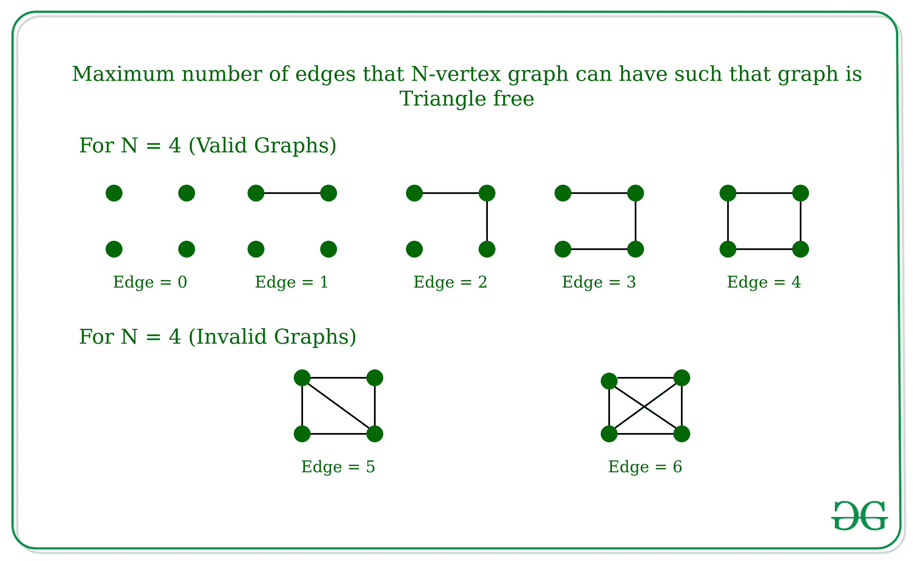
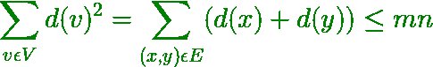
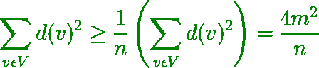

# N 顶点图可以拥有的最大边数，使得图没有三角形|曼特尔定理

> 原文:[https://www . geesforgeks . org/最大边数-n-顶点图可以有这样的图-无三角形-曼特尔斯定理/](https://www.geeksforgeeks.org/maximum-number-of-edges-that-n-vertex-graph-can-have-such-that-graph-is-triangle-free-mantels-theorem/)

给定一个数 **N** ，这是图中的节点数，任务是找到 N 顶点图可以具有的最大边数，使得图是[无三角形的](https://en.wikipedia.org/wiki/Triangle-free_graph)(这意味着图中不应该有任何三条边 A、B、C，使得 A 连接到 B，B 连接到 C，C 连接到 A)。图形不能包含自循环或多条边。

**示例:**

> **输入:** N = 4
> **输出:** 4
> **解释:**
> 
> 
> 
> **输入:** N = 3
> **输出:** 2
> **解释:**
> 如果三顶点图有三条边，那么它就有一个三角形。

**方法:**这个问题可以用[曼特尔定理](https://en.wikipedia.org/wiki/Tur%C3%A1n%27s_theorem#Mantel's_theorem)来解决，该定理指出不包含任何三角形的图的最大边数是地板(n <sup>2</sup> /4)。换句话说，要得到一个无三角形的图，必须删除将近一半的边。

**曼特尔定理是如何工作的？**
对于任何[图](https://www.geeksforgeeks.org/graph-and-its-representations/)，如果图是无三角形的，那么对于任何顶点 Z 只能连接到 x 和 y 中的任何一个顶点，即对于 x 和 y 之间连接的任何边，d(x) + d(y) ≤ N，其中 d(x)和 d(y)是顶点 x 和 y 的度数

*   然后，所有顶点的度数–



*   通过柯西-施瓦茨不等式–



*   因此，4m <sup>2</sup> / n ≤ mn，表示 m ≤ n <sup>2</sup> / 4

下面是上述方法的实现:

## C++

```
// C++ implementation to find the maximum
// number of edges for triangle free graph

#include <bits/stdc++.h>
using namespace std;

// Function to find the maximum number of
// edges in a N-vertex graph.
int solve(int n)
{
    // According to the Mantel's theorem
    // the maximum number of edges will be
    // floor of [(n^2)/4]
    int ans = (n * n / 4);

    return ans;
}

// Driver Function
int main()
{
    int n = 10;
    cout << solve(n) << endl;
    return 0;
}
```

## Java 语言(一种计算机语言，尤用于创建网站)

```
// Java implementation to find the maximum
// number of edges for triangle free graph
class GFG
{

    // Function to find the maximum number of
    // edges in a N-vertex graph.
    public static int solve(int n)
    {

        // According to the Mantel's theorem
        // the maximum number of edges will be
        // floor of [(n^2)/4]
        int ans = (n * n / 4);

        return ans;
    }

    // Driver code
    public static void main(String args[])
    {
        int n = 10;
        System.out.println(solve(n));
    }
}

// This code is contributed by divyamohan123
```

## C#

```
// C# implementation to find the maximum
// number of edges for triangle free graph
using System;

class GFG
{

    // Function to find the maximum number of
    // edges in a N-vertex graph.
    public static int solve(int n)
    {

        // According to the Mantel's theorem
        // the maximum number of edges will be
        // floor of [(n^2)/4]
        int ans = (n * n / 4);

        return ans;
    }

    // Driver code
    public static void Main()
    {
        int n = 10;
        Console.WriteLine(solve(n));
    }
}

// This code is contributed by AnkitRai01
```

## 蟒蛇 3

```
# Python3 implementation to find the maximum
# number of edges for triangle free graph

# Function to find the maximum number of
# edges in a N-vertex graph.
def solve(n):

    # According to the Mantel's theorem
    # the maximum number of edges will be
    # floor of [(n^2)/4]
    ans = (n * n // 4)

    return ans

# Driver Function
if __name__ == '__main__':
    n = 10
    print(solve(n))

# This code is contributed by mohit kumar 29
```

## java 描述语言

```
<script>

// Javascript implementation to find the maximum
// number of edges for triangle free graph

// Function to find the maximum number of
// edges in a N-vertex graph.
function solve(n)
{

    // According to the Mantel's theorem
    // the maximum number of edges will be
    // floor of [(n^2)/4]
    var ans = (n * n / 4);

    return ans;
}

// Driver code
var n = 10;

document.write(solve(n));

// This code is contributed by aashish1995

</script>
```

**Output:** 

```
25
```

**时间复杂度:** O(1)