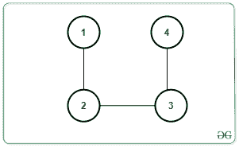
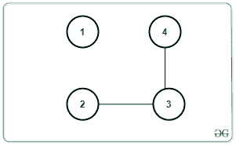
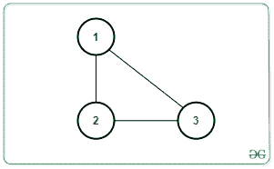
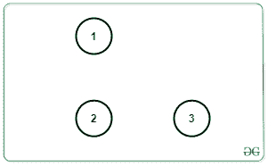

# 要移除的最大边数，以便在图形中精确地包含 K 个连通分量

> 原文:[https://www . geeksforgeeks . org/最大移除边数-包含精确 k 连接的图中组件/](https://www.geeksforgeeks.org/maximum-number-of-edges-to-be-removed-to-contain-exactly-k-connected-components-in-the-graph/)

给定一个带有 **N** 节点的[无向图](https://www.geeksforgeeks.org/graph-and-its-representations/) **G** 、 **M** 边和一个整数 **K** ，任务是找到可以移除的边的最大数量，以便在移除边后精确地保留 **K** [连接的组件](https://www.geeksforgeeks.org/connected-components-in-an-undirected-graph/)。如果图形不能包含 **K** 连接组件，打印 **-1** 。

**示例:**

> **输入:** N = 4，M = 3，K = 2，边[][] = {{1，2}，{2，3}，{3，4}}
> 
> 
> 
> **输出:** 1
> **解释:**
> 一种可能的方法是去掉边[1，2]。然后会有 2 个连接组件，如下所示:
> 
> 
> 
> **输入:** N = 3，M = 3，K = 3，边[][] = {{1，2}，{2，3}，{3，1}}
> 
> 
> 
> **输出:** 3
> **说明:**可以去掉所有边做成 3 个相连的组件，如下图:
> 
> 

**方法:**为了解决给定的问题，[计算给定图形](https://www.geeksforgeeks.org/program-to-count-number-of-connected-components-in-an-undirected-graph/)中存在的连接组件的数量。让计数为 **C** 。请注意，如果 **C** 大于 **K** ，则没有可能的边缘去除会生成 **K** 连接的组件，因为连接的组件数量只会增加。否则，答案将永远存在。

为了解决问题，需要进行以下观察:

*   假设 C <sub>1</sub> 、C <sub>2</sub> 、…、C <sub>c</sub> 是每个连接组件中的节点数。然后，每个组件必须有边缘，如 C<sub>1</sub>–1、C<sub>2</sub>–1、…、C <sub>c</sub> -1。因此，

> **C<sub>1</sub>–1+C<sub>2</sub>–1+…+C<sub>C</sub>–1 = C<sub>1</sub>+C<sub>2</sub>+…+C<sub>C</sub>–C = N–C**，其中 **N** 为节点数。

*   上述条件将通过移除**M –( N–C)**边来给我们 **C** 连接的组件，因为制造 **C** 组件需要**N–C**边。要获得 **K** 组件，**(K–C)**必须移除更多边缘。
*   因此，要移除的边的总数由下式给出:

> **M –( N–C)+(K–C)= M–N+K**T2】

按照以下步骤解决问题:

1.  [计算给定图形中存在的连接组件的数量](https://www.geeksforgeeks.org/program-to-count-number-of-connected-components-in-an-undirected-graph/)。让伯爵成为 **C** 。
2.  如果 **C** 大于 **K** ，打印 **-1** 。
3.  否则打印**M–N+K**，其中 **N** 为节点数 f， **M** 为边数， **K** 为所需连接组件数。

下面是上述方法的实现:

## C++

```
// C++ program for the above approach
#include <bits/stdc++.h>
using namespace std;

class Graph
{
  public:
    int V;
    map<int, vector<int>> adj;

    Graph(int);
    void addEdge(int, int);
    void DFS(int, vector<bool> &);
} * g;

// Constructor
Graph::Graph(int V)
{

  // No. of vertices
  this->V = V;

  // Dictionary of lists
  for(int i = 1; i <= V; i++)
    adj[i] = vector<int>();
}

// Function to add edge
// in the graph
void Graph::addEdge(int v, int w)
{
  adj[v].push_back(w);
  adj[w].push_back(v);
}

// Function to perform DFS
void Graph::DFS(int s, vector<bool> &visited)
{

  // Create a stack for DFS
  stack<int> stack;

  // Push the current source node
  stack.push(s);
  while (!stack.empty())
  {

    // Pop a vertex from stack
    // and print it
    s = stack.top();
    stack.pop();

    // Traverse adjacent vertices
    // of the popped vertex s
    for(auto node : adj[s])
    {
      if (!visited[node])
      {

        // If adjacent is unvisited,
        // push it to the stack
        visited[node] = true;
        stack.push(node);
      }
    }
  }
}

// Function to return the count
// edges removed
void countRemovedEdges(int N, int M, int K)
{
  int C = 0;

  // Initially mark all vertices
  // as not visited
  vector<bool> visited(g->V + 1, false);

  for(int node = 1; node <= N; node++)
  {

    // If node is unvisited
    if (!visited[node])
    {

      // Increment Connected
      // component count by 1
      C = C + 1;

      // Perform DFS Traversal
      g->DFS(node, visited);

      // Print the result
      if (C <= K)
        cout << M - N + K << endl;
      else
        cout << -1 << endl;
    }
  }
}

// Driver Code
int main(int argc, char const *argv[])
{
  int N = 4, M = 3, K = 2;

  // Create Graph
  g = new Graph(N);

  // Given Edges
  g->addEdge(1, 2);
  g->addEdge(2, 3);
  g->addEdge(3, 4);

  // Function Call
  countRemovedEdges(N, M, K);
}

// This code is contributed by sanjeev2552
```

## Java 语言(一种计算机语言，尤用于创建网站)

```
// Java program to implement 
// the above approach
import java.util.*;
class GFG
{

  static ArrayList<ArrayList<Integer>> graph;

  // Function to perform DFS
  static void DFS(int s, boolean[] visited)
  {

    // Create a stack for DFS
    Stack<Integer> stack = new Stack<>();

    // Push the current source node
    stack.push(s);
    while (!stack.isEmpty())
    {

      // Pop a vertex from stack
      // and print it
      s = stack.peek();
      stack.pop();

      // Traverse adjacent vertices
      // of the popped vertex s
      for(Integer node : graph.get(s))
      {
        if (!visited[node])
        {

          // If adjacent is unvisited,
          // push it to the stack
          visited[node] = true;
          stack.push(node);
        }
      }
    }
  }

  // Function to return the count
  // edges removed
  static void countRemovedEdges(int N, int M, int K)
  {
    int C = 0;

    // Initially mark all vertices
    // as not visited
    boolean[] visited = new boolean[N+1];

    for(int node = 1; node <= N; node++)
    {

      // If node is unvisited
      if (!visited[node])
      {

        // Increment Connected
        // component count by 1
        C = C + 1;

        // Perform DFS Traversal
        DFS(node, visited);

        // Print the result
        if (C <= K)
          System.out.println(M - N + K);
        else
          System.out.println(-1);
      }
    }
  }

  // Driver code
  public static void main (String[] args)
  {
    int N = 4, M = 3, K = 2;

    // Create Graph
    graph = new ArrayList<>();

    for(int i = 0; i <= N; i++)
      graph.add(new ArrayList<Integer>());

    // Given Edges
    graph.get(1).add(2);
    graph.get(2).add(3);
    graph.get(3).add(4);

    // Function Call
    countRemovedEdges(N, M, K);
  }
}

// This code is contributed by offbeat.
```

## 蟒蛇 3

```
# Python3 program for the above approach

class Graph:

    # Constructor
    def __init__(self, V):

        # No. of vertices
        self.V = V

        # Dictionary of lists
        self.adj = {i: [] for i in range(1, V + 1)}

    # Function to add edge
    # in the graph
    def addEdge(self, v, w):
        self.adj[v].append(w)
        self.adj[w].append(v)

    # Function to perform DFS
    def DFS(self, s, visited):

    # Create a stack for DFS
        stack = []

        # Push the current source node
        stack.append(s)
        while (len(stack)):

            # Pop a vertex from stack
            # and print it
            s = stack[-1]
            stack.pop()

            # Traverse adjacent vertices
            # of the popped vertex s
            for node in self.adj[s]:
                if (not visited[node]):

                    # If adjacent is unvisited,
                    # push it to the stack
                    visited[node] = True
                    stack.append(node)

# Function to return the count
# edges removed
def countRemovedEdges(N, M, K):

    C = 0

    # Initially mark all vertices
    # as not visited
    visited = [False for i in range(g.V + 1)]

    for node in range(1, N + 1):

        # If node is unvisited
        if (not visited[node]):

            # Increment Connected
            # component count by 1
            C = C + 1

            # Perform DFS Traversal
            g.DFS(node, visited)

    # Print the result
    if C <= K:
        print(M - N + K)
    else:
        print(-1)

# Driver Code

N, M, K = 4, 3, 2

# Create Graph
g = Graph(N)

# Given Edges
g.addEdge(1, 2)
g.addEdge(2, 3)
g.addEdge(3, 4)

# Function Call
countRemovedEdges(N, M, K)
```

## C#

```
// C# program to implement
// the above approach
using System;
using System.Collections.Generic;
class GFG {

  static List<List<int>> graph;

  // Function to perform DFS
  static void DFS(int s, bool[] visited)
  {

    // Create a stack for DFS
    Stack<int> stack = new Stack<int>();

    // Push the current source node
    stack.Push(s);
    while (stack.Count > 0)
    {

      // Pop a vertex from stack
      // and print it
      s = (int)stack.Peek();
      stack.Pop();

      // Traverse adjacent vertices
      // of the popped vertex s
      foreach(int node in graph[s])
      {
        if (!visited[node])
        {

          // If adjacent is unvisited,
          // push it to the stack
          visited[node] = true;
          stack.Push(node);
        }
      }
    }
  }

  // Function to return the count
  // edges removed
  static void countRemovedEdges(int N, int M, int K)
  {
    int C = 0;

    // Initially mark all vertices
    // as not visited
    bool[] visited = new bool[N+1];

    for(int node = 1; node <= N; node++)
    {

      // If node is unvisited
      if (!visited[node])
      {

        // Increment Connected
        // component count by 1
        C = C + 1;

        // Perform DFS Traversal
        DFS(node, visited);

        // Print the result
        if (C <= K)
          Console.WriteLine(M - N + K);
        else
          Console.WriteLine(-1);
      }
    }
  }

  // Driver code
  static void Main() {
    int N = 4, M = 3, K = 2;

    // Create Graph
    graph = new List<List<int>>();

    for(int i = 0; i <= N; i++)
      graph.Add(new List<int>());

    // Given Edges
    graph[1].Add(2);
    graph[2].Add(3);
    graph[3].Add(4);

    // Function Call
    countRemovedEdges(N, M, K);
  }
}

// This code is contributed by rameshtravel07.
```

## java 描述语言

```
<script>

    // JavaScript program for the above approach

    let graph;

    // Function to perform DFS
    function DFS(s, visited)
    {

      // Create a stack for DFS
      let stack = [];

      // Push the current source node
      stack.push(s);
      while (stack.length > 0)
      {

        // Pop a vertex from stack
        // and print it
        s = stack[stack.length - 1];
        stack.pop();

        // Traverse adjacent vertices
        // of the popped vertex s
        for(let node = 0; node < graph[s].length; node++)
        {
          if (!visited[graph[s][node]])
          {

            // If adjacent is unvisited,
            // push it to the stack
            visited[graph[s][node]] = true;
            stack.push(graph[s][node]);
          }
        }
      }
    }

    // Function to return the count
    // edges removed
    function countRemovedEdges(N, M, K)
    {
      let C = 0;

      // Initially mark all vertices
      // as not visited
      let visited = new Array(N+1);
      visited.fill(false);

      for(let node = 1; node <= N; node++)
      {

        // If node is unvisited
        if (!visited[node])
        {

          // Increment Connected
          // component count by 1
          C = C + 1;

          // Perform DFS Traversal
          DFS(node, visited);

          // Print the result
          if (C <= K)
            document.write((M - N + K) + "</br>");
          else
            document.write(-1 + "</br>");
        }
      }
    }

    let N = 4, M = 3, K = 2;

    // Create Graph
    graph = [];

    for(let i = 0; i <= N; i++)
      graph.push([]);

    // Given Edges
    graph[1].push(2);
    graph[2].push(3);
    graph[3].push(4);

    // Function Call
    countRemovedEdges(N, M, K);

</script>
```

**Output:** 

```
1
```

***时间复杂度:** O(N + M)*
***辅助空间:** O(M + N)*