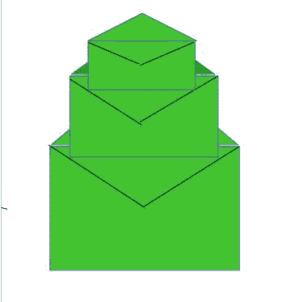

# 可以放入其他较大信封的最大信封数量

> 原文:[https://www . geeksforgeeks . org/可放入其他更大信封的最大信封数/](https://www.geeksforgeeks.org/maximum-number-of-envelopes-that-can-be-put-inside-other-bigger-envelopes/)

给定 **N** 个信封，作为 **{W，H}** 对，其中 **W** 为宽度， **H** 为高度。当且仅当一个信封的宽度和高度都大于另一个信封的宽度和高度时，一个信封才能放入另一个信封。找出可以放入另一个信封的最大信封数，以此类推。不允许旋转信封。

[](https://media.geeksforgeeks.org/wp-content/uploads/20200612225032/envelopes.jpg)

**示例:**

> **输入:**信封[] = {{4，3}、{5，3}、{5，6}、{1，2}}
> **输出:** 3
> **说明:**
> 可以放入另一个信封
> 的最大信封数为 3 个。
> ({1，2}、{4，3}、{5，6})
> 
> **输入:**信封[] = {{3，6}、{5，4}、{4，8}、{6，9}、{10，7}、{12，12 } }
> T3】输出:4
> T6】说明:T8】可以放入另一个信封的最大信封数为 4 个。
> ({3，6}、{4，8}、{6，9}、{12，12})

**天真方法:**这个问题类似于[动态规划](https://www.geeksforgeeks.org/dynamic-programming/)的[最长递增子序列](https://www.geeksforgeeks.org/longest-increasing-subsequence-dp-3/)问题。这个想法是按照不递减的顺序对信封进行排序，并检查每个信封中可以放入的信封数量。按照以下步骤解决问题:

*   按照宽度和高度的非递减顺序对数组进行排序。
*   初始化一个***【DP】***数组，其中***DP【I】***存储可以放进去的信封数量，以 ***信封【I】***为最大信封。
*   对于每个 ***包络【I】，*** 循环通过小于其自身的包络，并检查较小包络的宽度和高度是否严格小于 ***包络【I】。*** 如果小于，可以把小于的信封放在 ***信封【I】里面。***
*   ***【DP】***数组的最大值给出了可以相互放入的最大信封数。

下面是上述方法的实现:

## C++

```
// C++ program for the above approach
#include <bits/stdc++.h>
using namespace std;

// Function that returns the maximum
// number of envelopes that can be
// inserted into another envelopes
int maxEnvelopes(vector<vector<int> > envelopes)
{
    // Number of envelopes
    int N = envelopes.size();

    if (N == 0)
        return N;

    // Sort the envelopes in
    // non-decreasing order
    sort(envelopes.begin(),
        envelopes.end());

    // Initialize dp[] array
    int dp[N];

    // To store the result
    int max_envelope = 1;

    dp[0] = 1;

    // Loop through the array
    for (int i = 1; i < N; ++i) {
        dp[i] = 1;

        // Find envelopes count for
        // each envelope
        for (int j = 0; j < i; ++j) {

            if (envelopes[i][0] > envelopes[j][0]
                && envelopes[i][1] > envelopes[j][1]
                && dp[i] < dp[j] + 1)
                dp[i] = dp[j] + 1;
        }

        // Store maximum envelopes count
        max_envelope = max(max_envelope,
                        dp[i]);
    }

    // Return the result
    return max_envelope;
}

// Driver Code
int main()
{
    // Given the envelopes
    vector<vector<int> > envelopes
        = { { 4, 3 }, { 5, 3 }, { 5, 6 }, { 1, 2 } };

    // Function Call
    cout << maxEnvelopes(envelopes);

    return 0;
}
```

## Java 语言(一种计算机语言，尤用于创建网站)

```
// Java program for the above approach
import java.util.*;
import java.lang.*;

class GFG{

// Function that returns the maximum
// number of envelopes that can be
// inserted into another envelopes
static int maxEnvelopes(int[][] envelopes)
{

    // Number of envelopes
    int N = envelopes.length;

    if (N == 0)
        return N;

    // Sort the envelopes in
    // non-decreasing order
    Arrays.sort(envelopes,
               (a, b) -> (a[0] != b[0]) ?
                          a[0] - b[0] :
                          a[1] - b[1]);

    // Initialize dp[] array
    int[] dp = new int[N];

    // To store the result
    int max_envelope = 1;

    dp[0] = 1;

    // Loop through the array
    for(int i = 1; i < N; ++i)
    {
        dp[i] = 1;

        // Find envelopes count for
        // each envelope
        for(int j = 0; j < i; ++j)
        {

            if (envelopes[i][0] > envelopes[j][0] &&
                envelopes[i][1] > envelopes[j][1] &&
                          dp[i] < dp[j] + 1)
                dp[i] = dp[j] + 1;
        }

        // Store maximum envelopes count
        max_envelope = Math.max(max_envelope, dp[i]);
    }

    // Return the result
    return max_envelope;
}

// Driver Code
public static void main (String[] args)
{

    // Given the envelopes
    int[][] envelopes = { { 4, 3 }, { 5, 3 },
                          { 5, 6 }, { 1, 2 } };

    // Function call
    System.out.println(maxEnvelopes(envelopes));
}
}

// This code is contributed by offbeat
```

## 蟒蛇 3

```
# Python3 program for the above approach

# Function that returns the maximum
# number of envelopes that can be
# inserted into another envelopes
def maxEnvelopes(envelopes):

    # Number of envelopes
    N = len(envelopes)

    if (N == 0):
        return N

    # Sort the envelopes in
    # non-decreasing order
    envelopes = sorted(envelopes)

    # Initialize dp[] array
    dp = [0] * N

    # To store the result
    max_envelope = 1

    dp[0] = 1

    # Loop through the array
    for i in range(1, N):
        dp[i] = 1

        # Find envelopes count for
        # each envelope
        for j in range(i):

            if (envelopes[i][0] > envelopes[j][0]
                and envelopes[i][1] > envelopes[j][1]
                and dp[i] < dp[j] + 1):
                dp[i] = dp[j] + 1

        # Store maximum envelopes count
        max_envelope = max(max_envelope, dp[i])

    # Return the result
    return max_envelope

# Driver Code
if __name__ == '__main__':

    # Given the envelopes
    envelopes = [ [ 4, 3 ], [ 5, 3 ],
                [ 5, 6 ], [ 1, 2 ] ]

    # Function Call
    print(maxEnvelopes(envelopes))

# This code is contributed by Mohit Kumar
```

## java 描述语言

```
<script>

// JavaScript program for the above approach

// Function that returns the maximum
// number of envelopes that can be
// inserted into another envelopes
function maxEnvelopes(envelopes)
{
    // Number of envelopes
    var N = envelopes.length;

    if (N == 0)
        return N;

    // Sort the envelopes in
    // non-decreasing order
    envelopes.sort();

    // Initialize dp[] array
    var dp = Array(N);

    // To store the result
    var max_envelope = 1;

    dp[0] = 1;

    // Loop through the array
    for (var i = 1; i < N; ++i) {
        dp[i] = 1;

        // Find envelopes count for
        // each envelope
        for (var j = 0; j < i; ++j) {

            if (envelopes[i][0] > envelopes[j][0]
                && envelopes[i][1] > envelopes[j][1]
                && dp[i] < dp[j] + 1)
                dp[i] = dp[j] + 1;
        }

        // Store maximum envelopes count
        max_envelope = Math.max(max_envelope,
                        dp[i]);
    }

    // Return the result
    return max_envelope;
}

// Driver Code

// Given the envelopes
var envelopes
    = [ [ 4, 3 ], [ 5, 3 ], [ 5, 6 ], [ 1, 2 ] ];

// Function Call
document.write( maxEnvelopes(envelopes));

</script>
```

**Output:** 

```
3
```

***时间复杂度:**O(N<sup>2</sup>)*
***辅助空间:** O(N)*

**高效方法:**优化幼稚方法的思路是使用[【二分搜索法】](https://www.geeksforgeeks.org/binary-search/) 和[最长递增子序列](https://www.geeksforgeeks.org/longest-monotonically-increasing-subsequence-size-n-log-n/)的概念。如果宽度相同，则按照宽度的递增顺序和高度的递减顺序对信封进行排序，将问题简化为寻找信封高度的最长递增顺序。这种方法是可行的，因为宽度已经按递增顺序排序，只有高度的最大递增顺序才足以找到最大数量的信封。在[这篇](https://www.geeksforgeeks.org/longest-monotonically-increasing-subsequence-size-n-log-n/)文章中讨论了在 **N×log(N)** 方法中寻找最长递增序列的有效方法。

下面是上述方法的实现:

## C++

```
// C++ program for the above approach
#include <bits/stdc++.h>
using namespace std;

// Function that returns the maximum
// number of envelopes that can be
// inserted into another envelopes
int maxEnvelopes(vector<vector<int> >& envelopes)
{
    // Number of envelopes
    int N = envelopes.size();

    if (N == 0)
        return N;

    // Sort the envelopes in increasing
    // order of width and decreasing order
    // of height is width is same
    sort(envelopes.begin(), envelopes.end(),
        [](vector<int>& a, vector<int>& b) {
            return a[0] < b[0]
                    or (a[0] == b[0] and a[1] > b[1]);
        });

    // To store the longest increasing
    // sequence of height
    vector<int> dp;

    // Finding LIS of the heights
    // of the envelopes
    for (int i = 0; i < N; ++i) {
        auto iter = lower_bound(dp.begin(),
                                dp.end(),
                                envelopes[i][1]);

        if (iter == dp.end())
            dp.push_back(envelopes[i][1]);
        else if (envelopes[i][1] < *iter)
            *iter = envelopes[i][1];
    }

    // Return the result
    return dp.size();
}

// Driver Code
int main()
{
    // Given the envelopes
    vector<vector<int> > envelopes
        = { { 4, 3 }, { 5, 3 }, { 5, 6 }, { 1, 2 } };

    // Function Call
    cout << maxEnvelopes(envelopes);
    return 0;
}
```

**Output:** 

```
3
```

***时间复杂度:**O(*N * log(N)*)*
***辅助空间:** O(N)*