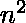

# 给定约束条件下 N*N 矩阵中的最大个数

> 原文:[https://www . geeksforgeeks . org/带给定约束的最大一进制数矩阵/](https://www.geeksforgeeks.org/maximum-number-of-ones-in-a-nn-matrix-with-given-constraints/)

给定两个整数和，其中。求一个二进制矩阵中一个的最大个数，使得每个大小为的子矩阵至少有一个单元格为零。

**示例:**

```
Input:5 3
Output: Maximum number of ones = 24
The matrix will be:
1 1 1 1 1
1 1 1 1 1 
1 1 0 1 1 
1 1 1 1 1
1 1 1 1 1 

Input:5 2
Output: Maximum number of ones = 21
The matrix will be:
1 1 1 1 1
1 0 1 0 1 
1 1 1 1 1 
1 0 1 0 1
1 1 1 1 1 
```

**方法**问题可以用贪婪的方法解决。在第一个正方形子矩阵的右下角放置一个零，即坐标为(1，1)和(x，x)的子矩阵，对称创建矩阵的其余部分，我们可以得到最小数量的零，或者说，最大数量的 1。因此，通过观察，可以得出一个共同的结论:在最小排列中有个零。NxN 矩阵中可用的细胞总数为。

> 。

下面是上述方法的实现:

## C++

```
// C++ program to get Maximum Number of
// ones in a matrix with given constraints
#include <bits/stdc++.h>

using namespace std;

// Function that returns the maximum
// number  of ones
int getMaxOnes(int n, int x)
{
    // Minimum number of zeroes
    int zeroes = (n / x);
    zeroes = zeroes * zeroes;

    // Totol cells = square of the size of the matrices
    int total = n * n;

    // Initialising the answer
    int ans =  total - zeroes;

    return ans;
}

// Driver code
int main()
{
    // Initialising the variables
    int n = 5;
    int x = 2;

    cout << getMaxOnes(n, x);

    return 0;
}
```

## Java 语言(一种计算机语言，尤用于创建网站)

```
// Java program to get Maximum
// Number of ones in a matrix
// with given constraints
import java.io.*;

class GFG
{

// Function that returns
// the maximum number of ones
static int getMaxOnes(int n,
                      int x)
{
    // Minimum number of zeroes
    int zeroes = (n / x);
    zeroes = zeroes * zeroes;

    // Totol cells = square of
    // the size of the matrices
    int total = n * n;

    // Initialising the answer
    int ans = total - zeroes;

    return ans;
}

// Driver code
public static void main (String[] args)
{

// Initialising the variables
int n = 5;
int x = 2;
System.out.println(getMaxOnes(n, x));
}
}

// This code is contributed
// by akt_mit
```

## 蟒蛇 3

```
# Python3 program to get
# Maximum Number of ones
# in a matrix with given
# constraints

# Function that returns
# the maximum number of ones
def getMaxOnes(n, x):

    # Minimum number
    # of zeroes
    zeroes = (int)(n / x);
    zeroes = zeroes * zeroes;

    # Totol cells = square of
    # the size of the matrices
    total = n * n;

    # Initialising
    # the answer
    ans = total - zeroes;

    return ans;

# Driver code

# Initialising the variables
n = 5;
x = 2;
print(getMaxOnes(n, x));

# This code is contributed
# by mits
```

## C#

```
// C# program to get Maximum
// Number of ones in a matrix
// with given constraints
using System;

class GFG
{

// Function that returns
// the maximum number of ones
static int getMaxOnes(int n,
                      int x)
{
    // Minimum number of zeroes
    int zeroes = (n / x);
    zeroes = zeroes * zeroes;

    // Totol cells = square of
    // the size of the matrices
    int total = n * n;

    // Initialising the answer
    int ans = total - zeroes;

    return ans;
}

// Driver code
static public void Main ()
{

    // Initialising the
    // variables
    int n = 5;
    int x = 2;
    Console.WriteLine(getMaxOnes(n, x));
}
}

// This code is contributed
// by ajit
```

## 服务器端编程语言（Professional Hypertext Preprocessor 的缩写）

```
<?php
// PHP program to get Maximum
// Number of ones in a matrix
// with given constraints

// Function that returns
// the maximum number of ones
function getMaxOnes($n, $x)
{
    // Minimum number
    // of zeroes
    $zeroes = (int)($n / $x);
    $zeroes = $zeroes *
              $zeroes;

    // Totol cells = square of
    // the size of the matrices
    $total = $n * $n;

    // Initialising
    // the answer
    $ans = $total - $zeroes;

    return $ans;
}

// Driver code

// Initialising
// the variables
$n = 5;
$x = 2;
echo getMaxOnes($n, $x);

// This code is contributed
// by akt_mit
?>
```

## java 描述语言

```
<script>

// Javascript program to get Maximum Number of
// ones in a matrix with given constraints

// Function that returns the maximum
// number of ones
function getMaxOnes(n, x)
{

    // Minimum number of zeroes
    let zeroes = parseInt(n / x, 10);
    zeroes = zeroes * zeroes;

    // Totol cells = square of the
    // size of the matrices
    let total = n * n;

    // Initialising the answer
    let ans =  total - zeroes;

    return ans;
}

// Driver Code

// Initialising the variables
let n = 5;
let x = 2;

document.write(getMaxOnes(n, x));

// This code is contributed by mukesh07   

</script>
```

**Output:** 

```
21
```

**时间复杂度:**O(1)
T3】辅助空间: O(1)