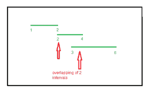
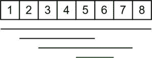

# 最大重叠间隔数

> 原文:[https://www . geesforgeks . org/最大重叠间隔数/](https://www.geeksforgeeks.org/maximum-number-of-overlapping-intervals/)

给定不同的时间间隔，任务是随时打印这些时间间隔之间的最大重叠数量。

**示例:**

> **输入:** v = {{1，2}、{2，4}、{3，6}}
> **输出:** 2
> 最大重叠为 2(在(1 2)和(2 4)之间或在(2 4)和(3 6)之间)
> 
> 
> 
> **输入:** v = {{1，8}、{2，5}、{5，6}、{3，7}}
> **输出:** 4
> 最大重叠为 4(在(1，8)、(2，5)、(5，6)和(3，7)之间)
> 
> 

**进场:**

*   其思想是将坐标存储在一个新的由字符“x”和“y”映射而成的向量对中，以识别坐标。
*   对向量进行排序。
*   遍历向量，如果遇到一个 x 坐标，意味着增加了一个新的范围，所以更新计数，如果遇到 y 坐标，意味着减去了一个范围。
*   更新每个新坐标的计数值，取最大值。

下面是上述方法的实现:

## C++

```
// C++ program that print maximum
// number of overlap
// among given ranges
#include <bits/stdc++.h>
using namespace std;

// Function that print maximum
// overlap among ranges
void overlap(vector<pair<int, int> > v)
{
    // variable to store the maximum
    // count
    int ans = 0;
    int count = 0;
    vector<pair<int, char> > data;

    // storing the x and y
    // coordinates in data vector
    for (int i = 0; i < v.size(); i++) {

        // pushing the x coordinate
        data.push_back({ v[i].first, 'x' });

        // pushing the y coordinate
        data.push_back({ v[i].second, 'y' });
    }

    // sorting of ranges
    sort(data.begin(), data.end());

    // Traverse the data vector to
    // count number of overlaps
    for (int i = 0; i < data.size(); i++) {

        // if x occur it means a new range
        // is added so we increase count
        if (data[i].second == 'x')
            count++;

        // if y occur it means a range
        // is ended so we decrease count
        if (data[i].second == 'y')
            count--;

        // updating the value of ans
        // after every traversal
        ans = max(ans, count);
    }

    // printing the maximum value
    cout << ans << endl;
}

// Driver code
int main()
{
    vector<pair<int, int> > v
        = { { 1, 2 }, { 2, 4 }, { 3, 6 } };
    overlap(v);
    return 0;
}
```

## Java 语言(一种计算机语言，尤用于创建网站)

```
// Java program that print maximum 
// number of overlap among given ranges 
import java.util.*;
import java.lang.*;
import java.io.*;
class GFG{

static class pair
{
    int first;
    char second;

    pair(int first, char second)
    {
        this.first = first;
        this.second = second;
    }
}

// Function that print maximum 
// overlap among ranges 
static void overlap(int[][] v) 
{ 

    // Variable to store the maximum 
    // count 
    int ans = 0; 
    int count = 0; 
    ArrayList<pair> data = new ArrayList<>(); 

    // Storing the x and y 
    // coordinates in data vector 
    for(int i = 0; i < v.length; i++)
    { 

        // Pushing the x coordinate 
        data.add(new pair(v[i][0], 'x')); 

        // pushing the y coordinate 
        data.add(new pair(v[i][1], 'y')); 
    } 

    // Sorting of ranges 
    Collections.sort(data, (a, b) -> a.first - b.first); 

    // Traverse the data vector to 
    // count number of overlaps 
    for(int i = 0; i < data.size(); i++) 
    { 

        // If x occur it means a new range 
        // is added so we increase count 
        if (data.get(i).second == 'x') 
            count++; 

        // If y occur it means a range 
        // is ended so we decrease count 
        if (data.get(i).second == 'y') 
            count--; 

        // Updating the value of ans 
        // after every traversal 
        ans = Math.max(ans, count); 
    } 

    // Printing the maximum value 
    System.out.println(ans); 
}

// Driver code
public static void main(String[] args) 
{
    int[][] v = { { 1, 2 }, 
                  { 2, 4 }, 
                  { 3, 6 } }; 
    overlap(v); 
}
}

// This code is contributed by offbeat
```

## 蟒蛇 3

```
# Python3 program that print maximum
# number of overlap
# among given ranges

# Function that prmaximum
# overlap among ranges
def overlap(v):

    # variable to store the maximum
    # count
    ans = 0
    count = 0
    data = []

    # storing the x and y
    # coordinates in data vector
    for i in range(len(v)):

        # pushing the x coordinate
        data.append([v[i][0], 'x'])

        # pushing the y coordinate
        data.append([v[i][1], 'y'])

    # sorting of ranges
    data = sorted(data)

    # Traverse the data vector to
    # count number of overlaps
    for i in range(len(data)):

        # if x occur it means a new range
        # is added so we increase count
        if (data[i][1] == 'x'):
            count += 1

        # if y occur it means a range
        # is ended so we decrease count
        if (data[i][1] == 'y'):
            count -= 1

        # updating the value of ans
        # after every traversal
        ans = max(ans, count)

    # printing the maximum value
    print(ans)

# Driver code
v = [ [ 1, 2 ], [ 2, 4 ], [ 3, 6 ] ]
overlap(v)

# This code is contributed by mohit kumar 29
```

## java 描述语言

```
<script>

// Javascript program that print maximum
// number of overlap among given ranges

// Function that print maximum
// overlap among ranges
function overlap(v)
{

    // Variable to store the maximum
    // count
    var ans = 0;
    var count = 0;
    var data = [];

    // Storing the x and y
    // coordinates in data vector
    for(var i = 0; i < v.length; i++) 
    {

        // Pushing the x coordinate
        data.push([v[i][0], 'x']);

        // Pushing the y coordinate
        data.push([v[i][1], 'y']);
    }

    // Sorting of ranges
    data.sort();

    // Traverse the data vector to
    // count number of overlaps
    for(var i = 0; i < data.length; i++) 
    {

        // If x occur it means a new range
        // is added so we increase count
        if (data[i][1] == 'x')
            count++;

        // If y occur it means a range
        // is ended so we decrease count
        if (data[i][1] == 'y')
            count--;

        // Updating the value of ans
        // after every traversal
        ans = Math.max(ans, count);
    }

    // Printing the maximum value
    document.write(ans + "<br>");
}

// Driver code
var v = [ [ 1, 2 ], [ 2, 4 ], [ 3, 6 ] ];
overlap(v);

// This code is contributed by rutvik_56

</script>
```

**Output:** 

```
2
```