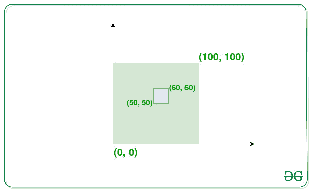

# 至少有一个公共点的重叠矩形的最大数量

> 原文:[https://www . geeksforgeeks . org/至少有一个公共点的最大重叠矩形数/](https://www.geeksforgeeks.org/maximum-number-of-overlapping-rectangles-with-at-least-one-common-point/)

给定大小为 **N** 的四个[阵列](https://www.geeksforgeeks.org/introduction-to-arrays/) **x1[]** 、 **x2[]** 、 **y1[]** 、 **y2[]** ，其中( **x1[i]** 、 **y1[i]** )表示矩形的左下角和( **x2[i]** 、 **y2[i]** )右上角，

**示例:**

> **输入:** N = 2 x1[] = {0，50} y1[] = {0，50} x2[] = {100，60} y2[] = {100，60}
> **输出:** 2
> **说明:**有两个矩形{{0，0}、{100，100}}、{{50，50}、{60，60}}两者相交，如下图所示:
> 
> 
> 
> **输入:** N = 2 x1[] = {0，100} y1[] = {0，100} x2[] = {100，200} y2[] = {100，200}
> **输出:** 1

**方法:**给定的问题可以通过使用[贪婪方法](https://www.geeksforgeeks.org/greedy-algorithms/)来解决，该方法基于这样的思想，即坐标平面上的每个矩形都有自己的区域，当多个矩形添加到同一平面上时，它们会在彼此之间产生交集。因此，要选择公共区域上重叠的最大矩形数，请贪婪地选择 **1×1 单位**的区域，因为所有重叠区域都至少有这么多块。按照以下步骤解决给定的问题:

*   因为有 **N** 个矩形，每个矩形有 **2 个 X 坐标**和 **2 个 Y 坐标**。共有 **2*N** 个 **X 坐标**和 **Y 坐标**。
*   因此，创建一个 **X** 和 **Y** 坐标的[向量](https://www.geeksforgeeks.org/vector-in-cpp-stl/)，并从相应向量中的矩形推所有 **X 的**和 **Y 的**。
*   初始化一个变量，比如说**最大矩形**为 **0** ，存储最大重叠矩形。
*   [遍历向量](https://www.geeksforgeeks.org/how-to-iterate-through-a-vector-without-using-iterators-in-c/) **X[]** ，对于每个坐标 **X[i]** ，遍历向量 **Y[]** ，找到与 **X[i]** 重叠的矩形数量，在此步骤之后，将**最大矩形**的值更新为最大值**最大矩形**，并对当前迭代获得的值进行计数。
*   完成上述步骤后，打印**最大矩形**的值作为结果。

下面是上述方法的实现:

## C++

```
// C++ program for the above approach

#include <bits/stdc++.h>
using namespace std;

// Function to find the maximum number
// of overlapping rectangles
void maxOverlappingRectangles(
    int x1[], int y1[], int x2[],
    int y2[], int N)
{
    // Stores the maximum count of
    // overlapping rectangles
    int max_rectangles = 0;

    // Stores the X and Y coordinates
    vector<int> X, Y;

    for (int i = 0; i < N; i++) {
        X.push_back(x1[i]);
        X.push_back(x2[i] - 1);
        Y.push_back(y1[i]);
        Y.push_back(y2[i] - 1);
    }

    // Iterate over all pairs of Xs and Ys
    for (int i = 0; i < X.size(); i++) {

        for (int j = 0; j < Y.size(); j++) {

            // Store the count for the
            // current X and Y
            int cnt = 0;
            for (int k = 0; k < N; k++) {

                if (X[i] >= x1[k]
                    && X[i] + 1 <= x2[k]
                    && Y[j] >= y1[k]
                    && Y[j] + 1 <= y2[k]) {
                    cnt++;
                }
            }

            // Update the maximum count of
            // rectangles
            max_rectangles = max(
                max_rectangles, cnt);
        }
    }

    // Returns the total count
    cout << max_rectangles;
}

// Driver Code
int main()
{
    int x1[] = { 0, 50 };
    int y1[] = { 0, 50 };
    int x2[] = { 100, 60 };
    int y2[] = { 100, 60 };
    int N = sizeof(x1) / sizeof(x1[0]);

    maxOverlappingRectangles(
        x1, y1, x2, y2, N);

    return 0;
}
```

## Java 语言(一种计算机语言，尤用于创建网站)

```
// java program for the above approach
import java.util.*;
class GFG
{

  // Function to find the maximum number
  // of overlapping rectangles
  static void maxOverlappingRectangles(int[] x1, int[] y1,
                                       int[] x2, int[] y2,
                                       int N)
  {

    // Stores the maximum count of
    // overlapping rectangles
    int max_rectangles = 0;

    // Stores the X and Y coordinates
    Vector<Integer> X = new Vector<>();
    Vector<Integer> Y = new Vector<>();

    for (int i = 0; i < N; i++) {
      X.add(x1[i]);
      X.add(x2[i] - 1);
      Y.add(y1[i]);
      Y.add(y2[i] - 1);
    }

    // Iterate over all pairs of Xs and Ys
    for (int i = 0; i < X.size(); i++) {

      for (int j = 0; j < Y.size(); j++) {

        // Store the count for the
        // current X and Y
        int cnt = 0;
        for (int k = 0; k < N; k++) {

          if (X.get(i)>= x1[k] && X.get(i) + 1 <= x2[k]
              && Y.get(j) >= y1[k]
              && Y.get(j) + 1 <= y2[k]) {
            cnt++;
          }
        }

        // Update the maximum count of
        // rectangles
        max_rectangles
          = Math.max(max_rectangles, cnt);
      }
    }

    // Returns the total count
    System.out.println(max_rectangles);
  }

  // Driver Code
  public static void main(String[] args)
  {
    int[] x1 = { 0, 50 };
    int[] y1 = { 0, 50 };
    int[] x2 = { 100, 60 };
    int[] y2 = { 100, 60 };
    int N = x1.length;

    maxOverlappingRectangles(x1, y1, x2, y2, N);
  }
}

// This code is contributed by amreshkumar3.
```

## 蟒蛇 3

```
# Python3 program for the above approach

# Function to find the maximum number
# of overlapping rectangles
def maxOverlappingRectangles(x1, y1, x2, y2, N):

    # Stores the maximum count of
    # overlapping rectangles
    max_rectangles = 0

    # Stores the X and Y coordinates
    X = []
    Y = []

    for i in range(0, N):
        X.append(x1[i])
        X.append(x2[i] - 1)
        Y.append(y1[i])
        Y.append(y2[i] - 1)

        # Iterate over all pairs of Xs and Ys
    for i in range(0, len(X)):
        for j in range(0, len(Y)):

           # Store the count for the
           # current X and Y
            cnt = 0
            for k in range(0, N):
                if (X[i] >= x1[k] and X[i] + 1 <= x2[k] and Y[j] >= y1[k] and Y[j] + 1 <= y2[k]):
                    cnt += 1

            # Update the maximum count of
            # rectangles
            max_rectangles = max(max_rectangles, cnt)

        # Returns the total count
    print(max_rectangles)

# Driver Code
if __name__ == "__main__":

    x1 = [0, 50]
    y1 = [0, 50]
    x2 = [100, 60]
    y2 = [100, 60]
    N = len(x1)

    maxOverlappingRectangles(x1, y1, x2, y2, N)

    # This code is contributed by rakeshsahni
```

## C#

```
// C# program for the above approach
using System;
using System.Collections.Generic;
class GFG
{

    // Function to find the maximum number
    // of overlapping rectangles
    static void maxOverlappingRectangles(int[] x1, int[] y1,
                                         int[] x2, int[] y2,
                                         int N)
    {
        // Stores the maximum count of
        // overlapping rectangles
        int max_rectangles = 0;

        // Stores the X and Y coordinates
        List<int> X = new List<int>();
        List<int> Y = new List<int>();

        for (int i = 0; i < N; i++) {
            X.Add(x1[i]);
            X.Add(x2[i] - 1);
            Y.Add(y1[i]);
            Y.Add(y2[i] - 1);
        }

        // Iterate over all pairs of Xs and Ys
        for (int i = 0; i < X.Count; i++) {

            for (int j = 0; j < Y.Count; j++) {

                // Store the count for the
                // current X and Y
                int cnt = 0;
                for (int k = 0; k < N; k++) {

                    if (X[i] >= x1[k] && X[i] + 1 <= x2[k]
                        && Y[j] >= y1[k]
                        && Y[j] + 1 <= y2[k]) {
                        cnt++;
                    }
                }

                // Update the maximum count of
                // rectangles
                max_rectangles
                    = Math.Max(max_rectangles, cnt);
            }
        }

        // Returns the total count
        Console.WriteLine(max_rectangles);
    }

    // Driver Code
    public static void Main()
    {
        int[] x1 = { 0, 50 };
        int[] y1 = { 0, 50 };
        int[] x2 = { 100, 60 };
        int[] y2 = { 100, 60 };
        int N = x1.Length;

        maxOverlappingRectangles(x1, y1, x2, y2, N);
    }
}

// This code is contributed by ukasp.
```

## java 描述语言

```
<script>
        // JavaScript Program to implement
        // the above approach

        // Function to find the maximum number
        // of overlapping rectangles
        function maxOverlappingRectangles(
            x1, y1, x2,
            y2, N)
        {
            // Stores the maximum count of
            // overlapping rectangles
            let max_rectangles = 0;

            // Stores the X and Y coordinates
            let X = [], Y = [];

            for (let i = 0; i < N; i++) {
                X.push(x1[i]);
                X.push(x2[i] - 1);
                Y.push(y1[i]);
                Y.push(y2[i] - 1);
            }

            // Iterate over all pairs of Xs and Ys
            for (let i = 0; i < X.length; i++) {

                for (let j = 0; j < Y.length; j++) {

                    // Store the count for the
                    // current X and Y
                    let cnt = 0;
                    for (let k = 0; k < N; k++) {

                        if (X[i] >= x1[k]
                            && X[i] + 1 <= x2[k]
                            && Y[j] >= y1[k]
                            && Y[j] + 1 <= y2[k]) {
                            cnt++;
                        }
                    }

                    // Update the maximum count of
                    // rectangles
                    max_rectangles = Math.max(
                        max_rectangles, cnt);
                }
            }

            // Returns the total count
            document.write(max_rectangles);
        }

        // Driver Code
        let x1 = [0, 50];
        let y1 = [0, 50];
        let x2 = [100, 60];
        let y2 = [100, 60];
        let N = x1.length;

        maxOverlappingRectangles(
            x1, y1, x2, y2, N);

// This code is contributed by Potta Lokesh
    </script>
```

**Output:** 

```
2
```

***时间复杂度:**O(N<sup>3</sup>)*
***辅助空间:** O(N)*