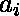

# 使用给定长度的线段可以制作的平行四边形的最大数量

> 原文:[https://www . geeksforgeeks . org/使用给定长度的线段可以制作的最大平行四边形数量/](https://www.geeksforgeeks.org/maximum-number-of-parallelograms-that-can-be-made-using-the-given-length-of-line-segments/)

给定 N 条线段，其中第 I 条线段的长度为。任务是如果每个线段最多用在一个平行四边形中，找到用这些线段可以构成的平行四边形的最大数量。
**例:**

```
Input: arr[] = {1, 2, 1, 2}
Output: 1
Only one parallelogram can be made with sides 1, 2, 1, 2

Input: arr[] = {1, 3, 5, 7, 1, 3, 5, 7, 1, 3, 5, 7}
Output: 2
```

**方法:**对线段长度进行频率排列。那么答案将是使用 4 个相似边可以制作的平行四边形的总数+使用 2 个相似边可以制作的平行四边形的总数。因为平行四边形必须有相等的对边。

## C++

```
// Function to find the maximum number
// of parallelograms can be made
#include <bits/stdc++.h>
using namespace std;

void convert(int n, int a[])
{

    // Finding the length of the frequency array
    int z = a[0];
    for (int i = 1; i < n; i++) {
        if (a[i] > z)
            z = a[i];
    }

    z = z + 1;

    int ff[z] = { 0 };
    for (int i = 0; i < n; i++) {
        // Increasing the occurrence of each segment
        ff[a[i]] += 1;
    }

    // To store the count of parallelograms
    int cc = 0;

    for (int i = 0; i < z; i++) {
        // Counting parallelograms that can
        // be made using 4 similar sides
        cc += int(ff[i] / 4);
        ff[i] = ff[i] % 4;
    }

    int vv = 0;

    for (int i = 0; i < z; i++) {
        // counting segments which have occurrence left >= 2
        if (ff[i] >= 2)
            vv += 1;
    }

    // Adding parallelograms that can be
    // made using 2 similar sides
    cc += int(vv / 2);
    cout << (cc);
}

// Driver function
int main()
{
    int n = 4;
    int a[] = { 1, 2, 1, 2 };
    convert(n, a);
}

// This code is contributed by
// Surendra_Gangwar
```

## Java 语言(一种计算机语言，尤用于创建网站)

```
// Function to find the maximum number
// of parallelograms can be made
import java.util.*;

class GFG
{

static void convert(int n, int a[])
{

    // Finding the length of the frequency array
    int z = a[0];
    for (int i = 1; i < n; i++)
    {
        if (a[i] > z)
            z = a[i];
    }

    z = z + 1;

    int ff[] = new int[z];
    for (int i = 0; i < n; i++)
    {
        // Increasing the occurrence of each segment
        ff[a[i]] += 1;
    }

    // To store the count of parallelograms
    int cc = 0;

    for (int i = 0; i < z; i++)
    {
        // Counting parallelograms that can
        // be made using 4 similar sides
        cc += (ff[i] / 4);
        ff[i] = ff[i] % 4;
    }

    int vv = 0;

    for (int i = 0; i < z; i++)
    {
        // counting segments which have occurrence left >= 2
        if (ff[i] >= 2)
            vv += 1;
    }

    // Adding parallelograms that can be
    // made using 2 similar sides
    cc += (vv / 2);
    System.out.println(cc);
}

// Driver code
public static void main(String[] args)
{
    int n = 4;
    int a[] = { 1, 2, 1, 2 };
    convert(n, a);
}
}

/* This code is contributed by PrinciRaj1992 */
```

## 计算机编程语言

```
# Function to find the maximum number
# of parallelograms can be made
def convert(n, a):

    # Finding the length of the frequency array
    z = max(a)+1

    ff =[0]*z
    for i in range(n):

        # Increasing the occurrence of each segment
        ff[a[i]]+= 1

    # To store the count of parallelograms
    cc = 0

    for i in range(z):
        # Counting parallelograms that can
        # be made using 4 similar sides
        cc+= ff[i]//4
        ff[i]= ff[i]% 4

    vv = 0

    for i in range(z):
        # counting segments which have occurrence left >= 2
        if(ff[i]>= 2):
            vv+= 1

    # Adding parallelograms that can be
    # made using 2 similar sides
    cc+= vv//2
    print(cc)

n = 4
a =[1, 2, 1, 2]
convert(n, a)
```

## C#

```
// Function to find the maximum number
// of parallelograms can be made
using System;

class GFG
{

static void convert(int n, int []a)
{

    // Finding the length of the frequency array
    int z = a[0];
    for (int i = 1; i < n; i++)
    {
        if (a[i] > z)
            z = a[i];
    }

    z = z + 1;

    int []ff = new int[z];
    for (int i = 0; i < n; i++)
    {
        // Increasing the occurrence of each segment
        ff[a[i]] += 1;
    }

    // To store the count of parallelograms
    int cc = 0;

    for (int i = 0; i < z; i++)
    {
        // Counting parallelograms that can
        // be made using 4 similar sides
        cc += (ff[i] / 4);
        ff[i] = ff[i] % 4;
    }

    int vv = 0;

    for (int i = 0; i < z; i++)
    {
        // counting segments which have occurrence left >= 2
        if (ff[i] >= 2)
            vv += 1;
    }

    // Adding parallelograms that can be
    // made using 2 similar sides
    cc += (vv / 2);
Console.WriteLine(cc);
}

// Driver code
static public void Main ()
{

    int n = 4;
    int []a = { 1, 2, 1, 2 };
    convert(n, a);
}
}

/* This code is contributed by ajit_23*/
```

## java 描述语言

```
<script>
    // Function to find the maximum number
    // of parallelograms can be made

    function convert(n, a)
    {

        // Finding the length of the frequency array
        let z = a[0];
        for (let i = 1; i < n; i++)
        {
            if (a[i] > z)
                z = a[i];
        }

        z = z + 1;

        let ff = new Array(z);
        ff.fill(0);
        for (let i = 0; i < n; i++)
        {
            // Increasing the occurrence of each segment
            ff[a[i]] += 1;
        }

        // To store the count of parallelograms
        let cc = 0;

        for (let i = 0; i < z; i++)
        {
            // Counting parallelograms that can
            // be made using 4 similar sides
            cc += parseInt(ff[i] / 4, 10);
            ff[i] = ff[i] % 4;
        }

        let vv = 0;

        for (let i = 0; i < z; i++)
        {
            // counting segments which have occurrence left >= 2
            if (ff[i] >= 2)
                vv += 1;
        }

        // Adding parallelograms that can be
        // made using 2 similar sides
        cc += parseInt(vv / 2, 10);
        document.write(cc);
    }

    let n = 4;
    let a = [ 1, 2, 1, 2 ];
    convert(n, a);

</script>
```

**Output:** 

```
1
```