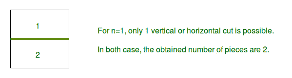
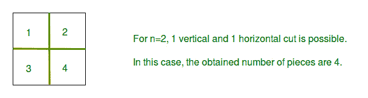
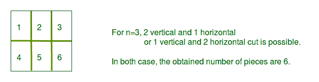

# N 次切割的最大件数

> 原文:[https://www . geesforgeks . org/n-cuts 中的最大碎片数/](https://www.geeksforgeeks.org/maximum-number-of-pieces-in-n-cuts/)

给定一个正方形片和可用的切口总数 n，找出用 n 个切口可以得到的相同大小的矩形或正方形片的最大数量。允许的切割有水平切割和垂直切割。
**注意:**不允许堆叠。
T4【示例】T5:

```
Input : n = 1
Output : 2
Explanation : 
```



```
Input : n = 2
Output : 4
Explanation : 
```



```
Input : n = 3
Output : 6
Explanation : 
```



给定 n，这是允许的切割次数。由于需要在 n 次切割后最大化工件数量，因此水平切割的数量将等于垂直切割的数量。这可以用微分来证明。所以水平切割的数量是 n/2。垂直切割将是 n-n/2。
所以**件数=(水平切割+ 1) *(垂直切割+ 1)。**
**程序:**

## C++

```
// C++ program to find maximum no of pieces
// by given number of cuts
#include <bits/stdc++.h>
using namespace std;

// Function for finding maximum pieces
// with n cuts.
int findMaximumPieces(int n)
{
    // to maximize number of pieces
    // x is the horizontal cuts
    int x = n / 2;

    // Now (x) is the horizontal cuts
    // and (n-x) is vertical cuts, then
    // maximum number of pieces = (x+1)*(n-x+1)
    return ((x + 1) * (n - x + 1));
}

// Driver code
int main()
{

    // Taking the maximum number of cuts allowed as 3
    int n = 3;

    // Finding and printing the max number of pieces
    cout << "Max number of pieces for n = " << n
         << " is " << findMaximumPieces(3);

    return 0;
}
```

## Java 语言(一种计算机语言，尤用于创建网站)

```
// Java program to find maximum
// no of pieces by given number
// of cuts
import java.util.*;

class GFG
{
// Function for finding maximum
// pieces with n cuts.
public static int findMaximumPieces(int n)
{
    // to maximize number of pieces
    // x is the horizontal cuts
    int x = n / 2;

    // Now (x) is the horizontal cuts
    // and (n-x) is vertical cuts, then
    // maximum number of pieces = (x+1)*(n-x+1)
    return ((x + 1) * (n - x + 1));
}

// Driver code
public static void main (String[] args)
{
    // Taking the maximum number
    // of cuts allowed as 3
    int n = 3;

    // Finding and printing the
    // max number of pieces
    System.out.print("Max number of pieces for n = " +
                   n + " is " + findMaximumPieces(3));

}
}

// This code is contributed by Kirti_Mangal
```

## 蟒蛇 3

```
# Python 3 program to find maximum no of pieces
# by given number of cuts

# Function for finding maximum pieces
# with n cuts.
def findMaximumPieces(n):

    # to maximize number of pieces
    # x is the horizontal cuts
    x = n // 2

    # Now (x) is the horizontal cuts
    # and (n-x) is vertical cuts, then
    # maximum number of pieces = (x+1)*(n-x+1)
    return ((x + 1) * (n - x + 1))

# Driver code
if __name__ == "__main__":

    #Taking the maximum number of cuts allowed as 3
    n = 3

    # Finding and printing the max number of pieces
    print("Max number of pieces for n = " +str( n)
         +" is " + str(findMaximumPieces(3)))

# This code is contributed by ChitraNayal
```

## C#

```
// C# program to find maximum
// no of pieces by given number
// of cuts
using System;

class GFG
{

// Function for finding maximum
// pieces with n cuts.
public static int findMaximumPieces(int n)
{
    // to maximize number of pieces
    // x is the horizontal cuts
    int x = n / 2;

    // Now (x) is the horizontal 
    // cuts and (n-x) is vertical
    // cuts, then maximum number
    // of pieces = (x+1)*(n-x+1)
    return ((x + 1) * (n - x + 1));
}

// Driver code
static public void Main ()
{
    // Taking the maximum number
    // of cuts allowed as 3
    int n = 3;

    // Finding and printing the
    // max number of pieces
    Console.Write("Max number of pieces for n = " +
                n + " is " + findMaximumPieces(3));
}
}

// This code is contributed by Mahadev
```

## 服务器端编程语言（Professional Hypertext Preprocessor 的缩写）

```
<?php
// PHP program to find maximum no
// of pieces by given number of cuts

// Function for finding maximum
// pieces with n cuts.
function findMaximumPieces($n)
{
    // to maximize number of pieces
    // x is the horizontal cuts
    $x = (int)($n / 2);

    // Now (x) is the horizontal cuts
    // and (n-x) is vertical cuts, then
    // maximum number of pieces = (x+1)*(n-x+1)
    return (($x + 1) * ($n - $x + 1));
}

// Driver code

// Taking the maximum number
// of cuts allowed as 3
$n = 3;

// Finding and printing the
// max number of pieces
echo "Max number of pieces for n = " .
    $n . " is " . findMaximumPieces(3);

// This code is contributed
// by Akanksha Rai(Abby_akku)
?>
```

## java 描述语言

```
<script>

// Javascript program to find maximum no of pieces
// by given number of cuts

// Function for finding maximum pieces
// with n cuts.
function findMaximumPieces(n)
{

    // to maximize number of pieces
    // x is the horizontal cuts
    var x = parseInt(n / 2);

    // Now (x) is the horizontal cuts
    // and (n-x) is vertical cuts, then
    // maximum number of pieces = (x+1)*(n-x+1)
    return ((x + 1) * (n - x + 1));
}

// Driver code
// Taking the maximum number of cuts allowed as 3
var n = 3;

// Finding and printing the max number of pieces
document.write("Max number of pieces for n = " + n
    + " is " + findMaximumPieces(3));

// This code is contributed by noob2000.
</script>
```

**Output:** 

```
Max number of pieces for n = 3 is 6
```