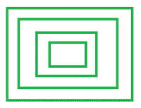
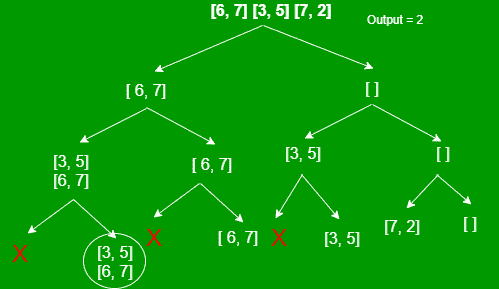
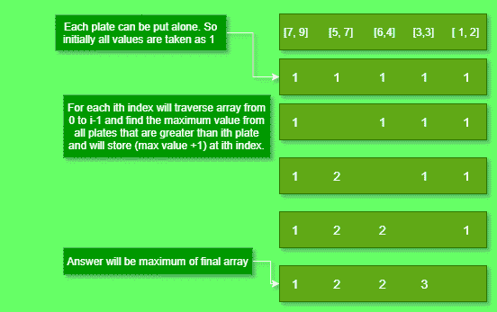

# 可从上到下按尺寸递增顺序放置的最大板数

> 原文:[https://www . geeksforgeeks . org/可放置的最大板数-从上到下-尺寸递增/](https://www.geeksforgeeks.org/maximum-number-of-plates-that-can-be-placed-from-top-to-bottom-in-increasing-order-of-size/)

给定一个尺寸为 **N** 的 [2D 阵列](https://www.geeksforgeeks.org/multidimensional-arrays-c-cpp/) **板【】【】**，每行代表一个 **N** 矩形板的长度和宽度，任务是找到可以相互放置的最大板数。
***注意:**一个盘子只有在长度和宽度严格小于另一个盘子的情况下才能放在另一个盘子上。*

[](https://media.geeksforgeeks.org/wp-content/uploads/20210421122541/plates-200x153.png)

**示例:**

> **输入:**板块[][] = [ [3，5]，[6，7]，[7，2]，[2，3] ]
> **输出:** 3
> **说明:**板块可以这样排列【6，7】=>【3，5】=>【2，3】。
> 
> **输入:**板块[][] = [ [6，4]，[ 5，7 ]，[1，2]，[ 3，3 ]，[ 7，9 ] ]
> **输出:** 4
> **说明:**板块可以这样排列【7，9】=>【5，7】=>【3，3】=>【1，2】。

**方法:**这个问题是[最长递增子序列](https://www.geeksforgeeks.org/longest-monotonically-increasing-subsequence-size-n-log-n/)问题的一个变种。唯一不同的是在 [LIS](https://www.geeksforgeeks.org/longest-increasing-subsequence-dp-3/) 中，如果 **i < j** ，那么 **i <sup>th</sup>** 元素总是排在 **j <sup>th</sup>** 元素之前。但在这里，板块的选择并不取决于指数。所以，要得到这个指标限制，需要**按照区域**的降序对所有板块进行排序。

> 如果**(I<j)****I<sup>th</sup>T5】板块的面积也大于 **j <sup>th</sup>** 板块，那么 **i <sup>th</sup>** 板块将始终位于**j<sup>th</sup>T17】板块之前(下)。****

#### [递归](https://www.geeksforgeeks.org/recursion/)方法:

每个板有两种可能的选择，即要么将其包含在序列中，要么将其丢弃。只有当板的长度和宽度小于先前包含的板时，才能包含该板。

**数组板[][] = [ [6，7]，[3，5]，[7，2] ]的递归树**如下:



下面是递归方法的实现:

## C++

```
// C++ Program for the above approach

#include <bits/stdc++.h>
using namespace std;

// Comparator function to sort plates
// in decreasing order of area
bool comp(vector<int> v1,
          vector<int> v2)
{
    return v1[0] * v1[1] > v2[0] * v2[1];
}

// Recursive function to count and return
// the max number of plates that can be placed
int countPlates(vector<vector<int> >& plates,
                int lastLength, int lastWidth,
                int i, int n)
{
    // If no plate remains
    if (i == n)
        return 0;

    int taken = 0, notTaken = 0;

    // If length and width of previous plate
    // exceeds that of the current plate
    if (lastLength > plates[i][0]
        && lastWidth > plates[i][1]) {

        // Calculate including the plate
        taken = 1 + countPlates(plates, plates[i][0],
                                plates[i][1], i + 1, n);

        // Calculate excluding the plate
        notTaken = countPlates(plates, lastLength,
                               lastWidth, i + 1, n);
    }

    // Otherwise
    else

        // Calculate only excluding the plate
        notTaken = countPlates(plates, lastLength,
                               lastWidth, i + 1, n);

    return max(taken, notTaken);
}

// Driver code
int main()
{
    vector<vector<int> > plates = { { 6, 4 }, { 5, 7 },
                        { 1, 2 }, { 3, 3 }, { 7, 9 } };
    int n = plates.size();

    // Sorting plates in decreasing order of area
    sort(plates.begin(), plates.end(), comp);

    // Assuming first plate to be of maximum size
    int lastLength = INT_MAX;
    int lastWidth = INT_MAX;

    cout << countPlates(plates, lastLength,
                        lastWidth, 0, n);
    return 0;
}
```

## Java 语言(一种计算机语言，尤用于创建网站)

```
// Java program for the above approach
import java.lang.*;
import java.util.*;

class GFG{

// Recursive function to count and return
// the max number of plates that can be placed
static int countPlates(int[][] plates,
                       int lastLength,
                       int lastWidth,
                       int i, int n)
{

    // If no plate remains
    if (i == n)
        return 0;

    int taken = 0, notTaken = 0;

    // If length and width of previous plate
    // exceeds that of the current plate
    if (lastLength > plates[i][0] &&
        lastWidth > plates[i][1])
    {

        // Calculate including the plate
        taken = 1 + countPlates(plates, plates[i][0],
                                plates[i][1], i + 1, n);

        // Calculate excluding the plate
        notTaken = countPlates(plates, lastLength,
                               lastWidth, i + 1, n);
    }

    // Otherwise
    else

        // Calculate only excluding the plate
        notTaken = countPlates(plates, lastLength,
                               lastWidth, i + 1, n);

    return Math.max(taken, notTaken);
}

// Driver code
public static void main(String[] args)
{
    int[][] plates = { { 6, 4 }, { 5, 7 },
                       { 1, 2 }, { 3, 3 }, { 7, 9 } };
    int n = plates.length;

    // Sorting plates in decreasing order of area
    Arrays.sort(plates, (v1, v2)-> (v2[0] * v2[1]) -
                                   (v1[0] * v1[1]));

    // Assuming first plate to be of maximum size
    int lastLength = Integer.MAX_VALUE;
    int lastWidth = Integer.MAX_VALUE;

    System.out.println(countPlates(plates, lastLength,
                                   lastWidth, 0, n));
}
}

// This code is contributed by offbeat
```

## java 描述语言

```
<script>

// Javascript Program for the above approach

// Recursive function to count and return
// the max number of plates that can be placed
function countPlates(plates, lastLength,
                     lastWidth, i, n)
{

    // If no plate remains
    if (i == n)
        return 0;

    var taken = 0, notTaken = 0;

    // If length and width of previous plate
    // exceeds that of the current plate
    if (lastLength > plates[i][0] &&
        lastWidth > plates[i][1])
    {

        // Calculate including the plate
        taken = 1 + countPlates(plates, plates[i][0],
                                plates[i][1], i + 1, n);

        // Calculate excluding the plate
        notTaken = countPlates(plates, lastLength,
                               lastWidth, i + 1, n);
    }

    // Otherwise
    else

        // Calculate only excluding the plate
        notTaken = countPlates(plates, lastLength,
                               lastWidth, i + 1, n);

    return Math.max(taken, notTaken);
}

// Driver code
var plates = [ [ 6, 4 ], [ 5, 7 ],
               [ 1, 2 ], [ 3, 3 ],
               [ 7, 9 ] ];
var n = plates.length;

// Sorting plates in decreasing order of area
plates.sort((v1, v2) => v2[0] * v2[1] - v1[0] * v1[1]);

// Assuming first plate to be of maximum size
var lastLength = 1000000000;
var lastWidth = 1000000000;

document.write(countPlates(plates, lastLength,
                           lastWidth, 0, n));

// This code is contributed by rutvik_56

</script>
```

**Output:** 

```
4
```

***时间复杂度:**O(2<sup>N</sup>)*
*T8】辅助空间 : O(N)*

[**【动态规划】**](https://www.geeksforgeeks.org/dynamic-programming/) **方法:**上述方法可以使用动态规划进行优化，如下图所示。



下面是上述方法的实现:

## C++

```
// C++ Program for the above approach

#include <bits/stdc++.h>
using namespace std;

// Comparator function to sort plates
// in decreasing order of area
bool comp(vector<int> v1, vector<int> v2)
{
    return v1[0] * v1[1] > v2[0] * v2[1];
}

// Function to count and return the max
// number of plates that can be placed
int countPlates(vector<vector<int> >& plates, int n)
{

    // Stores the maximum
    // number of plates
    int maximum_plates = 1;
    vector<int> dp(n, 1);

    for (int i = 1; i < n; i++) {
        int cur = dp[i];

        // For each i-th plate, traverse
        // all the previous plates
        for (int j = i - 1; j >= 0; j--) {

            // If i-th plate is smaller than j-th plate
            if (plates[i][0] < plates[j][0]
                && plates[i][1] < plates[j][1]) {

                // Include the j-th plate only if current
                // count exceeds the previously stored count
                if (cur + dp[j] > dp[i]) {

                    dp[i] = cur + dp[j];

                    // Update the maximum count
                    maximum_plates = max(maximum_plates, dp[i]);
                }
            }
        }
    }
    return maximum_plates;
}

// Driver code
int main()
{
    vector<vector<int> > plates = { { 6, 4 }, { 5, 7 },
                        { 1, 2 }, { 3, 3 }, { 7, 9 } };
    int n = plates.size();

    // Sorting plates in decreasing order of area
    sort(plates.begin(), plates.end(), comp);

    cout << countPlates(plates, n);

    return 0;
}
```

## java 描述语言

```
<script>

// Javascript program for the above approach

// Function to count and return the max
// number of plates that can be placed
function countPlates(plates, n)
{

    // Stores the maximum
    // number of plates
    var maximum_plates = 1;
    var dp = Array(n).fill(1);

    for(var i = 1; i < n; i++)
    {
        var cur = dp[i];

        // For each i-th plate, traverse
        // all the previous plates
        for(var j = i - 1; j >= 0; j--)
        {

            // If i-th plate is smaller than j-th plate
            if (plates[i][0] < plates[j][0] &&
                plates[i][1] < plates[j][1])
            {

                // Include the j-th plate only if
                // current count exceeds the
                // previously stored count
                if (cur + dp[j] > dp[i])
                {
                    dp[i] = cur + dp[j];

                    // Update the maximum count
                    maximum_plates = Math.max(
                        maximum_plates, dp[i]);
                }
            }
        }
    }
    return maximum_plates;
}

// Driver code
var plates = [ [ 6, 4 ], [ 5, 7 ],
               [ 1, 2 ], [ 3, 3 ],
               [ 7, 9 ] ];
var n = plates.length;

// Sorting plates in decreasing order of area
plates.sort((v1, v2) => {
    return((v2[0] * v2[1]) - (v1[0] * v1[1]));
});

document.write(countPlates(plates, n));

// This code is contributed by noob2000

</script>
```

**Output:** 

```
4
```

***时间复杂度:**O(N<sup>2</sup>)*
***辅助空间:** O(N)*