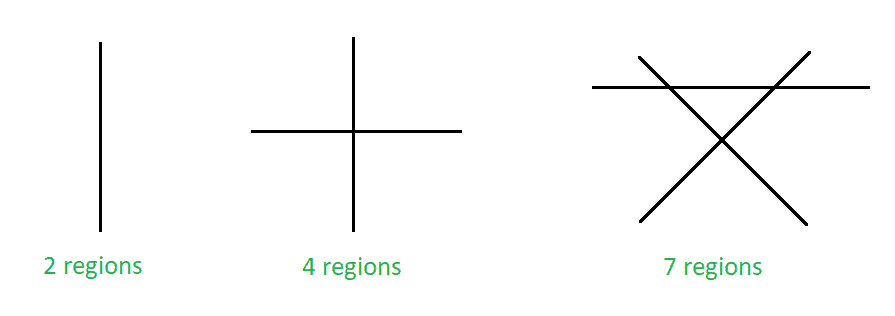

# N 条非平行线可以分割一个平面的最大区域数

> 原文:[https://www . geesforgeks . org/最大非平行线区域数/可分割平面/](https://www.geeksforgeeks.org/maximum-number-of-region-in-which-n-non-parallel-lines-can-divide-a-plane/)

给定 **N** ，非平行线的数量。任务是找到这些线可以分割一个平面的最大区域数。
**例:**

> **输入:** N = 3
> **输出:** 7
> **输入:** N = 2
> **输出:** 4



由于非平行线在平面上形成的最大区域数

**逼近:**上图显示了一条线可以分割一个平面的最大区域数。一条线可以把一个平面分成两个区域，两条非平行线可以把一个平面分成 4 个区域，三条非平行线可以分成 7 个区域，以此类推。当第 n 条<sup>线被添加到一组(n-1)线中时，则形成的额外区域的最大数量等于 n。
现在按如下方式求解递归:</sup> 

> l(2)-l(1)= 2…(I)
> l(3)-l(2)= 3…(ii)
> l(4)-l(3)= 4…(iii)
> 。。。
> 。。。
> l(n)-l(n-1)= n；……
> 加上我们得到的上述所有方程，
> l(n)-l(1)= 2+3+4+5+6+7+……+n；
> l(n)= l(1)+2+3+4+5+6+7 . ++ n；
> l(n)= 2+2+3+4+5+6+7 . ++ n；
> l(n)= 1+2+3+4+5+6+7 . ++ n+1；
> l(n)= n(n+1)/2+1；

N 条非平行线可以分割一个平面的区域数等于 **N*( N + 1 )/2 + 1** 。
以下是上述办法的实施情况:

## C++

```
// C++ program to implement the above problem

#include <bits/stdc++.h>
using namespace std;

// Function to find the maximum
// number of regions on a plane
void maxRegions(int n)
{
    int num;
    num = n * (n + 1) / 2 + 1;

    // print the maximum number of regions
    cout << num;
}

// Driver code
int main()
{
    int n = 10;

    maxRegions(n);

    return 0;
}
```

## Java 语言(一种计算机语言，尤用于创建网站)

```
// Java program to implement the above problem
class GFG
{

    // Function to find the maximum
    // number of regions on a plane
    static void maxRegions(int n)
    {
        int num;
        num = n * (n + 1) / 2 + 1;

        // print the maximum number of regions
        System.out.println(num);;
    }

    // Driver code
    public static void main(String[] args)
    {
        int n = 10;
        maxRegions(n);
    }
}

// This code is contributed by 29AjayKumar
```

## 蟒蛇 3

```
# Python3 program to implement
# the above problem

# Function to find the maximum
# number of regions on a plane
def maxRegions(n):
    num = n * (n + 1) // 2 + 1

    # print the maximum number
    # of regions
    print(num)

# Driver code
n = 10

maxRegions(n)

# This code is contributed
# by Mohit Kumar
```

## C#

```
// C# program to implement the above problem
using System;

class GFG
{

    // Function to find the maximum
    // number of regions on a plane
    static void maxRegions(int n)
    {
        int num;
        num = n * (n + 1) / 2 + 1;

        // print the maximum number of regions
        Console.WriteLine(num);
    }

    // Driver code
    public static void Main(String[] args)
    {
        int n = 10;
        maxRegions(n);
    }
}

// This code is contributed by 29AjayKumar
```

## java 描述语言

```
<script>

// Javascript program to implement the above problem

// Function to find the maximum
// number of regions on a plane
function maxRegions(n)
{
    let num;
    num = parseInt( n * (n + 1) / 2) + 1;

    // print the maximum number of regions
    document.write(num);
}

// Driver code
    let n = 10;

    maxRegions(n);

</script>
```

**Output:** 

```
56
```

**时间复杂度:** O(1)