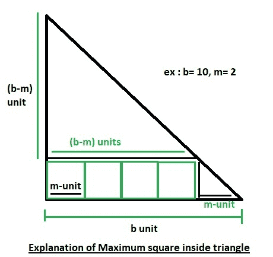

# 直角等腰三角形可容纳的最大方块数

> 原文:[https://www . geeksforgeeks . org/直角等腰三角形可容纳的最大方块数/](https://www.geeksforgeeks.org/maximum-number-of-squares-that-can-be-fit-in-a-right-angle-isosceles-triangle/)

给你一个以 b 为底的等腰(至少有两条等边的三角形)直角三角形，我们需要求出边 m 的最大平方数，它可以拟合到给定的三角形中。
示例:

```
Input : b = 6, m = 2
Output : 3

Input : b = 4, m = 1
Output : 6
```

让我们考虑一个直角三角形 XYZ，其中 YZ 是三角形的底。假设底边的长度为 b，如果我们考虑顶点为 Y 的第一个正方形的位置，我们将在底边有(b / m-1)个正方形，我们将剩下另一个底边长度为(b–m)的等腰直角三角形。
**图解:**



设 f(b，m) =可拟合到基长为 b.
的三角形中的平方数，然后 **f(b，m)=(b/m–1)+f(b–m，m)**
我们可以使用上述递归和记忆来计算 f(b)。稍后我们可以在 O(1)时间内回答每个查询。如果(b < 2 * m) f(b，m) = 0，我们可以用基本情况分别对偶数和奇数做。
给定的递归可解为:
f(b，m)= b/m–1+f(b–m，m)= b/m–1+(b–m)/m–1+f(b–2m，m)
f(b，m)= b/m–1+b/m–2+f(b–3m，m)+…+f(b–(b/m)m，m)
f(b)= b/m–1+b/m–2+b..+ 1 + 0
有条件的情况下，如果(b < 2 * m) f(b，m) = 0
f(b) =第一个(b/m–1)自然数之和
=(b/m–1)*(b/m)/2
这个公式可以用来将时间复杂度降低到 O(1)。

## C++

```
// CPP program for finding maximum squares
// that can fit in right angle isosceles 
// triangle
#include<bits/stdc++.h>
using namespace std;

// function for finding max squares
int maxSquare(int b, int m)
{
    // return in O(1) with derived 
    // formula
    return (b / m - 1) * (b / m) / 2;
}

// driver program
int main()
{
    int b = 10, m = 2;
    cout << maxSquare (b,m);
    return 0;
} 
```

## Java 语言(一种计算机语言，尤用于创建网站)

```
// Java program for finding maximum squares
// that can fit in right angle isosceles
// triangle
public class GFG 
{     
    // function for finding max squares
    static int maxSquare(int b, int m)
    {
        // return in O(1) with derived 
        // formula
        return (b / m - 1) * (b / m) / 2;
    }

    // driver program
    public static void main(String args[])
    {
        int b = 10, m = 2;
        System.out.println(maxSquare (b,m));
    } 
}

// This code is contribute by Sumit Ghosh
```

## 蟒蛇 3

```
# Python3 program for
# finding maximum squares
# that can fit in
# right angle isosceles 
# triangle

# function for finding max squares
def maxSquare(b, m):

    # return in O(1) with derived 
    # formula
    return (b / m - 1) * (b / m) / 2 

# driver program
b = 10
m = 2 
print(int(maxSquare (b,m))) 

# This code is contributed by
# Smitha Dinesh Semwal
```

## C#

```
// C# program for finding maximum squares
// that can fit in right angle isosceles
// triangle
using System;

public class GFG 
{ 
    // function for finding max squares
    static int maxSquare(int b, int m)
    {
        // return in O(1) with derived 
        // formula
        return (b / m - 1) * (b / m) / 2;
    }

    // driver program
    public static void Main()
    {
        int b = 10, m = 2;
        Console.WriteLine(maxSquare (b, m));
    } 
}

// This code is contribute by vt_m
```

## 服务器端编程语言（Professional Hypertext Preprocessor 的缩写）

```
<?php
// PHP program for finding
// maximum squares that can
// fit in right angle isosceles 
// triangle

// function for finding
// max squares
function maxSquare($b, $m)
{

    // return in O(1) with  
    // derived formula
    return ($b / $m - 1) * 
           ($b / $m) / 2;
}

    // Driver Code
    $b = 10; $m = 2;
    echo maxSquare($b,$m);
// This code is contribute by vt_m
?>
```

## java 描述语言

```
<script>

// Javascript program for finding maximum squares 
// that can fit in right angle isosceles 
// triangle 

// function for finding max squares 
function maxSquare(b, m) 
{ 

    // return in O(1) with derived 
    // formula 
    return (b / m - 1) * (b / m) / 2; a
} 

// Driver program 

    let b = 10, m = 2; 
    document.write(maxSquare (b,m)); 

// This code is contributed by Mayank Tyagi
</script>
```

输出:

```
10
```

本文由[**Shivam Pradhan(anuj _ charm)**](http://www.facebook.com/ma5ter6it)供稿。如果你喜欢 GeeksforGeeks 并想投稿，你也可以使用[write.geeksforgeeks.org](http://www.write.geeksforgeeks.org)写一篇文章或者把你的文章邮寄到 review-team@geeksforgeeks.org。看到你的文章出现在极客博客主页上，帮助其他极客。
如果发现有不正确的地方，或者想分享更多关于上述话题的信息，请写评论。