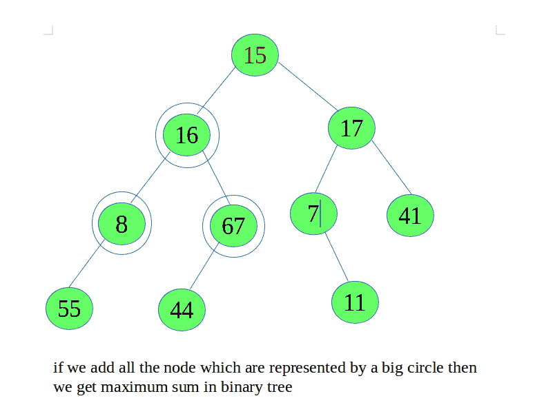

# 二叉树中最大父子和

> 原文:[https://www . geesforgeks . org/maximum-parent-children-sum-in-二叉树/](https://www.geeksforgeeks.org/maximum-parent-children-sum-in-binary-tree/)

给定一棵二叉树，通过将父树与其子树相加，找到二叉树中的最大和。正好需要添加三个节点。如果树中没有两个子节点都不为空的节点，则返回 0。



我们只需遍历树，找到具有最大和的节点。我们需要照顾好树叶。

## C++

```
// C++ program to find maximum sum of a node
// and its children
#include <iostream>
using namespace std;

struct Node {
    int data;
    struct Node *left, *right;
};

// insertion of Node in Tree
struct Node* newNode(int n)
{
    struct Node* root = new Node();
    root->data = n;
    root->left = root->right = NULL;
    return root;
}

int maxSum(struct Node* root)
{
    if (root == NULL)
        return 0;

    int res = maxSum(root->left);

    // if left and right link are null then
    // add all the three Node
    if (root->left != NULL && root->right != NULL) {
        int sum = root->data + root->left->data + root->right->data;
        res = max(res, sum);
    }

    return max(res, maxSum(root->right));
}

int main()
{
    struct Node* root =  newNode(15);
    root->left = newNode(16);
    root->left->left = newNode(8);
    root->left->left->left = newNode(55);
    root->left->right = newNode(67);
    root->left->right->left = newNode(44);
    root->right = newNode(17);
    root->right->left = newNode(7);
    root->right->left->right = newNode(11);
    root->right->right = newNode(41);
    cout << maxSum(root);
    return 0;
}
```

## Java 语言(一种计算机语言，尤用于创建网站)

```
// Java program to find
// maximum sum of a node
// and its children
import java.util.*;

// insertion of Node in Tree
class Node
{
    int data;
    Node left, right;

    Node(int key)
    {
        data = key;
        left = right = null;
    }
}
class GFG
{
    public static int maxSum(Node root)
    {
        if (root == null)
        return 0;

    int res = maxSum(root.left);

    // if left and right link are null
    // then add all the three Node
    if (root.left != null &&
        root.right != null)
    {
        int sum = root.data +
                  root.left.data +
                  root.right.data;
        res = Math.max(res, sum);
    }

    return Math.max(res, maxSum(root.right));
    }

    // Driver code
    public static void main (String[] args)
    {
        Node root = new Node(15);
        root.left = new Node(16);
        root.left.right = new Node(67);
        root.left.right.left = new Node(44);
        root.left.left = new Node(8);
        root.left.left.left = new Node(55);
        root.right = new Node(17);
        root.right.right = new Node(41);
        root.right.left = new Node(7);
        root.right.left.right = new Node(11);
        System.out.print(maxSum(root));
    }
}

// This code is contributed
// by akash1295
```

## 蟒蛇 3

```
# Python program to find maximum
# sum of a node and its children
class newNode():

    def __init__(self, data):
        self.data = data
        self.left = None
        self.right = None

def maxSum(root):

    if (root == None):
        return 0

    res = maxSum(root.left)

    # if left and right link are None then
    # add all the three Node
    if (root.left != None and root.right != None):
        sum = root.data + root.left.data + root.right.data
        res = max(res, sum)

    return max(res, maxSum(root.right))

# Driver code
if __name__ == '__main__':
    root = newNode(15)
    root.left = newNode(16)
    root.left.left = newNode(8)
    root.left.left.left = newNode(55)
    root.left.right = newNode(67)
    root.left.right.left = newNode(44)
    root.right = newNode(17)
    root.right.left = newNode(7)
    root.right.left.right = newNode(11)
    root.right.right = newNode(41)
    print(maxSum(root))

# This code is contributed by SHUBHAMSINGH10
```

## C#

```
// C# program to find
// maximum sum of a node
// and its children
using System;

// insertion of Node in Tree
public class Node
{
    public int data;
    public Node left, right;

    public Node(int key)
    {
        data = key;
        left = right = null;
    }
}
public class GFG
{
    public static int maxSum(Node root)
    {
        if (root == null)
        return 0;

    int res = maxSum(root.left);

    // if left and right link are null
    // then add all the three Node
    if (root.left != null &&
        root.right != null)
    {
        int sum = root.data +
                  root.left.data +
                  root.right.data;
        res = Math.Max(res, sum);
    }

    return Math.Max(res, maxSum(root.right));
    }

    // Driver code
    public static void Main ()
    {
        Node root = new Node(15);
        root.left = new Node(16);
        root.left.right = new Node(67);
        root.left.right.left = new Node(44);
        root.left.left = new Node(8);
        root.left.left.left = new Node(55);
        root.right = new Node(17);
        root.right.right = new Node(41);
        root.right.left = new Node(7);
        root.right.left.right = new Node(11);
        Console.Write(maxSum(root));
    }
}

/* This code is contributed PrinciRaj1992 */
```

## java 描述语言

```
<script>

// Javascript program to find
// maximum sum of a node
// and its children

// Insertion of Node in Tree
class Node
{
    constructor(key)
    {
        this.data = key;
        this.left = null;
        this.right = null;
    }
}

function maxSum(root)
{
    if (root == null)
        return 0;

    var res = maxSum(root.left);

    // If left and right link are null
    // then add all the three Node
    if (root.left != null &&
        root.right != null)
    {
        var sum = root.data +
                  root.left.data +
                  root.right.data;
        res = Math.max(res, sum);
    }

    return Math.max(res, maxSum(root.right));
}

// Driver code
var root = new Node(15);
root.left = new Node(16);
root.left.right = new Node(67);
root.left.right.left = new Node(44);
root.left.left = new Node(8);
root.left.left.left = new Node(55);
root.right = new Node(17);
root.right.right = new Node(41);
root.right.left = new Node(7);
root.right.left.right = new Node(11);
document.write(maxSum(root));

// This code is contributed by rutvik_56

</script>
```

**输出:**

```
91
```