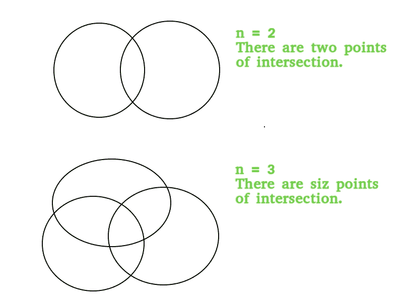

# n 个圆的最大交点

> 原文:[https://www . geesforgeks . org/maximum-points-intersection-n-circles/](https://www.geeksforgeeks.org/maximum-points-intersection-n-circles/)

给定一个数 n，我们需要找到 n 个圆相交的最大次数。

示例:

```
Input :  n = 2
Output : 2

Input :  n = 3
Output : 6
```



## 描述和推导

从上图中我们可以看到，每对圆最多可以有两个交点。因此，如果我们有 n 个圆，那么可以有 n 对圆，每对圆有两个交点。由此，我们可以得出结论，通过查看所有可能的圆对，可以得出 n 个圆的最大交点数的数学公式，由 **2 * <sup>n</sup> C <sub>2</sub>** 给出。
2 *<sup>n</sup>C<sub>2</sub>= 2 * n *(n–1)/2 =**n *(n-1)**

## C++

```
// CPP program to find maximum number of
// intersections of n circles
#include <bits/stdc++.h>
using namespace std;

// Returns maximum number of intersections
int intersection(int n)
{
   return n * (n - 1);
}

int main()
{
    cout << intersection(3) << endl;
    return 0;
}
// This code is contributed by
// Manish Kumar Rai.
```

## Java 语言(一种计算机语言，尤用于创建网站)

```
// Java program to find maximum number of
// intersections of n circles
import java.io.*;

public class GFG {

    // for the calculation of 2*(nC2)
    static int intersection(int n)
    {
       return n * (n - 1);
    }

    public static void main(String[] args) throws IOException
    {
        System.out.println(intersection(3));
    }
}
// This code is contributed by
// Manish Kumar Rai
```

## 蟒蛇 3

```
# python program to find maximum number of
# intersections of n circles
# Returns maximum number of intersections
def intersection(n):

   return n * (n - 1);

# Driver code
print(intersection(3))

# This code is contributed by Sam007
```

## C#

```
// C# program to find maximum number of
// intersections of n circles
using System;
class GFG {

    // for the calculation of 2*(nC2)
    static int intersection(int n)
    {
        return n * (n - 1);
    }

// Driver Code
public static void Main()
{
    Console.WriteLine(intersection(3));
}

}

// This code is contributed by Sam007
```

## 服务器端编程语言（Professional Hypertext Preprocessor 的缩写）

```
<?php
// php program to find maximum number of
// intersections of n circles

// Returns maximum number of intersections
function intersection($n)
{
   return $n * ($n - 1);
}

// Driver code

echo intersection(3);

// This code is contributed by Sam007
?>
```

## java 描述语言

```
<script>
// Javascript program to find maximum number of
// intersections of n circles

// Returns maximum number of intersections
function intersection(n)
{
   return n * (n - 1);
}

// Driver code
document.write(intersection(3));

// This code is contributed by _saurabh_jaiswal

</script>
```

**Output:** 

```
6
```