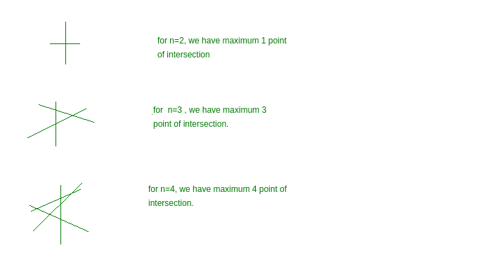

# n 条线的最大交点

> 原文:[https://www . geesforgeks . org/最大交点-n-line/](https://www.geeksforgeeks.org/maximum-points-of-intersection-n-lines/)

给你 n 条直线。你必须找到这 n 条线的最大交点数。
**例:**

```
Input : n = 4 
Output : 6

Input : n = 2
Output :1
```



**逼近:**
由于我们有 n 条线，我们必须用这 n 条线找到最大交点。所以这可以通过组合来实现。这个问题可以看作是在 n 行中选择任意两行的多种方法。因为每条线都与其他选定的线相交。
所以，积分总数= nC2
以下是上述方法的实施:

## C++

```
// CPP program to find maximum intersecting
// points
#include <bits/stdc++.h>
using namespace std;
#define ll long int

// nC2 = (n)*(n-1)/2;
ll countMaxIntersect(ll n)
{
   return (n) * (n - 1) / 2;
}

// Driver code
int main()
{
    // n is number of line
    ll n = 8;
    cout << countMaxIntersect(n) << endl;
    return 0;
}
```

## Java 语言(一种计算机语言，尤用于创建网站)

```
// Java program to find maximum intersecting
// points

public class GFG {

    // nC2 = (n)*(n-1)/2;
    static long countMaxIntersect(long n)
    {
       return (n) * (n - 1) / 2;
    }

    // Driver code
    public static void main(String args[])
    {
        // n is number of line
        long n = 8;
        System.out.println(countMaxIntersect(n));

    }
    // This code is contributed by ANKITRAI1
}
```

## 蟒蛇 3

```
# Python3 program to find maximum
# intersecting points

#nC2 = (n)*(n-1)/2
def countMaxIntersect(n):
    return int(n*(n - 1)/2)

#Driver code
if __name__=='__main__':

# n is number of line
    n = 8
    print(countMaxIntersect(n))

# this code is contributed by
# Shashank_Sharma
```

## C#

```
// C# program to find maximum intersecting
// points
using System;

class GFG
{

    // nC2 = (n)*(n-1)/2;
    public static long countMaxIntersect(long n)
    {
    return (n) * (n - 1) / 2;
    }

    // Driver code
    public static void Main()
    {
        // n is number of line
        long n = 8;
        Console.WriteLine(countMaxIntersect(n));
    }
}
// This code is contributed by Soumik
```

## 服务器端编程语言（Professional Hypertext Preprocessor 的缩写）

```
<?PHP
// PHP program to find maximum intersecting
// points

// nC2 = (n)*(n-1)/2;
function countMaxIntersect($n)
{
    return ($n) * ($n - 1) / 2;
}

// Driver code

// n is number of line
$n = 8;
echo countMaxIntersect($n) . "\n";

// This code is contributed by ChitraNayal
?>
```

## java 描述语言

```
<script>

// Javascript program to find maximum intersecting
// points

// nC2 = (n)*(n-1)/2;
function countMaxIntersect(n)
{
   return (n) * (n - 1) / 2;
}

// Driver code

// n is number of line
var n = 8;
document.write( countMaxIntersect(n) );

</script>
```

**Output:** 

```
28
```