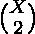
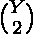
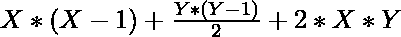
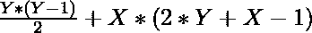

# X 圆和 Y 直线可能相交的最大点

> 原文:[https://www . geeksforgeeks . org/x 圆和 y 直线之间可能的最大交叉点/](https://www.geeksforgeeks.org/maximum-points-of-intersections-possible-among-x-circles-and-y-straight-lines/)

给定两个整数 **X** 和 **Y** ，任务是找出 **X** 圆和 **Y** 直线之间可能的最大交点数。

**示例:**

> **输入:** X = 4，Y = 4
> **输出:** 50
> **说明:**
> 4 条直线在 6 个点相交，4 个圆在最多 12 个点相交。
> 每条线在 8 点与 4 个圆相交。
> 因此，4 条线在最多 32 个点处与 4 个圆相交。
> 因此，所需的交叉点数量= 6 + 12 + 32 = 50。
> 
> **输入:** X = 3，Y = 4
> T3】输出: 36

**进场:**
可以观察到有三种类型的路口:

1.  从 X 个圆中选择一对点的方法数量为。每对这样的线最多相交两点。
2.  从 Y 线上选择一对点的方式数量为。每对这样的线最多相交于一点。
3.  从 X 圆和 Y 线中选择一圆一线的方式为。每对这样的线最多相交于两点。

> 所以，最大交点数可以计算为:
> = > 
> = > 

因此，求 **X** 圆与 **Y** 直线最大交点个数的公式为:


下面是上述方法的实现:

## C++

```
// C++ program to implement
// the above approach
#include <bits/stdc++.h>
using namespace std;

int maxPointOfIntersection(int x, int y)
{
    int k = y * (y - 1) / 2;
    k = k + x * (2 * y + x - 1);
    return k;
}

// Driver code
int main()
{

    // Number of circles
    int x = 3;

    // Number of straight lines
    int y = 4;

    // Function Call
    cout << (maxPointOfIntersection(x, y));
}

// This code is contributed by Ritik Bansal
```

## Java 语言(一种计算机语言，尤用于创建网站)

```
// Java program to implement
// the above approach
class GFG{

static int maxPointOfIntersection(int x, int y)
{
    int k = y * (y - 1) / 2;
    k = k + x * (2 * y + x - 1);
    return k;
}

// Driver code
public static void main(String[] args)
{

    // Number of circles
    int x = 3;

    // Number of straight lines
    int y = 4;

    // Function Call
    System.out.print(maxPointOfIntersection(x, y));
}
}

// This code is contributed by Princi Singh
```

## 蟒蛇 3

```
# Python3 program to implement
# the above approach
def maxPointOfIntersection(x, y):
    k = y * ( y - 1 ) // 2
    k = k + x * ( 2 * y + x - 1 )
    return k

# Number of circles
x = 3
# Number of straight lines
y = 4

# Function Call
print(maxPointOfIntersection(x, y))
```

## C#

```
// C# program to implement
// the above approach
using System;

class GFG{

static int maxPointOfIntersection(int x, int y)
{
    int k = y * (y - 1) / 2;
    k = k + x * (2 * y + x - 1);
    return k;
}

// Driver code
public static void Main(String[] args)
{

    // Number of circles
    int x = 3;

    // Number of straight lines
    int y = 4;

    // Function Call
    Console.Write(maxPointOfIntersection(x, y));
}
}

// This code is contributed by Princi Singh
```

## java 描述语言

```
<script>

// Javascript program to implement
// the above approach
function maxPointOfIntersection(x, y)
{
    let k = y * (y - 1) / 2;
    k = k + x * (2 * y + x - 1);
    return k;
}

// Driver code

// Number of circles
let x = 3;

// Number of straight lines
let y = 4;

// Function Call
document.write(maxPointOfIntersection(x, y));

// This code is contributed by rameshtravel07

</script>
```

**Output:** 

```
36
```

**时间复杂度:***O(1)*
T5】辅助空间: *O(1)*