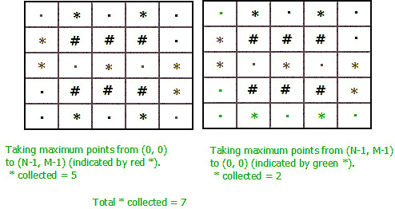

# 从矩阵左上角到右下角的最大点数，返回

> 原文:[https://www . geesforgeks . org/maximum-points-top-left-matrix-bottom-right-return-back/](https://www.geeksforgeeks.org/maximum-points-top-left-matrix-bottom-right-return-back/)

给定一个由“#”、“.”组成的大小为 **N X M** 的矩阵和' * '。# '表示被阻止的路径，'表示可行走的路径,“*”表示必须收集的点。现在假设你在矩阵的左上角。你必须到达矩阵的右下角，然后回到左上角。当你从左上移到右下时，你可以向右或向下走。当你从右下移到左上时，你可以向左或向上走。任务是找到你在整个旅程中能抓住的最大点数。积分一旦获得，将转换为“.”即可行走的路径。
**例:**

```
Input : N = 3, M = 4
****
.##.
.##.
****
Output : 8

Input : N = 9, M = 7
*........
.....**#.
..**...#*
..####*#.
.*.#*.*#.
...#**...
*........
Output : 7
```

如果考虑两条路径，一条从(0，0)到(N-1，M-1)，另一条从(N-1，M-1)到(0，0)，并在每条路径中收集最大值*。你可能会得到错误的答案。如果你独立地添加两条路径的答案，你将在回溯时再次计算交点。本质上，以相同的路径结束。即使你保留一个访问过的数组，在第一条路径上标记每一个*号，你仍然不会得到正确的答案。
考虑以下示例:


如果我们认为是两条独立的路径，那么



收集的总数*是 7。
而通过以下路径收集的最大点数可以是 8。


每条路径上有 4 个*。因此，总数= 8。
由此可见，最优解并不是两条路径各自最优解的和。一个人的最佳答案并不能保证一个最佳答案。
所以，我们必须同时计算两条路径。这是必需的，因为路径 2 的答案取决于路径 1 选择的路由。通过考虑从(0，0)到(N-1，M-1)的两条路径，并在每个位置做出四个决策(每个位置两个决策)，可以同时进行计算。
因此，我们将同时从(0，0)到(N-1，M-1)行进两条路径，而不是两条路径，一条从左上方行进到右下方，另一条从右下方行进到左上方，因此在每一步，我们都为两条路径走一步。所以我们的状态将由(x1，y1，x2，y2)组成，其中(x1，y1)是第一条路径的位置，(x2，y2)是网格中第二个游客的位置。
注意点:
1。在每一步中，任何一步都可以向右或向下移动，因此我们有 4 个移动选项(每个路径 2 个选项)。
2。如果两条路径都在同一个单元格上(x1 == x2 和 y1 == y2)，那么如果该单元格有*的话，我们只能将结果加 1。
3。我们可以通过将状态维数从 4 降低到 3 来降低复杂性。如果我们知道第一条路径(x1，y1)的位置和第二条路径 x2 的 x 坐标，那么我们必须有 x1 + y1 = x2 + y2，因为两条路径在相同的时间内覆盖相同的距离。所以 y2 = x1+y1–x2，我们的状态只取决于(x1，y1，x2)。
以下是本办法的实施:

## C++

```
// CPP program to find maximum points that can
// be collected in a journey from top to bottom
// and then back from bottom to top,
#include <bits/stdc++.h>
#define MAX 5
#define N 5
#define M 5
#define inf 100000
using namespace std;

// Calculating the points at a (row1, col1) &&
// (row2, col2) from path1 && path2
int cost(char grid[][M], int row1, int col1,
                           int row2, int col2)
{
    // If both path is at same cell
    if (row1 == row2 && col1 == col2) {

        // If the cell contain *, return 1
        if (grid[row1][col1] == '*')
            return 1;

        // else return 0.
        return 0;
    }

    int ans = 0;

    // If path 1 contain *, add to answer.
    if (grid[row1][col1] == '*')
        ans++;

    // If path  contain *, add to answer.
    if (grid[row2][col2] == '*')
        ans++;

    return ans;
}

// Calculate the maximum points that can be
// collected.
int solve(int n, int m, char grid[][M],
         int dp[MAX][MAX][MAX], int row1,
                      int col1, int row2)
{
    int col2 = (row1 + col1) - (row2);

    // If both path reach the bottom right cell
    if (row1 == n - 1 && col1 == m - 1 &&
        row2 == n - 1 && col2 == m - 1)
        return 0;

    // If moving out of grid
    if (row1 >= n || col1 >= m ||
        row2 >= n || col2 >= m)
        return -1 * inf;

    // If already calculated, return the value
    if (dp[row1][col1][row2] != -1)
        return dp[row1][col1][row2];

    // Variable for 4 options.
    int ch1 = -1 * inf, ch2 = -1 * inf;
    int ch3 = -1 * inf, ch4 = -1 * inf;

    // If path 1 is moving right and path 2
    // is moving down.
    if (col1 + 1 < m && row2 + 1 < n && grid[row1][col1 + 1] != '#' &&
        grid[row2 + 1][col2] != '#')
      ch1 = cost(grid, row1, col1 + 1, row2 + 1, col2) +
        solve(n, m, grid, dp, row1, col1 + 1, row2 + 1);

    // If path 1 is moving right and path 2 is moving
    // right.
    if (col2 + 1 < m && col1 + 1 < m && grid[row1][col1 + 1] != '#' &&
        grid[row2][col2 + 1] != '#')
      ch2 = cost(grid, row1, col1 + 1, row2, col2 + 1) +
            solve(n, m, grid, dp, row1, col1 + 1, row2);

    // If path 1 is moving down and path 2 is moving right.
    if (col2 + 1 < m && row1 + 1 < n && grid[row1 + 1][col1] != '#' &&
        grid[row2][col2 + 1] != '#')
     ch3 = cost(grid, row1 + 1, col1, row2, col2 + 1) +
           solve(n, m, grid, dp, row1 + 1, col1, row2);

    // If path 1 is moving down and path 2 is moving down.
    if (row1 + 1 < n && row2 + 1 < n && grid[row1 + 1][col1] != '#' &&
        grid[row2 + 1][col2] != '#')
      ch4 = cost(grid, row1 + 1, col1, row2 + 1, col2) +
         solve(n, m, grid, dp, row1 + 1, col1, row2 + 1);

    // Returning the maximum of 4 options.
    return dp[row1][col1][row2] = max({ch1, ch2, ch3, ch4});
}

// Wrapper Function
int wrapper(int n, int m, char grid[N][M])
{
    int ans = 0;
    int dp[MAX][MAX][MAX];
    memset(dp, -1, sizeof dp);

    // If last bottom right cell is blcoked
    if (grid[n - 1][m - 1] == '#' || grid[0][0] == '#')
        ans = -1 * inf;

    // If top left cell contain *
    if (grid[0][0] == '*')
        ans++;
    grid[0][0] = '.';

    // If bottom right cell contain *
    if (grid[n - 1][m - 1] == '*')
        ans++;
    grid[n - 1][m - 1] = '.';

    ans += solve(n, m, grid, dp, 0, 0, 0);
    return max(ans, 0);
}

// Driven Program
int main()
{
    int n = 5, m = 5;

    char grid[N][M] = {
        { '.', '*', '.', '*', '.' },
        { '*', '#', '#', '#', '.' },
        { '*', '.', '*', '.', '*' },
        { '.', '#', '#', '#', '*' },
        { '.', '*', '.', '*', '.' }
    };

    cout << wrapper(n, m, grid) << endl;
    return 0;
}
```

## 蟒蛇 3

```
# Python3 program to find maximum points
# that can be collected in a journey from
# top to bottom and then back from bottom to top,
MAX = 5
N = 5
M = 5
inf = 100000

# Calculating the points at a (row1, col1) and
# (row2, col2) from path1 and path2
def cost(grid, row1, col1, row2, col2):

    # If both path is at same cell
    if (row1 == row2 and col1 == col2):

        # If the cell contain *, return 1
        if (grid[row1][col1] == '*'):
            return 1

        # else return 0.
        return 0

    ans = 0

    # If path 1 contain *, add to answer.
    if (grid[row1][col1] == '*'):
        ans += 1

    # If path contain *, add to answer.
    if (grid[row2][col2] == '*'):
        ans += 1

    return ans

# Calculate the maximum points that can be
# collected.
def solve(n, m, grid, dp, row1, col1, row2):

    col2 = (row1 + col1) - (row2)

    # If both path reach the bottom right cell
    if (row1 == n - 1 and col1 == m - 1 and
        row2 == n - 1 and col2 == m - 1):
        return 0

    # If moving out of grid
    if (row1 >= n or col1 >= m or
        row2 >= n or col2 >= m):
        return -1 * inf

    # If already calculated, return the value
    if (dp[row1][col1][row2] != -1):
        return dp[row1][col1][row2]

    # Variable for 4 options.
    ch1 = -1 * inf
    ch2 = -1 * inf
    ch3 = -1 * inf
    ch4 = -1 * inf

    # If path 1 is moving right and path 2
    # is moving down.
    if (col1 + 1 < m and row2 + 1 < n and
          grid[row1][col1 + 1] != '#' and
          grid[row2 + 1][col2] != '#'):
        ch1 = cost(grid, row1, col1 + 1, row2 + 1, col2) + \
             solve(n, m, grid, dp, row1, col1 + 1, row2 + 1)

    # If path 1 is moving right and path 2
    # is moving right.
    if (col1 + 1 < m and col2 + 1 < m and
          grid[row1][col1 + 1] != '#' and
          grid[row2][col2 + 1] != '#'):
        ch2 = cost(grid, row1, col1 + 1, row2, col2 + 1) + \
             solve(n, m, grid, dp, row1, col1 + 1, row2)

    # If path 1 is moving down and path 2
    # is moving right.
    if (row1 + 1 < n and col2 + 1 < m and
          grid[row1 + 1][col1] != '#' and
          grid[row2][col2 + 1] != '#'):
        ch3 = cost(grid, row1 + 1, col1, row2, col2 + 1) + \
             solve(n, m, grid, dp, row1 + 1, col1, row2)

    # If path 1 is moving down and path 2 is moving down.
    if (row1 + 1 < n and row2 + 1 < n and
          grid[row1 + 1][col1] != '#' and
          grid[row2 + 1][col2] != '#'):
        ch4 = cost(grid, row1 + 1, col1, row2 + 1, col2) + \
             solve(n, m, grid, dp, row1 + 1, col1, row2 + 1)

    # Returning the maximum of 4 options.
    dp[row1][col1][row2] = max(ch1, ch2, ch3, ch4)
    return dp[row1][col1][row2]

# Wrapper Function
def wrapper(n, m, grid):

    ans = 0

    dp = [[[-1] * MAX for i in range(MAX)]
                      for j in range(MAX)]

    # If last bottom right cell is blcoked
    if (grid[n - 1][m - 1] == '#' or
        grid[0][0] == '#'):
        ans = -1 * inf

    # If top left cell contain *
    if (grid[0][0] == '*'):
        ans += 1
    grid[0][0] = '.'

    # If bottom right cell contain *
    if (grid[n - 1][m - 1] == '*'):
        ans += 1
    grid[n - 1][m - 1] = '.'

    ans += solve(n, m, grid, dp, 0, 0, 0)
    return max(ans, 0)

# Driver Code
if __name__ == '__main__':
    n = 5
    m = 5

    grid = [[ '.', '*', '.', '*', '.' ],
            [ '*', '#', '#', '#', '.' ],
            [ '*', '.', '*', '.', '*' ],
            [ '.', '#', '#', '#', '*' ],
            [ '.', '*', '.', '*', '.' ]]

    print(wrapper(n, m, grid))

# This code is contributed by ashutosh450
```

**Output**

```
8

```

**时间复杂度:** O(N^3)
本文由 **Anuj Chauhan** 供稿。如果你喜欢 GeeksforGeeks 并想投稿，你也可以使用[write.geeksforgeeks.org](https://write.geeksforgeeks.org)写一篇文章或者把你的文章邮寄到 review-team@geeksforgeeks.org。看到你的文章出现在极客博客主页上，帮助其他极客。
如果发现有不正确的地方，或者想分享更多关于上述话题的信息，请写评论。