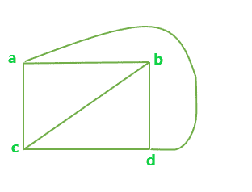
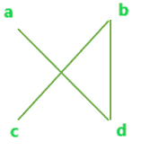
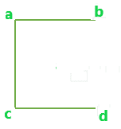
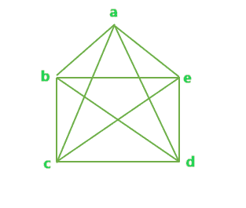
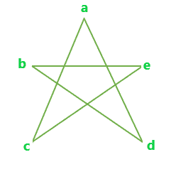
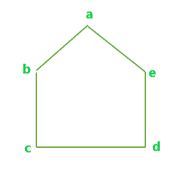

# 完全图的最大可能边不相交生成树

> 原文:[https://www . geeksforgeeks . org/最大可能边不相交完全图生成树/](https://www.geeksforgeeks.org/maximum-possible-edge-disjoint-spanning-tree-from-a-complete-graph/)

给出一个有 N 个顶点的完全图。任务是找出可能的最大边不相交生成树数。
**边不相交生成树**是一种生成树，其中集合中没有两个树有共同的边。
**示例:**

```
Input : N = 4
Output : 2

Input : N = 5
Output : 2 
```

具有 N 个顶点的完全图的可能的边不相交生成树的最大数目可以给出为，

```
Max Edge-disjoint spanning tree = floor(N / 2)
```

我们来看一些例子:
**例 1** :

**具有 4 个顶点的完整图形**



上图所有可能的边不相交生成树是:



A



B

**例 2** :

**有 5 个顶点的完整图形**



上图所有可能的边不相交生成树是:



A



B

下面是寻找最大可能边不相交生成树数的程序。

## C++

```
// C++ program to find the maximum number of
// Edge-Disjoint Spanning tree possible

#include <bits/stdc++.h>
using namespace std;

// Function to calculate max number of
// Edge-Disjoint Spanning tree possible
float edgeDisjoint(int n)
{
    float result = 0;

    result = floor(n / 2);

    return result;
}

// Driver code
int main()
{
    int n = 4;

    cout << edgeDisjoint(n);

    return 0;
}
```

## Java 语言(一种计算机语言，尤用于创建网站)

```
// Java program to find the maximum 
// number of Edge-Disjoint Spanning
// tree possible
import java.io.*;

class GFG
{

// Function to calculate max number
// of Edge-Disjoint Spanning tree
// possible
static double edgeDisjoint(int n)
{
    double result = 0;

    result = Math.floor(n / 2);

    return result;
}

// Driver Code
public static void main(String[] args)
{
    int n = 4;
    System.out.println((int)edgeDisjoint(n));
}
}

// This code is contributed
// by Naman_Garg
```

## 蟒蛇 3

```
# Python 3 to find the maximum
# number of Edge-Disjoint
# Spanning tree possible
import math

# Function to calculate max
# number of Edge-Disjoint
# Spanning tree possible
def edgeDisjoint(n):

    result = 0

    result = math.floor(n / 2)

    return result

# Driver Code
if __name__ == "__main__" :

    n = 4

    print(int(edgeDisjoint(n)))

# This Code is contributed
# by Naman_Garg
```

## C#

```
// C# program to find the maximum number of
// Edge-Disjoint Spanning tree possible
using System;

class GFG
{

// Function to calculate max number of
// Edge-Disjoint Spanning tree possible
static double edgeDisjoint(double n)
{
    double result = 0;

    result = Math.Floor(n / 2);

    return result;
}

// Driver Code
public static void Main()
{
    int n = 4;

    Console.Write(edgeDisjoint(n));
}
}

// This code is contributed
// by Sanjit_Prasad
```

## 服务器端编程语言（Professional Hypertext Preprocessor 的缩写）

```
<?php
// PHP program to find the maximum
// number of Edge-Disjoint Spanning
// tree possible

// Function to calculate max number of
// Edge-Disjoint Spanning tree possible
function edgeDisjoint($n)
{
    $result = 0;

    $result = floor($n / 2);

    return $result;
}

// Driver code
$n = 4;

echo edgeDisjoint($n);

// This code is contributed
// by Ankita Saini
?>
```

## java 描述语言

```
<script>

// Javascript program to find the maximum number of
// Edge-Disjoint Spanning tree possible

// Function to calculate max number of
// Edge-Disjoint Spanning tree possible
function edgeDisjoint(n)
{
    var result = 0;

    result = Math.floor(n / 2);

    return result;
}

// Driver code
var n = 4;
document.write( edgeDisjoint(n));

</script>
```

**Output:** 

```
2
```