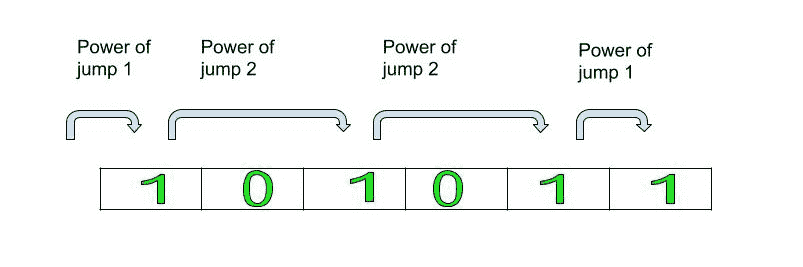

# 到达弦末端所需的最大跳跃力

> 原文:[https://www . geeksforgeeks . org/达到字符串末尾所需的最大跳跃功率/](https://www.geeksforgeeks.org/maximum-power-of-jump-required-to-reach-the-end-of-string/)

给定一个由 1 和 0 组成的字符串，任务是找出到达字符串末尾所需的最大跳跃功率。一次可以从一个 **1** 跳到下一个 **1** 或者从一个 **0** 跳到下一个 **0** 。
**注:**跳跃的力量定义为两个连续的 1 或两个连续的 0 之间的距离。
**例:**

```
Input: 10101
Output: 2
First, make a power jump of 1 to reach first 1, 
then a power jump of 2 to reach second 1
and then finally a power jump of 2 
to reach the end of the string
hence the maximum power of jump is 2.

Input: 11110
Output: 5
Since to reach the end of the string, we have to make
power jump of 5 to reach 0 and end of the string
```



**进场:**

*   检查给定字符串的最后一个字符是 1 还是 0。
*   如果最后一个字符是 1，则搜索字符串中的第一个 1，并继续跳到下一个 1 以到达字符串的最后一个。更新最大跳跃。
*   同样，如果最后一个字符是 0，则搜索字符串中的第一个 0，并继续跳到下一个 0 以到达字符串的最后一个。更新最大跳跃。
*   返回到达终点所需的最大跳跃次数。

## C++

```
// C++ program to calculate power of jump
#include<bits/stdc++.h>
using namespace std;

// Function to calculate the maximum power of the jump
int powerOfJump(string s)
{
    // Initialize the count with 1
    int count = 1;
    int max_so_far = INT_MIN;

    // Find the character at last index
    char ch = s[s.length() - 1];

    // Start traversing the string
    for (int i = 0; i < s.length(); i++)
    {
        // Check if the current char is equal
        // to the last character
        if (s[i] == ch)
        {
            // max_so_far stores maximum value of
            // the power of the jump from starting
            // to ith position
            if (count > max_so_far) {
                max_so_far = count;

            }
            // Reset the count to 1
            count = 1;

        }
        // Else, increment the number of jumps/count
        else
        count++;

    }
    // Return the maximum number of jumps
    return max_so_far;

}

// Driver code
int main(){
    string st = "1010101";
    cout<<powerOfJump(st);

}
// This code is contributed by ash264
```

## Java 语言(一种计算机语言，尤用于创建网站)

```
// java program to calculate power of jump
import java.util.ArrayList;

public class string_sort {

    // Function to calculate the maximum power of the jump
    public static int powerOfJump(String s)
    {
        // Initialize the count with 1
        int count = 1;
        int max_so_far = Integer.MIN_VALUE;

        // Find the character at last index
        char ch = s.charAt(s.length() - 1);

        // Start traversing the string
        for (int i = 0; i < s.length(); i++) {

           // Check if the current char is equal
           // to the last character
            if (s.charAt(i) == ch) {

                // max_so_far stores maximum value of
                // the power of the jump from starting
                // to ith position
                if (count > max_so_far) {
                    max_so_far = count;
                }

                // Reset the count to 1
                count = 1;
            }

            // Else, increment the number of jumps/count
            else
                count++;
        }

        // Return the maximum number of jumps
        return max_so_far;
    }
    // Driver code
    public static void main(String[] args)
    {
        String st = "1010101";
        System.out.println(powerOfJump(st));
    }
}
```

## 蟒蛇 3

```
# Python3 program to calculate
# power of jump

# Function to calculate the maximum
# power of the jump
def powerOfJump(s):

    # Initialize the count with 1
    count = 1
    max_so_far = 0

    # Find the character at last index
    ch = s[-1]

    # Start traversing the string
    for i in range(0, len(s)):

        # Check if the current char is
        # equal to the last character
        if s[i] == ch:

            # max_so_far stores maximum value of
            # the power of the jump from starting
            # to ith position
            if count > max_so_far:
                max_so_far = count

            # Reset the count to 1
            count = 1

        # Else, increment the number
        # of jumps/count
        else:
            count += 1

    # Return the maximum number of jumps
    return max_so_far

# Driver Code
if __name__ == "__main__":

    st = "1010101"
    print(powerOfJump(st))

# This code is contributed
# by Rituraj Jain
```

## C#

```
// C# program to calculate
// power of jump
using System;

class GFG
{

// Function to calculate the
// maximum power of the jump
public static int powerOfJump(String s)
{
    // Initialize the count with 1
    int count = 1;
    int max_so_far = int.MinValue;

    // Find the character at last index
    char ch = s[s.Length - 1];

    // Start traversing the string
    for (int i = 0; i < s.Length; i++)
    {

    // Check if the current char is
    // equal to the last character
        if (s[i] == ch)
        {

            // max_so_far stores maximum value
            // of the power of the jump from
            // starting to ith position
            if (count > max_so_far)
            {
                max_so_far = count;
            }

            // Reset the count to 1
            count = 1;
        }

        // Else, increment the number
        // of jumps/count
        else
            count++;
    }

    // Return the maximum number of jumps
    return max_so_far;
}

// Driver code
public static void Main()
{
    String st = "1010101";
    Console.WriteLine(powerOfJump(st));
}
}

// This code is contributed
// by Akanksha Rai(Abby_akku)
```

## 服务器端编程语言（Professional Hypertext Preprocessor 的缩写）

```
<?php
// PHP program to calculate
// power of jump

// Function to calculate the
// maximum power of the jump
function powerOfJump($s)
{
    // Initialize the count with 1
    $count = 1;
    $max_so_far = PHP_INT_MIN;

    // Find the character at last index
    $ch = $s[strlen($s) - 1];

    // Start traversing the string
    for ($i = 0;
         $i < strlen($s); $i++)
    {
        // Check if the current char
        // is equal to the last character
        if ($s[$i] == $ch)
        {
            // max_so_far stores maximum value
            // of the power of the jump from
            // starting to ith position
            if ($count > $max_so_far)
            {
                $max_so_far = $count;   
            }

            // Reset the count to 1
            $count = 1;

        }

        // Else, increment the number
        // of jumps/count
        else
        $count++;
    }

    // Return the maximum number
    // of jumps
    return $max_so_far;
}

// Driver code
$st = "1010101";
echo powerOfJump($st);

// This code is contributed by ajit
?>
```

## java 描述语言

```
<script>

// Javascript program to calculate power of jump

    // Function to calculate the maximum power of the jump
     function powerOfJump( s) {
        // Initialize the count with 1
        let count = 1;
        let max_so_far = Number.MIN_VALUE;

        // Find the letacter at last index
        let ch = s[s.length - 1];

        // Start traversing the string
        for (let i = 0; i < s.length; i++) {

            // Check if the current let is equal
            // to the last letacter
            if (s[i] == ch) {

                // max_so_far stores maximum value of
                // the power of the jump from starting
                // to ith position
                if (count > max_so_far) {
                    max_so_far = count;
                }

                // Reset the count to 1
                count = 1;
            }

            // Else, increment the number of jumps/count
            else
                count++;
        }

        // Return the maximum number of jumps
        return max_so_far;
    }

    // Driver code

        let st = "1010101";
        document.write(powerOfJump(st));

// This code is contributed by shikhasingrajput

</script>
```

**Output:** 

```
2
```

**时间复杂度** : O(n)，其中 n 是弦的长度