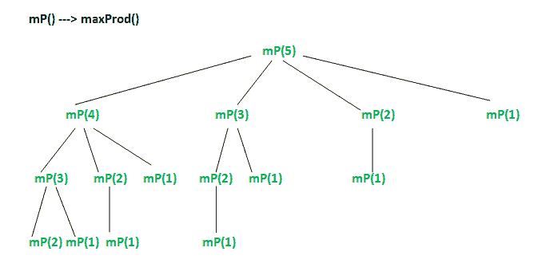

# 最大产品切割| DP-36

> 原文:[https://www . geesforgeks . org/maximum-product-cutting-DP-36/](https://www.geeksforgeeks.org/maximum-product-cutting-dp-36/)

给定一根 n 米长的绳子，将绳子切成整数长度的不同部分，使所有部分的长度乘积最大化。你至少要剪一次。假设绳子的长度超过 2 米。
**例:**

```
Input: n = 2
Output: 1 (Maximum obtainable product is 1*1)

Input: n = 3
Output: 2 (Maximum obtainable product is 1*2)

Input: n = 4
Output: 4 (Maximum obtainable product is 2*2)

Input: n = 5
Output: 6 (Maximum obtainable product is 2*3)

Input: n = 10
Output: 36 (Maximum obtainable product is 3*3*4)
```

**1)最优子结构:**
这个问题类似于[切杆问题。](https://www.geeksforgeeks.org/dynamic-programming-set-13-cutting-a-rod/)我们可以通过在不同位置进行切割并比较切割后获得的值来获得最大产品。我们可以对切割后获得的一个片段递归调用相同的函数。
设 maxProd(n)为长度为 n 的绳子的最大乘积，maxProd(n)可写成如下。
maxProd(n) = max(i*(n-i)，maxProdRec(n-i)*i)适用于{1，2，3 }中的所有 I..n}
**2)重叠子问题**
以下是问题的简单递归实现。实现简单地遵循上面提到的递归结构。

## C++

```
// A Naive Recursive method to find maximum product
#include <iostream>
using namespace std;

// Utility function to get the maximum of two and three integers
int max(int a, int b) { return (a > b)? a : b;}
int max(int a, int b, int c) { return max(a, max(b, c));}

// The main function that returns maximum product obtainable
// from a rope of length n
int maxProd(int n)
{
    // Base cases
    if (n == 0 || n == 1) return 0;

    // Make a cut at different places and take the maximum of all
    int max_val = 0;
    for (int i = 1; i < n; i++)
      max_val = max(max_val, i*(n-i), maxProd(n-i)*i);

    // Return the maximum of all values
    return max_val;
}

/* Driver program to test above functions */
int main()
{
    cout << "Maximum Product is " << maxProd(10);
    return 0;
}
```

## Java 语言(一种计算机语言，尤用于创建网站)

```
// Java program to find maximum product
import java.io.*;

class GFG {

    // The main function that returns
    // maximum product obtainable from
    // a rope of length n
    static int maxProd(int n)
    {
        // Base cases
        if (n == 0 || n == 1) return 0;

        // Make a cut at different places
        // and take the maximum of all
        int max_val = 0;
        for (int i = 1; i < n; i++)
        max_val = Math.max(max_val,
                  Math.max(i * (n - i),
                   maxProd(n - i) * i));

        // Return the maximum of all values
        return max_val;
    }  

    /* Driver program to test above functions */
    public static void main(String[] args)
    {
        System.out.println("Maximum Product is "
                            + maxProd(10));
    }
}
// This code is contributed by Prerna Saini
```

## 蟒蛇 3

```
# The main function that returns maximum
# product obtainable from a rope of length n

def maxProd(n):

    # Base cases
    if (n == 0 or n == 1):
        return 0

    # Make a cut at different places
    # and take the maximum of all
    max_val = 0
    for i in range(1, n - 1):
        max_val = max(max_val, max(i * (n - i), maxProd(n - i) * i))

    #Return the maximum of all values
    return max_val;

# Driver program to test above functions
print("Maximum Product is ", maxProd(10));

# This code is contributed
# by Sumit Sudhakar
```

## C#

```
// C# program to find maximum product
using System;

class GFG {

    // The main function that returns 
    // the max possible product
    static int maxProd(int n)
    {

        // n equals to 2 or 3 must
        // be handled explicitly
        if (n == 2 || n == 3)
            return (n - 1);

        // Keep removing parts of size
        // 3 while n is greater than 4
        int res = 1;
        while (n > 4) {
            n -= 3;

            // Keep multiplying 3 to res
            res *= 3;
        }

        // The last part multiplied
        // by previous parts
        return (n * res);
    }

    // Driver code
    public static void Main()
    {
        Console.WriteLine("Maximum Product is "
                                + maxProd(10));
    }
}

// This code is contributed by Sam007
```

## 服务器端编程语言（Professional Hypertext Preprocessor 的缩写）

```
<?php
// A Naive Recursive method to
// find maximum product

// Utility function to get the
// maximum of two and three integers
function max_1($a, $b, $c)
{
    return max($a, max($b, $c));
}

// The main function that returns
// maximum product obtainable
// from a rope of length n
function maxProd($n)
{
    // Base cases
    if ($n == 0 || $n == 1) return 0;

    // Make a cut at different places
    // and take the maximum of all
    $max_val = 0;
    for ($i = 1; $i < $n; $i++)
    $max_val = max_1($max_val, $i * ($n - $i),
               maxProd($n - $i) * $i);

    // Return the maximum of all values
    return $max_val;
}

// Driver Code
echo "Maximum Product is " . maxProd(10);

// This code is contributed
// by ChitraNayal
?>
```

## java 描述语言

```
<script>

// Javascript program to find maximum product   

    // The main function that returns
    // maximum product obtainable from
    // a rope of length n
    function maxProd(n)
    {
        // Base cases
        if (n == 0 || n == 1)
            return 0;

        // Make a cut at different places
        // and take the maximum of all
        let max_val = 0;
        for (let i = 1; i < n; i++)
        {
            max_val = Math.max(max_val,
                  Math.max(i * (n - i),
                   maxProd(n - i) * i));
        }
        // Return the maximum of all values
        return max_val;
    }

    /* Driver program to test above functions */
    document.write("Maximum Product is "
                            + maxProd(10));

    // This code is contributed by rag2127

</script>
```

**输出:**

```
Maximum Product is 36
```

考虑到上面的实现，下面是长度为 5 的绳子的递归树。



在上面的部分递归树中，mP(3)被求解了两次。我们可以看到有很多子问题被一次又一次地解决。由于相同的子问题被再次调用，这个问题具有重叠子问题的性质。所以这个问题同时具有动态规划问题的两个性质(参见[这个](https://www.geeksforgeeks.org/dynamic-programming-set-2-optimal-substructure-property/)和[这个](https://www.geeksforgeeks.org/dynamic-programming-set-1/))。像其他典型的[动态规划(DP)问题](https://www.geeksforgeeks.org/tag/dynamic-programming/)一样，通过以自下而上的方式构建临时数组 val[]可以避免相同子问题的重新计算。

## C

```
// A Dynamic Programming solution for Max Product Problem
int maxProd(int n)
{
   int val[n+1];
   val[0] = val[1] = 0;

   // Build the table val[] in bottom up manner and return
   // the last entry from the table
   for (int i = 1; i <= n; i++)
   {
      int max_val = 0;
      for (int j = 1; j <= i; j++)
         max_val = max(max_val, (i-j)*j, j*val[i-j]);
      val[i] = max_val;
   }
   return val[n];
}
```

## Java 语言(一种计算机语言，尤用于创建网站)

```
// A Dynamic Programming solution for Max Product Problem
int maxProd(int n)
{
   int val[n+1];
   val[0] = val[1] = 0;

   // Build the table val[] in bottom up manner and return
   // the last entry from the table
   for (int i = 1; i <= n; i++)
   {
      int max_val = 0;
      for (int j = 1; j <= i; j++)
         max_val = Math.max(max_val, (i-j)*j, j*val[i-j]);
      val[i] = max_val;
   }
   return val[n];
}

// This code is contributed by umadevi9616
```

## 蟒蛇 3

```
# A Dynamic Programming solution for Max Product Problem
def maxProd(n):
   val= [0 for i in range(n+1)];

   # Build the table val in bottom up manner and return
   # the last entry from the table
   for i in range(1,n+1):
      max_val = 0;
      for j in range(1,i):
         max_val = max(max_val, (i-j)*j, j*val[i-j]);
      val[i] = max_val;
    return val[n];

# This code is contributed by gauravrajput1
```

## C#

```
// A Dynamic Programming solution for Max Product Problem
int maxProd(int n)
{
   int []val = new int[n+1];
   val[0] = val[1] = 0;

   // Build the table val[] in bottom up manner and return
   // the last entry from the table
   for (int i = 1; i <= n; i++)
   {
      int max_val = 0;
      for (int j = 1; j <= i; j++)
         max_val = Math.Max(max_val, (i-j)*j, j*val[i-j]);
      val[i] = max_val;
   }
   return val[n];
}

// This code is contributed by umadevi9616
```

## java 描述语言

```
<script>
// A Dynamic Programming solution for Max Product Problem
function maxProd(n)
{
   var val = Array(n+1).fill(0;
   val[0] = val[1] = 0;

   // Build the table val in bottom up manner and return
   // the last entry from the table
   for (var 1; i <= n; i++)
   {
      var max_val = 0;
      for ( var ; j <= i; j++)
         max_val = Math.max(max_val, (i-j)*j, j*val[i-j]);
      val[i] = max_val;
   }
   return val[n];
}

// This code is contributed by gauravrajput1
</script>
```

动态编程解决方案的时间复杂度是 O(n^2 ),并且它需要 O(n)个额外空间。
**一个棘手的解决方案:**
如果我们看到这个问题的一些例子，我们可以很容易地观察到以下模式。
当尺寸大于 4 时，重复切割尺寸为 3 的零件，保持最后一个零件的尺寸为 2 或 3 或 4，可以获得最大的产品。例如，n = 10，最大乘积由 3，3，4 得到。对于 n = 11，最大乘积由 3，3，3，2 得到。下面是这种方法的实现。

## C++

```
#include <iostream>
using namespace std;

/* The main function that returns the max possible product */
int maxProd(int n)
{
   // n equals to 2 or 3 must be handled explicitly
   if (n == 2 || n == 3) return (n-1);

   // Keep removing parts of size 3 while n is greater than 4
   int res = 1;
   while (n > 4)
   {
       n -= 3;
       res *= 3; // Keep multiplying 3 to res
   }
   return (n * res); // The last part multiplied by previous parts
}

/* Driver program to test above functions */
int main()
{
    cout << "Maximum Product is " << maxProd(10);
    return 0;
}
```

## Java 语言(一种计算机语言，尤用于创建网站)

```
// Java program to find maximum product
import java.io.*;

class GFG {

    /* The main function that returns the
    max possible product */
    static int maxProd(int n)
    {

    // n equals to 2 or 3 must be handled
    // explicitly
    if (n == 2 || n == 3) return (n-1);

    // Keep removing parts of size 3
    // while n is greater than 4
    int res = 1;
    while (n > 4)
    {
        n -= 3;

        // Keep multiplying 3 to res
        res *= 3;
    }

    // The last part multiplied by
    // previous parts
    return (n * res);
    }

    /* Driver program to test above functions */
    public static void main(String[] args)
    {
        System.out.println("Maximum Product is "
                            + maxProd(10));
    }  
}
// This code is contributed by Prerna Saini
```

## 蟒蛇 3

```
# The main function that returns the
# max possible product

def maxProd(n):

    # n equals to 2 or 3 must
    # be handled explicitly
    if (n == 2 or n == 3):
        return (n - 1)

    # Keep removing parts of size 3
    # while n is greater than 4
    res = 1
    while (n > 4):
        n -= 3;

        # Keep multiplying 3 to res
        res *= 3;

    # The last part multiplied
    # by previous parts
    return (n * res)

# Driver program to test above functions
print("Maximum Product is ", maxProd(10));

# This code is contributed
# by Sumit Sudhakar
```

## C#

```
// C# program to find maximum product
using System;

class GFG {

    // The main function that returns
    // maximum product obtainable from
    // a rope of length n
    static int maxProd(int n)
    {
        // Base cases
        if (n == 0 || n == 1)
            return 0;

        // Make a cut at different places
        // and take the maximum of all
        int max_val = 0;
        for (int i = 1; i < n; i++)
            max_val = Math.Max(max_val,
                    Math.Max(i * (n - i),
                     maxProd(n - i) * i));

        // Return the maximum of all values
        return max_val;
    }

    // Driver code
    public static void Main()
     {
        Console.WriteLine("Maximum Product is "
                                + maxProd(10));
     }
}

// This code is contributed by Sam007
```

## 服务器端编程语言（Professional Hypertext Preprocessor 的缩写）

```
<?php

/* The main function that returns
   the max possible product */
function maxProd($n)
{

// n equals to 2 or 3 must
// be handled explicitly
if ($n == 2 || $n == 3)
    return ($n - 1);

// Keep removing parts of size
// 3 while n is greater than 4
$res = 1;
while ($n > 4)
{
    $n = $n - 3;

    // Keep multiplying 3 to res
    $res = $res * 3;
}

// The last part multiplied
// by previous parts
return ($n * $res);
}

// Driver code
echo ("Maximum Product is ");
echo(maxProd(10));

// This code is contributed
// by Shivi_Aggarwal
?>
```

## java 描述语言

```
<script>

// Javascript program to find maximum product   

    /* The main function that returns the
    max possible product */
    function maxProd(n)
    {
        // n equals to 2 or 3 must be handled
        // explicitly
        if (n == 2 || n == 3)
        {
            return (n-1);
        }
        // Keep removing parts of size 3
        // while n is greater than 4
        let res = 1;
        while (n > 4)
        {
            n -= 3;

            // Keep multiplying 3 to res
            res *= 3;
        }

        // The last part multiplied by
        // previous parts
        return (n * res);
    }

    /* Driver program to test above functions */
    document.write("Maximum Product is " + maxProd(10));

    // This code is contributed by avanitrachhadiya2155

</script>
```

**输出:**

```
Maximum Product is 36
```

如果发现有不正确的地方，请写评论，或者想分享更多关于以上讨论话题的信息